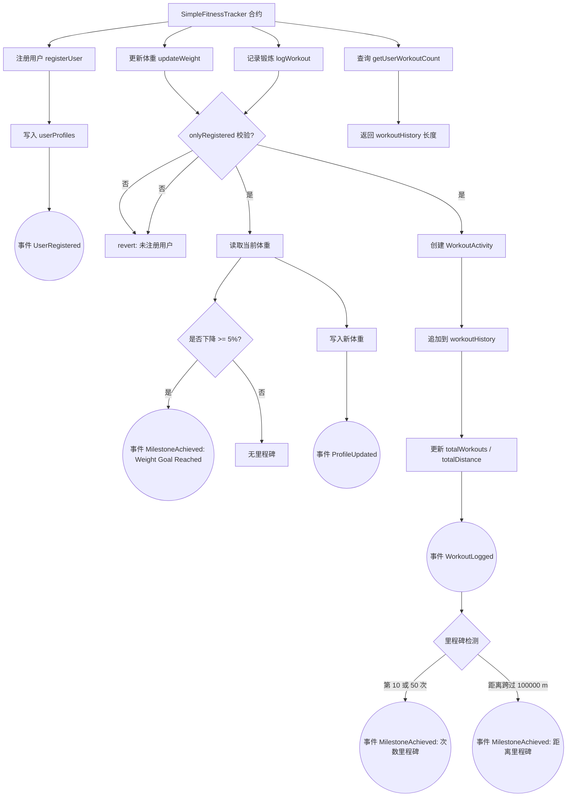

# 链上健身记录器

Day: Day 10
ID: 10
原文: https://builder-hub.notion.site/ActivityTracker-Contract-1d15720a23ef8065a8d4f1ccd61800e0
状态: 完成
译者: Shuyi
难度等级: 初级

[🧭 首页](https://www.notion.so/5-5-HerSolidity-28e06421268880e4b645d9458179e231?pvs=21) ｜ [🎓 30天课程日历](https://www.notion.so/28e0642126888002b26be4b2e9841ce0?pvs=21) ｜[](https://www.notion.so/28e06421268881e59a00e854a7444215?pvs=21) ｜[FAQ-Solidity答疑问题库](https://www.notion.so/2910642126888046a897d75705d86a58?pvs=21) ｜ [👩🏻‍💻 关于我们](https://www.notion.so/344d3328efef4b3ab742f92b61533ce8?pvs=21)

# ActivityTracker 合约

很好！到目前为止，我们已经构建了计算器、共享钱包、存钱罐，甚至还有一个可以接受美元并神奇地将其转换为以太币的 TipJar。

但如果我们稍微换个方向呢？

假设你和你的朋友们在进行一场健身之旅。你们记录锻炼、跟踪进度、庆祝像“完成 10 次跑步！”或“跑完 100 公里！”这样的里程碑——并且你希望这一切在链上都是透明、可证明的。

这不仅仅是为了数据而记录数据——这些数据可以触发前端的实时更新，解锁奖励，甚至在你达到某些目标时铸造 NFT。

**这就是 Solidity 事件发挥作用的地方。**

今天，我们将构建一个有趣的小合约，名为……

---

```solidity
 
// SPDX-License-Identifier: MIT
pragma solidity ^0.8.0;

contract SimpleFitnessTracker {
```

没错，**SimpleFitnessTracker**——但别被这个名字迷惑了。虽然这个合约很小，但它会教你 Solidity 中最强大的功能之一：**事件（events）。**

💻

这是完整的代码 👇🏼

[https://github.com/snehasharma76/30daysSolidity_Web3Compass/blob/master/ActivityTracker.sol](https://github.com/snehasharma76/30daysSolidity_Web3Compass/blob/master/ActivityTracker.sol)

---

# 1. 产品需求书

## 用户流程



## 数据库

| Contract | Type | Visibility | Mutability | Modifiers | 含义 |
| --- | --- | --- | --- | --- | --- |
| SimpleFitnessTracker | Implementation |  |  |  | 一个简单的健身活动追踪合约 |
|  |  |  |  |  |  |
| Structs |  |  |  |  | 数据结构 |
| └ | UserProfile |  |  |  | 存储用户基本信息 |
| └ | WorkoutActivity |  |  |  | 存储单次锻炼的详细信息 |
|  |  |  |  |  |  |
| State Variables |  |  |  |  | 状态变量 |
| └ | userProfiles | Public ❗️ | 🛑 |  | (地址 => 用户资料) 的映射 |
| └ | workoutHistory | Private 🔐 | 🛑 |  | (地址 => 锻炼活动数组) 的映射 |
| └ | totalWorkouts | Public ❗️ | 🛑 |  | (地址 => 总锻炼次数) 的映射 |
| └ | totalDistance | Public ❗️ | 🛑 |  | (地址 => 总距离) 的映射 |
|  |  |  |  |  |  |
| Events |  |  |  |  | 事件 |
| └ | UserRegistered |  |  |  | 用户成功注册时触发 |
| └ | ProfileUpdated |  |  |  | 用户更新个人资料（如体重）时触发 |
| └ | WorkoutLogged |  |  |  | 用户记录一次新的锻炼时触发 |
| └ | MilestoneAchieved |  |  |  | 用户达成一个里程碑（如10次锻炼）时触发 |
|  |  |  |  |  |  |
| Modifiers |  |  |  |  | 修改器 |
| └ | onlyRegistered |  |  |  | 限制函数只能由已注册用户调用 |
|  |  |  |  |  |  |
| Functions |  |  |  |  | 函数 |
| └ | registerUser | Public ❗️ | 🛑 | NO❗️ | 注册一个新用户，记录姓名和体重 |
| └ | updateWeight | Public ❗️ | 🛑 | onlyRegistered | 更新用户的体重，并检查是否达到减重里程碑 |
| └ | logWorkout | Public ❗️ | 🛑 | onlyRegistered | 记录一次新的锻炼活动，并检查是否达到锻炼里程碑 |
| └ | getUserWorkoutCount | Public ❗️ | View ✅ | onlyRegistered | 获取指定用户的总锻炼次数 |

# 2. 细节解说

### 什么是事件？

Solidity 中的事件就像你的智能合约拿起一个扩音器大喊：“嘿，刚刚发生了点事！”

它们不会改变链上的任何东西——相反，它们会**发出日志（emit logs）**，这些日志可以被你的前端或任何正在监听的外部系统捕获。

想象一下 Alice 刚刚完成了她的第 10 次锻炼。合约发出一个事件说：“Alice 完成了 10 次锻炼！” 你的前端捕捉到这个信号，然后——砰！——它可以撒花、解锁一项成就或触发一个徽章动画。

所以，是的，事件在你的代码中可能看起来只是一行无聊的 `emit`……但在幕后，它们是让你的 dApp 感觉*充满活力*的秘密武器。

好了，是时候设置这些魔法背后的数据了。

### 状态变量与结构体——奠定基础

---

在我们深入研究实际逻辑之前，让我们先设置好合约的数据结构。

我们正在构建一个健身追踪器，所以需要存储关于用户和他们锻炼的信息。你以后总是可以扩展它，加入目标、成就或社交功能——但现在，我们保持简单和专注。

让我们从两个关键的 `structs`（结构体）开始：

### `UserProfile` 结构体

```solidity
    
struct UserProfile {
    string name;
    uint256 weight; // in kg
    bool isRegistered;
}
```

这个结构体包含基本的用户信息：

- 他们的名字
- 他们的体重（单位：公斤）
- 一个告诉我们他们是否已注册的标志

每个注册的地址都会在链上存储一个这样的个人资料。

### `WorkoutActivity` 结构体

```solidity
    
struct WorkoutActivity {
    string activityType;
    uint256 duration; // in seconds
    uint256 distance; // in meters
    uint256 timestamp;
}
```

这个结构体记录了每次锻炼的细节：

- 活动类型（跑步、骑行、游泳等）
- 持续时间（单位：秒）
- 用户运动的距离（单位：米）
- 发生时间（`block.timestamp`）

每当用户记录一次锻炼，我们就会创建一个这样的结构体并将其添加到他们的锻炼历史中。

---

### 将所有内容映射起来

现在我们有了数据结构，让我们用映射（mappings）将它们连接起来：

```solidity
mapping(address => UserProfile) public userProfiles;
mapping(address => WorkoutActivity[]) private workoutHistory;
mapping(address => uint256) public totalWorkouts;
mapping(address => uint256) public totalDistance;
```

以下是每个映射的作用：

- `userProfiles`：为每个用户（通过他们的地址）存储一份个人资料
- `workoutHistory`：为每个用户保存一个锻炼日志数组
- `totalWorkouts`：跟踪每个用户记录了多少次锻炼
- `totalDistance`：跟踪用户覆盖的总距离

有了这个设置，我们就可以开始构建核心功能了——用户注册、记录锻炼、跟踪进度和庆祝里程碑。

对于仅仅几行设置代码来说，还不错吧？

---

### 声明事件——这才是最酷的部分

让我们声明一些事件，这样前端就能对它们作出反应：

```solidity
   
event UserRegistered(address indexed userAddress, string name, uint256 timestamp);
event ProfileUpdated(address indexed userAddress, uint256 newWeight, uint256 timestamp);
event WorkoutLogged(address indexed userAddress, string activityType, uint256 duration, uint256 distance, uint256 timestamp);
event MilestoneAchieved(address indexed userAddress, string milestone, uint256 timestamp);
```

让我们一步一步地分解它：

### 从技术上讲，什么是事件？

在 Solidity 中，一个 `event` 就像定义一个自定义的日志格式。当你的合约中发生重要事件时，你可以 `emit`（发出）一个这样的事件，它将被记录在交易日志中。

事件不会影响你的合约状态——它们只是合约用来表达“嘿，刚刚发生了点事”并发送相关细节的一种方式。

然后，这些日志可以被你的前端捕获，以显示消息、更新用户界面或实时触发操作。

### 理解参数

以这个事件为例：

```solidity
  
event WorkoutLogged(
  address indexed userAddress,
  string activityType,
  uint256 duration,
  uint256 distance,
  uint256 timestamp
);
```

以下是每个参数的含义：

- `userAddress`：谁进行了锻炼。
- `activityType`：他们做了什么类型的活动——跑步、骑行等。
- `duration`：锻炼持续了多长时间，单位=秒。
- `distance`：他们运动了多远，单位=米。
- `timestamp`：事件发生的时间，使用 `block.timestamp` 捕获。

我们的每个事件都遵循类似的模式——它们记录了谁、做了什么以及何时发生——为你的前端提供了即时响应所需的一切信息。

---

### 为什么使用 `indexed`？

你会注意到每个事件都包含 `address indexed userAddress`。那么 `indexed` 是怎么回事呢？

当你将一个参数标记为 `indexed` 时，你使它变得**可搜索**。这意味着你可以在前端根据该特定值筛选日志。

例如，如果你只想在 Alice 的个人资料页面上显示她的事件，你的前端可以查询日志，并只拉取那些 `userAddress == Alice` 的事件。

如果没有 `indexed`，你就必须扫描每一个事件日志并手动检查——效率低下且速度缓慢。

有了 `indexed`，它就变得优化和可扩展——这正是一个 dApp 所需要的。

需要注意一点：在一个事件中，你最多只能索引**三个**参数。所以要明智地使用它们。

---

### 修改器（Modifiers）

```solidity
 
modifier onlyRegistered() {
    require(userProfiles[msg.sender].isRegistered, "User not registered");
    _;
}
```

这个修改器是一个简单的检查——它确保调用者已经注册。我们将在多个函数中重用它以保持代码整洁。

## `registerUser()`——让训练开始

```solidity

function registerUser(string memory _name, uint256 _weight) public {
    require(!userProfiles[msg.sender].isRegistered, "User already registered");

    userProfiles[msg.sender] = UserProfile({
        name: _name,
        weight: _weight,
        isRegistered: true
    });

    emit UserRegistered(msg.sender, _name, block.timestamp);
}
```

这是某人正式加入健身小队的时刻。

首先，我们使用 `require` 检查确保他们尚未注册。然后，我们将他们的姓名和体重保存在我们的 `userProfiles` 映射中，并将 `isRegistered` 标志设置为 true。

现在到了最酷的部分——事件。

```solidity

emit UserRegistered(msg.sender, _name, block.timestamp);
```

这行代码告诉区块链：“嘿，有人刚刚注册了——这是他是谁，以及注册的时间。”

让我们把它与事件声明联系起来：

```solidity

event UserRegistered(address indexed userAddress, string name, uint256 timestamp);
```

当我们发出事件时，我们按声明的顺序传入所有需要的值：发送者的地址、他们的名字和当前的时间戳。这些值被打包到日志中，并立即可供前端捕获和响应。

你的前端可能会使用这个事件来：

- 显示一个欢迎弹窗
- 触发一个徽章或动画
- 将事件存储在链下数据库中
- 跟踪分析数据，如“今日总注册数”

### 等等——这不消耗 Gas 吗？

好问题。是的，发出事件确实会消耗一点 Gas（因为日志被写入区块链），但**它们比在链上存储数据便宜得多**。

事实上，发出事件是智能合约暴露数据最节省 Gas 的方式之一。这就是为什么我们经常将它们用于前端更新、分析以及任何不需要永久存储在状态中的事情。

所以，大胆地发出事件吧。它便宜、快速，并使你的 dApp 充满活力。

---

## `updateWeight()`——追求进步，而非完美

```solidity
function updateWeight(uint256 _newWeight) public onlyRegistered {
    UserProfile storage profile = userProfiles[msg.sender];

    if (_newWeight < profile.weight && (profile.weight - _newWeight) * 100 / profile.weight >= 5) {
        emit MilestoneAchieved(msg.sender, "Weight Goal Reached", block.timestamp);
    }

    profile.weight = _newWeight;
    emit ProfileUpdated(msg.sender, _newWeight, block.timestamp);
}
```

这个函数允许注册用户更新他们的体重——但它不仅仅是一个简单的设置器。这里面包含了一些聪明的逻辑，以奖励有意义的进步。

让我们来解析一下：

### 逐步分解

1. **访问用户的个人资料**
    
    ```solidity
    
    UserProfile storage profile = userProfiles[msg.sender];
    ```
    
    在这一行，我们正在创建一个指向存储在区块链上的用户个人资料的**引用（reference）**。
    
    通过使用 `storage` 关键字，我们在说：
    
    “嘿，Solidity，直接指向合约存储中已经存在的数据——不要创建它的副本。”
    
    这很重要，因为我们想要**修改链上实际存在的个人资料**。如果我们使用 `memory`，我们将只是在一个临时副本上工作——我们所做的任何更改都将在函数结束时被丢弃。
    
    所以通过使用 `storage`，我们确保当我们更新像用户体重这样的东西时，更新是永久的，并反映在全局的 `userProfiles` 映射中。
    
2. **检查体重里程碑**
    
    在更新体重之前，我们检查新体重是否比当前体重至少**减少了 5%**。
    
    ```solidity
    
    if (_newWeight < profile.weight && (profile.weight - _newWeight) * 100 / profile.weight >= 5)
    ```
    
    这确保我们只为显著的进步触发里程碑——而不是微小的波动。如果条件为真，我们发出这个事件：
    
    ```solidity
    
    emit MilestoneAchieved(msg.sender, "Weight Goal Reached", block.timestamp);
    ```
    
    这个事件告诉前端：“这个用户刚刚达成了一个重要目标！”——非常适合触发徽章、音效或解锁奖励。
    
3. **更新用户的体重**
    
    在里程碑检查之后，我们继续保存新的体重：
    
    ```solidity
    
    profile.weight = _newWeight;
    ```
    
4. **发出个人资料更新事件**Solidity
    
    最后，我们让外部世界知道用户的体重已经改变：
    
    ```solidity
    
    emit ProfileUpdated(msg.sender, _newWeight, block.timestamp);
    ```
    
    这有助于前端刷新用户统计数据或重新计算进度条。
    

---

## `logWorkout()`——追踪每一次训练、跑步和骑行

```solidity
   
function logWorkout(
    string memory _activityType,
    uint256 _duration,
    uint256 _distance
) public onlyRegistered {
    // Create new workout activity
    WorkoutActivity memory newWorkout = WorkoutActivity({
        activityType: _activityType,
        duration: _duration,
        distance: _distance,
        timestamp: block.timestamp
    });

    // Add to user's workout history
    workoutHistory[msg.sender].push(newWorkout);

    // Update total stats
    totalWorkouts[msg.sender]++;
    totalDistance[msg.sender] += _distance;

    // Emit workout logged event
    emit WorkoutLogged(
        msg.sender,
        _activityType,
        _duration,
        _distance,
        block.timestamp
    );

    // Check for workout count milestones
    if (totalWorkouts[msg.sender] == 10) {
        emit MilestoneAchieved(msg.sender, "10 Workouts Completed", block.timestamp);
    } else if (totalWorkouts[msg.sender] == 50) {
        emit MilestoneAchieved(msg.sender, "50 Workouts Completed", block.timestamp);
    }

    // Check for distance milestones
    if (totalDistance[msg.sender] >= 100000 && totalDistance[msg.sender] - _distance < 100000) {
        emit MilestoneAchieved(msg.sender, "100K Total Distance", block.timestamp);
    }
}
```

这是健身追踪器的**核心引擎**——它处理用户记录新锻炼时发生的一切。

让我们一步一步地过一遍：

### **1. 接受锻炼细节作为输入**

该函数接受三个参数：

- `_activityType`：用户做了什么类型的锻炼（例如，“跑步”、“游泳”）。
- `_duration`：锻炼持续了多长时间，单位是秒。
- `_distance`：用户运动了多远，单位是米。

该函数是 `public` 的，并受 `onlyRegistered` 修改器限制，因此**只有注册用户**才能记录锻炼。

### **2. 将锻炼记录在结构体中**

我们使用输入数据和当前区块的时间戳创建一个新的 `WorkoutActivity` 实例：

```solidity
   
WorkoutActivity memory newWorkout = WorkoutActivity({
    activityType: _activityType,
    duration: _duration,
    distance: _distance,
    timestamp: block.timestamp
});
```

这个 `newWorkout` 对象包含了所有重要信息：

- 用户做了什么（`activityType`）
- 持续了多久（`duration`）
- 运动了多远（`distance`）
- 何时发生（`timestamp`）

但这里有一点很重要：我们使用 `memory` 关键字声明了结构体。为什么呢？

### **为什么是 `memory`？**

---

在 Solidity 中，你有两个主要的数据位置：`storage` 和 `memory`。

- `storage` 是持久的——它存在于区块链上，读/写都需要消耗 Gas。
- `memory` 是临时的——它只在函数调用期间存在，而且便宜得多。

因为我们只是**临时创建这个结构体**，以便将它推入一个数组（`workoutHistory[msg.sender]`），我们不需要将它作为一个独立的变量永久存储。使用 `memory` 使这个操作**更高效、更节省 Gas**。

一旦它被推入数组（该数组存在于 `storage` 中），数据就被保存在了它需要的地方——而临时的 `newWorkout` 实例就可以消失了。

所以：临时数据 → 使用 `memory`。持久数据 → 使用 `storage`。

高效、整洁，正是我们在这种情况下所需要的。

### **3. 将锻炼存储在用户的历史记录中**

然后，新的锻炼被添加到用户的锻炼历史中——该历史以动态数组的形式存储在 `workoutHistory` 映射中：

```solidity
   
workoutHistory[msg.sender].push(newWorkout);
```

这意味着每个用户都有一个他们记录过的每一次锻炼的完整个人日志。

### **4. 更新汇总统计数据**

接下来，我们持续记录以下总数：

- 用户完成了多少次锻炼
- 他们总共运动了多远（累积距离）

```solidity
   
totalWorkouts[msg.sender]++;
totalDistance[msg.sender] += _distance;
```

这些值对于排行榜风格的功能、进度跟踪和里程碑检测非常有用。

### **5. 发出 `WorkoutLogged` 事件**

现在数据已经存储好了，我们让前端知道刚刚发生了什么：

```solidity
   
emit WorkoutLogged(
    msg.sender,
    _activityType,
    _duration,
    _distance,
    block.timestamp
);
```

这个事件提供了前端显示新活动、更新图表、动画化进度条或触发声音或消息等实时反馈所需的所有信息。

### **6. 检测并庆祝里程碑**

这是我们让应用感觉**充满活力**的地方。

我们检查用户是否达到了一个关键的里程碑——比如完成他们的第 10 次或第 50 次锻炼——并在他们达到时发出一个 `MilestoneAchieved` 事件：

```solidity
   
if (totalWorkouts[msg.sender] == 10) {
    emit MilestoneAchieved(msg.sender, "10 Workouts Completed", block.timestamp);
} else if (totalWorkouts[msg.sender] == 50) {
    emit MilestoneAchieved(msg.sender, "50 Workouts Completed", block.timestamp);
}
```

我们还检查用户的**总距离是否超过了 10 万米**：

```solidity
   
if (totalDistance[msg.sender] >= 100000 && totalDistance[msg.sender] - _distance < 100000) {
    emit MilestoneAchieved(msg.sender, "100K Total Distance", block.timestamp);
}
```

注意我们是如何将**新的总数**与**之前的总数（通过减去当前距离）进行比较的——这确保了我们只在用户跨过阈值的那一刻触发一次**里程碑。

---

### getUserWorkoutCount()

```solidity
 
function getUserWorkoutCount() public view onlyRegistered returns (uint256) {
    return workoutHistory[msg.sender].length;
}
```

最后，一个方便的只读函数。它告诉用户他们到目前为止记录了多少次锻炼。

非常适合仪表盘或统计数据显示。

---

### 总结

好了，现在你拥有了一个简单但功能强大的合约。

是的，实现看起来很短。但**事件**在幕后承担了所有的繁重工作。

每一个动作都被广播到外部世界——让这个合约感觉充满活力。

而这才是真正的魔力所在。

因为当智能合约和前端像这样协同工作时——你不仅仅是在存储数据……你还在讲述故事。

一次次的锻炼，一步步的前进。