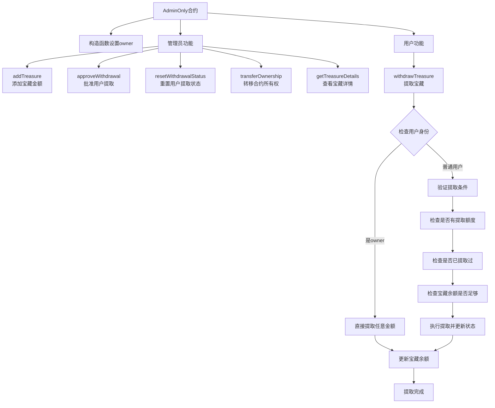

# 管理控制

Day: Day 5
ID: 5
原文: https://www.notion.so/Admin-Only-Contract-1ca5720a23ef804cbd61dc3ca3d380df?source=copy_link
状态: 完成
译者: 连接站 月球
难度等级: 初级

[🧭 首页](https://www.notion.so/5-5-HerSolidity-28e06421268880e4b645d9458179e231?pvs=21) ｜ [🎓 30天课程日历](https://www.notion.so/28e0642126888002b26be4b2e9841ce0?pvs=21) ｜[](https://www.notion.so/28e06421268881e59a00e854a7444215?pvs=21) ｜[FAQ-Solidity答疑问题库](https://www.notion.so/2910642126888046a897d75705d86a58?pvs=21) ｜ [👩🏻‍💻 关于我们](https://www.notion.so/344d3328efef4b3ab742f92b61533ce8?pvs=21)

在之前的合约中，每个人都是平等的。

只要遵守规则（例如出更高的价），任何人都可以自由地与合约交互。

但在现实世界中，有些操作应当只由特定的人或角色来执行。

想象一个游戏，只有管理员能分发奖励；

或一个金库，只有一个人能批准取款。

我们需要一种机制来表达：

> “只有这个人可以执行这个操作。”
> 

这正是本合约要教你的内容——

如何创建**只能由合约拥有者**调用的函数，

我们将使用一种叫做 **modifier（修饰符）** 的机制。

在此过程中，我们会模拟一个“宝箱系统”：

由一个人控制谁能取宝、取多少、以及何时取。

# 产品需求说明书

## 用户流程



---

## 数据库

| Contract | Type | Bases |  |
| --- | --- | --- | --- |
| AdminOnly | Implementation |  |  |
| └ | Function Name | Visibility | Mutability |
| └ | constructor | Public | 🛑 |
| └ | addTreasure | Public ❗️ | 🛑 |
| └ | approveWithdrawal | Public ❗️ | 🛑 |
| └ | withdrawTreasure | Public ❗️ | 🛑 |
| └ | resetWithdrawalStatus | Public ❗️ | 🛑 |
| └ | transferOwnership | Public ❗️ | 🛑 |
| └ | getTreasureDetails | Public ❗️ |  |

**说明：**

- ❗️ 表示函数有访问控制修饰符（onlyOwner）
- 🛑 表示函数会修改状态变量
- 无🛑标记的函数为view/pure函数，只读取状态不修改

# 细节解释

<aside>
💻

**下面是完整合约代码** 👇🏼

[https://github.com/snehasharma76/30daysSolidity_Web3Compass/blob/master/AdminOnly.sol](https://github.com/snehasharma76/30daysSolidity_Web3Compass/blob/master/AdminOnly.sol)

</aside>

让我们逐行浏览合约代码——解释代码里正在发生的事以及为什么它很重要。

## 设置合约拥有者

```solidity
address public owner;

constructor() {
    owner = msg.sender;
}

```

我们首先声明一个 `owner` 变量，用于存储部署该合约的账户地址。

在构造函数constructor中，我们写 `owner = msg.sender`。记住我们之前课程中的知识：

`msg.sender` 是一个全局变量，用来表示当前调用该函数的账户地址。

而构造函数只在部署时运行一次，因此`owner = msg.sender`这句话的意思是：

> “谁部署了这个合约，谁就是合约的拥有者。”
> 

这个拥有者将在接下来的合约中拥有特殊权限。

---

## 通过修饰符实现可复用的访问控制

```solidity
modifier onlyOwner() {
    require(msg.sender == owner, "Access denied: Only the owner can perform this action");
    _;
}

```

这是我们的“**护栏**”。

在 Solidity 中，modifier（修饰符）让我们能够创建可以附加到函数中的可复用的小型权限检查逻辑。

这个修饰符会检查调用者是否是拥有者。

如果不是，函数将不会继续执行。

符号 `_` 表示权限检查之后的函数主体将被插入的位置（它是一个占位符）。

只有检查通过时，函数主体的代码才会被执行。

这样一来，我们不再需要在每个函数中都写

`require(msg.sender == owner)`，

只需添加 `onlyOwner` 修饰符即可——

更简洁、更安全、也更好维护。

---

## 往宝箱中添加宝物

```solidity
uint256 public treasureAmount;

function addTreasure(uint256 amount) public onlyOwner {
    treasureAmount += amount;
}

```

这里我们引入了“宝物”，用一个 `uint256` 类型的变量存储。

只有拥有者可以调用 `addTreasure()` 函数。当函数被调用时，宝箱中的数量会增加指定的数额。

`onlyOwner` 修饰符确保没有随便其Ta人可以潜入并添加（或假装添加）宝物。

---

## 授权Ta人取宝

```solidity
mapping(address => uint256) public withdrawalAllowance;

function approveWithdrawal(address recipient, uint256 amount) public onlyOwner {
    require(amount <= treasureAmount, "Not enough treasure available");
    withdrawalAllowance[recipient] = amount;
}

```

现在假设拥有者想允许某个人可以取出一些宝物。

我们使用一个 `mapping` （映射）来记录每个地址被允许提取的数量。

在批准前，我们会先检查宝箱中是否有足够的宝物来覆盖提取数量。

这个逻辑的流程是：

- 拥有者为某个地址设置提取额度；
- 那个地址之后可以尝试取宝，但前提是已经被批准。

这就像银行经理给你一张写有额度的取款单。

---

## 实际的取宝过程

```solidity
mapping(address => bool) public hasWithdrawn;

function withdrawTreasure(uint256 amount) public {

```

这是让人们真正从宝箱中取出宝物的函数。

接下来我们分两种情况来看它的逻辑。

---

### 情况一：拥有者自己取宝

```solidity
if (msg.sender == owner) {
    require(amount <= treasureAmount, "Not enough treasury available for this action.");
    treasureAmount -= amount;
    return;
}

```

如果调用者是拥有者，那么 Ta 拥有完全的自由：

可以提取任意数量的宝物，只要宝箱里足够。

这里我们不检查Ta的额度，也不追踪Ta的提取记录，

因为拥有者本身就有最高权限。

---

### 情况二：普通用户取宝

```solidity
uint256 allowance = withdrawalAllowance[msg.sender];
require(allowance > 0, "You don't have any treasure allowance");
require(!hasWithdrawn[msg.sender], "You have already withdrawn your treasure");
require(allowance <= treasureAmount, "Not enough treasure in the chest");

```

如果调用者不是拥有者，我们就要进行一系列检查：

- 是否被批准提取？
- 是否已经提取过？
- 宝箱里是否仍有足够的宝物？

如果任意条件不满足，函数将立即终止执行。

这样我们建立了一个系统：

用户只能提取一次，且必须经过拥有者的批准。

---

## 完成取宝操作

```solidity
hasWithdrawn[msg.sender] = true;
treasureAmount -= allowance;
withdrawalAllowance[msg.sender] = 0;
}

```

当所有检查都通过后，我们执行以下操作：

- 将用户标记为“已提取”；
- 从宝箱中减去被批准的提取数量；
- 将该用户的提取额度重置为零，防止重复提取。

这样一来，可以确保用户只能获得被授权的宝物，并且只有一次机会。

---

## 重置用户的提取状态

```solidity
function resetWithdrawalStatus(address user) public onlyOwner {
    hasWithdrawn[user] = false;
}

```

如果你想让某个用户再次拥有资格提取宝物（例如完成了新的任务或通过了新的关卡），

这个函数的功能能够让拥有者重置该用户的提取状态，从而使该用户能够再次进行取宝。

同样，这个函数也受到 `onlyOwner` 修饰符保护。

---

## 转移合约拥有权

```solidity
function transferOwnership(address newOwner) public onlyOwner {
    require(newOwner != address(0), "Invalid address");
    owner = newOwner;
}

```

就像现实中的系统一样，

原始创建者有时会卸任并将控制权移交给Ta人。

这个函数允许当前拥有者指定一个新的拥有者。

函数中我们还加入了一个快速检查，防止新地址是空的或无效的。

一旦执行后，新拥有者将获得完全控制权——

包括添加宝物、批准用户、再次转移拥有权。

---

## 查看宝箱信息（仅限拥有者）

```solidity
function getTreasureDetails() public view onlyOwner returns (uint256) {
    return treasureAmount;
}

```

最后，这个函数让拥有者可以查看宝箱中当前的宝物数量。

它被标记为 `view`（仅查看，不修改数据），

并受 `onlyOwner` 保护，确保只有拥有者才能调用。

---

## 总结

虽然这个合约可能看起来很简单，

但它教授了 **Solidity 中一个极其重要的概念**：

如何控制谁有权执行什么操作。

以下是我们今天学到的：

- 如何使用 `msg.sender` 来跟踪和识别函数调用者；
- 修饰符如何帮助避免重复并实现简洁的权限检查；
- 如何用 `mapping` 与标记（flags）追踪特定用户的权限；
- 如何模拟一个真实世界的“管理员面板”——
    
    只有拥有者能添加、批准、重置或转移控制权。
    

这是你将在代币合约、NFT 铸造、治理系统以及几乎所有生产级智能合约中看到的常见模式。

---

## 进阶挑战

你可以尝试以下一些想法来升级此合约：

- 添加**冷却时间计时器**：用户只能每隔 X 分钟提取一次
- 在添加、提取、或转移拥有权时**触发事件**（**emit event**）
- 添加一个**查询函数**，让用户查看自己是否被批准、是否已提取
- 为**每个用户设置最大提取上限**

准备好了迎接下一份合约了吗？我们现在只是在热身。