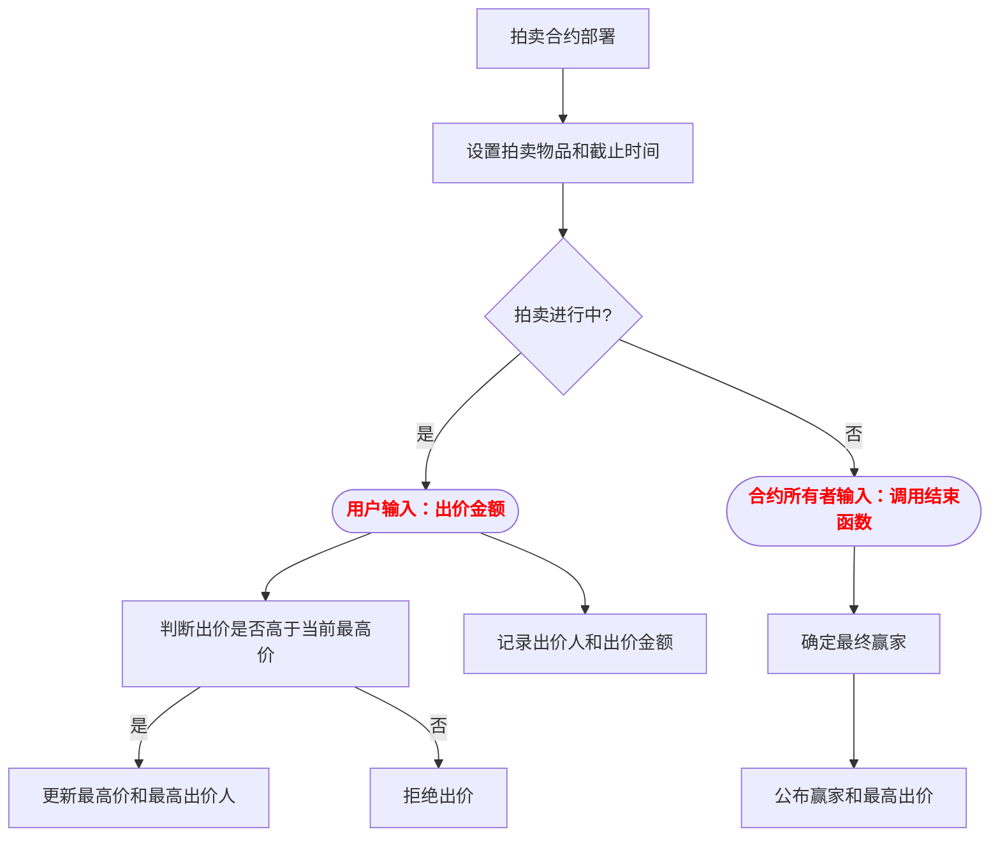

# 拍卖行合约

Day: Day 4
ID: 4
原文: https://www.notion.so/AuctionHouse-Contract-1c35720a23ef80198952efbbe2554608?source=copy_link
状态: 完成
译者: 禾
难度等级: 初级

[🧭 首页](https://www.notion.so/5-5-HerSolidity-28e06421268880e4b645d9458179e231?pvs=21) ｜ [🎓 30天课程日历](https://www.notion.so/28e0642126888002b26be4b2e9841ce0?pvs=21) ｜[](https://www.notion.so/28e06421268881e59a00e854a7444215?pvs=21) ｜[FAQ-Solidity答疑问题库](https://www.notion.so/2910642126888046a897d75705d86a58?pvs=21) ｜ [👩🏻‍💻 关于我们](https://www.notion.so/344d3328efef4b3ab742f92b61533ce8?pvs=21)

# 今日学习内容：

我们已经使用过像`string`, `uint`, `mapping`, 和`array`这样的数据类型。你已经了解如何存储和检索数据，甚至知道如何用  `require()`实现一些逻辑。

但是讲实话——只处理孤立的部分对于练习来说还行...

现在到了整合所有内容、构建一个完整、真实的合约的时候了。
在这个教程中，我们将构建一个拍卖系统 。你可以把它想象成一个在线竞价平台，用户可以对物品进行出价，最终出价最高者获胜。

<aside>
💻

以下是完整代码👇🏼：

[https://github.com/snehasharma76/30daysSolidity_Web3Compass/blob/master/AuctionHouse.sol](https://github.com/snehasharma76/30daysSolidity_Web3Compass/blob/master/AuctionHouse.sol)

</aside>

# 1. 产品需求书

1. 用户路径图



b. 数据库结构表

|  contact |  function name |  visibility | mutability |  modifiers | notes |
| --- | --- | --- | --- | --- | --- |
| **AuctionHouse** | Implementation |  |  |  |  |
| └ | <Constructor> | Public ❗️ | 🛑 | NO❗️ |  |
| └ | bid | External ❗️ | 🛑 | NO❗️ |  |
| └ | endAuction | External ❗️ | 🛑 | NO❗️ |  |
| └ | getAllBidders | External ❗️ |  | NO❗️ |  |
| └ | getWinner | External ❗️ |  | NO❗️ |  |
|  |  |  |  |  |  |

# 2. 细节解说

在深入代码之前，让我们先问自己一个问题：

# 我们实际需要哪些数据来运行拍卖？

让我们仔细思考一下。

## 1.谁创建了拍卖？

我们需要追踪负责操作的人——即部署合约的人。我们称他们为所有者 。

```solidity
address public owner;
```

我们将在合约部署时设置此项，并将其设为`public` ，以便任何人都可以验证竞拍的所有者。

## 2. 我们在拍卖什么？

一定有物品，对吧？一幅画、一部手机、一件稀有数字收藏品——我们希望拍卖创建者描述即将被竞拍的东西。

```solidity
string public item;
```

这可以是任何东西——在部署合同时，我们将让所有者提供物品名称。

## 3. 拍卖何时结束？

我们不想让拍卖永远持续下去。因此，我们将定义它的持续时间——并使用时间戳跟踪拍卖结束的时间。

```solidity
uint public auctionEndTime;
```

我们将使用当前时间加上拍卖应运行的时间来计算这一点。更多内容将在我们到达构造函数时介绍。

## 4. 目前谁在领先？

这有点重要。我们需要存储：

- 迄今为止的最高出价
- 以及出价人的地址

```solidity
address private highestBidder;
uint private highestBid;
```

我们将这些标记为`private` ，这样没有人可以直接访问它们并欺骗系统。但我们仍然会让人看到它们——只是拍卖结束后 。

## 5. 拍卖已经结束了吗？

我们需要一个标志来标记拍卖是否完成——以确保它不会被结束两次，或者有人过早地查看获胜者。

```solidity
bool public ended;
```

这最初是 `false`，一旦有人正式结束拍卖，就会切换为`true`。

## 6. 谁出价了，出价多少？

我们想要记录每个用户的出价。这样我们就能确保人们不会再次出相同金额的价，并且知道谁参与了竞标。

```solidity
mapping(address => uint) public bids;
```

也许我们还想要一个完整列出所有至少出价一次的人的名单——不只是他们的出价金额：

```solidity
address[] public bidders;
```

如果你想要展示排行榜或者只是保持事情透明，这会很有帮助。

# 那么，我们该如何设置这一切呢？

让我们从构造函数开始——这是合约部署时仅执行一次的部分。

```solidity
constructor(string memory _item, uint _biddingTime) {
    owner = msg.sender;
    item = _item;
    auctionEndTime = block.timestamp + _biddingTime;
}
```

这是发生的事情：

- `msg.sender`  是一个全局变量——它给我们提供**部署合约的操作者地址** 。我们将其保存为所有者。
- `_item` 是被拍卖物品的名称——我们将其存储在 `item` 变量中。
- `_biddingTime` 表示拍卖应持续的时间（以秒为单位）。我们将它加到当前时间（`block.timestamp`）上，以确定拍卖何时结束。

例如，如果有人使用`"Digital Art"`和  `300`部署这个，拍卖将在 5 分钟后结束。

# 现在我们来谈谈出价。

这是用户主要执行的操作。以下是该函数的样式：

```solidity
function bid(uint amount) external {
    require(block.timestamp < auctionEndTime, "Auction has already ended.");
    require(amount > 0, "Bid amount must be greater than zero.");
    require(amount > bids[msg.sender], "New bid must be higher than your current bid.");

    if (bids[msg.sender] == 0) {
        bidders.push(msg.sender);
    }

    bids[msg.sender] = amount;

    if (amount > highestBid) {
        highestBid = amount;
        highestBidder = msg.sender;
    }
}
```

让我们慢慢来。

## 首先：这个出价可能发生吗？

我们使用 `require()` 来设置规则——如果规则失败，函数会立即停止。

1. 拍卖已经结束了吗？
    
    
    ```solidity
    require(block.timestamp < auctionEndTime, "Auction has already ended.");
    ```
    
    如果当前时间已过拍卖截止时间，将不再接受更多出价。
    
2. 出价金额是否有效？
    
    
    ```solidity
    require(amount > 0, "Bid amount must be greater than zero.");
    ```
    
    我们不希望有人出价零或负数。
    
3. 这次出价是否高于该用户的上次出价？
    
    
    ```solidity
    require(amount > bids[msg.sender], "New bid must be higher than your current bid.");
    ```
    
    这确保了人们只会提高他们的出价——不会进行垃圾信息发送或降低出价。
    

## 接下来：这是新的竞标者吗？

```solidity
if (bids[msg.sender] == 0) {
    bidders.push(msg.sender);
}
```

如果这是用户的首次出价 ，我们将他们添加到`bidders`数组中。这样，我们就能得到一个完整的参与人员名单。

## 然后：保存出价

```solidity
bids[msg.sender] = amount;
```

我们在  `bids`  映射中更新他们的出价金额。

## 最后：他们是不是新的最高价者？

```solidity
if (amount > highestBid) {
    highestBid = amount;
    highestBidder = msg.sender;
}
```

如果这是目前为止我们看到的最大出价，我们会同时更新出价和出价者。

# 拍卖结束

某个时刻，拍卖必须停止。这就是这个功能发挥作用的地方：

```solidity
function endAuction() external {
    require(block.timestamp >= auctionEndTime, "Auction hasn't ended yet.");
    require(!ended, "Auction end already called.");
    ended = true;
}
```

我们来逐步解析它。

1. 首先，我们检查拍卖时间是否已过：
    
    ```solidity
    require(block.timestamp >= auctionEndTime, "Auction hasn't ended yet.");
    ```
    
2. 然后，我们确保没有人已经结束它：
    
    ```solidity
    require(!ended, "Auction end already called.");
    ```
    
3. 如果一切顺利，我们翻转 `ended` 标志：
    
    ```solidity
    ended = true;
    ```
    

这是一种  **常见的 Solidity 模式**  — 使用 `bool` 来确保某事只发生一次。

# 拍卖结束后查看信息

我们不想在拍卖结束前暴露获胜者。这就是为什么我们使 `highestBidder` 和 `highestBid` 私有的。但我们可以像这样揭示它们：

```solidity
function getWinner() external view returns (address, uint) {
    require(ended, "Auction has not ended yet.");
    return (highestBidder, highestBid);
}
```

我们检查拍卖是否已结束。如果已结束，我们返回获胜者的地址和他们的出价。

# 想查看所有出价者吗？

当然，我们也有这个功能：

```solidity

function getAllBidders() external view returns (address[] memory) {
    return bidders;
}
```

这仅返回`bidders`数组，所以任何人都可以看到参与情况。

# 快速回顾

这份合同引入了一些重要概念：

- **全局变量** ：
`msg.sender` 告诉我们谁在调用一个函数
`block.timestamp` 给我们提供当前时间
- **require()** 帮助我们执行规则并控制允许的操作
- **构造函数Constructor**  运行一次并设置合约的初始状态
- **可见性 关键字** 如 `public`, `private`, 和 `external` 控制哪些内容可以被访问以及被谁访问
- **映射**和**数组**帮助我们追踪用户数据与参与情况

# 你后续可以在代码之上构建什么？

这次拍卖有效——但你可以随时添加更多。

这里有一些你可以尝试的事情：

- 添加一个**最低加价规则** （例如每个新出价必须至少高 5%）
- 允许未中奖者**撤回他们的出价**
- 添加一个**起拍价**