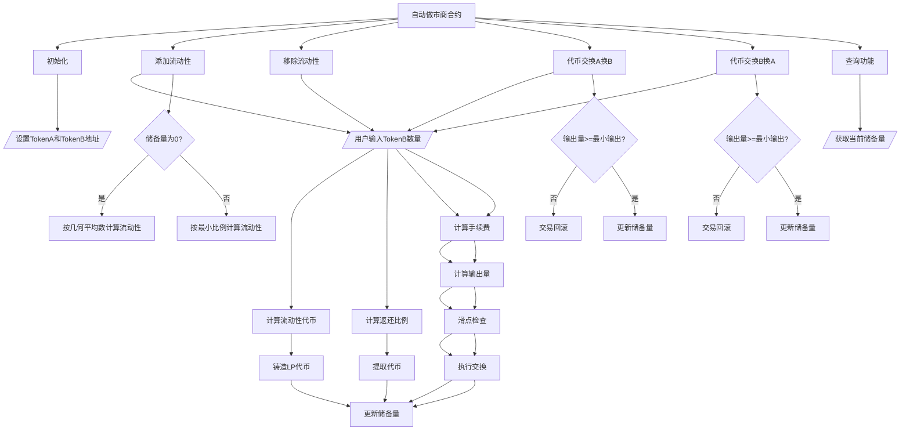

# 自动做市商合约

Day: Day 25
ID: 25
原文: https://www.notion.so/Automated-Market-Maker-1df5720a23ef807cac40e0ddc4e22224?source=copy_link
状态: 完成
译者: 连接站 月球
难度等级: 高级

欢迎回到 **30天学Solidity** —— 在这里，我们每天把一个复杂概念变成你真正能理解的代码。

今天，我们将揭开 DeFi 中最传奇机制之一的神秘面纱：

**自动化做市商（Automated Market Maker）**，简称 AMM。

# 产品需求说明书

## 用户流程



## 数据库

| Contract | Type | Bases |
| --- | --- | --- |
| **AutomatedMarketMaker** | Implementation | ERC20 |

### 状态变量

| 变量名 | 类型 | 可见性 | 说明 |
| --- | --- | --- | --- |
| tokenA | IERC20 | Public | 代币A合约地址 |
| tokenB | IERC20 | Public | 代币B合约地址 |
| reserveA | uint256 | Public | 代币A储备量 |
| reserveB | uint256 | Public | 代币B储备量 |
| owner | address | Public | 合约所有者 |

### 函数清单

| Function Name | Visibility | Mutability | 说明 |
| --- | --- | --- | --- |
| **constructor** | Public ❗️ | 🛑 | 构造函数，初始化代币对和合约名称 |
| **addLiquidity** | Public ❗️ | 🛑 | 添加流动性到资金池 |
| **removeLiquidity** | Public ❗️ | 🛑 | 从资金池移除流动性 |
| **swapAforB** | Public ❗️ | 🛑 | 用代币A交换代币B |
| **swapBforA** | Public ❗️ | 🛑 | 用代币B交换代币A |
| **getReserves** | Public ❗️ |  | 查看当前储备量 |
| **min** | Internal |  | 返回两个值中的较小值 |
| **sqrt** | Internal |  | 巴比伦平方根算法 |

### 事件

| Event Name | 参数 | 说明 |
| --- | --- | --- |
| **LiquidityAdded** | provider, amountA, amountB, liquidity | 流动性添加事件 |
| **LiquidityRemoved** | provider, amountA, amountB, liquidity | 流动性移除事件 |
| **TokensSwapped** | trader, tokenIn, amountIn, tokenOut, amountOut | 代币交换事件 |

### 继承的ERC20函数

| Function Name | Visibility | Mutability | 说明 |
| --- | --- | --- | --- |
| **totalSupply** | Public ❗️ |  | 获取总供应量 |
| **balanceOf** | Public ❗️ |  | 获取账户余额 |
| **_mint** | Internal | 🛑 | 铸造代币 |
| **_burn** | Internal | 🛑 | 销毁代币 |
| **transfer** | Public ❗️ | 🛑 | 转账代币 |
| **transferFrom** | Public ❗️ | 🛑 | 从指定地址转账 |

# 细节解释

---

自动化做市商是 **DeFi 最强大的发明之一** —— 这种东西帮助智能合约变成成熟的金融应用程序

我们在谈论：

**自动化做市商** —— 也就是 AMM。

但如果你觉得听起来很高大上，不用担心 ——

因为在学习结束时，你不仅会知道 AMM 是什么，

你还能够自己构建一个 AMM。

让我们先从 **为什么 AMM 会存在** 的故事开始。

---

## 🏛️ 回到过去：人们如何交易加密货币

让我们回到交易最初的运作方式 —— 即使在加密货币的早期：

它就像一个股票市场。

- **买家**说：
    
    *“我想买 1 个 DAI，我愿意付 0.95 个 ETH。”*
    
- **卖家**说：
    
    *“我有 1 个 DAI 想卖，但我想要 1 个 ETH。”*
    
- 买家和卖家中间坐着一个叫做 **订单簿** 的系统。
    
    把它想象成一个巨大的列表，用来匹配买家和卖家。
    

当买家和卖家对价格达成一致？砰 —— 交易发生了。

这种系统在像 Binance 或 Coinbase 这样的中心化交易所上运行良好。

但有一个问题……

---

## 🤕 为什么链上不能这样做

在区块链上，一切都要消耗 **gas**。

即便是像“我想买 DAI”这样简单的操作，也意味着：

- 发送交易
- 支付手续费
- 等待确认

想象一下，对于买入或卖出价格的**每一个微小动作变化** ，都必须遵循这样的流程。那将是噩梦。

而且如果那时没有人愿意和你交易呢？

你就被卡住了。你的订单就那样挂着，浪费 gas 和时间。

所以核心问题是：

- 订单簿是**中心化的**
- 它们需要人一直活跃
- 链上使用既慢又贵

DeFi 需要一些**更好的方式**。

---

## 💡 突破口：如果不需要买家和卖家会怎样？

这是改变一切的绝妙想法：

> 如果人们不需要等待交易伙伴呢？
> 

> 如果智能合约可以像自动售货机一样提供代币呢？
> 

所以，不再依赖别人来交易……

你将拥有一个包含两种代币的池子 —— 比如 DAI 和 ETH ——

该池子锁在任何人都可以使用的合约中。

想**用 DAI 买 ETH**？

合约做数学运算，给你 ETH，同时收下你的 DAI。

想**出售ETH 换取 DAI**？

同样 —— 合约给你 DAI，同时留存你的 ETH。

不需要买家，不需要卖家。只需要数学。

---

## 📐 那它实际上是如何运作的？

AMM 使用一个简单公式：

> x × y = k
> 

让我们拆解一下。

- `x` = 池中代币 A 的数量
- `y` = 池中代币 B 的数量
- `k` = 某个常数（永远不变）

所以 **两个代币储备的乘积必须始终保持不变**。

这里的魔力是：

如果有人想添加更多的代币 A（比如 ETH），

保持 `k` 不变的唯一方法是让合约给Ta们更少的代币 B（比如 DAI）。

这就是价格**自动**调整的方式。

随着交易的增多，比例会发生变化 —— 价格也随之自动更新。

这就是为什么它叫**自动化做市商**。

合约使用数学来创造市场，而不是依赖人工订单。

---

## 🔁 那么 AMM 可以做什么？

主要有三件大事可以做：

1. **兑换**代币
    - 即时将代币 A 换成代币 B（或反过来）
    - 不用等待匹配
    - 只需发送代币，即可得到另一种代币
2. **添加流动性**
    - 存入等值的代币 A 和 B
    - 获得 **LP 代币**（类似收据）
    - 当你的代币在池中时，你会获得交易费用分成
3. **移除流动性**
    - 归还 LP 代币
    - 取回你对应份额的两种代币

---

现在你已经理解了概念……

下一部分，我们将查看一个真实的 Solidity 合约 —— 并演示如何**从零开始编码自己的 AMM**。

我们将展示：

- 流动性池是如何工作的
- 价格计算是如何完成的
- 如何确保一切公平平衡

准备好构建 DeFi 的核心引擎了吗？

让我们进入代码部分。

---

## 🛠️ 今天你要构建的内容

今天的项目不仅仅是一个玩具合约。

你要构建的是驱动数十亿美元去中心化交易的**核心引擎**。

但有个特点：

- **不用库（libraries）**
- **不用捷径**
- **没有幕后魔法**

你将**纯手写**自动化做市商的核心 —— 这是真正理解它的**最佳方式**。

让我们准确分解一下你的智能合约将做什么，以及分析每部分的重要性：

---

### 🔁 创建两个 ERC-20 代币之间的流动性池

你将从锁定两个 ERC-20 代币开始 —— 我们称它们为 **代币 A** 和 **代币 B** —— 放入智能合约中。

这些代币形成**流动性池**。

人们将通过这个池子进行**代币兑换**或**提供流动性**。它就像存放所有交易资产的金库。

---

### ➕ 允许用户添加和移除流动性

任何人都可以向池子存入等值的代币 A 和 B。

为什么需要等值？

因为它保持**价格比例**平衡。

当有人添加流动性时：

- 你将Ta们的代币存入合约
- 然后你给Ta们签发 **LP 代币**（liquidity provider tokens 的缩写）—— 就像数字收据

稍后，当Ta们移除流动性时，归还 LP 代币 —— 你返还Ta们对应份额的两种代币。

这样，每个人都有拥有池子份额的**所有权证明（proof of ownership）**。

---

### 🧮 跟踪并更新内部储备

合约会始终跟踪记录两个数值：

- `reserveA`：池中代币 A 的数量
- `reserveB`：池中代币 B 的数量

每次有人添加、移除代币，或者进行兑换时，这些储备都会更新。

这些数值非常**关键**，因为它们用于：

- 计算公平价格
- 执行恒定乘积公式（稍后详细说明）
- 防止滥用或操纵

---

### 🔁 允许任何人以代币 A 兑换代币 B（反之亦然）

这是 AMM 的核心功能。

比如 Alice 想用她的代币 A 兑换代币 B。

你的合约会：

- 接收她的代币 A
- 根据当前池比例计算给她多少代币 B
- 更新储备
- 转账代币

这一切都发生在**无需交易对手**的情况下 —— 不需要卖家。

同样逻辑适用于反向兑换 —— 代币 B 换代币 A。

---

### 📐 使用恒定乘积公式

魔法发生时刻。

你的合约将使用以下公式来确定兑换率：

> x * y = k
> 

其中：

- `x` = 代币 A 的储备
- `y` = 代币 B 的储备
- `k` = 永远不变的常数

当有人向池中添加代币 A 时，保持 `k` 不变的唯一方法是**减少一些代币 B** —— 反之亦然。

这就是价格发现的方式。自动、公平，并且基于数学。

为防止滥用，你还会对每笔交易收取小额手续费（例如 0.3%） —— 就像 Uniswap一样 —— 然后支付给流动性提供者。

---

### 🎟️ 发放自定义 LP 代币

还记得之前人们添加流动性得到的“收据”吗？

这些 LP 代币代表Ta们在池中的**所有权份额**。

如果池子因交易费用增长，LP 会受益 —— 因为Ta们可以提取的资产比投入的**更多**。

你将扩展 ERC-20 合约来自己发行和管理这些 LP 代币。

---

这个合约表面看起来可能很简单 —— 只是几个函数、几个数学公式……

但合约背后呢？

你正在重新创建**去中心化交易所**的基本构建模块 —— 运行在以太坊上，无需任何人、经纪人或中间人。

最棒的部分是，

你将逐行编写 —— 完全透明、完全去中心化，并且完全在你掌控之下。

让我们开始构建。

---

## 合约拆解

现在你已经理解了**什么是自动化做市商**以及**它为什么重要**，是时候该深入了解。

接下来你将看到的是一个**可运行 AMM 的完整代码** —— 如果一开始看上去有些吓人也不用担心。我们会**逐步拆解**，并用通俗语言解释每一部分。

从开头的导入……

到如何添加和移除流动性……

再到代币兑换背后的精确数学……

在本次拆解结束时，你将明白：

- ERC-20 代币如何集成到智能合约中
- 储备余额如何被跟踪和更新
- `x * y = k` 公式在代码中究竟是什么样子
- 以及自定义 LP 代币如何被铸造和销毁

所以先深呼吸，慢慢往下滚动 —— 让我们逐行解码。

这是一切开始变得清晰的地方。

```solidity
// SPDX-License-Identifier: MIT
pragma solidity ^0.8.20;

import "@openzeppelin/contracts/token/ERC20/ERC20.sol";

/// @title Automated Market Maker with Liquidity Token
contract AutomatedMarketMaker is ERC20 {
    IERC20 public tokenA;
    IERC20 public tokenB;

    uint256 public reserveA;
    uint256 public reserveB;

    address public owner;

    event LiquidityAdded(address indexed provider, uint256 amountA, uint256 amountB, uint256 liquidity);
    event LiquidityRemoved(address indexed provider, uint256 amountA, uint256 amountB, uint256 liquidity);
    event TokensSwapped(address indexed trader, address tokenIn, uint256 amountIn, address tokenOut, uint256 amountOut);

    constructor(address _tokenA, address _tokenB, string memory _name, string memory _symbol) ERC20(_name, _symbol) {
        tokenA = IERC20(_tokenA);
        tokenB = IERC20(_tokenB);
        owner = msg.sender;
    }

    /// @notice Add liquidity to the pool
    function addLiquidity(uint256 amountA, uint256 amountB) external {
        require(amountA > 0 && amountB > 0, "Amounts must be > 0");

        tokenA.transferFrom(msg.sender, address(this), amountA);
        tokenB.transferFrom(msg.sender, address(this), amountB);

        uint256 liquidity;
        if (totalSupply() == 0) {
            liquidity = sqrt(amountA * amountB);
        } else {
            liquidity = min(
                amountA * totalSupply() / reserveA,
                amountB * totalSupply() / reserveB
            );
        }

        _mint(msg.sender, liquidity);

        reserveA += amountA;
        reserveB += amountB;

        emit LiquidityAdded(msg.sender, amountA, amountB, liquidity);
    }

    /// @notice Remove liquidity from the pool
    function removeLiquidity(uint256 liquidityToRemove) external returns (uint256 amountAOut, uint256 amountBOut) {
        require(liquidityToRemove > 0, "Liquidity to remove must be > 0");
        require(balanceOf(msg.sender) >= liquidityToRemove, "Insufficient liquidity tokens");

        uint256 totalLiquidity = totalSupply();
        require(totalLiquidity > 0, "No liquidity in the pool");

        amountAOut = liquidityToRemove * reserveA / totalLiquidity;
        amountBOut = liquidityToRemove * reserveB / totalLiquidity;

        require(amountAOut > 0 && amountBOut > 0, "Insufficient reserves for requested liquidity");

        reserveA -= amountAOut;
        reserveB -= amountBOut;

        _burn(msg.sender, liquidityToRemove);

        tokenA.transfer(msg.sender, amountAOut);
        tokenB.transfer(msg.sender, amountBOut);

        emit LiquidityRemoved(msg.sender, amountAOut, amountBOut, liquidityToRemove);
        return (amountAOut, amountBOut);
    }

    /// @notice Swap token A for token B
    function swapAforB(uint256 amountAIn, uint256 minBOut) external {
        require(amountAIn > 0, "Amount must be > 0");
        require(reserveA > 0 && reserveB > 0, "Insufficient reserves");

        uint256 amountAInWithFee = amountAIn * 997 / 1000;
        uint256 amountBOut = reserveB * amountAInWithFee / (reserveA + amountAInWithFee);

        require(amountBOut >= minBOut, "Slippage too high");

        tokenA.transferFrom(msg.sender, address(this), amountAIn);
        tokenB.transfer(msg.sender, amountBOut);

        reserveA += amountAInWithFee;
        reserveB -= amountBOut;

        emit TokensSwapped(msg.sender, address(tokenA), amountAIn, address(tokenB), amountBOut);
    }

    /// @notice Swap token B for token A
    function swapBforA(uint256 amountBIn, uint256 minAOut) external {
        require(amountBIn > 0, "Amount must be > 0");
        require(reserveA > 0 && reserveB > 0, "Insufficient reserves");

        uint256 amountBInWithFee = amountBIn * 997 / 1000;
        uint256 amountAOut = reserveA * amountBInWithFee / (reserveB + amountBInWithFee);

        require(amountAOut >= minAOut, "Slippage too high");

        tokenB.transferFrom(msg.sender, address(this), amountBIn);
        tokenA.transfer(msg.sender, amountAOut);

        reserveB += amountBInWithFee;
        reserveA -= amountAOut;

        emit TokensSwapped(msg.sender, address(tokenB), amountBIn, address(tokenA), amountAOut);
    }

    /// @notice View the current reserves
    function getReserves() external view returns (uint256, uint256) {
        return (reserveA, reserveB);
    }

    /// @dev Utility: Return the smaller of two values
    function min(uint256 a, uint256 b) internal pure returns (uint256) {
        return a < b ? a : b;
    }

    /// @dev Utility: Babylonian square root
    function sqrt(uint256 y) internal pure returns (uint256 z) {
        if (y > 3) {
            z = y;
            uint256 x = y / 2 + 1;
            while (x < z) {
                z = x;
                x = (y / x + x) / 2;
            }
        } else if (y != 0) {
            z = 1;
        }
    }
}

```

让我们以最适合初学者的方式开始拆解这个合约。

---

---

## 🧱 1. 导入 ERC20 标准

```solidity
import "@openzeppelin/contracts/token/ERC20/ERC20.sol";

```

先从这一行开始 —— 很简单，但功能非常强大。

这里，我们从 **OpenZeppelin** 导入了 ERC20 合约。

> 🧰 什么是 OpenZeppelin？
> 
> 
> 它是一个经过实战验证、安全可靠的智能合约库，在以太坊生态系统中被广泛使用。可以把它想象成你可以信赖的乐高积木 —— 不用从零构建每一块砖。
> 

> 📦 什么是 ERC20？
> 
> 
> ERC-20 是以太坊上创建代币的标准。大多数你听说过的代币 —— 比如 DAI、USDC 或 UNI —— 都遵循这个标准。它定义了代币的行为方式，包括：
> 
- 如何发送和接收代币（`transfer`）
- 如何授权Ta人使用代币（`approve` + `transferFrom`）
- 如何查询余额（`balanceOf`）
- 甚至如何创建或销毁代币（`mint` 和 `burn`）（如果允许的话）

通过导入 `ERC20.sol`，我们可以立即访问使用**所有这些功能**，无需自己重新编写。

> ✨ 为什么我们在这里需要它？
> 
> 
> 因为我们的 AMM 合约也会发行自己的代币 —— 当用户提供流动性时获得的 LP 代币。这些 LP 代币就是标准的 ERC-20 代币 —— 通过继承 ERC20 合约，我们可以像操作任何其它代币一样铸造它们。
> 

这个导入为 LP 代币功能搭建了整个骨架。

---

## 🧾 2. 合约声明

```solidity
contract AutomatedMarketMaker is ERC20 {

```

这一行开始了我们的主要智能合约。

我们来拆解一下：

- `contract AutomatedMarketMaker`：
    
    定义了一个名为 `AutomatedMarketMaker` 的新合约。这将是我们的 AMM 的**大脑**，负责持有代币、计算兑换、跟踪流动性。
    
- `is ERC20`：
    
    这意味着我们的合约**继承自我们刚导入的 ERC20 合约**。
    

把继承想象成在说：

> “我的合约应该像 ERC20 代币一样运作 —— 在此基础上，我还会添加一些 AMM 专属逻辑。”
> 

因为有了继承，我们无需手动编码 ERC-20 的行为 —— 它已经内置好了。需要发行或销毁 LP 代币时，我们只需调用 `_mint()` 和 `_burn()`。

> 🎟️ 为什么 AMM 需要自己的代币？
> 
> 
> 每当有人提供流动性时，我们会给Ta们一个代币，代表Ta们在**流动性池中的份额证明**。这就是 LP 代币。它像任何其它 ERC-20 代币一样 —— 可以转移、跟踪，并且可以在之后赎回池中对应份额。
> 

所以这一行不仅仅是声明 —— 它是让我们的 AMM 同时扮演代币发行者和去中心化交易所的开始。

---

## 🧮 3. 状态变量

```solidity
IERC20 public tokenA;
IERC20 public tokenB;

uint256 public reserveA;
uint256 public reserveB;

address public owner;

```

这些是**核心变量**，存储 AMM 的重要状态。

可以把它们想象成合约的内部记忆 —— 记录合约处理的代币、每种代币的数量，以及谁部署了合约。

我们逐一解析：

---

### 🪙 `tokenA` 和 `tokenB`

```solidity
IERC20 public tokenA;
IERC20 public tokenB;

```

- 这两个变量存储 AMM 将管理的 ERC-20 代币的**地址**。
- 它们的类型是 `IERC20`，只是一个接口 —— 用来表示：
    
    > “这东西表现得像 ERC-20 代币，所以我知道它有 transfer、transferFrom、approve 等函数。”
    > 

如果这个 AMM 用于交易 **DAI 和 USDC**，那么 `tokenA` 可能是 DAI，`tokenB` 是 USDC。

> ✅ 为什么是 public？
> 
> 
> 因为我们希望这些变量可以**被外部查看** —— 例如前端、区块链浏览器或其他合约。
> 

---

### 🧾 `reserveA` 和 `reserveB`

```solidity
uint256 public reserveA;
uint256 public reserveB;

```

这两个数值跟踪当前锁定在 AMM 合约中的每种代币数量。

为什么需要这个数值？

因为**整个 AMM 逻辑 —— 兑换、价格、LP 份额 —— 都依赖于知道池中每种代币的数量**。

当有人兑换代币时：

- 我们更新这些储备
- 并使用这些数值在公式 `x * y = k` 中计算兑换量

> 🎯 重要提示：这些数值不会自动根据代币余额自动更新 —— 而是每次我们进行操作（如兑换或去除流动性）时，需要手动更新。
> 

---

### 🧑‍💼 `owner`

```solidity
address public owner;

```

存储**部署**合约的地址。

目前，我们还没有使用它来做任何仅限管理员的操作……但这是一个好的模式，如果未来我们想要做以下操作可以考虑该模式：

- 添加治理
- 在紧急情况下让拥有者暂停交易
- 或者之后引入费用转换

> 🔐 现在的案例只是简单追踪谁控制合约 —— 或者只是标记谁最初部署了合约。
> 

---

这些变量一起定义了 AMM 的 **核心身份和状态**：

- 支持哪些代币
- 拥有多少流动性
- 谁拥有或管理它

---

## 🔔 4. Event（事件）

```solidity
event LiquidityAdded(address indexed provider, uint256 amountA, uint256 amountB, uint256 liquidity);
event LiquidityRemoved(address indexed provider, uint256 amountA, uint256 amountB, uint256 liquidity);
event TokensSwapped(address indexed trader, address tokenIn, uint256 amountIn, address tokenOut, uint256 amountOut);

```

这些是 **event（事件）**，虽然它们不会影响合约的底层运作，但在应用与用户交互中起到**重要作用**。

把事件想象成**链上通知**或**区块链的控制台日志**。

每当发生关键操作 —— 添加流动性、移除流动性或兑换代币 —— 我们就会触发一个事件。

让我们逐一解析：

---

### 💧 `LiquidityAdded`

```solidity
event LiquidityAdded(address indexed provider, uint256 amountA, uint256 amountB, uint256 liquidity);

```

- 该事件在有人**添加代币**到池子时触发。
- 记录：
    - 谁添加了流动性 (`provider`)
    - 添加了多少 tokenA 和 tokenB
    - 获得了多少 **LP 代币**

> 🧠 为什么记录事件有用？
> 
> 
> 因为dapps可以**监听这个事件** 并在 UI 显示。例如，一个网站可能显示：
> 
> “你向池中添加了 100 DAI 和 100 USDC，获得了 99 个 LP 代币。”
> 

---

### 💸 `LiquidityRemoved`

```solidity
event LiquidityRemoved(address indexed provider, uint256 amountA, uint256 amountB, uint256 liquidity);

```

- 该事件在有人 **移除池中流动性** 时记录。
- 显示：
    - 谁进行了操作
    - 取回了每种代币的多少
    - 销毁了多少 LP 代币

> 🔍 前端可以用该事件来更新你的池子持仓或历史记录。
> 

---

### 🔄 `TokensSwapped`

```solidity
event TokensSwapped(address indexed trader, address tokenIn, uint256 amountIn, address tokenOut, uint256 amountOut);

```

- 当有人**兑换** 一种代币换另一种代币时触发该事件。
- 告诉我们：
    - 谁进行了兑换 (`trader`)
    - 兑换进来的代币种类 (`tokenIn`)
    - 给进的代币数量
    - 兑换出去的代币种类 (`tokenOut`)
    - 支出的代币数量

> 🖥️ 有了这个，dapps 可以立即显示兑换确认，例如：
> 
> 
> “你用 10 DAI 换了 9.87 USDC。”
> 

---

## 🚀 5. 构造函数 – 初始化设置

```solidity
constructor(address _tokenA, address _tokenB, string memory _name, string memory _symbol) ERC20(_name, _symbol) {
  tokenA = IERC20(_tokenA);
  tokenB = IERC20(_tokenB);
  owner = msg.sender;
}

```

这个函数可能看起来很小，但**至关重要**。

这是**构造函数**，在合约部署到区块链时**只会运行一次**。

我们逐步解析。

---

### 🔧 构造函数的作用

就像在机器首次使用前进行初始配置。你定义：

- AMM 支持哪些代币
- LP 代币的名称
- 谁部署了合约（以后可能控制升级或特殊操作）

---

### 📬 参数

```solidity
constructor(address _tokenA, address _tokenB, string memory _name, string memory _symbol)

```

构造函数接受 **四个输入**：

1. `_tokenA`：第一种 ERC-20 代币的地址（例如 DAI）
2. `_tokenB`：第二种 ERC-20 代币的地址（例如 USDC）
3. `_name`：LP 代币名称（例如 “DAI-USDC LP Token”）
4. `_symbol`：LP 代币符号（例如 “DAIUSDC-LP”）

> 📝 string memory 类型只是在 Solidity中 表示着：
> 
> 
> “我们临时传递这个字符串 —— 不是存储在固定长度的位置。”
> 

---

### 🎟️ `ERC20(_name, _symbol)`

```solidity
ERC20(_name, _symbol)

```

这部分虽然隐蔽，但很重要。

因为我们的 AMM 合约继承自 `ERC20`，这里调用它的构造函数设置 **LP 代币的名称和符号**。

所以有人添加流动性后，可能会得到这个代币，名为：

> “DAI-USDC LP Token (DAIUSDC-LP)”
> 

就像 USDC 有自己的名称和符号一样 —— 你的 LP 代币也会有。

---

### 🪙 代币设置

```solidity
tokenA = IERC20(_tokenA);
tokenB = IERC20(_tokenB);

```

这一部分把实际代币合约赋值给状态变量。

我们将传入的两个地址 (`_tokenA` 和 `_tokenB`) 并将其视作 ERC-20 代币，通过 `IERC20` 接口使用。这让我们可以访问：

- `transfer()`
- `transferFrom()`
- `balanceOf()`
- 以及其它与代币相关的函数

这样 AMM 就知道**它正在处理哪些代币**。

---

### 👑 所有权

```solidity
owner = msg.sender;

```

这一行把 `owner` 变量设置为部署合约的人。

`msg.sender` 是 Solidity 中的全局变量 —— 总是指当前调用函数的地址。

在构造函数中，它就是合约部署者的地址。

我们目前还没有用 `owner` 做任何管理员相关操作，但记录部署者是一个好习惯 —— 以防以后想引入治理或费用分配机制。

---

## 6.🧰 辅助函数 – 小工具，大用途

```solidity
function min(uint256 a, uint256 b) internal pure returns (uint256) {
    return a < b ? a : b;
}

function sqrt(uint256 y) internal pure returns (uint256 z) {
    if (y > 3) {
        z = y;
        uint256 x = y / 2 + 1;
        while (x < z) {
            z = x;
            x = (y / x + x) / 2;
        }
    } else if (y != 0) {
        z = 1;
    }
}

```

---

### 🔽 min(): 返回较小的数

```solidity
function min(uint256 a, uint256 b) internal pure returns (uint256) {
    return a < b ? a : b;
}

```

这个函数用来选择两个数字中较小的一个。

我们为什么需要这个函数？

👉 在 `addLiquidity()` 中，当有人向已有流动性池添加代币时，我们希望根据**哪个代币贡献较少**来铸造 LP 代币 —— 这样可以保持比例稳定，防止铸造过多。

举例：如果用户发送 100 个 A 和 150 个 B，我们只会用 100 个 A 和 100 个 B 来铸造 LP 代币 —— 多余的 50 个 B 会返还给池子。

这个 `min()` 函数确保了池子的**平衡**与**公平**。

---

### 🧮 sqrt(): 巴比伦平方根算法

```solidity
function sqrt(uint256 y) internal pure returns (uint256 z) {
    if (y > 3) {
        z = y;
        uint256 x = y / 2 + 1;
        while (x < z) {
            z = x;
            x = (y / x + x) / 2;
        }
    } else if (y != 0) {
        z = 1;
    }
}

```

这是一种经典的**巴比伦算法** ，用于在 Solidity 中计算数字的平方根——因为 Solidity 不像其它一些编程语言那样内置 sqrt（） 函数。

它只用在一个地方，但用途非常重要：

🎯 使用场景：

在 `addLiquidity()` 中，**第一个提供流动性的人**获得的 LP 代币数量为：

```
sqrt(amountA * amountB)

```

这保证了：

- LP 代币供应从一个平衡值开始
- 结果反映了两个代币添加量的几何平均值
- 例如你添加了 100 A 和 400 B，你的 LP 代币将基于 √(100×400) = √40000 = 200，而不是简单的总和

这是一个公平且数学驱动的方式来初始化池子。

---

🧠 为什么把这些函数放在合约里？

- 它们都是小型**纯函数**（不读/写存储）
- 内部使用可以保持逻辑整洁
- 特别是在处理需要保证重要公平的代币数学时，它们有助于避免出错

我们将在后续函数中使用这些辅助函数。

---

## 💧 7. 添加流动性 – 喂入池子

```solidity
function addLiquidity(uint256 amountA, uint256 amountB) external {
    require(amountA > 0 && amountB > 0, "Amounts must be > 0");

    tokenA.transferFrom(msg.sender, address(this), amountA);
    tokenB.transferFrom(msg.sender, address(this), amountB);

    uint256 liquidity;
    if (totalSupply() == 0) {
        liquidity = sqrt(amountA * amountB);
    } else {
        liquidity = min(
            amountA * totalSupply() / reserveA,
            amountB * totalSupply() / reserveB
        );
    }

    _mint(msg.sender, liquidity);

    reserveA += amountA;
    reserveB += amountB;

    emit LiquidityAdded(msg.sender, amountA, amountB, liquidity);
}

```

---

🧠 总体思路：

这个函数允许用户通过存入等值金额的 Token A 和 Token B 来向池子添加流动性。

作为回报，用户会获得 LP 代币（流动性提供者代币），代表Ta们在池子中的份额。

> 这些 LP 代币就像一张证明你为池子做出了贡献的“收据”，也是你在池子里的代币份额的声明。
> 

第一个添加流动性的人会设定初始价格。

之后的每个人必须**按照当前池子的比例**存入代币 —— 以保持价格公平。

---

🧩 逐行解析：

### ✅ 输入检查

```solidity
require(amountA > 0 && amountB > 0, "Amounts must be > 0");

```

先做一个基本的合理性检查。

- 不允许有人存入零个代币。
- 这样可以保护合约免受奇怪操作影响或避免gas浪费。

---

### 💸 将代币转入池子

```solidity
tokenA.transferFrom(msg.sender, address(this), amountA);
tokenB.transferFrom(msg.sender, address(this), amountB);

```

用户将Ta们的代币实际发送到合约。

- 我们使用 `transferFrom()`，因为用户需要先批准合约可以拿走Ta们的代币。
- 这是标准ERC-20 行为操作 —— 用户必须先调用 `approve()`。

也就是说，用户把 `amountA` 的代币A 和`amountB` 的代币B给了合约。

---

### 📐 计算要铸造的 LP 代币

```solidity
uint256 liquidity;
if (totalSupply() == 0) {
    liquidity = sqrt(amountA * amountB);
} else {
    liquidity = min(
        amountA * totalSupply() / reserveA,
        amountB * totalSupply() / reserveB
    );
}

```

这一部分决定了**要给用户多少 LP 代币**。

- 如果用户是**第一个添加流动性的人**，池子中还没有 LP 代币：
    - 那么我们给Ta们：`sqrt(amountA * amountB)`
    - 这是 Uniswap常用的标准公式，用于公平地设定初始 LP 代币数量。
- 如果池子已经有流动性：
    - 我们根据**比例贡献**来计算用户应获得的 LP 代币数量。
    - 确保用户按**正确比例**添加流动性。
    - 使用 `min()` 函数避免当用户输入的代币数量稍有偏差时铸造过多 LP 代币。

> 这保证了每个人在池子中的份额都是公平的。
> 

---

### 🖨️ 铸造 LP 代币

```solidity
_mint(msg.sender, liquidity);

```

现在我们把 LP 代币实际发给用户。

因为我们的合约继承自 `ERC20`，可以直接调用 `_mint()` 来给用户铸造新代币。

---

### 📊 更新储备量

```solidity
reserveA += amountA;
reserveB += amountB;

```

更新合约内部状态，反映新加入的代币数量。

这是**非常重要的**，因为兑换的数学公式依赖于储备量保持准确。

---

### 🔔 发出事件

```solidity
emit LiquidityAdded(msg.sender, amountA, amountB, liquidity);

```

记录这一操作，前端和 DApp可以显示用户刚刚做了什么。

包括信息：

- 谁添加了流动性
- 添加了多少代币
- 获得了多少 LP 代币

---

## 🧯 8. 移除流动性 – 提取你的份额

```solidity
function removeLiquidity(uint256 liquidityToRemove) external returns (uint256 amountAOut, uint256 amountBOut) {
    require(liquidityToRemove > 0, "Liquidity to remove must be > 0");
    require(balanceOf(msg.sender) >= liquidityToRemove, "Insufficient liquidity tokens");

    uint256 totalLiquidity = totalSupply();
    require(totalLiquidity > 0, "No liquidity in the pool");

    amountAOut = liquidityToRemove * reserveA / totalLiquidity;
    amountBOut = liquidityToRemove * reserveB / totalLiquidity;

    require(amountAOut > 0 && amountBOut > 0, "Insufficient reserves for requested liquidity");

    reserveA -= amountAOut;
    reserveB -= amountBOut;

    _burn(msg.sender, liquidityToRemove);

    tokenA.transfer(msg.sender, amountAOut);
    tokenB.transfer(msg.sender, amountBOut);

    emit LiquidityRemoved(msg.sender, amountAOut, amountBOut, liquidityToRemove);
    return (amountAOut, amountBOut);
}

```

---

### 🧠 总体思路

这个函数允许用户**提取自己之前添加的代币份额**。

用户需要归还（销毁）Ta们的 **LP 代币**，合约会按比例返回：

- 对应比例的 Token A
- 对应比例的 Token B

所有计算都是基于Ta们在总流动性池中的份额。

例如：如果用户持有 10% 的 LP 代币，Ta们将得到池子中每种代币的 10%。

下面逐行解析：

---

### 🧩 逐行解析

---

### ✅ 输入检查

```solidity
require(liquidityToRemove > 0, "Liquidity to remove must be > 0");
require(balanceOf(msg.sender) >= liquidityToRemove, "Insufficient liquidity tokens");

```

- 首先确保用户想移除的 LP 代币数量为正
- 然后确认用户**拥有**足够的 LP 代币
- `balanceOf(msg.sender)` 用于检查用户持有的 LP 代币数量

这样可以保护合约免受无效或恶意输入的影响。

---

### 📊 获取 LP 代币总量

```solidity
uint256 totalLiquidity = totalSupply();
require(totalLiquidity > 0, "No liquidity in the pool");

```

- 获取 LP 代币 **总供应量**，这代表池子 100% 的所有权
- 如果总供应量为零，阻止交易 —— 因为没有流动性可提取

---

### 🧮 计算要返回的代币数量

```solidity
amountAOut = liquidityToRemove * reserveA / totalLiquidity;
amountBOut = liquidityToRemove * reserveB / totalLiquidity;

```

这里是魔法发生之处。

使用简单的比例计算用户应获得多少代币：

> 用户的 LP 份额 × 代币总储备 = 提取数量
> 

例如：如果用户持有 25% 的 LP 代币，Ta们将获得池中 25% 的 Token A 和 Token B。

---

### ⛔ 最终合理性检查

```solidity
require(amountAOut > 0 && amountBOut > 0, "Insufficient reserves for requested liquidity");

```

防止计算因四舍五入出现灰尘值，如果任何输出为 0，则拒绝交易 —— 避免出错或浪费提款。

---

### 🧾 更新内部储备量

```solidity
reserveA -= amountAOut;
reserveB -= amountBOut;

```

从内部储备中扣除提取的代币数量。

这样使兑换数学公式保持正确，因为每笔交易都依赖储备量的准确性。

---

### 🔥 销毁 LP 代币

```solidity
_burn(msg.sender, liquidityToRemove);

```

由于用户归还 LP 代币以换取实际代币，我们会**销毁**这些 LP 代币 —— 实际上是删除它们的存在。

---

### 💸 将代币转回给用户

```solidity
tokenA.transfer(msg.sender, amountAOut);
tokenB.transfer(msg.sender, amountBOut);

```

这些操作将代币实际发送给用户：

- 用户获得`amountAOut` 个代币A
- 用户获得`amountBOut` 个 代币B

所有这些操作由合约自动处理。

---

### 🔔 发出事件

```solidity
emit LiquidityRemoved(msg.sender, amountAOut, amountBOut, liquidityToRemove);

```

记录操作到区块链上，方便 DApp、浏览器或索引器监听捕获。

包括信息：

- 谁提取了流动性
- 提取了多少代币
- 销毁了多少 LP 代币

---

### 📤 返回输出

```solidity
return (amountAOut, amountBOut);

```

返回代币数量，方便调用者（可能是合约或前端）显示结果。

---

## 🔄 9. 用 A 交换 B

```solidity
function swapAforB(uint256 amountAIn, uint256 minBOut) external {
    require(amountAIn > 0, "Amount must be > 0");
    require(reserveA > 0 && reserveB > 0, "Insufficient reserves");

    uint256 amountAInWithFee = amountAIn * 997 / 1000;
    uint256 amountBOut = reserveB * amountAInWithFee / (reserveA + amountAInWithFee);

    require(amountBOut >= minBOut, "Slippage too high");

    tokenA.transferFrom(msg.sender, address(this), amountAIn);
    tokenB.transfer(msg.sender, amountBOut);

    reserveA += amountAInWithFee;
    reserveB -= amountBOut;

    emit TokensSwapped(msg.sender, address(tokenA), amountAIn, address(tokenB), amountBOut);
}

```

假设你在 DEX 上想用 代币**A** 换 代币**B** —— 就像用 ETH 换 DAI。

在中心化交易所，会有匹配引擎帮你配对售卖 DAI 的用户。

而在这里没有卖家，凭借着数学公式计算，你直接和**智能合约**交易。

此函数允许用户：

- 发送一些 `Token A` 给合约
- 自动获得对应数量的 `Token B`
- 合约更新内部储备量以反映交换

但如何计算出正确价格呢？

---

### ⚙️ 核心思想：恒定乘积公式

> x * y = k
> 

这是每个 Uniswap v2 风格的AMM 的公式。

- `x`：合约中 Token A 的数量
- `y`：合约中 Token B 的数量
- `k`：常数 —— 两者的乘积

当有人向池子添加 Token A，池子必须返还**恰好数量的 Token B**，保持 `x * y` 恒定（考虑到滑点和手续费现象，也可以非常接近恒定）。

这意味着：**你尝试交换的次数越多，你的兑换率越差** —— 因为你推动了价格曲线。

这种设计保持池子平衡，防止人为操纵，并根据供需自动调整价格。

---

### 🧩 逐行解析

---

### ✅ 第 1 步：合理性检查

```solidity
require(amountAIn > 0, "Amount must be > 0");
require(reserveA > 0 && reserveB > 0, "Insufficient reserves");

```

- 确保用户输入数量大于 0
- 确保池子有足够流动性，两种代币都必须有存量

若不满足其一，则提前停止交易并**节省 gas**。

---

### 🧮 第 2 步：收取 0.3% 手续费

```solidity
uint256 amountAInWithFee = amountAIn * 997 / 1000;

```

从输入代币中扣除 **0.3% 手续费。**

- 比如输入 100 Token A，只用 99.7 参与交换
- 剩余的 0.3 保留在池子里，奖励流动性提供者

这个小额手续费可以防止滥用（如掉期合约），并让池子随时间增长，这有利于 LP。

---

### 🔢 第 3 步：计算获得多少 Token B

```solidity
uint256 amountBOut = reserveB * amountAInWithFee / (reserveA + amountAInWithFee);

```

- 计算用户投入**代币A**应获得的**代币B**数量
- `reserveA`：交换前池中 Token A 数量
- `amountAInWithFee`：扣除手续费后的新增 Token A数量
- 代码中的公式确保**交易后** `x * y = k` 大致保持不变

你投入越多，**你每单位获得越少**，因为这推动了价格曲线，这就是**价格滑点**。

所以这很公平。它是自动的，无需人工定价。

---

### 🛡️ 第 4 步：滑点保护

```solidity
require(amountBOut >= minBOut, "Slippage too high");

```

再继续深入之前，我们先检查**实际输出**是否符合用户期望。

- `minBOut` 是用户设置的最小可接受 Token B 数量，Ta们想表达的是：

> “只有当我至少获得x个代币B时，我才会进行交换。”
> 

若计算结果低于x值，则交易回滚，防止**意外价格波动的影响**

---

### 🔄 第 5 步：转账代币

```solidity
tokenA.transferFrom(msg.sender, address(this), amountAIn);
tokenB.transfer(msg.sender, amountBOut);

```

- 合约从用户钱包**收取**Token A。（前提是用户`approve()` 批准了合约这样做）
- 然后合约发送对应数量的 Token B 给用户。

无需订单簿，无需交易对手，只靠数学计算。

---

### 📊 第 6 步：更新储备量

```solidity
reserveA += amountAInWithFee;
reserveB -= amountBOut;

```

更新合约持有代币数量的记录，记录每种代币还有多少。

> 为什么只加 amountAInWithFee 到 reserveA？
> 
> 
> 因为手续费部分不参与下一笔交易的逻辑 —— 它留作奖励。
> 

---

### 🔔 第 7 步：发出事件

```solidity
emit TokensSwapped(msg.sender, address(tokenA), amountAIn, address(tokenB), amountBOut);

```

记录交易信息，让 DApp 或前端显示给用户：

- 谁进行了交换
- 涉及哪些代币
- 交换数量

---

## 🔁 10. 用 B 交换 A —— 反向交易

```solidity
function swapBforA(uint256 amountBIn, uint256 minAOut) external {
    require(amountBIn > 0, "Amount must be > 0");
    require(reserveA > 0 && reserveB > 0, "Insufficient reserves");

    uint256 amountBInWithFee = amountBIn * 997 / 1000;
    uint256 amountAOut = reserveA * amountBInWithFee / (reserveB + amountBInWithFee);

    require(amountAOut >= minAOut, "Slippage too high");

    tokenB.transferFrom(msg.sender, address(this), amountBIn);
    tokenA.transfer(msg.sender, amountAOut);

    reserveB += amountBInWithFee;
    reserveA -= amountAOut;

    emit TokensSwapped(msg.sender, address(tokenB), amountBIn, address(tokenA), amountAOut);
}

```

---

### 🧠 作用是什么？

这个函数是 `swapAforB()` 的 **镜像版本**。

它允许用户将 **Token B** 交换进池子，并获得 **Token A** — 遵循**相同的定价逻辑**、同样的**常数乘积公式** 和 **0.3% 手续费**。

一切都只是“翻转”而已。

如果你把 `Token A` 看作 ETH，把 `Token B` 看作 DAI，这就是一个用 DAI **购买 ETH** 的路径。

---

### 🧩 逐行解析

---

### ✅ 步骤 1：输入检查

```solidity
require(amountBIn > 0, "Amount must be > 0");
require(reserveA > 0 && reserveB > 0, "Insufficient reserves");

```

和之前一样：

- 确保输入不为零。
- 确保池子中两种代币都有足够的流动性以完成交换。

---

### 💸 步骤 2：应用 0.3% 手续费

```solidity
uint256 amountBInWithFee = amountBIn * 997 / 1000;

```

同样地，我们在计算输出之前，从输入中减去 **0.3% 的手续费**。

这保证了交易公平，并随着时间推移**为流动性提供者产生奖励**。

---

### 📐 步骤 3：常数乘积计算（B ➜ A）

```solidity
uint256 amountAOut = reserveA * amountBInWithFee / (reserveB + amountBInWithFee);

```

使用相同的常数乘积公式：

> x * y = k 必须保持（大致）不变。
> 

但现在：

- `reserveB` 是当前的 Token B 数量
- `amountBInWithFee` 是我们加入的量
- `reserveA` 用于计算需要发放多少 Token A

这个计算**自动根据池子余额调整汇率**。交易量越大，价格变化越明显 — 这叫做**价格影响（price impact）** 或 **滑点（slippage）**。

---

### 🛡️ 步骤 4：滑点检查

```solidity
require(amountAOut >= minAOut, "Slippage too high");

```

这一行代码**保护用户**。

用户指定了 `minAOut` — Ta们期望收到的最少 Token A 数量。

如果池子状态变化太大，导致实际输出低于预期，交易会被取消。

避免意外支付和损失。

---

### 🔁 步骤 5：执行交换

```solidity
tokenB.transferFrom(msg.sender, address(this), amountBIn);
tokenA.transfer(msg.sender, amountAOut);

```

- 合约**收取**用户的 Token B。
- 然后**发送**计算好的 Token A 给用户。

交换完成 — 完全无需许可。

---

### 📊 步骤 6：更新储备

```solidity
reserveB += amountBInWithFee;
reserveA -= amountAOut;

```

更新我们对池子内代币数量的内部记录。

注意：

- 只有 **扣除手续费后的金额** 计入储备量（代币B）。
- 用户收到的确切金额从要换取的代币储备量（代币A）中减去。

这很重要 — 未来的交易都依赖这些储备数量 **100% 准确**。

---

### 🔔 步骤 7：触发事件

```solidity
emit TokensSwapped(msg.sender, address(tokenB), amountBIn, address(tokenA), amountAOut);

```

记录完整的交易事件：

- 谁交易了
- 哪些代币参与
- 输入输出数量

前端可以使用这些信息即时显示给用户，例如：

> “你用 50 DAI 换取了 0.027 ETH。”
> 

---

### 🧠 这些操作为什么重要

`swapAforB()` 和 `swapBforA()` 搭配，使 AMM 成为 **功能完整的去中心化交易所**。

- 无需匹配引擎
- 无需市场做市商
- 无需守门人

只是依靠存粹和开放的数学。

---

## 🧐 11. 查看储备 – 公开池子状态

```solidity
function getReserves() external view returns (uint256, uint256) {
    return (reserveA, reserveB);
}

```

---

### 🧠 这个函数的意义

它用于**公开池子的当前状态** — 具体来说，合约当前持有多少 **Token A** 和 **Token B**（即流动性储备）。

- 不会修改任何数据
- 外部调用不消耗 gas
- 仅返回**两个数值**：每个代币的当前储备

这些数字对于：

- 前端应用（如 DEX UI）
- 钱包集成
- 数据分析仪表板
- 任何想显示价格或流动性信息的人

都**非常重要**。

---

### 🔍 逐行解析

### 声明：

```solidity
function getReserves() external view returns (uint256, uint256)

```

- `external`：函数**供合约外部调用**，如前端
- `view`：告诉 Solidity**我们不修改任何状态**，仅读取
- `returns (uint256, uint256)`：返回两个值 — 分别对应 Token A 和 Token B

---

### 返回语句：

```solidity
return (reserveA, reserveB);

```

- `reserveA` 是池子内 Token A 的数量
- `reserveB` 是池子内 Token B 的数量

简单、清晰、一目了然。

---

### 🖥️ 前端为何喜欢这个函数

想象你在 DEX 网站上准备交易。

前端需要显示：

- 可用流动性
- 当前价格比率
- 你的交易量相对于池子的比例（用以估算滑点）

要做到这些，前端必须读取**当前储备** — 这个函数让操作变得简单。

没有它，前端需要手动追踪每个事件并尝试推测状态 — 容易出错且效率低。

---

这就是去中心化交易所的核心逻辑。

你现在理解了：

- 交易如何计算
- 流动性如何运作
- LP 代币如何代表所有权

接下来：我们来测试一下，添加代币，并进行第一次交易。

---

## 🧪 在 Remix 上测试你的 AMM 合约

你已经构建了一个强大的 AMM 合约 — 现在来看看它的运行效果。

要正确测试，你需要：

1. 两个基础 ERC-20 代币合约（Token A 和 Token B）
2. 你的 `AutomatedMarketMaker` 合约
3. 一些简单的批准和交易操作

---

### 🧱 步骤 1：创建两个 ERC-20 代币

在 [Remix](https://remix.ethereum.org/) 创建一个名为：

**`TokenA.sol`** 的新文件，在里面粘贴这个简单 ERC-20 合约：

```solidity
// SPDX-License-Identifier: MIT
pragma solidity ^0.8.20;

import "@openzeppelin/contracts/token/ERC20/ERC20.sol";

contract TokenA is ERC20 {
    constructor() ERC20("Token A", "TKA") {
        _mint(msg.sender, 1000000 * 10 ** decimals()); // 铸造 100 万代币给你
    }
}

```

然后创建第二个文件：

**`TokenB.sol`**

粘贴：

```solidity
// SPDX-License-Identifier: MIT
pragma solidity ^0.8.20;

import "@openzeppelin/contracts/token/ERC20/ERC20.sol";

contract TokenB is ERC20 {
    constructor() ERC20("Token B", "TKB") {
        _mint(msg.sender, 1000000 * 10 ** decimals());
    }
}

```

✅ **使用 Solidity 编译器编译两个合约**。

---

### 🧠 步骤 2：部署两个代币

切换到 **Deploy & Run** 标签页：

- 环境：`Remix VM (London)`
- 部署 `TokenA`
- 部署 `TokenB`

现在你有两个代币，每个代币供应量为 100 万。

---

### 💧 步骤 3：部署你的 AMM 合约

新建文件 **`AutomatedMarketMaker.sol`**，

粘贴你完整的 AMM 合约。

然后在 Deploy 选项卡输入：

- `_tokenA`：填入部署的 `TokenA` 地址
- `_tokenB`：填入部署的 `TokenB` 地址
- `_name`：例如 `"Liquidity Pool Token"`
- `_symbol`：例如 `"LPT"`

👉 点击 **Deploy** — AMM 合约已上线。

---

### ✅ 步骤 4：批准代币转移

在 AMM 挪动你的代币前，你必须授予**权限**。

ERC-20 代币不会允许任何人随意转移你的代币 — 你必须调用 `approve()` 授权 AMM。

### 对于Token A：

1. 复制 AMM 合约地址
2. 打开已部署的 `TokenA` 合约
3. 调用 `approve(address spender, uint amount)`
    - `spender`：粘贴 AMM 合约地址
    - `amount`：大一点，例如 `1000000000000000000000`（1000 代币，18 位小数）

### 对于Token B：

对 `TokenB` 合约做与上面同样的操作。

✅ 现在 AMM 合约被授权代表你挪动你的代币了。

---

### 💧 步骤 5：添加流动性

现在将代币添加进池中。

1. 打开已部署的 AMM 合约
2. 调用 `addLiquidity(uint256 amountA, uint256 amountB)`
    - 代币使用 18 位小数：
        - 100 代币 = `100000000000000000000`（在原来基础上添加18个0）
    - 为两种代币试试 `100 * 10^18` 这种表示形式

完成后：

- 你正式添加了流动性
- LP 代币会铸造到你的地址
- 会触发一个事件

---

### 🔁 步骤 6：尝试代币交换

假设你想用 10 Token A 换 Token B：

1. 再次批准 AMM 使用 10 Token A（如果之前没批准）
2. 调用 `swapAforB(uint256 amountAIn, uint256 minBOut)`
    - `amountAIn`：`10000000000000000000`（10 代币A）
    - `minBOut`：先填类似 `1` 的选择，避免交易失败

调用后：

- 你会收到 Token B
- AMM 内部储备更新

---

### 🔁 反向交换：Token B → Token A

同理，操作反向：

1. 批准 AMM 使用一定数量的 Token B
2. 调用 `swapBforA(amountBIn, minAOut)`

✅ 成功 — 你用自己写的 AMM 完成了交易。

---

### 🔙 步骤 7：移除流动性

1. 使用 `balanceOf(你的地址)` 查看 LP 代币余额
2. 调用 `removeLiquidity(uint liquidityToRemove)`
3. 你将收回相应份额的 Token A 和 B

---

### 🧪 小技巧：观察事件

会看到类似日志：

- `LiquidityAdded`
- `TokensSwapped`
- `LiquidityRemoved`

帮助你验证操作 — 也是前端用来更新 UI 的依据。

---

### ✅ 你做到了

你现在已经：

- 部署了两个 ERC-20 代币
- 构建并测试了自己的 AMM
- 使用数学逻辑完成代币交换，而非依赖做市商
- 成为自己 DEX 的首位流动性提供者

---

## 🎉 总结 — 你刚刚构建了一个DEX 引擎

稍微停一下，感受一下你的成就。

你不仅写了一个 Solidity 合约 —

你构建了**驱动 Uniswap、SushiSwap 等 DeFi 平台的核心引擎**。

回顾你完成的内容：

---

### ✅ 学到了 AMM 核心

- 为什么传统交易方式（订单簿）无法链上使用
- AMM 如何通过简单数学公式 `x * y = k` 改变游戏规则
- 流动性池如何运作以及 LP 代币的重要性
- 价格发现、滑点和手续费如何内置在数学逻辑中

---

### ✍️ 编写了完整智能合约逻辑

- 从零创建基于 ERC-20 的 AMM
- 支持 **交换**、**添加**、**移除流动性**
- 处理 LP 代币铸造、手续费逻辑和储备追踪
- 使用 `sqrt()` 和 `min()` 等**工具函数**保证公平和节省 gas

---

### 🧪 在 Remix 上运行

- 部署两个代币
- 启动 AMM
- 批准代币转移
- 添加流动性
- 执行真实代币交易
- 实时观察所有变化更新

---

### 🎯 你构建了什么

你不仅理解了**AMM 如何运作**……

还真正**亲手构建了一个AMM** — 这种技能在 Web3 世界中非常抢眼。

你写了一个自包含、自维持的智能合约，它可以：

- 管理流动性
- 计算公平交换价格
- 保持池子平衡
- 永久在链上运行

无需中间人、无需权限控制。纯粹代码 + 数学。