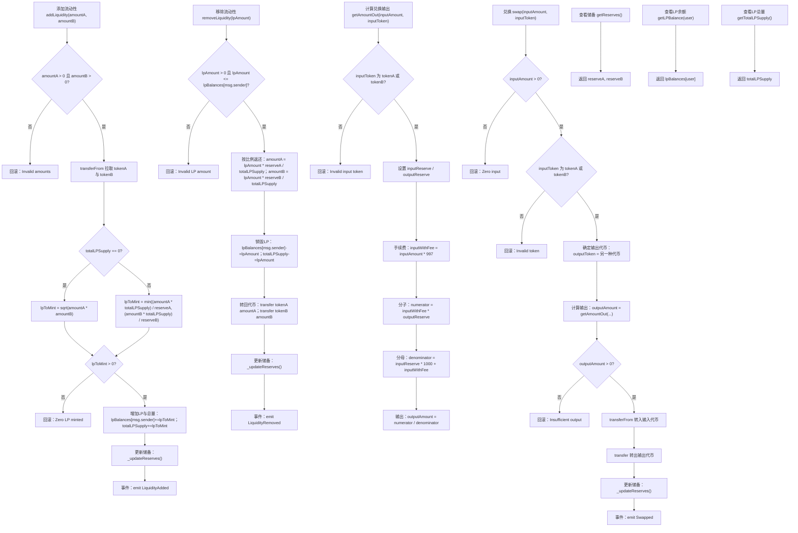

# Mini-交易所

Day: Day 30
ID: 30
原文: https://builder-hub.notion.site/Day-30-The-Final-Build-Your-Own-Mini-DEX-1e45720a23ef80debfd5e4507d43b4ed
状态: 完成
译者: Bala Chen
难度等级: 高级

# 🎉 第30天 – 最终构建：你自己的简约版DEX

**你做到了。**

整整三十天深入学习Solidity。一次一个合约。一次一个概念。从你的第一个`uint`到你的第一次代币销售，你一直在坚持、构建、学习——现在？你准备好创建从DeFi巨鲸到收益农场Degens都在使用的东西：

一个**去中心化交易所**——你自己的**简约版DEX**。

但在我们继续之前——

### 🧡 让我们花一点时间来欣赏这一点

认真的。回顾第1天。

你从基本的存储、结构体和函数开始。你学习了全局变量、控制流、修饰符、继承和接口。你亲手实践了NFT、DAO、AMM、稳定币、预言机、随机性、可升级合约等等。

而且你不仅仅是阅读它们——

**你构建了它们。**

这不是那种读了就忘的系列。
这是：编写、调试、理解、破坏、修复和部署。

这是你培养的真正的Solidity肌肉。现在，在第30天，是时候进行你的顶点项目了：

### 🚀 一个简约版去中心化交易所

不是模拟。不是复制粘贴的Uniswap克隆。我们说的是一个干净、简单、精简的、**从头开始实现**的DEX——足以理解交换、流动性和LP代币的真正工作原理。

这不是前端的东西。这是DEX的**链上后端**。智能合约逻辑。金库。池子。价格曲线。

# 产品需求说明

用户流程



需要的数据结构

| Contract | Type | Bases | Function Name | Visibility | Mutability |
| --- | --- | --- | --- | --- | --- |
| MiniDexPair | Implementation | ReentrancyGuard | constructor | Public | 🛑 |
|  |  |  | addLiquidity(amountA, amountB) | External | 🛑 |
|  |  |  | removeLiquidity(lpAmount) | External | 🛑 |
|  |  |  | swap(inputAmount, inputToken) | External | 🛑 |
|  |  |  | getAmountOut(inputAmount, inputToken) | Public | View |
|  |  |  | getReserves() | External | View |
|  |  |  | getLPBalance(user) | External | View |
|  |  |  | getTotalLPSupply() | External | View |
|  |  |  | sqrt(y) | Internal | Pure |
|  |  |  | min(a, b) | Internal | Pure |
|  |  |  | _updateReserves() | Private | 🛑 |
| MiniDexFactory | Implementation | Ownable | constructor(_owner) | Public | 🛑 |
|  |  |  | createPair(_tokenA, _tokenB) | External | 🛑 |
|  |  |  | allPairsLength() | External | View |
|  |  |  | getPairAtIndex(index) | External | View |
|  |  |  | getPair[tokenA][tokenB] | Public | View (mapping) |
|  |  |  | PairCreated (event) | — | — |
| MiniDexPair (events) | — | — | LiquidityAdded | — | — |
|  |  |  | LiquidityRemoved | — | — |
|  |  |  | Swapped | — | — |

# 细节解说

为了让这一切都清楚，我们将这个最终挑战分成**两个合约**：

---

### 🛠️ `MiniDexPair.sol` – 池子合约

这是行动发生的地方：

- 它接受两个代币：TokenA和TokenB
- 它允许用户**添加流动性**，作为回报，他们获得LP代币
- 它允许用户**移除流动性**，并获得他们的比例份额
- 它使用经典的恒定乘积公式启用TokenA和TokenB之间的**交换**：`x * y = k`
- 它跟踪内部储备、LP余额和费用

这是运行每个代币对的核心逻辑——无论是ETH/DAI、USDC/WBTC，还是任何其他组合。

我们将深入了解这是如何工作的，费用是如何计算的，以及储备更新如何保持池子平衡。

---

### 🏗️ `MiniDexFactory.sol` – 池子创建者

一旦我们理解了单个配对合约的工作原理，我们就会将其提升到下一个级别。

我们不会为每个代币组合手动部署新的配对合约，而是构建一个工厂：

- 可以**动态创建**新的MiniDexPair合约
- 跟踪**所有现有配对**
- 确保没有重复的池子
- 让我们探索像Uniswap这样的协议如何扩展到数千个配对

在本课程结束时，你将拥有：

- 一个工作的去中心化交易所的迷你版本
- 部署任何你想要的配对的能力
- 对交换、储备、LP代币和AMM如何在底层工作的完全理解

更重要的是？
你会意识到这些看似复杂的协议只是智能合约模式，由你已经知道的工具组成。

---

所以。最后一次。

让我们编写一个合约。让我们学习一些真实的东西。让我们以开始时的同样能量结束这个旅程：

**构建者模式开启。**

让我们深入`MiniDexPair.sol`。

---

### 📦 核心池子：`MiniDexPair.sol`

在我们深入*如何*之前，让我们先看看*什么*。

这是**MiniDexPair**合约——为我们简约版DEX中的每个代币交换提供动力的引擎。

它是金库。流动性池。LP代币计算器。

它负责持有两个代币，让人们在它们之间交换，并管理保持整个系统公平和流畅的内部储备。

你可以把这想象成你的个人代币交换摊位。

放入TokenA，取出TokenB——基于供应、需求和一些简单但强大的数学自动定价。

我们将详细分解每个函数，但首先，让我们一次性看看整个合约：

```solidity

// SPDX-License-Identifier: MIT
pragma solidity ^0.8.20;

import "@openzeppelin/contracts/token/ERC20/IERC20.sol";
import "@openzeppelin/contracts/security/ReentrancyGuard.sol";

contract MiniDexPair is ReentrancyGuard {
    address public immutable tokenA;
    address public immutable tokenB;

    uint256 public reserveA;
    uint256 public reserveB;
    uint256 public totalLPSupply;

    mapping(address => uint256) public lpBalances;

    event LiquidityAdded(address indexed provider, uint256 amountA, uint256 amountB, uint256 lpMinted);
    event LiquidityRemoved(address indexed provider, uint256 amountA, uint256 amountB, uint256 lpBurned);
    event Swapped(address indexed user, address inputToken, uint256 inputAmount, address outputToken, uint256 outputAmount);

    constructor(address _tokenA, address _tokenB) {
        require(_tokenA != _tokenB, "Identical tokens");
        require(_tokenA != address(0) && _tokenB != address(0), "Zero address");

        tokenA = _tokenA;
        tokenB = _tokenB;
    }

    // 实用工具
    function sqrt(uint y) internal pure returns (uint z) {
        if (y > 3) {
            z = y;
            uint x = y / 2 + 1;
            while (x < z) {
                z = x;
                x = (y / x + x) / 2;
            }
        } else if (y != 0) {
            z = 1;
        }
    }

    function min(uint256 a, uint256 b) internal pure returns (uint256) {
        return a < b ? a : b;
    }

    function _updateReserves() private {
        reserveA = IERC20(tokenA).balanceOf(address(this));
        reserveB = IERC20(tokenB).balanceOf(address(this));
    }

    function addLiquidity(uint256 amountA, uint256 amountB) external nonReentrant {
        require(amountA > 0 && amountB > 0, "Invalid amounts");

        IERC20(tokenA).transferFrom(msg.sender, address(this), amountA);
        IERC20(tokenB).transferFrom(msg.sender, address(this), amountB);

        uint256 lpToMint;
        if (totalLPSupply == 0) {
            lpToMint = sqrt(amountA * amountB);
        } else {
            lpToMint = min(
                (amountA * totalLPSupply) / reserveA,
                (amountB * totalLPSupply) / reserveB
            );
        }

        require(lpToMint > 0, "Zero LP minted");

        lpBalances[msg.sender] += lpToMint;
        totalLPSupply += lpToMint;

        _updateReserves();

        emit LiquidityAdded(msg.sender, amountA, amountB, lpToMint);
    }

    function removeLiquidity(uint256 lpAmount) external nonReentrant {
        require(lpAmount > 0 && lpAmount <= lpBalances[msg.sender], "Invalid LP amount");

        uint256 amountA = (lpAmount * reserveA) / totalLPSupply;
        uint256 amountB = (lpAmount * reserveB) / totalLPSupply;

        lpBalances[msg.sender] -= lpAmount;
        totalLPSupply -= lpAmount;

        IERC20(tokenA).transfer(msg.sender, amountA);
        IERC20(tokenB).transfer(msg.sender, amountB);

        _updateReserves();

        emit LiquidityRemoved(msg.sender, amountA, amountB, lpAmount);
    }

    function getAmountOut(uint256 inputAmount, address inputToken) public view returns (uint256 outputAmount) {
        require(inputToken == tokenA || inputToken == tokenB, "Invalid input token");

        bool isTokenA = inputToken == tokenA;
        (uint256 inputReserve, uint256 outputReserve) = isTokenA ? (reserveA, reserveB) : (reserveB, reserveA);

        uint256 inputWithFee = inputAmount * 997;
        uint256 numerator = inputWithFee * outputReserve;
        uint256 denominator = (inputReserve * 1000) + inputWithFee;

        outputAmount = numerator / denominator;
    }

    function swap(uint256 inputAmount, address inputToken) external nonReentrant {
        require(inputAmount > 0, "Zero input");
        require(inputToken == tokenA || inputToken == tokenB, "Invalid token");

        address outputToken = inputToken == tokenA ? tokenB : tokenA;
        uint256 outputAmount = getAmountOut(inputAmount, inputToken);

        require(outputAmount > 0, "Insufficient output");

        IERC20(inputToken).transferFrom(msg.sender, address(this), inputAmount);
        IERC20(outputToken).transfer(msg.sender, outputAmount);

        _updateReserves();

        emit Swapped(msg.sender, inputToken, inputAmount, outputToken, outputAmount);
    }

    // 查看函数
    function getReserves() external view returns (uint256, uint256) {
        return (reserveA, reserveB);
    }

    function getLPBalance(address user) external view returns (uint256) {
        return lpBalances[user];
    }

    function getTotalLPSupply() external view returns (uint256) {
        return totalLPSupply;
    }
}
```---

### 🧱 让我们从顶部开始：导入

在我们的`MiniDexPair`合约的顶部，你会立即看到这个：

```solidity

import "@openzeppelin/contracts/token/ERC20/IERC20.sol";
import "@openzeppelin/contracts/security/ReentrancyGuard.sol";

```

这是每个导入的作用：

---

### 📦 `IERC20.sol`

这引入了ERC-20代币标准的**接口**。

> 简单来说：它告诉我们的合约如何与任何ERC-20代币对话——即使我们自己没有编写代币的代码。
> 

有了这个接口，我们可以：

- 在**任何兼容的ERC-20代币**上调用`transferFrom`、`transfer`和`balanceOf`
- 在我们的流动性池中使用这些代币
- 保持完全的代币无关性——DAI、USDC、WETH，无论什么——都能正常工作

没有这个导入，Solidity就不知道如何与你传入的代币合约对话。

---

### 🛡️ `ReentrancyGuard.sol`

这个是为了**安全**。

它帮助我们防范一类称为**重入攻击**的智能合约攻击——有人试图在第一个函数调用完成*之前*回调到合约中。

> 重入是智能合约历史上最常见和最危险的漏洞之一——它是导致臭名昭著的DAO黑客攻击的原因。
> 

通过继承`ReentrancyGuard`，我们可以在敏感函数如`addLiquidity`、`removeLiquidity`和`swap`上使用`nonReentrant`修饰符。

这确保：

- 一次一个调用
- 没有恶意行为
- 你的流动性保持安全

---

这两个导入一起构成了安全、可互操作、ERC-20驱动的DEX的基础。

---

### 🧮 状态变量——池子的记忆

这是我们`MiniDexPair`合约中状态变量的第一个块：

```solidity

address public immutable tokenA;
address public immutable tokenB;

uint256 public reserveA;
uint256 public reserveB;
uint256 public totalLPSupply;

```

让我们逐一分析：

---

### `tokenA`和`tokenB`

```solidity

address public immutable tokenA;
address public immutable tokenB;

```

这些是这个特定DEX配对支持的**两个代币**。

每个`MiniDexPair`合约将永远只处理恰好两个代币。

例如：

- 如果这个池子是DAI/WETH，那么`tokenA = DAI`，`tokenB = WETH`。

它们被标记为`public`，所以任何人都可以读取它们，`immutable`是因为：

> 一旦在构造函数中设置，它们就永远不能被更改。
> 

`immutable`是一个Solidity关键字：

- 让你**一次**分配一个值（在构造函数内部）
- 但之后**永远锁定**该值
- 并且比使用常规`storage`变量更**节省gas**

所以：一旦设置了这些代币，没有人可以交换它们或搞乱它们。这正是我们想要的——池子应该是永久和可预测的。

---

### `reserveA`和`reserveB`

```solidity

uint256 public reserveA;
uint256 public reserveB;

```

这些跟踪当前**在池子中**的每个代币数量。

每当有人添加流动性、进行交换或移除流动性时，我们更新这些储备以反映新的余额。

这些**不仅仅是合约中的实际代币余额**——我们将它们单独存储有两个原因：

1. **读取效率**——引用变量比不断调用`balanceOf`更快更便宜。
2. **价格准确性**——我们在交换计算中使用它们来确保恒定乘积公式（`x * y = k`）保持平衡。

我们将在每次主要操作后使用`_updateReserves()`手动更新这些。

---

### `totalLPSupply`

```solidity

uint256 public totalLPSupply;

```

这跟踪**曾经铸造的LP代币总量**——有点像公司的总股份。

当有人添加流动性时，我们为他们铸造LP代币（在这种情况下不是实际的ERC-20代币，只是内部跟踪）。

当他们移除流动性时，我们销毁他们的LP数量并减少这个总数。

> LP代币代表池子的所有权。如果你拥有10%的LP供应量，你就拥有池子中10%的代币。
> 

---

### 🧾 跟踪谁拥有什么：`lpBalances`

```solidity

mapping(address => uint256) public lpBalances;

```

这个映射是我们跟踪**每个用户在这个池子中拥有多少流动性**的方式。

它的工作原理：

- `address`是用户的钱包（流动性提供者）。
- `uint256`是他们被分配的LP代币数量（再次，这些不是ERC-20代币——只是我们在合约内部跟踪的数字）。

所以如果Alice向这个池子添加DAI和WETH，我们可能有：

```solidity

lpBalances[alice] = 1200;

```

这意味着Alice有1,200个LP代币——这给了她对池子中代币的比例权利。

当她决定提取（移除流动性）时，我们将使用这个映射来：

- 检查她有多少LP代币
- 计算她有权获得多少TokenA和TokenB
- 销毁她的LP余额并相应更新储备

> 把lpBalances想象成池子版本的股东登记册。
> 
> 
> 它保持会计诚实和公平。
> 

因为它被标记为`public`，任何用户都可以通过调用`lpBalances(address)`函数来检查他们在池子中有多少LP。

---

与`totalLPSupply`一起，这个映射让我们实现围绕**比例所有权**的所有数学。

---

### 📢 事件——记录链上发生的事情

这是在`MiniDexPair`合约中声明的事件：

```solidity

event LiquidityAdded(address indexed provider, uint256 amountA, uint256 amountB, uint256 lpMinted);
event LiquidityRemoved(address indexed provider, uint256 amountA, uint256 amountB, uint256 lpBurned);
event Swapped(address indexed user, address inputToken, uint256 inputAmount, address outputToken, uint256 outputAmount);

```

事件就像**链上日志**——它们不影响合约逻辑，但它们使**跟踪和索引合约内部发生的事情**变得容易。

你可以把它们想象成智能合约的控制台日志——除了用户、应用程序、浏览器和机器人都可以监听它们。

让我们逐一分析：

---

### `LiquidityAdded`

```solidity

event LiquidityAdded(address indexed provider, uint256 amountA, uint256 amountB, uint256 lpMinted);

```

当有人向池子添加流动性时触发此事件。

它告诉世界：

- 谁添加了流动性（`provider`）
- 他们提供了多少每种代币（`amountA`、`amountB`）
- 他们作为回报收到了多少LP代币（`lpMinted`）

`provider`上的关键字`indexed`意味着我们可以**按提供者地址过滤日志**——对前端和分析仪表板非常有用。

---

### `LiquidityRemoved`

```solidity

event LiquidityRemoved(address indexed provider, uint256 amountA, uint256 amountB, uint256 lpBurned);

```

这是前一个事件的镜像。

当有人从池子**移除流动性**时触发。

我们记录：

- 谁移除了流动性
- 他们提取了多少每种代币
- 销毁了多少LP代币

这为每个人提供了池子流动性流入和流出的可见性。

---

### `Swapped`

```solidity

event Swapped(address indexed user, address inputToken, uint256 inputAmount, address outputToken, uint256 outputAmount);

```

此事件记录池子中发生的每个代币**交换**。

它包括：

- 交换者的地址
- 他们发送的代币（`inputToken`）和数量
- 他们收到的代币（`outputToken`）和数量

这是DEX前端、仪表板和浏览器需要**跟踪实时交易活动**的核心数据。

> 每次有人使用DEX交换代币时，这个事件就会被触发——让世界知道确切发生了什么。
> 

---

这些事件一起为我们提供了这个池子中发生的一切的完整**审计跟踪**：

- 流动性流动
- 代币交换
- LP代币发行和销毁--
- 

### 🏗️ 构造函数——启动池子

这是`MiniDexPair`的构造函数：

```solidity

constructor(address _tokenA, address _tokenB) {
    require(_tokenA != _tokenB, "Identical tokens");
    require(_tokenA != address(0) && _tokenB != address(0), "Zero address");

    tokenA = _tokenA;
    tokenB = _tokenB;
}

```

这个函数**只运行一次**，就在合约部署时。它设置这个特定池子的身份——并锁定它将支持的两个代币。

让我们分解一下：

---

```solidity
constructor(address _tokenA, address _tokenB)

```

我们传入这个池子应该支持的两个代币地址。

例如，如果我们想要一个WETH/DAI池子，我们会在这里传入WETH和DAI合约地址。

---

```solidity
require(_tokenA != _tokenB, "Identical tokens");

```

这一行确保我们不会意外地尝试为同一个代币创建两次池子——比如WETH/WETH。那将是毫无意义的。

---

```solidity
require(_tokenA != address(0) && _tokenB != address(0), "Zero address");

```

这个检查确保我们没有为任一代币使用空地址——这可能导致错误甚至安全问题。

---

```solidity
tokenA = _tokenA; tokenB = _tokenB;

```

最后，我们将输入值分配给合约的`immutable`状态变量。

> 因为它们是不可变的，它们只能设置一次——在这里的构造函数中——之后永远不能更改。
> 

这确保：

- 每个合约实例永久绑定到只有两个代币
- 部署后没有人可以搞乱代币地址

---

一旦这个构造函数运行，池子就被锁定、安全，并准备开始接受存款。

---

### 🛠️ 实用函数——数学背后的无名英雄

在我们进入真正的行动——交换代币、添加流动性、铸造LP代币——之前，我们需要几个数学助手。

这两个函数不直接接触代币或用户，但它们在**幕后是必不可少的**。

它们保持我们的数字公平，我们的计算安全，我们的逻辑干净。

它们是：

```solidity

function sqrt(uint y) internal pure returns (uint z) {
    if (y > 3) {
        z = y;
        uint x = y / 2 + 1;
        while (x < z) {
            z = x;
            x = (y / x + x) / 2;
        }
    } else if (y != 0) {
        z = 1;
    }
}

function min(uint256 a, uint256 b) internal pure returns (uint256) {
    return a < b ? a : b;
}

```

让我们谈谈每个函数的作用以及它在合约后面的出现位置：

---

### `sqrt(uint y)`

这是一个平方根计算器——使用**巴比伦方法**实现，这是在纯整数数学中估算平方根的经典方法。

为什么我们需要它？

当**第一个流动性提供者**进入池子时，我们使用这个函数。

当储备中还没有代币时，我们不能使用通常的比例LP计算。

相反，我们使用他们存入的代币数量的几何平均值来计算要铸造的LP代币：

```solidity

lpToMint = sqrt(amountA * amountB);

```

这给第一个提供者一个基于两个代币的公平份额——不仅仅是较大的那个——并为池子的初始比率定下基调。

---

### `min(uint256 a, uint256 b)`

这个很直接：它返回两个输入中较小的那个。

我们在池子初始化后使用它——当池子有储备且用户正在添加流动性时。

为了保持池子比率完整，我们在铸造LP代币时只考虑**较小的有效贡献**：

```solidity

lpToMint = min(
    (amountA * totalLPSupply) / reserveA,
    (amountB * totalLPSupply) / reserveB
);

```

这样：

- 你不能通过过度供应一个代币来欺骗系统
- LP代币只为你存款的平衡部分铸造

---

这两个助手在大小上很小，但影响很大。

没有它们，合约其余部分的数学将是笨拙的、重复的和容易出错的。

---

### 🔄 `_updateReserves()` — 保持数字同步

这是函数：

```solidity

function _updateReserves() private {
    reserveA = IERC20(tokenA).balanceOf(address(this));
    reserveB = IERC20(tokenB).balanceOf(address(this));
}

```

这个函数很简单——但它在维护我们池子的完整性方面发挥着**关键作用**。

让我们分解一下：

---

### 它做什么？

它通过实际读取合约中有多少代币来更新我们的内部跟踪变量——`reserveA`和`reserveB`：

```solidity

IERC20(tokenA).balanceOf(address(this));
IERC20(tokenB).balanceOf(address(this));

```

这些是合约在任何时刻持有的每个代币的**真实余额**。

我们将这些值存储在`reserveA`和`reserveB`状态变量中，这样我们就不必一遍又一遍地调用`balanceOf`——这会花费更多gas并使代码混乱。

---

### 为什么标记为`private`？

因为这个函数不是为了被用户或外部合约直接调用。

它是一个**内部助手**——被以下函数使用：

- `addLiquidity`
- `removeLiquidity`
- `swap`

基本上，任何时候代币进出合约，我们调用`_updateReserves()`来同步数字。

这保持内部状态准确，并确保我们所有的数学（特别是在交换计算中）基于**最新的实际余额**。

---

没有这个函数，我们会面临：

- 基于过时储备计算LP代币
- 破坏恒定乘积公式
- 让用户抢跑过时的池子数据

所以虽然它可能很小且隐藏，`_updateReserves()`是保持我们池子诚实的胶水。

---

### 💧 `addLiquidity()` — 向池子提供代币

在我们可以交换代币或赚取费用之前，池子需要**流动性**。

这意味着有人必须进来存入两种代币——TokenA和TokenB——来启动系统。

这个函数让任何人都可以这样做。

这是完整的代码：

```solidity

function addLiquidity(uint256 amountA, uint256 amountB) external nonReentrant {
    require(amountA > 0 && amountB > 0, "Invalid amounts");

    IERC20(tokenA).transferFrom(msg.sender, address(this), amountA);
    IERC20(tokenB).transferFrom(msg.sender, address(this), amountB);

    uint256 lpToMint;
    if (totalLPSupply == 0) {
        lpToMint = sqrt(amountA * amountB);
    } else {
        lpToMint = min(
            (amountA * totalLPSupply) / reserveA,
            (amountB * totalLPSupply) / reserveB
        );
    }

    require(lpToMint > 0, "Zero LP minted");

    lpBalances[msg.sender] += lpToMint;
    totalLPSupply += lpToMint;

    _updateReserves();

    emit LiquidityAdded(msg.sender, amountA, amountB, lpToMint);
}

```

---

让我们逐步分解：

---

### 步骤1：基本检查

```solidity

require(amountA > 0 && amountB > 0, "Invalid amounts");

```

你不能添加零代币——两个数量都需要大于零才能继续。

---

### 步骤2：拉入代币

```solidity

IERC20(tokenA).transferFrom(msg.sender, address(this), amountA);
IERC20(tokenB).transferFrom(msg.sender, address(this), amountB);

```

这将两种代币从用户钱包拉入池子。

注意：用户必须事先为两种代币调用`approve()`。

---

### 步骤3：确定要铸造多少LP代币

```solidity

uint256 lpToMint;
if (totalLPSupply == 0) {
    lpToMint = sqrt(amountA * amountB);
} else {
    lpToMint = min(
        (amountA * totalLPSupply) / reserveA,
        (amountB * totalLPSupply) / reserveB
    );
}

```

这是数学开始的地方。

- 如果这是**第一次存款**，我们使用`sqrt(amountA * amountB)`来设置初始LP供应量。
- 如果这是**后续存款**，我们使用`min(...)`逻辑来确保流动性以正确的比例添加，LP代币按比例铸造。

这部分保持一切公平，防止人们通过过度供应一个代币来玩弄系统。

---

### 步骤4：最终检查和状态更新

```solidity

require(lpToMint > 0, "Zero LP minted");
lpBalances[msg.sender] += lpToMint;
totalLPSupply += lpToMint;

```

我们检查LP数量不是零，然后：

- 将新的LP代币添加到用户余额
- 增加总LP供应量

---

### 步骤5：更新储备

```solidity

_updateReserves();

```

这将池子的内部状态与实际代币余额同步，确保所有未来的数学都基于最新值。

---

### 步骤6：发出事件

```solidity

emit LiquidityAdded(msg.sender, amountA, amountB, lpToMint);

```

触发链上日志，以便前端、浏览器和分析工具可以跟踪流动性操作。

---

这就是完整的流程：

从代币存款到LP铸造到状态更新——全部在一个干净、受保护的函数中。---

### 💸 `removeLiquidity()` — 从池子中提取你的份额

如果你已经向池子添加了代币并收到了LP代币作为回报，你最终会想要**兑现**。

这个函数让流动性提供者提取他们在池子中的份额——基于他们持有的LP代币数量。

这是完整的函数：

```solidity

function removeLiquidity(uint256 lpAmount) external nonReentrant {
    require(lpAmount > 0 && lpAmount <= lpBalances[msg.sender], "Invalid LP amount");

    uint256 amountA = (lpAmount * reserveA) / totalLPSupply;
    uint256 amountB = (lpAmount * reserveB) / totalLPSupply;

    lpBalances[msg.sender] -= lpAmount;
    totalLPSupply -= lpAmount;

    IERC20(tokenA).transfer(msg.sender, amountA);
    IERC20(tokenB).transfer(msg.sender, amountB);

    _updateReserves();

    emit LiquidityRemoved(msg.sender, amountA, amountB, lpAmount);
}

```

让我们看看这里发生了什么：

---

### 步骤1：验证要销毁的LP代币

```solidity

require(lpAmount > 0 && lpAmount <= lpBalances[msg.sender], "Invalid LP amount");

```

我们确保：

- 用户实际上试图移除**正数**数量
- 他们没有试图移除**超过他们拥有的**

---

### 步骤2：计算要返回多少每种代币

```solidity

uint256 amountA = (lpAmount * reserveA) / totalLPSupply;
uint256 amountB = (lpAmount * reserveB) / totalLPSupply;

```

这是比例份额公式。

如果你拥有10%的LP供应量，你应该得到两种代币储备的10%。

这正是这个数学所做的——基于当前储备和你的LP余额。

---

### 步骤3：销毁LP代币

```solidity

lpBalances[msg.sender] -= lpAmount;
totalLPSupply -= lpAmount;

```

我们更新我们的内部跟踪：

- 用户的LP余额下降
- LP代币的总供应量也下降

这模拟了**销毁**LP代币。

---

### 步骤4：将代币转回给用户

```solidity

IERC20(tokenA).transfer(msg.sender, amountA);
IERC20(tokenB).transfer(msg.sender, amountB);

```

现在我们知道用户应得什么，我们直接从池子将两种代币转回给他们。

---

### 步骤5：同步内部储备

```solidity

_updateReserves();

```

因为代币刚刚离开池子，我们需要更新我们的内部`reserveA`和`reserveB`值以匹配现实。

---

### 步骤6：发出透明度日志

```solidity

emit LiquidityRemoved(msg.sender, amountA, amountB, lpAmount);

```

这个事件告诉外部世界：

- 谁移除了流动性
- 他们得到了多少每种代币
- 销毁了多少LP代币

---

就是这样——有了这个函数，流动性提供者可以安全公平地提取他们在池子中的份额。

---

### 🔄 `getAmountOut()` — 计算交换输出

在我们实际执行交换之前，我们需要知道：

**"如果我给池子X数量的TokenA，我会得到多少TokenB？"**

这正是这个函数所做的——它使用**恒定乘积公式**根据当前储备计算公平的输出数量。

这是函数：

```solidity

function getAmountOut(uint256 inputAmount, address inputToken) public view returns (uint256 outputAmount) {
    require(inputToken == tokenA || inputToken == tokenB, "Invalid input token");

    bool isTokenA = inputToken == tokenA;
    (uint256 inputReserve, uint256 outputReserve) = isTokenA ? (reserveA, reserveB) : (reserveB, reserveA);

    uint256 inputWithFee = inputAmount * 997;
    uint256 numerator = inputWithFee * outputReserve;
    uint256 denominator = (inputReserve * 1000) + inputWithFee;

    outputAmount = numerator / denominator;
}

```

让我们分解一下：

---

### 步骤1：代币验证

```solidity

require(inputToken == tokenA || inputToken == tokenB, "Invalid input token");

```

用户必须交换`tokenA`或`tokenB`——不接受其他任何东西。

---

### 步骤2：识别交易的输入和输出方

```solidity

bool isTokenA = inputToken == tokenA;
(uint256 inputReserve, uint256 outputReserve) = isTokenA ? (reserveA, reserveB) : (reserveB, reserveA);

```

我们确定交易的方向：

- 如果`inputToken == tokenA`，我们正在交换A → B
- 否则，我们正在交换B → A

然后我们相应地提取正确的储备。

---

### 步骤3：应用交换费用

```solidity

uint256 inputWithFee = inputAmount * 997;

```

我们应用**0.3%费用**——就像Uniswap V2一样。

- 完整的输入数量将是`inputAmount * 1000`
- 但我们只使用997，将0.3%保留在池子内作为协议费用

这个小费用使DEX流动性可持续——用交换费用奖励LP。

---

### 步骤4：使用AMM公式计算输出

```solidity

uint256 numerator = inputWithFee * outputReserve;
uint256 denominator = (inputReserve * 1000) + inputWithFee;
outputAmount = numerator / denominator;

```

这是恒定乘积AMM（`x * y = k`）的**核心公式**，重新排列以计算输出：

这确保：

- 你一次尝试交换得越多，你的价格就越差（滑点）
- 池子永远不会完全耗尽
- 交换总是使乘积`x * y`大致相同

---

这个函数是只读的（`view`）——它不移动任何代币。

它是为了在你实际执行之前**模拟**交换会产生什么。

---

### 🔁 `swap()` — 执行代币交换

这个函数让用户基于当前池子储备和恒定乘积公式将一个代币交易为另一个。

这是完整的函数：

```solidity

function swap(uint256 inputAmount, address inputToken) external nonReentrant {
    require(inputAmount > 0, "Zero input");
    require(inputToken == tokenA || inputToken == tokenB, "Invalid token");

    address outputToken = inputToken == tokenA ? tokenB : tokenA;
    uint256 outputAmount = getAmountOut(inputAmount, inputToken);

    require(outputAmount > 0, "Insufficient output");

    IERC20(inputToken).transferFrom(msg.sender, address(this), inputAmount);
    IERC20(outputToken).transfer(msg.sender, outputAmount);

    _updateReserves();

    emit Swapped(msg.sender, inputToken, inputAmount, outputToken, outputAmount);
}

```

让我们看看交换是如何工作的：

---

### 步骤1：输入验证

```solidity

require(inputAmount > 0, "Zero input");
require(inputToken == tokenA || inputToken == tokenB, "Invalid token");

```

我们确保用户发送：

- 非零数量
- 两个有效池子代币之一

这里不允许随机代币合约。

---

### 步骤2：确定输出代币

```solidity

address outputToken = inputToken == tokenA ? tokenB : tokenA;

```

如果输入是TokenA，输出是TokenB——反之亦然。

我们正在构建一个简单的双代币池子，所以这个逻辑总是二进制的。

---

### 步骤3：计算要发送回多少

```solidity

uint256 outputAmount = getAmountOut(inputAmount, inputToken);
require(outputAmount > 0, "Insufficient output");

```

我们调用刚刚分解的`getAmountOut()`函数。

这使用AMM公式和当前储备来计算公平价格（包括0.3%费用）。

如果结果为零——也许因为输入太小——我们回滚。

---

### 步骤4：转移代币

```solidity

IERC20(inputToken).transferFrom(msg.sender, address(this), inputAmount);
IERC20(outputToken).transfer(msg.sender, outputAmount);

```

现在我们实际移动代币：

- 将输入代币从用户拉入池子
- 将计算的输出代币发送回用户

这是**真正的交换**在行动。

---

### 步骤5：同步储备

```solidity

_updateReserves();

```

代币移动后，我们调用`_updateReserves()`来反映新的池子状态。

没有这个，未来的交换可能破坏数学或变得可操纵。

---

### 步骤6：发出交换事件

```solidity

emit Swapped(msg.sender, inputToken, inputAmount, outputToken, outputAmount);

```

这帮助前端和仪表板显示交换活动——包括滑点、交易量和配对移动。

---

这就是完整的交换逻辑——干净、快速、安全。

你现在已经完成了工作流动性池的整个逻辑：

✅ 添加流动性

✅ 移除流动性

✅ 计算公平价格

✅ 执行代币交换

---

### 👀 查看函数——读取池子状态

它们是：

```solidity

function getReserves() external view returns (uint256, uint256) {
    return (reserveA, reserveB);
}

function getLPBalance(address user) external view returns (uint256) {
    return lpBalances[user];
}

function getTotalLPSupply() external view returns (uint256) {
    return totalLPSupply;
}

```

让我们快速看看每个函数的作用：

---

### `getReserves()`

```solidity

function getReserves() external view returns (uint256, uint256)

```

这返回池子中当前的**TokenA和TokenB**数量——根据内部跟踪变量`reserveA`和`reserveB`。

有用于：

- 前端显示池子的当前状态
- 用户计算预期交换价格或滑点
- 验证可用的实际流动性

---

### `getLPBalance(address user)`

```solidity

function getLPBalance(address user) external view returns (uint256)

```

这告诉你给定地址持有**多少LP代币**——本质上是他们在池子中的**所有权份额**。

有用于：

- 让用户检查他们提供了多少流动性
- 构建LP仪表板
- 计算他们在提取时会得到多少

---

### `getTotalLPSupply()`

```solidity

function getTotalLPSupply() external view returns (uint256)

```

返回曾经铸造的LP代币总数——等于所有个人LP余额的总和。

这有助于：

- 维护准确的比例数学
- 检查任何单个LP拥有池子的多少（通过`用户LP / 总LP`）
- 可视化池子如何随时间增长

---

有了这个，`MiniDexPair`合约就**完成了**。

你现在有一个完全工作的DEX配对：

- 支持ERC-20代币
- 让用户交换、添加和移除流动性
- 使用恒定乘积AMM模型计算价格
- 发出干净的事件并公开有用的查看函数---

## 🧰 在Remix中运行`MiniDexPair`——逐步指南

### ✅ 先决条件

在我们深入之前：

1. 打开Remix IDE
2. 确保你使用**Solidity版本0.8.20**或更高
3. 安装或导入**2个ERC-20模拟代币**（我们将为演示目的创建这些）

---

### 🧪 步骤1：创建两个模拟ERC-20代币

我们需要两个代币来模拟交换配对——让我们称它们为`TokenA`和`TokenB`。

这是一个你可以为两者使用的超级简单的ERC-20实现：

```solidity

// SPDX-License-Identifier: MIT
pragma solidity ^0.8.20;

import "@openzeppelin/contracts/token/ERC20/ERC20.sol";

contract MockToken is ERC20 {
    constructor(string memory name, string memory symbol, uint256 initialSupply) ERC20(name, symbol) {
        _mint(msg.sender, initialSupply);
    }
}

```

部署**两个**这样的代币，使用不同的名称、符号和大的初始供应量（例如，`1_000_000 ether`）——一个用于`TokenA`，一个用于`TokenB`。

---

### 🏗️ 步骤2：部署MiniDexPair合约

现在粘贴你的`MiniDexPair`合约，编译它，并通过传入步骤1中的两个代币地址来部署它：

```solidity

new MiniDexPair(TokenA_address, TokenB_address)

```

这初始化配对合约只接受这两个特定代币。

---

### 💰 步骤3：批准配对合约花费代币

在调用`addLiquidity`之前，你的代币需要被转移的权限。

在两个代币合约上调用`approve()`函数（通过Remix UI）：

```solidity

TokenA.approve(MiniDexPair_address, amount)
TokenB.approve(MiniDexPair_address, amount)

```

使用一个大数字，如`1000000000000000000000`（对于18位小数的代币，这是`1000 * 10^18`）。

---

### ➕ 步骤4：添加流动性

现在调用：

```solidity

addLiquidity(amountA, amountB)

```

例如：

```solidity

addLiquidity(1000 ether, 2000 ether)

```

这将存入代币并向你的钱包铸造LP代币。

使用`getReserves()`和`getLPBalance(yourAddress)`来验证结果。

---

### 🔁 步骤5：交换代币

现在尝试从另一个地址（或同一个）调用`swap`，在再次批准后：

```solidity

swap(500 ether, TokenA_address)

```

这应该发送TokenA并根据当前池子比率给你TokenB。

在交换之前使用`getAmountOut(inputAmount, inputToken)`来预览结果。

---

### 💸 步骤6：移除流动性

要取回你的代币，只需调用：

```solidity

removeLiquidity(lpAmount)

```

你可以使用`getLPBalance(yourAddress)`来找到你确切的LP持有量并传入。

你应该收到两种代币，减去之前任何交换的池子费用效应。

---

### 📊 步骤7：跟踪发生的事情

使用Remix"日志"面板观察：

- `LiquidityAdded`
- `LiquidityRemoved`
- `Swapped`

你也可以使用只读查看函数来检查：

- `getReserves()`
- `getTotalLPSupply()`
- `getLPBalance(address)`

---

就是这样——你刚刚使用Remix部署并运行了你自己的迷你Uniswap风格池子。

---

### 🏗️ 让它变得动态——进入`MiniDexFactory`

到目前为止，我们的`MiniDexPair`合约一直很稳固——它作为独立池子工作得很好。

但这里有个问题：

每次我们想创建新的代币配对——比如`WETH/USDC`、`DAI/FRAX`或`PEPE/SOL`——我们都必须手动部署`MiniDexPair`合约的新副本。

如果你正在构建一次性原型，这很好。

但在DeFi的现实世界中，DEX不仅支持**一个**交易配对。

它们支持**数百个**，有时**数千个**，所有这些都需要：

- 可以即时部署
- 可发现和可索引
- 可被其他合约和前端重用

那么我们该怎么办？

> 我们引入一个工厂——一个可以部署新池子、跟踪它们并使整个DEX系统动态化的智能合约。
> 

这正是`MiniDexFactory`所做的。

这个合约成为我们DEX中所有配对的**中央注册表**。

有了它，我们可以：

- **按需**创建新的代币配对
- 防止重复
- 仅使用代币地址检索配对的地址
- 如果需要，循环遍历所有配对（用于分析、UI等）

简而言之，这就是我们如何从单池原型扩展到**完全功能的去中心化交易所**。

---

### 🧱 完整的`MiniDexFactory`合约——池子的启动台

现在我们已经构建并测试了单个`MiniDexPair`，是时候**扩展**了。

这个合约——`MiniDexFactory`——是我们DEX系统的支柱。它是让我们**动态创建新流动性池**的部分，无论何时需要任何代币配对。

这是高级逻辑：

- 只有合约所有者可以创建新配对（目前）
- 当调用`createPair()`时，它使用给定代币启动新的`MiniDexPair`
- 它将该配对的地址存储在映射中，以便我们稍后可以获取它
- 它确保**不创建重复配对**（例如，`DAI/WETH`和`WETH/DAI`应该被视为相同）
- 它用`PairCreated`事件记录一切

简而言之：这是与你一起成长的DEX部分。

这是完整的代码：

```solidity

// SPDX-License-Identifier: MIT
pragma solidity ^0.8.20;

import "@openzeppelin/contracts/access/Ownable.sol";
import "./MiniDexPair.sol"; // 假设MiniDexPair.sol在同一目录中

contract MiniDexFactory is Ownable {
    event PairCreated(address indexed tokenA, address indexed tokenB, address pairAddress, uint);

    mapping(address => mapping(address => address)) public getPair;
    address[] public allPairs;

    constructor(address _owner) Ownable(_owner) {}

    function createPair(address _tokenA, address _tokenB) external onlyOwner returns (address pair) {
        require(_tokenA != address(0) && _tokenB != address(0), "Invalid token address");
        require(_tokenA != _tokenB, "Identical tokens");
        require(getPair[_tokenA][_tokenB] == address(0), "Pair already exists");

        // 为一致性排序代币
        (address token0, address token1) = _tokenA < _tokenB ? (_tokenA, _tokenB) : (_tokenB, _tokenA);

        pair = address(new MiniDexPair(token0, token1));
        getPair[token0][token1] = pair;
        getPair[token1][token0] = pair;

        allPairs.push(pair);
        emit PairCreated(token0, token1, pair, allPairs.length - 1);
    }

    function allPairsLength() external view returns (uint) {
        return allPairs.length;
    }

    function getPairAtIndex(uint index) external view returns (address) {
        require(index < allPairs.length, "Index out of bounds");
        return allPairs[index];
    }
}

```

---

### 📦 导入——引入我们需要的工具

```solidity

import "@openzeppelin/contracts/access/Ownable.sol";
import "./MiniDexPair.sol"; // 假设MiniDexPair.sol在同一目录中

```

这两行设置了`MiniDexFactory`安全高效运行所需的一切。

让我们看看每一个：

---

### `Ownable.sol`

这个导入来自**OpenZeppelin**，它为我们的合约提供**访问控制**。

通过继承`Ownable`，我们可以：

- 自动跟踪合约的`owner`
- 限制像`createPair()`这样的敏感函数只能由所有者调用
- 使用`onlyOwner`修饰符进行安全

换句话说，我们确保**不是任何人**都可以开始创建新的代币配对——除非你稍后决定放宽它。

---

### `MiniDexPair.sol`

这是我们自己的本地导入——它引入了我们之前编写的**配对合约**。

> 工厂的整个工作就是为不同的代币组合部署这个合约的新实例。
> 

所以每当我们调用`createPair()`时，我们将启动一个新的`MiniDexPair`，传入我们希望池子支持的两个代币地址。

这里的关键点是：

工厂*了解*配对合约并将其用作模板——有点像每次有人需要新的交易配对时铸造新池子。

---

### 🏗️ 合约声明

```solidity

contract MiniDexFactory is Ownable {

```

这一行定义了我们合约的名称以及它继承自OpenZeppelin的`Ownable`合约的事实。让我们解开两个部分：

---

```solidity
MiniDexFactory

```

这是DEX管理器的**蓝图**——一个可以：

- 部署多个流动性池合约（`MiniDexPair`）
- 跟踪它们
- 确保不创建重复池子

你可以把这想象成你的去中心化交易所的**后端管理员**——它不进行交换，但它保持一切有序。

---

```solidity
is Ownable

```

这给我们的合约一个**所有者**——以及对`onlyOwner`修饰符的访问。

这意味着：

- 只有合约部署者（或部署者转移所有权的人）可以调用像`createPair()`这样的函数
- 我们添加了基本的**访问控制**和**安全**层，特别是在初始设置或测试时有用

这有助于防止随机用户垃圾邮件池创建——尽管在生产级系统中，你可能稍后通过适当的验证开放这个。

---

所以仅仅这一行，我们就设置了一个合约：

- 可以部署新的配对合约
- 拥有控制如何以及何时创建池子的权威

---

### 🧠 工厂如何跟踪一切？

如果这个合约将成为池子创建的中央枢纽，它需要一种可靠的方式来**跟踪**、**存储**和**公开**每个MiniDex配对背后的数据。

我们需要：

- 记录何时创建新配对
- 让用户或前端通过代币地址查询任何配对
- 保留所有创建配对的完整列表，用于分析或索引

这正是这一部分处理的。

这是使所有这些成为可能的代码：

```solidity

event PairCreated(address indexed tokenA, address indexed tokenB, address pairAddress, uint);

mapping(address => mapping(address => address)) public getPair;
address[] public allPairs;

```

### `event PairCreated(...)`

每次通过`createPair()`创建新配对时，这个事件就会触发。

```solidity

event PairCreated(address indexed tokenA, address indexed tokenB, address pairAddress, uint);

```

这是每个部分记录的内容：

- `tokenA`和`tokenB`：配对中的两个代币（索引，所以你可以按它们过滤）
- `pairAddress`：新`MiniDexPair`合约的实际部署地址
- 一个`uint`，作为配对在`allPairs`数组中的索引

这对以下非常有用：

- 前端应用试图显示所有可用配对
- 索引器跟踪链上配对创建
- 开发者调试部署

---

### `mapping getPair`

```solidity

mapping(address => mapping(address => address)) public getPair;

```

这是一个**双重映射**，用于存储每个创建的配对的部署地址。

你可以把它想象成查找表：

```solidity

getPair[DAI][WETH] = 0x...PairAddress
getPair[WETH][DAI] = 0x...SamePairAddress

```

两个方向都存储，所以用户可以查询配对，无论代币顺序如何——在`createPair()`函数中会详细说明。

因为它被标记为`public`，Solidity自动为它创建一个getter函数。

你可以随时调用`getPair(tokenA, tokenB)`来检查该配对是否存在并检索部署的池地址。

---

### `address[] public allPairs`

这个数组存储这个工厂创建的**所有配对合约**。

每次创建新池子时，它都会被推入这个数组。

它允许：

- 循环遍历所有创建的池子
- 按索引返回池地址
- 构建分页UI和分析仪表板

我们将在像`allPairsLength()`和`getPairAtIndex()`这样的函数中使用这个。

---

所以仅仅这三行，我们就构建了：

- 一种**记录**每个新配对的方式
- 一种高效**存储**和**查找**每个配对的方式
- 一种**列出和计数**系统中每个池子的方式---

### 🏁 构造函数——设置所有者

```solidity

constructor(address _owner) Ownable(_owner) {}

```

这个构造函数做一件简单但重要的事情：它设置工厂合约的**初始所有者**。

让我们解开它：

- 我们在部署期间接受`_owner`地址作为输入。
- 我们将该地址直接传递给OpenZeppelin的`Ownable`构造函数。

结果？

部署合约的人可以**立即将所有权分配给其他人**——而不是总是默认为部署者。

这在以下情况下很方便：

- 你代表DAO或前端部署合约
- 你希望所有权转到多重签名、时间锁或其他合约

通过从一开始就使所有权灵活，我们保持事物更可组合和生产友好。

现在我们已经初始化了所有者，让我们看看明星：`createPair()`函数。

---

### 🛠️ `createPair()` — 部署新的流动性池

这个函数允许工厂为任何两个代币**部署全新的MiniDexPair合约**——只要它们还没有配对。

这是完整的代码：

```solidity

function createPair(address _tokenA, address _tokenB) external onlyOwner returns (address pair) {
    require(_tokenA != address(0) && _tokenB != address(0), "Invalid token address");
    require(_tokenA != _tokenB, "Identical tokens");
    require(getPair[_tokenA][_tokenB] == address(0), "Pair already exists");

    // 为一致性排序代币
    (address token0, address token1) = _tokenA < _tokenB ? (_tokenA, _tokenB) : (_tokenB, _tokenA);

    pair = address(new MiniDexPair(token0, token1));
    getPair[token0][token1] = pair;
    getPair[token1][token0] = pair;

    allPairs.push(pair);
    emit PairCreated(token0, token1, pair, allPairs.length - 1);
}

```

让我们逐步分解：

---

### 🔒 访问控制

```solidity

external onlyOwner

```

只有**工厂的所有者**（在构造函数中设置）可以调用这个函数。

这防止任何人垃圾邮件新池子——尽管在公共DEX中，你可能最终会放宽这个限制。

---

### 🧼 基本验证

```solidity

require(_tokenA != address(0) && _tokenB != address(0), "Invalid token address");
require(_tokenA != _tokenB, "Identical tokens");
require(getPair[_tokenA][_tokenB] == address(0), "Pair already exists");

```

我们确保：

- 两个代币地址都有效
- 代币不相同
- 这个组合的配对还不存在

这保持事物干净、安全并避免重复。

---

### 🧭 代币排序

```solidity

(address token0, address token1) = _tokenA < _tokenB ? (_tokenA, _tokenB) : (_tokenB, _tokenA);

```

这很微妙但**非常重要**。

我们总是以`(token0, token1)`的顺序存储配对，其中`token0 < token1`。

这确保：

- 我们将`DAI/WETH`和`WETH/DAI`视为**同一个**配对
- 我们的映射在两个方向都工作
- 前端和索引器不会混淆

---

### 🧱 部署配对合约

```solidity

pair = address(new MiniDexPair(token0, token1));

```

我们使用排序的代币创建`MiniDexPair`合约的新实例。

这是实际的**链上流动性池**。

---

### 🧾 存储配对

```solidity

getPair[token0][token1] = pair;
getPair[token1][token0] = pair;
allPairs.push(pair);

```

我们：

- 在映射中的两个组合下存储配对地址
- 将配对添加到我们的`allPairs`数组中，以便可以索引

---

### 📢 发出事件

```solidity

emit PairCreated(token0, token1, pair, allPairs.length - 1);

```

最后，我们发出`PairCreated`事件，以便任何监听者（前端、浏览器、机器人）知道创建了新池子。

---

就是这样——一个完整的链上**配对工厂**。

---

### 👀 查看函数——探索工厂

这些函数不修改任何东西——它们纯粹用于**读取**工厂创建的池子列表。

这是代码：

```solidity

function allPairsLength() external view returns (uint) {
    return allPairs.length;
}

function getPairAtIndex(uint index) external view returns (address) {
    require(index < allPairs.length, "Index out of bounds");
    return allPairs[index];
}

```

让我们分解它们：

---

### `allPairsLength()`

这是获取工厂创建的**配对总数**的简单方法。

有用于：

- 前端分页（例如，"第1页，共X个配对"）
- 索引器循环遍历所有现有池子
- 协议分析或仪表板

---

### `getPairAtIndex(index)`

这个函数让你通过其在列表中的位置检索特定的配对合约。

例如：

```solidity

getPairAtIndex(0)

```

可能返回第一个创建的池子——比如`DAI/WETH`。

我们还包括一个`require`检查以确保索引有效，防止意外的越界错误。

---

这些查看函数一起使**浏览、获取和交互**通过工厂部署的所有MiniDex配对变得容易。

就是这样——你的工厂现在是一个成熟的、动态的池子管理器。

---

## 🧪 如何在Remix中运行MiniDexFactory + MiniDexPair

### ✅ 步骤0：打开Remix并设置你的环境

1. 转到Remix IDE
2. 确保编译器设置为**Solidity 0.8.20**或更高
3. 创建**三个文件**：
    - `MockToken.sol`
    - `MiniDexPair.sol`
    - `MiniDexFactory.sol`

将相应的合约代码粘贴到每个文件中。

---

### 🧱 步骤1：部署两个模拟ERC-20代币

在`MockToken.sol`中，粘贴：

```solidity

// SPDX-License-Identifier: MIT
pragma solidity ^0.8.20;

import "@openzeppelin/contracts/token/ERC20/ERC20.sol";

contract MockToken is ERC20 {
    constructor(string memory name, string memory symbol, uint256 initialSupply) ERC20(name, symbol) {
        _mint(msg.sender, initialSupply);
    }
}

```

编译并部署**两个代币**，例如：

- TokenA：`("Token A", "TKA", 1000000 ether)`
- TokenB：`("Token B", "TKB", 1000000 ether)`

记下它们的地址。

---

### 🏭 步骤2：部署`MiniDexFactory`

在`MiniDexFactory.sol`中，确保它导入`MiniDexPair.sol`，然后编译并部署工厂：

```solidity

new MiniDexFactory(msg.sender)

```

这将工厂的所有权给予你在Remix中的当前账户。

---

### ⚙️ 步骤3：使用工厂创建池子

调用：

```solidity

createPair(TokenA_address, TokenB_address)

```

工厂将：

- 部署新的MiniDexPair合约
- 将其保存在注册表中
- 发出`PairCreated`事件

要获取新的配对地址：

- 调用`getPair(tokenA, tokenB)`
- 或使用`getPairAtIndex(0)`

---

### 📋 步骤4：与部署的配对交互

现在池子存在了：

1. 从工厂复制配对地址
2. 转到Remix中的"Deploy & Run"面板
3. 在"At Address"下，粘贴配对地址并选择`MiniDexPair`作为合约

你现在可以直接与池子交互！

---

### 🔑 步骤5：批准配对合约花费代币

从**MockToken合约**：

- 为**两种代币**调用`approve(pairAddress, amount)`

你必须在`addLiquidity`之前批准。

---

### 💧 步骤6：添加流动性

从`MiniDexPair`实例，调用：

```solidity

addLiquidity(amountA, amountB)

```

例如：

```solidity

addLiquidity(1000 ether, 2000 ether)

```

然后验证：

- 你的LP余额：`getLPBalance(yourAddress)`
- 当前储备：`getReserves()`

---

### 🔁 步骤7：尝试交换

从同一个配对合约：

1. 从第二个账户再次批准（或同一个）
2. 调用：

```solidity

swap(inputAmount, inputToken)

```

首先使用`getAmountOut()`看看你会得到什么。

---

### 💸 步骤8：移除流动性

调用：

```solidity

removeLiquidity(lpAmount)

```

这会发送回你在两种代币中的比例份额。

---

### 🔍 步骤9：探索和监控

使用：

- `getPair(tokenA, tokenB)`获取任何池子
- `allPairsLength()`计数它们
- `getPairAtIndex(index)`循环遍历所有池子
- Remix日志查看所有事件