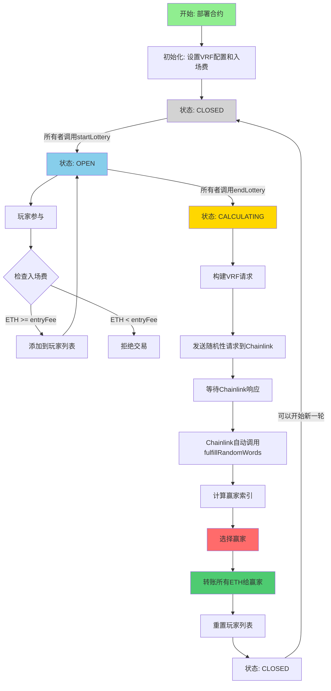

# 去中心化彩票 - Chainlink VRF

Day: Day 22
ID: 22
原文: https://www.notion.so/DecentralisedLottery-contract-1dd5720a23ef8030ab23ee0d8b2c2c2d?source=copy_link
状态: 完成
译者: Shuyi
难度等级: 高级

欢迎回到 **30 Days of Solidity** —— 每一天，我们都在提升智能合约的技能。

到目前为止，你已经完成了一些相当酷的事情：

- 你制作了可以**发送和接收 ETH** 的合约，
- 用**修饰符**像数字保镖一样保护它们，
- 强化你的代码以抵御像**重入攻击**这样的阴险伎俩，
- 甚至用你自己的 **NFT** 让数字艺术焕发生机。

但今天？

今天我们要走出合约的围墙。

我们要接入*真实世界* —— 一个智能合约可以伸手、请求数据并**安全地**带回来的世界。

而且我们要用一种很酷的方式来做这件事……

通过构建一个**去中心化彩票**。

不是普通的彩票。

这个彩票：

- 🧾 **可证明公平**
- ⚙️ **完全自动化**
- 🔐 **不可能被操纵**

而它的核心是一个特别的东西：

**Chainlink VRF** —— 一个在链上工作的可信随机性来源。

---

## 🔮 但等等……什么*是* Chainlink VRF？

问题来了：

智能合约很聪明……但它们也**可预测**。

它们只会做代码中写的事情 —— 不多不少。

这意味着它们**无法生成随机性**。

而在彩票中？这可是个致命问题。

如果你尝试使用时间戳或区块号作为随机性，矿工可以**操纵**它们。

这就是 **Chainlink VRF** 的用武之地。

可以这样想：

你叫来一个可信的裁判，递给他们一个密封的信封，然后说：

> "抛个硬币。向所有人展示结果。然后把它锁定到区块链上。"
> 

这就是 Chainlink VRF 所做的。

它给你：

- 🎲 一个**随机数**，
- 🧾 一个**密码学证明**，证明它是公平生成的，
- 📦 并将两者直接传递给你的智能合约。

这就是我们如何将**可信的随机性**带入一个**不信任的世界**。

现在你知道幕后是什么了……

让我们构建一个*真正配得上*被称为公平的彩票。

---

## 1. 产品需求书

### 流程图



---

### **合约与函数清单**

**📋 合约结构表**

| Contract Type | Bases |
| --- | --- |
| FairChainLottery | VRFConsumerBaseV2Plus |

---

**🔧 函数详细列表**

| Function Name | Visibility | Mutability | Modifiers | Description |
| --- | --- | --- | --- | --- |
| **constructor** | Public | 🛑 | - | 初始化VRF配置、订阅ID、密钥哈希和入场费 |
| **enter** | Public ❗️ | 💵 Payable | - | 玩家支付入场费参与彩票 |
| **startLottery** | External ❗️ | 🛑 | onlyOwner | 所有者开启新一轮彩票 |
| **endLottery** | External ❗️ | 🛑 | onlyOwner | 所有者结束彩票并请求随机数 |
| **fulfillRandomWords** | Internal 🔒 | 🛑 | override | Chainlink自动回调，选择赢家并发送奖金 |
| **getPlayers** | External ❗️ | 👀 View | - | 返回当前轮次的所有玩家地址 |

---

**📊 状态变量清单**

| Variable Name | Type | Visibility | Description |
| --- | --- | --- | --- |
| **lotteryState** | LOTTERY_STATE (enum) | Public | 彩票当前状态（OPEN/CLOSED/CALCULATING） |
| **players** | address payable[] | Public | 当前轮次参与的玩家列表 |
| **recentWinner** | address | Public | 最近一轮的赢家地址 |
| **entryFee** | uint256 | Public | 参与彩票所需的入场费 |
| **subscriptionId** | uint256 | Public | Chainlink VRF订阅ID |
| **keyHash** | bytes32 | Public | Chainlink VRF密钥哈希 |
| **callbackGasLimit** | uint32 | Public | 回调函数的gas限制（默认100000） |
| **requestConfirmations** | uint16 | Public | 随机数请求的确认区块数（默认3） |
| **numWords** | uint32 | Public | 请求的随机数数量（默认1） |
| **latestRequestId** | uint256 | Public | 最新的随机性请求ID |

---

**🎭 事件与枚举**

| Type | Name | Values/Parameters | Description |
| --- | --- | --- | --- |
| **enum** | LOTTERY_STATE | OPEN, CLOSED, CALCULATING | 彩票的三种可能状态 |

---

**🔐 访问控制标识**

| Symbol | Meaning |
| --- | --- |
| ❗️ | External/Public 函数 |
| 🔒 | Internal/Private 函数 |
| 🛑 | 修改状态的函数 |
| 👀 | View 函数（只读） |
| 💵 | Payable 函数（可接收ETH） |

## 2.🧾 完整合约 —— FairChainLottery

```solidity

// SPDX-License-Identifier: MIT
pragma solidity ^0.8.20;

import {VRFConsumerBaseV2Plus} from "@chainlink/contracts/src/v0.8/vrf/dev/VRFConsumerBaseV2Plus.sol";
import {VRFV2PlusClient} from "@chainlink/contracts/src/v0.8/vrf/dev/libraries/VRFV2PlusClient.sol";

contract FairChainLottery is VRFConsumerBaseV2Plus {
    enum LOTTERY_STATE { OPEN, CLOSED, CALCULATING }
    LOTTERY_STATE public lotteryState;

    address payable[] public players;
    address public recentWinner;
    uint256 public entryFee;

    // Chainlink VRF 配置
    uint256 public subscriptionId;
    bytes32 public keyHash;
    uint32 public callbackGasLimit = 100000;
    uint16 public requestConfirmations = 3;
    uint32 public numWords = 1;
    uint256 public latestRequestId;

    constructor(
        address vrfCoordinator,
        uint256 _subscriptionId,
        bytes32 _keyHash,
        uint256 _entryFee
    ) VRFConsumerBaseV2Plus(vrfCoordinator) {
        subscriptionId = _subscriptionId;
        keyHash = _keyHash;
        entryFee = _entryFee;
        lotteryState = LOTTERY_STATE.CLOSED;
    }

    function enter() public payable {
        require(lotteryState == LOTTERY_STATE.OPEN, "Lottery not open");
        require(msg.value >= entryFee, "Not enough ETH");
        players.push(payable(msg.sender));
    }

    function startLottery() external onlyOwner {
        require(lotteryState == LOTTERY_STATE.CLOSED, "Can't start yet");
        lotteryState = LOTTERY_STATE.OPEN;
    }

    function endLottery() external onlyOwner {
        require(lotteryState == LOTTERY_STATE.OPEN, "Lottery not open");
        lotteryState = LOTTERY_STATE.CALCULATING;

        VRFV2PlusClient.RandomWordsRequest memory req = VRFV2PlusClient.RandomWordsRequest({
            keyHash: keyHash,
            subId: subscriptionId,
            requestConfirmations: requestConfirmations,
            callbackGasLimit: callbackGasLimit,
            numWords: numWords,
            extraArgs: VRFV2PlusClient._argsToBytes(
                VRFV2PlusClient.ExtraArgsV1({nativePayment: true})
            )
        });

        latestRequestId = s_vrfCoordinator.requestRandomWords(req);
    }

    function fulfillRandomWords(uint256, uint256[] calldata randomWords) internal override {
        require(lotteryState == LOTTERY_STATE.CALCULATING, "Not ready to pick winner");

        uint256 winnerIndex = randomWords[0] % players.length;
        address payable winner = players[winnerIndex];
        recentWinner = winner;

        players = new address payable[](0);
        lotteryState = LOTTERY_STATE.CLOSED;

        (bool sent, ) = winner.call{value: address(this).balance}("");
        require(sent, "Failed to send ETH to winner");
    }

    function getPlayers() external view returns (address payable[] memory) {
        return players;
    }
}

```

---

好的 —— 你已经了解了**为什么**我们需要随机性，你已经认识了我们的裁判（*Chainlink VRF*），现在是时候**构建真正的游戏**了。

但这不是什么老旧的抽奖箱。

我们正在构建一个**防篡改**、**自动化**、**链上彩票系统**，任何人都可以参与……而**没有人**可以作弊。

在每轮结束时，合约会向 Chainlink 请求一个随机数，从池中选出一位幸运赢家，并**向他们发送所有 ETH**。

没有人工干预。没有幕后花招。

只有数学、透明度，还有一点 Chainlink 魔法。

---

## 🔗 Chainlink 设置

在我们转动彩票轮盘之前，我们需要一种方法将**真正的随机性**引入我们的合约 —— 这就是 **Chainlink VRF** 发挥作用的地方。

但要真正使用 Chainlink 的随机性系统，我们需要与它*对话*。在 Solidity 中，这意味着导入正确的库 —— 就像插入一个智能合约版本的对讲机，让我们的彩票与 Chainlink 的预言机网络聊天。

我们是这样做的：

```solidity

import {VRFConsumerBaseV2Plus} from "@chainlink/contracts/src/v0.8/vrf/dev/VRFConsumerBaseV2Plus.sol";
import {VRFV2PlusClient} from "@chainlink/contracts/src/v0.8/vrf/dev/libraries/VRFV2PlusClient.sol";

```

这些导入给我们提供了两个主要工具：

1. **`VRFConsumerBaseV2Plus`** —— 这是 Chainlink 提供的一个*基础合约*。我们从它继承，作为回报，我们得到一个名为 `fulfillRandomWords` 的特殊函数，当随机数准备好时，Chainlink 会自动调用它。可以把它看作是随机数的"回调"插槽。
2. **`VRFV2PlusClient`** —— 这是一个辅助库，它给我们提供了一种简单的方式来构造和格式化我们发送给 Chainlink 的随机性请求。它让我们可以配置以下内容：
    - 我们想要多少个随机数
    - 回调使用多少 gas
    - 使用哪个 Chainlink 任务（通过 `keyHash`）

这两个部分共同构成了**我们链上随机性的直接链接**。没有它们，我们将无法安全地接触外部世界。

---

## 🗝️ 让我们声明我们的合约

准备好 Chainlink 设置后，是时候真正声明将运行整个节目的智能合约了。

这是我们去中心化彩票系统的开始：

```solidity

contract FairChainLottery is VRFConsumerBaseV2Plus {

```

我们称它为 `FairChainLottery` —— 因为这正是我们正在构建的：

一个**生活在链上的彩票合约**，**公平性已经融入其 DNA**。

请注意，我们继承自 `VRFConsumerBaseV2Plus` —— 这就是赋予我们的合约从 Chainlink 接收随机数并在我们的逻辑中使用它们的能力。

---

从这里开始，我们将开始定义使整个彩票系统运转的变量和函数 —— 从跟踪谁参与到加冕赢家并向他们发送整个奖池。

让我们深入了解 👇

---

## 🧠 彩票状态 —— 保持游戏井然有序

每个好系统都需要规则。

而在我们的彩票中，我们需要**非常清楚**合约处于哪个阶段 —— 因为在不同时间应该允许不同的事情。

我们是让玩家加入吗？

我们是在等待选出赢家吗？

还是我们只是在两轮之间休息？

这就是这段小代码的作用：

```solidity

enum LOTTERY_STATE { OPEN, CLOSED, CALCULATING }
LOTTERY_STATE public lotteryState;

```

让我们分解一下。

---

```jsx
enum LOTTERY_STATE

```

`enum` 是 **enumeration**（枚举）的缩写，在 Solidity 中，它是一种创建变量可以取的命名状态列表的方法。

在这种情况下，我们为彩票定义了三种可能的状态：

- `OPEN` —— 彩票正在进行，**玩家可以参与**。
- `CLOSED` —— 彩票**不活跃**。没有参与，没有选择。只是休息。
- `CALCULATING` —— 彩票目前**正在向 Chainlink 请求随机数**，在我们获得结果之前**没有人可以参与或重启游戏**。

---

### 🔍 为什么这很重要

这个 `lotteryState` 变量是**合约的大脑** —— 它帮助我们管理游戏流程并在正确的时间执行正确的规则。

例如：

- 我们只在 `lotteryState == OPEN` 时允许新玩家参与
- 我们只在状态为 `CLOSED` 时开始新一轮
- 我们只在 `CALCULATING` 状态时选择赢家

这防止了：

- 人们在选择赢家期间偷偷溜进来
- 在另一轮中间意外开始新一轮
- 重复的随机性请求（这会很昂贵且混乱）

---

## 👥 玩家跟踪

```solidity

address payable[] public players;
address public recentWinner;
uint256 public entryFee;

```

- `players` 存储本轮加入的每个人。
- `recentWinner` 记住上一轮谁赢了。
- `entryFee` 设置某人必须支付多少 ETH 才能加入。

---

## ⚙️ Chainlink 配置 —— 连接随机性引擎

当我们向 Chainlink 请求一个随机数时，我们不只是说：

> "嘿，给我一些随机的东西。"
> 

不 —— 我们必须非常**具体**地说明我们想要什么。

这就是这组配置变量的作用：

```solidity

uint256 public subscriptionId;
bytes32 public keyHash;
uint32 public callbackGasLimit = 100000;
uint16 public requestConfirmations = 3;
uint32 public numWords = 1;
uint256 public latestRequestId;

```

让我们逐一了解它们的作用，以及为什么重要。

---

```jsx
subscriptionId

```

这就像你的 **Chainlink 账户 ID** —— 它与你的 Chainlink 订阅绑定，你用 LINK 代币为其充值以支付预言机服务。

每次发出随机性请求时，LINK 都会从你的订阅中扣除。

这个 ID 告诉 Chainlink 协调器：

> "记在我账上。"
> 

---

```jsx
keyHash

```

这标识了**你想要运行哪个 Chainlink 预言机任务**。

可以想象 Chainlink 有许多不同的"任务" —— 每个任务由具有不同配置的不同预言机提供支持（有些更快，有些更去中心化等）。

`keyHash` 是一个唯一标识符，它说：

> "使用 VRF 服务的这个特定配置。"
> 

它确保你连接到适合你需求的**正确预言机设置**。

---

```jsx
 callbackGasLimit

```

这为 Chainlink 在用结果回调你的合约时设置了一个 **gas 预算**。

Chainlink 必须调用你的 `fulfillRandomWords()` 函数来传递随机数。

就像任何其他交易一样，它需要 gas。

这个数字告诉 Chainlink：

> "在履行请求时，你可以使用最多 X 个 gas。"
> 

太低？你的函数可能会失败。

太高？你在浪费 gas。

所以你想找到一个不错的中间地带 —— 100,000 通常是简单逻辑（如选择赢家）的良好安全默认值。

---

```jsx
requestConfirmations

```

这设置了 Chainlink 在生成随机数之前等待**多少个区块确认**。

为什么？

因为你等待的确认越多，结果就越**难被操纵**（即使是矿工）。

它增加了**安全性**，但也增加了轻微的**延迟**。

像 `3` 这样的值是速度和安全性之间的可靠平衡。

---

```jsx
numWords

```

这告诉 Chainlink 你在一次请求中想要多少个**随机数**。

我们只是在这里选择一个赢家，所以 `1` 就足够了。

但如果你在做像洗牌列表、选择多个赢家或生成 NFT 特征之类的事情，你可以请求更多。

---

```jsx
latestRequestId

```

每次发出随机性请求时，Chainlink 都会给你一个**请求 ID**。

我们将它存储在这里，主要用于跟踪目的 —— 例如，在前端或如果我们想验证响应。

你可以把它想象成你的随机性订单的票号。

---

## 🛠️ 构造函数 —— 设置游戏室

好的，在我们让任何人参与彩票之前，我们需要**摆好桌子**。

就像你为真实世界的彩票做准备一样 —— 打印彩票、锁定奖池和设置入场价格 —— 我们需要**用正确的设置初始化我们的智能合约**。

这就是**构造函数**的作用。

这是代码：

```solidity

constructor(
    address vrfCoordinator,
    uint256 _subscriptionId,
    bytes32 _keyHash,
    uint256 _entryFee
) VRFConsumerBaseV2Plus(vrfCoordinator) {
    subscriptionId = _subscriptionId;
    keyHash = _keyHash;
    entryFee = _entryFee;
    lotteryState = LOTTERY_STATE.CLOSED;
}

```

让我们解开这里发生的事情：

---

### 🧩 构造函数基础

在 Solidity 中，`constructor` 是一个**特殊函数**，它**只运行一次** —— 在合约首次部署时。

这是你**设置初始条件**和锁定重要值的唯一机会。

---

### 🧭 参数分解

- **`vrfCoordinator`** —— 这是你要部署到的区块链上 Chainlink VRF 协调器的地址。它充当接收随机性请求并返回结果的中间人。
- **`_subscriptionId`** —— 这是你的 Chainlink 订阅 ID（用于支付 VRF 请求）。
- **`_keyHash`** —— 这定义了 Chainlink 应该使用哪个随机性任务。
- **`_entryFee`** —— 这设置了玩家必须支付多少 ETH 才能参与每轮彩票。

---

### ⚙️ 初始化

在构造函数的主体内，我们正在做几件关键的事情：

```solidity

subscriptionId = _subscriptionId;
keyHash = _keyHash;
entryFee = _entryFee;
lotteryState = LOTTERY_STATE.CLOSED;

```

这意味着什么：

- 我们正在保存部署期间传递给我们的 **Chainlink 配置**。
- 我们将**入场费**存储为状态变量，以便可以在 `enter()` 函数中重用。
- 最重要的是，我们默认将 `lotteryState` 设置为 `CLOSED`。

为什么默认关闭？

因为我们想要**控制**。

我们不希望玩家在我们仍在设置或在彩票正式开始之前就进入。

所以我们保持门关闭 —— 之后，所有者可以调用 `startLottery()` 来打开大门。

---

## 🚪 参与彩票 —— 请进！

好的 —— 设置完成了，门开了，霓虹灯标志正在发光：**"彩票进行中。"**

现在是人们开始排队买票的时候了。

让我们看看实现这一点的函数：

```solidity

function enter() public payable {
    require(lotteryState == LOTTERY_STATE.OPEN, "Lottery not open");
    require(msg.value >= entryFee, "Not enough ETH");
    players.push(payable(msg.sender));
}

```

---

### 🎟️ 这里发生了什么？

这个函数是你的**售票亭**。它允许区块链上的任何用户参与彩票，只要他们遵守规则。

让我们逐行看：

---

```jsx
require(lotteryState == LOTTERY_STATE.OPEN, "Lottery not open");

```

我们只允许人们在彩票处于 `OPEN` 状态时进入。

这保护系统免受试图在选择赢家或设置期间偷偷溜进来的迟到者的影响。

如果彩票仍然是 `CLOSED` 或当前正在 `CALCULATING`，这一行将阻止交易。

这就像出现在一个关闭的嘉年华 —— 大门就是不会动。

---

```jsx
require(msg.value >= entryFee, "Not enough ETH");

```

接下来，我们检查玩家是否已经支付了**至少**所需的最低 ETH。

`msg.value` 是随交易一起发送的 ETH 数量。

如果它少于 `entryFee`，交易将被还原，并带有一条礼貌（但坚定）的消息：

> "ETH 不够。"
> 

这里没有免费乘车。

---

```jsx
players.push(payable(msg.sender));

```

最后 —— 如果所有检查都通过 —— 我们**将玩家添加到列表中**。

我们用 `payable(...)` 包装 `msg.sender`，因为我们计划稍后可能会向这个地址发送 ETH（如果他们赢了）。Solidity 需要我们将其标记为 `payable`，以便向其转移资金。

---

## 🟢 开始游戏 —— 让抽奖开始！

在任何彩票售出之前……

在收集任何 ETH 之前……

必须有人正式启动。

那个人？**合约所有者** —— 部署合约的人。

这是翻转开关的函数：

```solidity

function startLottery() external onlyOwner {
    require(lotteryState == LOTTERY_STATE.CLOSED, "Can't start yet");
    lotteryState = LOTTERY_STATE.OPEN;
}

```

---

### `onlyOwner` —— 一个按钮，一个老板

`onlyOwner` 修饰符（从 Chainlink 的基础合约继承）确保**只有部署合约的人**可以调用此函数。

这意味着随机玩家不能：

- 开始新一轮
- 干扰彩票流程
- 通过在轮中重启来破坏游戏

这就像把发射发令枪的权力交给比赛协调员 —— 而不是跑步者。

---

```jsx
require(lotteryState == LOTTERY_STATE.CLOSED, "Can't start yet");

```

这一行确保我们不会在**另一轮已经在进行时**开始一轮。

换句话说：

- 如果大门已经打开，你不能再打开大门。
- 如果彩票仍在等待 Chainlink 返回赢家，你不能重启彩票。

这避免了混乱的重叠并保护游戏流程。

---

```jsx
lotteryState = LOTTERY_STATE.OPEN;

```

现在 —— 所有检查都通过了 —— 我们翻转开关。

合约将其状态从 `CLOSED` 更新为 `OPEN`，就这样……

**游戏开始了。**

玩家现在可以通过向合约发送 ETH 来开始参与彩票。

---

## 结束游戏并请求随机性 —— 最后的哨声

一旦有足够的玩家加入并且是时候结束了，就需要有人正式结束游戏并要求 Chainlink 掷骰子。

这就是这个函数的作用：

```solidity

function endLottery() external onlyOwner {
    require(lotteryState == LOTTERY_STATE.OPEN, "Lottery not open");
    lotteryState = LOTTERY_STATE.CALCULATING;

    VRFV2PlusClient.RandomWordsRequest memory req = VRFV2PlusClient.RandomWordsRequest({
        keyHash: keyHash,
        subId: subscriptionId,
        requestConfirmations: requestConfirmations,
        callbackGasLimit: callbackGasLimit,
        numWords: numWords,
        extraArgs: VRFV2PlusClient._argsToBytes(
            VRFV2PlusClient.ExtraArgsV1({nativePayment: true})
        )
    });

    latestRequestId = s_vrfCoordinator.requestRandomWords(req);
}

```

---

### 🧠 这里发生了什么？

让我们逐步分解：

---

```jsx
require(lotteryState == LOTTERY_STATE.OPEN, "Lottery not open");

```

我们只想在彩票当前处于活动状态时结束它。

这个检查确保有人不会意外（或恶意）结束一个甚至还没开始的轮次。

---

```jsx
lotteryState = LOTTERY_STATE.CALCULATING;

```

一旦我们结束了这一轮，我们就将状态翻转为 `CALCULATING`。

这表明我们正在选择赢家的过程中，现在没有新玩家可以进入。

---

### 🔮 构建请求

这是真正魔法开始的地方：

```solidity
    VRFV2PlusClient.RandomWordsRequest memory req = VRFV2PlusClient.RandomWordsRequest({
        keyHash: keyHash,
        subId: subscriptionId,
        requestConfirmations: requestConfirmations,
        callbackGasLimit: callbackGasLimit,
        numWords: numWords,
        extraArgs: VRFV2PlusClient._argsToBytes(
            VRFV2PlusClient.ExtraArgsV1({nativePayment: true})
        )
    });

```

我们正在制作一个要发送给 Chainlink 的**随机性请求**。

这个对象告诉 Chainlink 它需要知道的一切：

- 使用哪个随机性任务（`keyHash`）
- 谁在付款（`subscriptionId`）
- 等待多少确认
- 响应时使用多少 gas
- 我们想要多少个随机数（在这种情况下，只有 `1`）

---

### 📡 发送请求

```solidity

latestRequestId = s_vrfCoordinator.requestRandomWords(req);

```

这一行实际上**将请求发送到 Chainlink VRF**。

此时，我们的工作完成了 —— 合约等待 Chainlink 用随机数响应。

这是很酷的部分：**我们不手动调用下一个函数。**

---

## 🏆 fulfillRandomWords —— 由 Chainlink 自动调用

一旦 Chainlink 收到我们的请求并完成其密码学魔法，它会通过调用此函数直接将结果发送回我们的合约：

```solidity

function fulfillRandomWords(uint256, uint256[] calldata randomWords) internal override {
    require(lotteryState == LOTTERY_STATE.CALCULATING, "Not ready to pick winner");

    uint256 winnerIndex = randomWords[0] % players.length;
    address payable winner = players[winnerIndex];
    recentWinner = winner;

    players = new address payable[](0);
    lotteryState = LOTTERY_STATE.CLOSED;

    (bool sent, ) = winner.call{value: address(this).balance}("");
    require(sent, "Failed to send ETH to winner");
}

```

---

### 🛡️ 安全检查

```solidity

require(lotteryState == LOTTERY_STATE.CALCULATING, "Not ready to pick winner");

```

为了安全起见，我们再次检查合约确实处于选择赢家的过程中。

这里不允许有任何有趣的事情。

---

### 🧮 选择赢家

```solidity

uint256 winnerIndex = randomWords[0] % players.length;
address payable winner = players[winnerIndex];

```

我们使用 Chainlink 提供的随机数并应用**模运算符（`%`）**以确保它映射到玩家索引之一。

假设：

- 我们有 5 个玩家
- Chainlink 给我们 `482340923`

那么：

```solidity

winnerIndex = 482340923 % 5 = 3

```

砰 —— 列表中的第 4 个玩家获胜。

---

### 🎉 宣布赢家

```solidity

recentWinner = winner;

```

我们存储赢家的地址以供参考，可能在 UI 中显示或稍后记录。

---

### 🧼 为下一轮重置

```solidity

players = new address payable[](0);
lotteryState = LOTTERY_STATE.CLOSED;

```

我们清空玩家列表并关闭彩票 —— 重置系统，以便所有者可以在准备好时开始新一轮。

---

### 💸 发送奖金

```solidity

(bool sent, ) = winner.call{value: address(this).balance}("");
require(sent, "Failed to send ETH to winner");

```

最后，我们将合约中存储的**所有 ETH** 发送给幸运的赢家。

如果转账因某种原因失败，我们会回滚以避免任何不一致。

---

### 🔬 自动 Chainlink 魔法

需要明确的是：

- 我们**手动调用** `endLottery()` 来发送随机性请求。
- 但我们**不调用** `fulfillRandomWords()` —— Chainlink 在返回随机数时**自动**为我们做这件事。

这就是预言机与智能合约交互方式的美妙之处 —— **事件驱动编程**的最佳体现。

---

## 🧾 实用函数

```solidity
    function getPlayers() external view returns (address payable[] memory) {
        return players;
    }

```

这只是返回当前玩家列表。对前端应用程序或浏览器很有用。

---

## 🧪 运行合约（在 Base Sepolia 上使用 Chainlink VRF）

我们已经编写了一个可证明公平的彩票，集成了 Chainlink VRF，并完整讲解了所有逻辑。

现在是时候**部署并实时测试它了**。

让我们一步步来 👇

---

### 🌐 步骤 1：设置 Remix + MetaMask

1. **打开 Remix IDE**
2. 在 MetaMask 中，**切换到"Base Sepolia"网络**。
    - 你可以通过 [Chainlist](https://chainlist.org/) 将 Base Sepolia 添加到 MetaMask，或手动添加：
        - **RPC**：`https://sepolia.base.org`
        - **链 ID**：`84532`
        - **货币符号**：ETH
        - **浏览器**：`https://sepolia.basescan.org`
3. 在 Remix 中，**转到"Deploy & Run Transactions"标签**
4. 将**"Environment"设置为"Injected Provider - MetaMask"**

现在 Remix 正在直接与你在 Base Sepolia 上的钱包对话 ✅

---

### ⛽ 步骤 2：在 Base Sepolia 上获取测试 ETH

要与合约交互，你需要一些测试 ETH。

1. 从 Chainlink Faucet 获取 Sepolia ETH
2. 使用 Base Bridge 桥接到 Base Sepolia，或者如果可用的话使用直接的 Base Sepolia 水龙头。

> ⚠️ Base Sepolia 水龙头可能有速率限制 —— 请耐心等待或使用开发网络替代方案。
> 

---

### 🔑 步骤 3：订阅 Chainlink VRF

Chainlink VRF 需要一个**订阅**来支付随机数请求。

以下是创建和充值的方法：

1. 前往 Chainlink VRF 订阅管理器
2. 连接你的钱包并切换到 **Base Sepolia**
3. 点击 **"Create Subscription"**
4. 记下 **Subscription ID**（你在部署时需要它）
5. 点击 **"Add Funds"** 并存入 **LINK 代币**
    - 你可以从同一页面的水龙头获取测试网 LINK

> ⚠️ 确保你有 Base Sepolia 上的 LINK，而不是以太坊 Sepolia 上的。
> 

---

### 👤 步骤 4：将你的合约添加为消费者

一旦你的合约部署完成，你需要**授权它使用你的 VRF 订阅**。

1. 部署后复制你的合约地址
2. 返回 VRF 订阅页面
3. 点击 **"Add Consumer"**
4. 粘贴你的合约地址

完成！现在你的合约被允许使用你的订阅请求随机性 ✅

---

### 🧱 步骤 5：在 Remix 中部署合约

1. 在 Remix 中，编译你的合约
2. 转到 **Deploy & Run Transactions** 标签
3. 在构造函数字段中输入以下内容：
    - `vrfCoordinator`：Base Sepolia VRF 协调器地址
        
        > 0x2ed832ba0d0969071f133b3f07f2f79c37f511f1
        > 
    - `subscriptionId`：（来自 Chainlink VRF UI）
    - `keyHash`：你想要使用的任务
        
        > 0xc17251dcf7c0358d32be3324e9b61fb71c71ff0b245f78b45f87838f19d3f01d（Base Sepolia 默认密钥哈希）
        > 
    - `entryFee`：例如，`1000000000000000` 表示 0.001 ETH

点击 **"Deploy"**，并确认 MetaMask 交易。

---

### 🎮 步骤 6：与合约交互

现在它已经部署了：

- 🟢 调用 `startLottery()`（onlyOwner）
- 🧑 任何人都可以 `enter()` 彩票（发送 ETH > entryFee）
- 🛑 准备好后，调用 `endLottery()`（onlyOwner）请求随机性
- 🧙 Chainlink 将自动调用 `fulfillRandomWords()`
- 🏆 检查 `recentWinner` 查看谁赢了
- 🔄 调用 `getPlayers()` 查看当前轮次的参与者

---

## 🧠 你刚刚掌握了什么

你不只是构建了一个彩票合约 ——

你刚刚迈出了进入**真实世界智能合约交互**世界的第一大步。

以下是你现在掌握的技能：

- ✅ 如何**集成 Chainlink VRF** 以将**安全、可验证的随机性**带到链上
- ✅ 如何使用 `enum` 设计**有状态合约**来管理游戏流程
- ✅ 如何**安全处理 ETH** —— 收集、存储和发送回去
- ✅ 如何构建**对外部事件做出反应**的合约，比如预言机响应

---

这是你第二次体验**链下到链上的魔法** —— 你的智能合约不只是孤立存在，而是实际上与外部世界对话。

有了 Chainlink VRF，你现在有了一种可信的方法将随机性添加到你的 dApp 中 —— 这只是个开始。

你可以采用这个概念并构建：

- 🎮 具有随机战利品掉落的区块链游戏
- 🎲 骰子、纸牌游戏和回合制机制
- 🧬 具有随机特征的 NFT 铸造
- 📦 神秘盒子和抽奖
- 🗳️ 具有随机陪审团选择的公平 DAO 提案

还有更多。