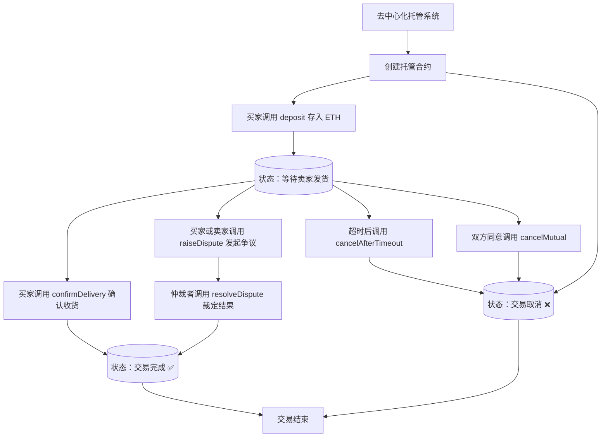

# 去中心化托管 - Escrow

Day: Day 24
ID: 24
原文: https://www.notion.so/DecentraliseEscrow-Contract-1de5720a23ef8007a888eca6b48df76f?source=copy_link
状态: 完成
译者: Rebecca9715
难度等级: 高级

欢迎回到 **30 天 Solidity**，在这里我们每天都在向掌握智能合约迈进一步——不仅仅是理论上的，更是实践中的。

今天，我们要构建一些**真实的**东西。一些**实用的**东西。一些真正可以在现实世界市场中使用的东西。

一个**托管服务**。

---

### 等等——什么是托管？

如果你曾经在网上购买过昂贵的东西——也许是自由职业工作、二手设备或门票——你可能希望有某个中间人来持有资金，直到*每个人都满意*。

这就是**托管**的全部意义。

在现实世界中，像 PayPal 或 eBay 这样的公司会为你做这件事。他们持有你的钱直到你拿到物品。如果出现问题，他们会介入。

但在 Web3 中呢？我们不需要这些公司。

我们可以**编写中间人代码**——并使其无需信任。

---

### 我们要构建什么

这个合约，`EnhancedSimpleEscrow`，是一个安全的智能合约，它可以：

- 持有 ETH 直到买家确认收货
- 让任何一方在出现问题时提出争议
- 允许中立的**仲裁人**介入并解决问题
- 具有内置的**超时逻辑**，这样买家就不会永远被挂起
- 支持**相互取消**，如果双方同意取消交易

没有文书工作。没有等待。没有可疑的第三方。

只有清晰的规则——用 Solidity 编写。

---

这个项目教你如何：

- 使用枚举来管理合约状态
- 使用 `block.timestamp` 处理超时
- 实现争议解决工作流程
- 使用像 `require()` 这样的修饰符进行严格的访问控制
- 并使你的合约通过清晰的事件和只读函数为前端做好准备

到最后，你将构建一个**真正可工作的托管系统**，它可以为数字市场、自由职业平台、NFT 交易等提供动力。

让我们深入研究，并用代码编写信任的规则。

## 🔐 EnhancedSimpleEscrow – 智能合约中间人

托管服务是区块链最实用的用例之一。今天，你将从头开始构建一个。

这个智能合约就像一个**数字中间人**。它在两方——一个**买家**和一个**卖家**——完成交易时安全地持有 ETH。如果出现问题，一个受信任的**仲裁人**可以介入解决争议。

它无需信任、安全，并且完全按照编写的方式运行——没有意外。

首先是完整的合约：

---

## 🧾 完整合约代码：`EnhancedSimpleEscrow.sol`

```solidity

// SPDX-License-Identifier: MIT
pragma solidity ^0.8.20;

/// @title EnhancedSimpleEscrow - 具有超时、取消和事件的安全托管合约
contract EnhancedSimpleEscrow {
    enum EscrowState { AWAITING_PAYMENT, AWAITING_DELIVERY, COMPLETE, DISPUTED, CANCELLED }

    address public immutable buyer;
    address public immutable seller;
    address public immutable arbiter;

    uint256 public amount;
    EscrowState public state;
    uint256 public depositTime;
    uint256 public deliveryTimeout; // 存款后的持续时间（以秒为单位）

    event PaymentDeposited(address indexed buyer, uint256 amount);
    event DeliveryConfirmed(address indexed buyer, address indexed seller, uint256 amount);
    event DisputeRaised(address indexed initiator);
    event DisputeResolved(address indexed arbiter, address recipient, uint256 amount);
    event EscrowCancelled(address indexed initiator);
    event DeliveryTimeoutReached(address indexed buyer);

    constructor(address _seller, address _arbiter, uint256 _deliveryTimeout) {
        require(_deliveryTimeout > 0, "Delivery timeout must be greater than zero");
        buyer = msg.sender;
        seller = _seller;
        arbiter = _arbiter;
        state = EscrowState.AWAITING_PAYMENT;
        deliveryTimeout = _deliveryTimeout;
    }

    receive() external payable {
        revert("Direct payments not allowed");
    }

    function deposit() external payable {
        require(msg.sender == buyer, "Only buyer can deposit");
        require(state == EscrowState.AWAITING_PAYMENT, "Already paid");
        require(msg.value > 0, "Amount must be greater than zero");

        amount = msg.value;
        state = EscrowState.AWAITING_DELIVERY;
        depositTime = block.timestamp;
        emit PaymentDeposited(buyer, amount);
    }

    function confirmDelivery() external {
        require(msg.sender == buyer, "Only buyer can confirm");
        require(state == EscrowState.AWAITING_DELIVERY, "Not in delivery state");

        state = EscrowState.COMPLETE;
        payable(seller).transfer(amount);
        emit DeliveryConfirmed(buyer, seller, amount);
    }

    function raiseDispute() external {
        require(msg.sender == buyer || msg.sender == seller, "Not authorized");
        require(state == EscrowState.AWAITING_DELIVERY, "Can't dispute now");

        state = EscrowState.DISPUTED;
        emit DisputeRaised(msg.sender);
    }

    function resolveDispute(bool _releaseToSeller) external {
        require(msg.sender == arbiter, "Only arbiter can resolve");
        require(state == EscrowState.DISPUTED, "No dispute to resolve");

        state = EscrowState.COMPLETE;
        if (_releaseToSeller) {
            payable(seller).transfer(amount);
            emit DisputeResolved(arbiter, seller, amount);
        } else {
            payable(buyer).transfer(amount);
            emit DisputeResolved(arbiter, buyer, amount);
        }
    }

    function cancelAfterTimeout() external {
        require(msg.sender == buyer, "Only buyer can trigger timeout cancellation");
        require(state == EscrowState.AWAITING_DELIVERY, "Cannot cancel in current state");
        require(block.timestamp >= depositTime + deliveryTimeout, "Timeout not reached");

        state = EscrowState.CANCELLED;
        payable(buyer).transfer(address(this).balance);
        emit EscrowCancelled(buyer);
        emit DeliveryTimeoutReached(buyer);
    }

    function cancelMutual() external {
        require(msg.sender == buyer || msg.sender == seller, "Not authorized");
        require(
            state == EscrowState.AWAITING_DELIVERY || state == EscrowState.AWAITING_PAYMENT,
            "Cannot cancel now"
        );

        EscrowState previousState = state;
        state = EscrowState.CANCELLED;

        if (previousState == EscrowState.AWAITING_DELIVERY) {
            payable(buyer).transfer(address(this).balance);
        }

        emit EscrowCancelled(msg.sender);
    }

    function getTimeLeft() external view returns (uint256) {
        if (state != EscrowState.AWAITING_DELIVERY) return 0;
        if (block.timestamp >= depositTime + deliveryTimeout) return 0;
        return (depositTime + deliveryTimeout) - block.timestamp;
    }
}

```

---

# 1. 产品说明书

### 用户流程



### 数据库

| Contract | Type | Bases |
| --- | --- | --- |
| **Escrow** | Implementation | Ownable, ReentrancyGuard |

| └ Function Name | Visibility | Mutability |
| --- | --- | --- |
| constructor | public | 🛑 |
| deposit | external | payable 🛑 |
| confirmDelivery | external | 🛑 |
| raiseDispute | external | 🛑 |
| resolveDispute | external (onlyArbiter) | 🛑 |
| cancelMutual | external | 🛑 |
| cancelAfterTimeout | external | 🛑 |
| getState | public | view |
| getBalance | public | view |

# 2. 细节解说

## 🔖 合约名称

```solidity

contract EnhancedSimpleEscrow {

```

我们称它为 **EnhancedSimpleEscrow**，因为它建立在基本托管思想的基础上——并添加了争议处理、基于超时的取消和前端友好的事件等功能。

---

## 🧠 状态变量和设置

让我们探索合约的大脑——持有所有重要数据的变量。

### 涉及的各方：

```solidity

address public immutable buyer;
address public immutable seller;
address public immutable arbiter;

```

这些是在合约部署时设置的三个固定地址。

- **buyer**（买家）是发送资金的人
- **seller**（卖家）是交付商品或服务的人
- **arbiter**（仲裁人）是解决争议的受信任第三方

---

### 托管状态管理：

```solidity

enum EscrowState { AWAITING_PAYMENT, AWAITING_DELIVERY, COMPLETE, DISPUTED, CANCELLED }
EscrowState public state;

```

我们使用 `enum` 来跟踪交易处于哪个阶段。这使得流程**更容易理解且更安全**。

---

### 金额和时间：

```solidity

uint256 public amount;
uint256 public depositTime;
uint256 public deliveryTimeout;

```

- `amount` 是锁定在托管中的 ETH
- `depositTime` 跟踪买家何时付款
- `deliveryTimeout` 是卖家交付的窗口期（以秒为单位）

---

### 事件：

合约为每个关键操作发出事件：存款、确认、争议、取消。这使得合约**易于与前端**或监控工具集成。

```jsx
    event PaymentDeposited(address indexed buyer, uint256 amount);
    event DeliveryConfirmed(address indexed buyer, address indexed seller, uint256 amount);
    event DisputeRaised(address indexed initiator);
    event DisputeResolved(address indexed arbiter, address recipient, uint256 amount);
    event EscrowCancelled(address indexed initiator);
    event DeliveryTimeoutReached(address indexed buyer);

```

这些事件就像**广播**——它们被前端、索引器或分析仪表板接收，并触发视觉反馈，如：

- "收到付款！"
- "托管完成！"
- "提出争议！"

让我们逐一回顾。

---

### 1. `PaymentDeposited`

```solidity

event PaymentDeposited(address indexed buyer, uint256 amount);

```

当买家成功将 ETH 存入托管时触发。

用于：

- 确认托管已开始
- 在前端显示锁定的金额

---

### 2. `DeliveryConfirmed`

```solidity

event DeliveryConfirmed(address indexed buyer, address indexed seller, uint256 amount);

```

当买家确认他们已收到产品或服务时触发。

用于：

- 确认交易完成
- 表明卖家已收到付款

---

### 3. `DisputeRaised`

```solidity

event DisputeRaised(address indexed initiator);

```

当买家或卖家提出争议时触发。

用于：

- 通知前端并可能触发 UI 更改（如"争议进行中"）
- 让仲裁人知道需要他们的关注

---

### 4. `DisputeResolved`

```solidity

event DisputeResolved(address indexed arbiter, address recipient, uint256 amount);

```

当仲裁人解决争议并转移资金时触发。

用于：

- 显示争议的最终状态
- 显示谁获得了资金以及金额

---

### 5. `EscrowCancelled`

```solidity

event EscrowCancelled(address indexed initiator);

```

当托管被取消时触发，无论是通过超时还是相互协议。

用于：

- 用"托管已取消"状态更新 UI
- 表明已发出退款

---

### 6. `DeliveryTimeoutReached`

```solidity

event DeliveryTimeoutReached(address indexed buyer);

```

如果买家在交付窗口到期后取消，则触发。

用于：

- 显示超时原因
- 解释为什么资金被自动退还

# 🔧 函数 – 让托管逻辑活起来

好的，我们已经设置好了参与者。我们已经定义了规则。我们已经准备好了所有变量、状态和事件。

现在是时候通过**函数**让这个托管系统活起来了。

函数是所有**操作**发生的地方。

它们是用户按下的按钮，合约执行的规则，以及确保资金*只在满足条件时 流动*的逻辑。

在这个合约中，托管流程的每一步都清晰地映射出来：

- **买家存入** ETH 到托管中
- **卖家交付**，买家确认
- 如果有麻烦，任何一方都可以**提出争议**
- 中立的**仲裁人介入**解决冲突
- 如果卖家拖延太久，**买家可以取消**
- 双方都可以**相互退出**

每个步骤都由专门的函数处理。

我们将详细查看每一个——并**解码每一行在做什么**，这样它就不仅仅是你复制粘贴的东西，而是你完全理解的东西。

让我们从一开始，从第一个运行的东西开始：`constructor()`。

准备好了吗？让我们开始吧。

# 🔨 `constructor` – 设置托管

```solidity

constructor(address _seller, address _arbiter, uint256 _deliveryTimeout) {
    require(_deliveryTimeout > 0, "Delivery timeout must be greater than zero");
    buyer = msg.sender;
    seller = _seller;
    arbiter = _arbiter;
    state = EscrowState.AWAITING_PAYMENT;
    deliveryTimeout = _deliveryTimeout;
}

```

### 🧠 什么是构造函数？

在 Solidity 中，`constructor` 是一个**特殊函数**，它**只运行一次**——当合约首次部署时。

它就像合约的设置阶段。这是我们定义**谁参与**、**事情应该花多长时间**以及系统**起始状态**应该是什么的地方。

---

### 🚀 这个构造函数做什么

当买家（部署合约的人）调用这个构造函数时，他们提供：

- **卖家的**地址（交付商品或服务的人）
- **仲裁人的**地址（可以解决争议的中立第三方）
- **交付超时**——卖家在买家可以取消之前必须交付的时间

然后这个函数设置好一切，让托管开始。

---

### 🔍 逐行分解

### 1. ✅ 必须设置超时

```solidity

require(_deliveryTimeout > 0, "Delivery timeout must be greater than zero");

```

这是一个基本的安全检查。我们确保交付超时是一个**正数**。

为什么？因为如果它是 0，买家可以在存入资金的那一刻立即取消托管——这违背了给卖家时间交付的整个目的。

---

### 2. 👤 设置买家

```solidity

buyer = msg.sender;

```

买家是**部署合约的人**，`msg.sender` 总是指调用函数的人——在这种情况下，是部署者。

这就是为什么我们在这里将他们分配为买家。

他们是发起交易并负责锁定资金的人。

---

### 3. 📦 分配卖家

```solidity

seller = _seller;

```

卖家的地址在部署期间作为参数传入。

*如果* 交付被确认的话，这是最终将收到资金的人。

---

### 4. ⚖️ 设置仲裁人

```solidity

arbiter = _arbiter;

```

同样，在部署期间传入。仲裁人是中立的法官。

他们只在出现问题时参与——比如买家提出争议并声称没有交付。

仲裁人有权通过将资金释放给买家或卖家来解决问题。

---

### 5. 🕓 设置初始状态

```solidity

state = EscrowState.AWAITING_PAYMENT;

```

我们将合约设置为**等待状态**——资金尚未存入。

这确保 `deposit()` 函数是下一个逻辑步骤，任何其他操作（如确认交付）在此之前都被阻止。

---

### 6. ⏱️ 设置超时窗口

```solidity

deliveryTimeout = _deliveryTimeout;

```

这设置了卖家必须交付的时间窗口，以秒为单位。

它只在买家将 ETH 存入合约**之后**开始计时。

我们稍后将在 `cancelAfterTimeout()` 函数中使用它，让买家在卖家延期时取消交易并获得退款。

---

# 🚫 `receive()` – 阻止随机 ETH 转账

```solidity

receive() external payable {
    revert("Direct payments not allowed");
}

```

### 🔍 这个函数做什么

这个小函数在这里充当你合约的**门卫**。

它阻止任何人试图发送的**任何 ETH**，**而不调用正确的函数**——比如 `deposit()`。

你可能想知道：

> 为什么我们需要这个？
> 
> 
> 发送到合约的所有 ETH 不都是正常流程的一部分吗？
> 

不完全是。

---

### 📬 Solidity 中的隐藏行为

默认情况下，Solidity 中的任何智能合约都可以**静默接收 ETH**——即使发送者没有调用特定函数。

这意味着有人可以去 Etherscan，粘贴你的合约地址，并向其发送 ETH，*而不*与你精心编写的逻辑交互。

这就是 `receive()` 函数的用武之地。

---

### 🧱 `receive()` 的目的

在 Solidity 中，当合约接收 ETH **而没有任何数据**时，会**自动**调用这个特殊函数。

所以如果有人只是使用以下方式发送 ETH：

- 像 MetaMask 这样的钱包应用
- Etherscan 的"发送 ETH"按钮
- 原始交易

...这个函数就会被触发。

但在我们的托管系统中，我们**不想要那样**。

我们希望每笔存款都通过正确的渠道——`deposit()` 函数——在那里我们：

- 跟踪谁发送的
- 更新 `amount`
- 更改 `state`
- 记录时间戳
- 发出事件

如果有人盲目发送 ETH，所有这些都会被跳过。

所以我们**拒绝它**：

```solidity

revert("Direct payments not allowed");

```

这确保没有 ETH 可以在没有适当处理的情况下意外进入合约。

没有意外存款。没有状态损坏。没有用户困惑。

---

# 💸 `deposit()` – 买家将资金发送到托管

```solidity

function deposit() external payable {
    require(msg.sender == buyer, "Only buyer can deposit");
    require(state == EscrowState.AWAITING_PAYMENT, "Already paid");
    require(msg.value > 0, "Amount must be greater than zero");

    amount = msg.value;
    state = EscrowState.AWAITING_DELIVERY;
    depositTime = block.timestamp;
    emit PaymentDeposited(buyer, amount);
}

```

### 🧠 这个函数做什么

这是我们托管合约中的**第一个真正操作**。

一旦合约被部署，所有三个角色（买家、卖家、仲裁人）都就位，这个函数允许**买家将 ETH 锁定到合约中**。

这个 ETH 现在处于悬而未决的状态——由智能合约安全持有——直到买家确认交付，或争议被解决。

让我们逐行分解。

---

### 🔐 步骤 1：只有买家可以存款

```solidity

require(msg.sender == buyer, "Only buyer can deposit");

```

我们使用 `require()` 来强制只有**买家**（部署合约的人）可以调用此函数。

这防止随机用户与托管交互并发送合约不期望的 ETH——保持一切干净和安全。

---

### 🔁 步骤 2：只有在尚未付款时

```solidity

require(state == EscrowState.AWAITING_PAYMENT, "Already paid");

```

一旦买家发送了 ETH，我们就进入一个新状态：`AWAITING_DELIVERY`。

这个检查确保 `deposit()` 函数只能被调用**一次**——我们不希望人们充值同一个托管或在它已经开始后发送 ETH。

---

### 💰 步骤 3：ETH 必须大于零

```solidity

require(msg.value > 0, "Amount must be greater than zero");

```

只是一个基本的安全检查——你不能发送 0 ETH 并期望托管开始。

没有这个，有人可能会意外地在没有资金的情况下触发函数，使合约处于奇怪的状态。

---

### 🏦 步骤 4：锁定资金

```solidity

amount = msg.value;

```

这将发送到合约的 ETH 存储在名为 `amount` 的状态变量中。

我们稍后将使用这个值来知道**多少**要发送给卖家（或退还给买家），当托管完成或取消的时候。

---

### 🔄 步骤 5：更改合约状态

```solidity

state = EscrowState.AWAITING_DELIVERY;

```

一旦钱进来了，我们就进入下一个阶段：我们现在正在等待卖家交付物品或服务。

这也意味着其他函数（如确认交付或提出争议）现在被允许——但只是因为我们处于正确的状态。

---

### ⏱️ 步骤 6：记录时间戳

```solidity

depositTime = block.timestamp;

```

这保存了 ETH 存入的确切时刻。

为什么这很重要？

我们稍后将在 `cancelAfterTimeout()` 函数中使用它。如果卖家在时间窗口（`deliveryTimeout`）内没有交付，买家可以取消并取回他们的钱——**但只在这个存款时间之后**。

---

### 📣 步骤 7：宣布存款

```solidity

emit PaymentDeposited(buyer, amount);

```

事件是我们告诉外部世界刚刚发生了什么的方式。

这一行触发一个链上事件，说：

> "买家刚刚将 X ETH 存入托管。"
> 

前端和像 Etherscan 这样的工具可以监听这个并实时更新 UI。

---

# ✅ `confirmDelivery()` – 买家标记交易完成

```solidity

function confirmDelivery() external {
    require(msg.sender == buyer, "Only buyer can confirm");
    require(state == EscrowState.AWAITING_DELIVERY, "Not in delivery state");

    state = EscrowState.COMPLETE;
    payable(seller).transfer(amount);
    emit DeliveryConfirmed(buyer, seller, amount);
}

```

### 🧠 这个函数做什么

一旦卖家交付了承诺的东西——无论是实物、数字文件、服务还是其他任何东西——买家需要一种方式来说：

> "是的，我收到了。继续释放资金。"
> 

这正是这个函数所做的。

它**完成交易**，将锁定的 ETH 转移给卖家，并更新合约以显示一切都完成了。

让我们逐行走一遍。

---

### 🧍 步骤 1：只有买家可以确认

```solidity

require(msg.sender == buyer, "Only buyer can confirm");

```

这确保只有**付款的人**——买家——可以将交易标记为完成。

我们不希望卖家或任何其他随机用户过早确认交付。

批准释放资金的权力严格保留给买家。

---

### 🔒 步骤 2：只允许在交付窗口期间

```solidity

require(state == EscrowState.AWAITING_DELIVERY, "Not in delivery state");

```

我们确保合约目前正在等待交付。

如果我们仍在等待存款，或者交易已经被争议、取消或完成——这个操作是不允许的。

> 这保护了托管的流程，防止逻辑错误或重复确认。
> 

---

### 🔁 步骤 3：将状态更改为完成

```solidity

state = EscrowState.COMPLETE;

```

我们更新状态以显示交易已完成。

从现在开始，不能再进行存款、争议或取消。托管正式结束。

---

### 💸 步骤 4：将资金释放给卖家

```solidity

payable(seller).transfer(amount);

```

这一行**转移 ETH**，之前锁定在合约中的资金直接到卖家的钱包。

我们使用 `payable()` 来明确说明这个地址被允许接收 ETH。

`amount` 变量是在买家存款时设置的，所以我们现在发送的正是约定的金额。

> 在这一点上，卖家已经收到付款，买家已经确认收货。无需信任且自动。
> 

---

### 📣 步骤 5：发出交付确认事件

```solidity

emit DeliveryConfirmed(buyer, seller, amount);

```

这告诉外部世界——你的前端、Etherscan、日志、通知——托管成功完成。

它包括：

- 买家是谁
- 卖家是谁
- 发送了多少 ETH

这使得跟踪链上活动和更新 UI 变得超级简单。

---

# ⚠️ `raiseDispute()` – 买家或卖家标记问题

```solidity

function raiseDispute() external {
    require(msg.sender == buyer || msg.sender == seller, "Not authorized");
    require(state == EscrowState.AWAITING_DELIVERY, "Can't dispute now");

    state = EscrowState.DISPUTED;
    emit DisputeRaised(msg.sender);
}

```

### 🧠 这个函数做什么

托管交易并不总是顺利进行。

也许**卖家没有交付**。

也许**买家声称他们没有收到物品**，即使卖家说他们交付了。

当信任破裂时，我们需要一种方式让任何一方**举手说："有问题。"**

这就是 `raiseDispute()` 的用途。

它将托管置于**争议状态**——在那里没有资金可以移动——并向仲裁人发出信号，表明需要他们的关注。

让我们逐行分解。

---

### 👥 步骤 1：只有买家或卖家可以调用此函数

```solidity

require(msg.sender == buyer || msg.sender == seller, "Not authorized");

```

此函数**严格限制**于交易中涉及的两方——买家和卖家。

随机用户不能干涉。

仲裁人也不允许触发争议——他们只解决它。

这使争议系统保持**干净、安全和公平**。

---

### 🕒 步骤 2：只在交付阶段

```solidity

require(state == EscrowState.AWAITING_DELIVERY, "Can't dispute now");

```

争议只能在**交付仍在等待时**提出。

如果交易已经完成、取消或争议，此函数就不再被允许。

这确保争议过程在**正确的时间**发生，并防止任何人在事后制造问题。

---

### 🔁 步骤 3：进入争议状态

```solidity

state = EscrowState.DISPUTED;

```

这是函数的核心。它将合约转换为**锁定**状态，在那里没有 ETH 可以移动——不能给卖家，也不能退还给买家。

这就像在说：

> "停止一切。我们需要一个人（仲裁人）介入并做出决定。"
> 

这确保在冲突未解决时，任何一方都不能操纵系统。

---

### 📣 步骤 4：发出争议事件

```solidity

emit DisputeRaised(msg.sender);

```

这告诉外部世界——特别是仲裁人——出现了问题。

我们包含 `msg.sender`，这样我们就知道**谁提出了争议**（买家或卖家），这对前端反馈或通知很有用。

---

# ⚖️ `resolveDispute()` – 仲裁人决定结果

```solidity

function resolveDispute(bool _releaseToSeller) external {
    require(msg.sender == arbiter, "Only arbiter can resolve");
    require(state == EscrowState.DISPUTED, "No dispute to resolve");

    state = EscrowState.COMPLETE;
    if (_releaseToSeller) {
        payable(seller).transfer(amount);
        emit DisputeResolved(arbiter, seller, amount);
    } else {
        payable(buyer).transfer(amount);
        emit DisputeResolved(arbiter, buyer, amount);
    }
}

```

### 🧠 这个函数做什么

一旦使用 `raiseDispute()` 提出争议，托管就被冻结了——在有人中立介入之前，没有人可以触及资金。

那个中立方就是**仲裁人**。

仲裁人的工作是审查情况并做出最终决定：

**应该支付给卖家，还是应该退款给买家？**

这个函数赋予他们这样做的权力。

---

### 🔍 逐行分解

---

### 1. ✅ 只有仲裁人可以调用此函数

```solidity

require(msg.sender == arbiter, "Only arbiter can resolve");

```

此函数对买家和卖家是禁止的。

为什么？因为这是关于**公正解决**的。

只有在合约开始时定义的仲裁人可以做出这个最终决定。

这使过程保持中立并保护双方。

---

### 2. 🔒 只有在我们处于争议中时才允许

```solidity

require(state == EscrowState.DISPUTED, "No dispute to resolve");

```

此函数只能在合约处于 `DISPUTED` 状态时使用——其他时间都不可以。

这意味着你不能在问题被提出之前调用它，或者在交易已经完成或取消之后。

---

### 3. 🏁 将托管标记为完成

```solidity

state = EscrowState.COMPLETE;

```

无论仲裁人做出什么决定，托管现在都是**关闭的**。

这防止任何进一步的操作（如再次取消或争议）并将最终结果锁定到位。

---

### 4. 💸 根据决定释放资金

```solidity

if (_releaseToSeller) {
    payable(seller).transfer(amount);
    emit DisputeResolved(arbiter, seller, amount);
} else {
    payable(buyer).transfer(amount);
    emit DisputeResolved(arbiter, buyer, amount);
}

```

仲裁人传入一个布尔值：`_releaseToSeller`。

- 如果是 `true`：卖家获得 ETH。
- 如果是 `false`：买家取回他们的 ETH。

在进行转账后，函数发出 `DisputeResolved` 事件——显示谁赢得了争议以及他们收到了多少。

> 这使决定透明且可在链上验证。
> 

---

# ⏱️ `cancelAfterTimeout()` – 如果卖家延迟，买家取消

```solidity

function cancelAfterTimeout() external {
    require(msg.sender == buyer, "Only buyer can trigger timeout cancellation");
    require(state == EscrowState.AWAITING_DELIVERY, "Cannot cancel in current state");
    require(block.timestamp >= depositTime + deliveryTimeout, "Timeout not reached");

    state = EscrowState.CANCELLED;
    payable(buyer).transfer(address(this).balance);
    emit EscrowCancelled(buyer);
    emit DeliveryTimeoutReached(buyer);
}

```

### 🧠 这个函数做什么

这是你作为买家的**紧急出口**。

假设你已经将 ETH 锁定在托管中。卖家应该交付一些东西——但日子过去了，什么也没有出现。没有交付，没有沟通。

与其永远被困在合约中，这个函数给你一种方式**退出**——但只有在约定的截止日期过去之后。

让我们逐行分解。

---

### 👤 步骤 1：只有买家可以取消

```solidity

require(msg.sender == buyer, "Only buyer can trigger timeout cancellation");

```

由于买家是存入资金的人，他们是唯一可以因延迟而取消交易的人。

这保护了买家，而不给卖家任何触发过早取消的方式。

---

### ⏳ 步骤 2：只有在我们等待交付时

```solidity

require(state == EscrowState.AWAITING_DELIVERY, "Cannot cancel in current state");

```

我们只能在资金已经存入并且我们处于交付阶段时使用此函数。

如果我们仍在等待买家存款，或者合约已经处于争议、完成或取消状态——此函数是不允许的。

---

### 🕒 步骤 3：检查超时是否已过

```solidity

require(block.timestamp >= depositTime + deliveryTimeout, "Timeout not reached");

```

现在我们检查卖家是否错过了他们的截止日期。

- `depositTime` 是买家存入 ETH 的时间。
- `deliveryTimeout` 是卖家必须交付的约定持续时间。

如果当前时间（`block.timestamp`）**等于或大于**那个截止日期，买家就被允许取消。

否则，他们需要再等一会儿。

---

### ❌ 步骤 4：取消托管

```solidity

state = EscrowState.CANCELLED;

```

我们更新合约以将交易标记为已取消。

从这一点开始，没有人可以确认交付、提出争议或触发任何其他操作。

---

### 💸 步骤 5：退款给买家

```solidity

payable(buyer).transfer(address(this).balance);

```

资金全额退还给买家。

我们使用 `address(this).balance` 而不是 `amount`，只是为了额外安全——以防有任何意外进入合约（尽管通常只有 `amount` 会在那里）。

---

### 📣 步骤 6：发出取消和超时事件

```solidity

emit EscrowCancelled(buyer);
emit DeliveryTimeoutReached(buyer);

```

这两个事件告诉前端和任何外部监听器：

- 托管被取消了
- 原因是**交付超时**

这有助于提供透明度并解释用户审查交易历史时发生了什么。

---

# 🤝 `cancelMutual()` – 任何一方在完成前取消

```solidity

function cancelMutual() external {
    require(msg.sender == buyer || msg.sender == seller, "Not authorized");
    require(
        state == EscrowState.AWAITING_DELIVERY || state == EscrowState.AWAITING_PAYMENT,
        "Cannot cancel now"
    );

    EscrowState previousState = state;
    state = EscrowState.CANCELLED;

    if (previousState == EscrowState.AWAITING_DELIVERY) {
        payable(buyer).transfer(address(this).balance);
    }

    emit EscrowCancelled(msg.sender);
}

```

### 🧠 这个函数做什么

有时，双方决定取消交易——没有争议，没有超时，没有戏剧性。

也许卖家不能再履行订单了。

也许买家改变主意了。

或者也许双方都同意它就是行不通。

此函数允许**买家或卖家**在**完成之前**取消托管——无论是刚创建还是资金已经存入。

让我们详细分解它是如何工作的。

---

### 🔐 步骤 1：只有买家或卖家可以取消

```solidity

require(msg.sender == buyer || msg.sender == seller, "Not authorized");

```

此函数不对公众开放。

只有**买家**或**卖家**可以触发相互取消。

这确保取消的决定留在涉及的两个人之间。

---

### 🕒 步骤 2：只能在正确的时间使用

```solidity

require(
    state == EscrowState.AWAITING_DELIVERY || state == EscrowState.AWAITING_PAYMENT,
    "Cannot cancel now"
);

```

此函数仅在合约仍然是：

- 等待买家存款（`AWAITING_PAYMENT`）
- 或等待卖家交付（`AWAITING_DELIVERY`）

如果交易已经完成、争议或取消——就太晚了。

如果已经提出争议，那么取消必须由仲裁人处理。

---

### 🧭 步骤 3：存储之前的状态

```solidity

EscrowState previousState = state;

```

我们将当前状态存储在临时变量中，以便稍后检查资金是否已经存入。

为什么这很重要？

因为如果我们在存款**之后**取消，我们需要**退款给买家**。

---

### ❌ 步骤 4：取消托管

```solidity

state = EscrowState.CANCELLED;

```

一旦决定取消，我们就将整个托管标记为 `CANCELLED`。

不能再采取进一步的操作——这永久关闭了交易。

---

### 💸 步骤 5：退款给买家（如果需要）

```solidity

if (previousState == EscrowState.AWAITING_DELIVERY) {
    payable(buyer).transfer(address(this).balance);
}

```

如果买家已经存入了 ETH，我们退款。

这确保卖家不会从不完整或已取消的交易中带走资金。

> 🔒 如果状态仍然是 AWAITING_PAYMENT，则跳过此条件——因为从未存入任何资金。
> 

---

### 📣 步骤 6：发出取消事件

```solidity

emit EscrowCancelled(msg.sender);

```

这发出一个公共事件，以便前端和浏览器可以跟踪交易被相互取消——并查看**谁发起的**。

这使一切透明且易于跟踪。

---

# ⌛ `getTimeLeft()` – 查看剩余多少时间

```solidity

function getTimeLeft() external view returns (uint256) {
    if (state != EscrowState.AWAITING_DELIVERY) return 0;
    if (block.timestamp >= depositTime + deliveryTimeout) return 0;
    return (depositTime + deliveryTimeout) - block.timestamp;
}

```

### 🧠 这个函数做什么

此函数不会改变任何东西。

它不会移动资金、更新状态或触发事件。

相反，它是一个**只读辅助函数**——设计用于**前端**显示卖家在买家可以使用 `cancelAfterTimeout()` 取消之前还有多少时间来履行交付。

这是一个小函数，但对透明度和用户体验非常有用。

让我们逐行过一遍。

---

### ⛔ 步骤 1：如果我们不在等待交付，提前退出

```solidity

if (state != EscrowState.AWAITING_DELIVERY) return 0;

```

我们只关心**在等待交付时**剩余的时间。

如果我们处于任何其他状态——等待付款、完成、争议、取消——就**没有倒计时发生**。所以我们只返回 0。

---

### 🕒 步骤 2：如果超时已经过去，返回 0

```solidity

if (block.timestamp >= depositTime + deliveryTimeout) return 0;

```

如果当前时间已经过了截止日期，我们再次返回 0。

在这一点上，**买家有资格取消托管**，没有时间可等了。

---

### ⏳ 步骤 3：否则，返回剩余时间

```solidity

return (depositTime + deliveryTimeout) - block.timestamp;

```

如果合约正在等待交付*并且* 截止日期还没有过，我们计算买家可以取消之前剩余的**秒数**。

这是一个简单的减法：

- 截止日期 = `depositTime + deliveryTimeout`
- 现在 = `block.timestamp`

所以差值为**剩余的秒数**。

# 🧾 演练：自由职业工作托管

假设 Alice 想雇佣 Bob 为她建立一个网站。由于他们彼此不完全了解，他们决定使用智能合约安全地持有资金，直到工作完成。他们还引入了一个中立的第三方 Charlie，以便*在出现问题时*介入。

他们使用的合约是什么？

`EnhancedSimpleEscrow`——一个用 Solidity 编写的无需信任的数字中间人。

---

## 🤝 设置

- **买家：** Alice (`0xAlice`)
- **卖家：** Bob (`0xBob`)
- **仲裁人：** Charlie (`0xCharlie`)
- **交付超时：** 3 天 = `3 * 86400 = 259200` 秒

---

## 1️⃣ 合约部署 – *（第 0 天）*

Alice 部署合约并定义关键参与者：

```solidity

EnhancedSimpleEscrow(
    seller = 0xBob,
    arbiter = 0xCharlie,
    deliveryTimeout = 259200  // 3 天
)

```

在这一点上：

- Alice 默认成为**买家**（因为她是部署者）。
- 状态设置为 `AWAITING_PAYMENT`。
- 尚未发送任何 ETH。

```

State: AWAITING_PAYMENT
Funds: 0 ETH

```

---

## 2️⃣ Alice 存入付款 – *（第 1 天）*

Alice 决定使用 `deposit()` 函数将 2 ETH 锁定到合约中：

```solidity

escrow.deposit{value: 2 ether}()

```

假设区块时间戳是：

`depositTime = 1_715_000_000`

现在：

- 2 ETH 被锁定在合约中。
- 合约状态转移到 `AWAITING_DELIVERY`。
- 超时倒计时开始。

```

State: AWAITING_DELIVERY
Funds: 2 ETH
Deposit Time: 1_715_000_000

```

> 📣 发出事件：PaymentDeposited
> 

---

## 3️⃣ Bob 交付工作 – 现在有 3 条可能的路径

---

### 🛣️ 路径 A：顺利交付

Bob 交付了网站，Alice 很满意。

她调用：

```solidity

escrow.confirmDelivery()

```

这做了三件事：

- 将托管标记为 `COMPLETE`
- 将 2 ETH 转给 Bob
- 发出事件 `DeliveryConfirmed`

```

State: COMPLETE
Funds: 0 ETH

```

> 🎉 一切按预期工作。没有人需要介入。
> 

---

### 🛣️ 路径 B：提出争议

Bob 说他交付了，但 Alice 对工作不满意。

她调用：

```solidity

escrow.raiseDispute()

```

这将会：

- 将状态移至 `DISPUTED`
- 发出事件 `DisputeRaised`

现在仲裁人 Charlie 审查双方并决定买家是对的。

他调用：

```solidity

escrow.resolveDispute(false)

```

由于 `false` 意味着"释放给买家"，2 ETH 退还给 Alice。

```

State: COMPLETE
Funds: 0 ETH

```

> 🎯 争议得到公平解决。资金转给了合法方。
> 

---

### 🛣️ 路径 C：卖家消失

Bob 消失了。Alice 什么也没听到。

她等了整整 3 天。超时期过去了：

```solidity

block.timestamp = 1_715_000_000 + 259200 = 1_715_259_200

```

现在她可以触发取消：

```solidity

escrow.cancelAfterTimeout()

```

合约会：

- 确认超时已过
- 取消托管
- 将 2 ETH 退还给 Alice
- 发出事件 `EscrowCancelled` 和 `DeliveryTimeoutReached`

```

State: CANCELLED
Funds: 0 ETH

```

> ⏱️ 不需要仲裁人。代码执行了截止日期。
> 

---

### 🛣️ 路径 D：相互取消

也许 Bob 的日程变忙了。也许 Alice 改变了工作范围。

他们都同意取消交易。

他们中的任何一个调用：

```solidity

escrow.cancelMutual()

```

如果 ETH 已经存入：

- 资金退还给 Alice
- 状态改为 `CANCELLED`
- 发出：`EscrowCancelled`

```

State: CANCELLED
Funds: 0 ETH

```

> ✌️ 干净和平的退出——双方达成一致。
> 

## 🔚 总结 – 用代码建立信任

今天的项目就到这里了。

我们刚刚构建的不仅仅是另一个玩具合约——这是一个解决现实世界问题的现实世界工具：

> 你如何信任一个你不认识的人你的钱？
> 

使用 `EnhancedSimpleEscrow`，你不必这样做。

你学会了如何构建一个**安全、透明和自我执行的托管系统**，它可以：

- 持有资金直到双方都满意
- 让用户提出争议并获得公平解决
- 如果有人未能交付，自动退款
- 支持干净的相互取消
- 并在链上保持整个过程可验证且无需信任

所有这些——不是由公司或平台管理——而是由几行**智能合约逻辑**管理。

---

## 你今天掌握的内容

- ✅ 如何定义**角色和访问控制**（买家、卖家、仲裁人）
- 🧠 如何使用**枚举**来模拟合约状态转换
- ⏳ 如何使用 `block.timestamp` 强制执行**超时**
- ⚖️ 如何公平且安全地解决**争议**
- 📣 如何使用**事件**提供前端可见性
- 🛠️ 如何编写**安全、清晰且强制流程**的函数

---

## 你可以从这里构建的真实用例

这种确切的模式可以为以下提供动力：

- 自由职业市场
- NFT 或数字商品交易
- 社区赏金或补助金
- 带条件支付的众筹
- 甚至 DAO 控制的争议解决系统

托管无处不在——现在，你知道如何从头开始构建它了。