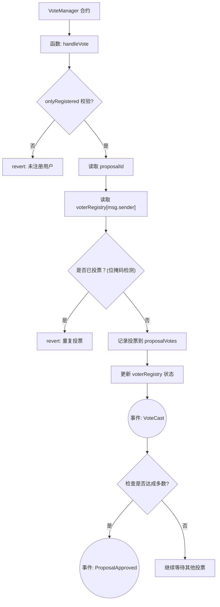

# Gas节省方式

Day: Day 15
ID: 15
原文: https://builder-hub.notion.site/Gas-Efficient-Voting-1d65720a23ef80dca7dcee996bbe510a?pvs=25
状态: 完成
译者: Shuyi
难度等级: 中级

我们已经走了很长一段路了。从学习如何构建代币合约到安全的保险库系统，您现在对智能合约架构和继承有了扎实的掌握。

但有一件事我们还没有深入探讨：**Gas 优化**。

在编写智能合约时，尤其是那些许多用户会交互的合约（比如投票系统），**节省 Gas** 至关重要——否则，即使是简单的操作也可能变得昂贵，让用户望而却步。

因此，在本课中，我们将探索如何编写**一个精简、高效且经济的投票合约**。

但在我们深入了解优化版本之前，让我们看看一个典型的、未经优化的版本可能是什么样子——以及为什么它可以改进。

## 产品需求书

### 合约流程图



### 合约与函数清单

| Contract | Type | Bases |
| --- | --- | --- |
| GasEfficientVoting | Implementation | - |
| └ Function Name | Visibility | Mutability |
| └ createProposal | External ❗️ | 🛑 |
| └ vote | External ❗️ | 🛑 |
| └ executeProposal | External ❗️ | 🛑 |
| └ hasVoted | External ❗️ | view |
| └ getProposal | External ❗️ | view |

## 🧱 第一部分：通用投票合约（未经优化）

在深入了解 **GasEfficientVoting** 合约之前，让我们想象一下，在一个更“标准”的 Solidity 合约中，这个投票系统会是什么样子——一个初学者可能在不怎么担心 Gas 的情况下编写的版本。

以下是一个简化后的版本：

```solidity

pragma solidity ^0.8.0;

contract BasicVoting {
    struct Proposal {
        string name;
        uint256 voteCount;
        uint256 startTime;
        uint256 endTime;
        bool executed;
    }

    Proposal[] public proposals;
    mapping(address => mapping(uint => bool)) public hasVoted;

    function createProposal(string memory name, uint duration) public {
        proposals.push(Proposal({
            name: name,
            voteCount: 0,
            startTime: block.timestamp,
            endTime: block.timestamp + duration,
            executed: false
        }));
    }

    function vote(uint proposalId) public {
        Proposal storage proposal = proposals[proposalId];
        require(block.timestamp >= proposal.startTime, "Too early");
        require(block.timestamp <= proposal.endTime, "Too late");
        require(!hasVoted[msg.sender][proposalId], "Already voted");

        hasVoted[msg.sender][proposalId] = true;
        proposal.voteCount++;
    }

    function executeProposal(uint proposalId) public {
        Proposal storage proposal = proposals[proposalId];
        require(block.timestamp > proposal.endTime, "Too early");
        require(!proposal.executed, "Already executed");

        proposal.executed = true;
        // Some execution logic here
    }
}
```

### 🚨 此版本中的问题：

- 对名称使用了 `string` 而非 `bytes32`（更昂贵）
- 对提案使用了动态数组（增长和访问需要更多 Gas）
- 使用**嵌套映射**（`mapping(address => mapping(uint => bool))`）来追踪个人投票——占用更多存储空间
- 每一次存储写入（如追踪投票）都会消耗 Gas

---

现在，让我们来看看 **GasEfficientVoting** 版本，看看每个部分是如何优化的：

# 🚀 我们关注的内容

我们之前已经编写了一个标准的投票合约。它使用字符串作为提案名称，到处使用 `uint256`，使用数组来存储数据，并使用多个映射来跟踪投票。

现在，我们正在重写同样的逻辑——**但这次是以 Gas 优化为核心**。

因此，该合约仍然：

- 允许用户创建提案
- 允许用户投票
- 追踪谁投了票
- 允许我们执行提案
- 触发事件

但它使用**更少的 Gas 完成所有这些操作**。

让我们一块一块地分解它：

```solidity
// SPDX-License-Identifier: MIT
pragma solidity ^0.8.0;

contract GasEfficientVoting {
    
    // Use uint8 for small numbers instead of uint256
    uint8 public proposalCount;
    
    // Compact struct using minimal space types
    struct Proposal {
        bytes32 name;          // Use bytes32 instead of string to save gas
        uint32 voteCount;      // Supports up to ~4.3 billion votes
        uint32 startTime;      // Unix timestamp (supports dates until year 2106)
        uint32 endTime;        // Unix timestamp
        bool executed;         // Execution status
    }
    
    // Using a mapping instead of an array for proposals is more gas efficient for access
    mapping(uint8 => Proposal) public proposals;
    
    // Single-slot packed user data
    // Each address occupies one storage slot in this mapping
    // We pack multiple voting flags into a single uint256 for gas efficiency
    // Each bit in the uint256 represents a vote for a specific proposal
    mapping(address => uint256) private voterRegistry;
    
    // Count total voters for each proposal (optional)
    mapping(uint8 => uint32) public proposalVoterCount;
    
    // Events
    event ProposalCreated(uint8 indexed proposalId, bytes32 name);
    event Voted(address indexed voter, uint8 indexed proposalId);
    event ProposalExecuted(uint8 indexed proposalId);
    

    
    // === Core Functions ===
    
    /**
     * @dev Create a new proposal
     * @param name The proposal name (pass as bytes32 for gas efficiency)
     * @param duration Voting duration in seconds
     */
    function createProposal(bytes32 name, uint32 duration) external {
        require(duration > 0, "Duration must be > 0");
        
        // Increment counter - cheaper than .push() on an array
        uint8 proposalId = proposalCount;
        proposalCount++;
        
        // Use a memory struct and then assign to storage
        Proposal memory newProposal = Proposal({
            name: name,
            voteCount: 0,
            startTime: uint32(block.timestamp),
            endTime: uint32(block.timestamp) + duration,
            executed: false
        });
        
        proposals[proposalId] = newProposal;
        
        emit ProposalCreated(proposalId, name);
    }
    
    /**
     * @dev Vote on a proposal
     * @param proposalId The proposal ID
     */
    function vote(uint8 proposalId) external {
        // Require valid proposal
        require(proposalId < proposalCount, "Invalid proposal");
        
        // Check proposal voting period
        uint32 currentTime = uint32(block.timestamp);
        require(currentTime >= proposals[proposalId].startTime, "Voting not started");
        require(currentTime <= proposals[proposalId].endTime, "Voting ended");
        
        // Check if already voted using bit manipulation (gas efficient)
        uint256 voterData = voterRegistry[msg.sender];
        uint256 mask = 1 << proposalId;
        require((voterData & mask) == 0, "Already voted");
        
        // Record vote using bitwise OR
        voterRegistry[msg.sender] = voterData | mask;
        
        // Update proposal vote count
        proposals[proposalId].voteCount++;
        proposalVoterCount[proposalId]++;
        
        emit Voted(msg.sender, proposalId);
    }
    
    /**
     * @dev Execute a proposal after voting ends
     * @param proposalId The proposal ID
     */
    function executeProposal(uint8 proposalId) external {
        require(proposalId < proposalCount, "Invalid proposal");
        require(block.timestamp > proposals[proposalId].endTime, "Voting not ended");
        require(!proposals[proposalId].executed, "Already executed");
        
        proposals[proposalId].executed = true;
        
        emit ProposalExecuted(proposalId);
        
        // In a real contract, execution logic would happen here
    }
    
    // === View Functions ===
    
    /**
     * @dev Check if an address has voted for a proposal
     * @param voter The voter address
     * @param proposalId The proposal ID
     * @return True if the address has voted
     */
    function hasVoted(address voter, uint8 proposalId) external view returns (bool) {
        return (voterRegistry[voter] & (1 << proposalId)) != 0;
    }
    
    /**
     * @dev Get detailed proposal information
     * Uses calldata for parameters and memory for return values
     */
    function getProposal(uint8 proposalId) external view returns (
        bytes32 name,
        uint32 voteCount,
        uint32 startTime,
        uint32 endTime,
        bool executed,
        bool active
    ) {
        require(proposalId < proposalCount, "Invalid proposal");
        
        Proposal storage proposal = proposals[proposalId];
        
        return (
            proposal.name,
            proposal.voteCount,
            proposal.startTime,
            proposal.endTime,
            proposal.executed,
            (block.timestamp >= proposal.startTime && block.timestamp <= proposal.endTime)
        );
    }
    
    /**
     * @dev Convert string to bytes32 (helper for frontend integration)
     * Note: This is a pure function that doesn't use state, so it's gas-efficient
     */

}
```

## 

在我们早期的投票合约中，我们走了传统的路线——使用人类可读的字符串作为提案名称，`uint256` 作为所有内容的默认类型，以及数组和映射来跟踪投票。它能工作，但不够精简。

这一次，我们正在构建**相同的投票系统**，但带着一种新的思维模式：**如何在不牺牲功能的前提下，节省每一个可能的 Gas 单位？**

那么哪些保持不变呢？

- ✅ 用户仍然可以创建提案
- ✅ 用户可以投票
- ✅ 我们追踪投票历史
- ✅ 提案可以被执行
- ✅ 事件被触发以保持透明度

但关键在于：我们通过做出更智能的存储和逻辑决策，使所有操作**更快、更便宜**。

让我们一块一块地解析这个合约 👇

---

## 🧱 合约定义

```solidity

// SPDX-License-Identifier: MIT
pragma solidity ^0.8.0;

contract GasEfficientVoting {
```

- 名字说明了一切——这个合约是我们投票系统的精简、Gas 友好的版本。

---

## 🔐 存储变量

```solidity

uint8 public proposalCount;
```

- **为什么是 `uint8`？** 我们可能不会有超过 255 个提案。使用 `uint256` 会提供远远超出所需的范围，浪费 31 个额外的存储字节。
- 这一微小改变减少了读取和写入此变量的 Gas 使用量。

---

## 🗃️ 提案结构体（Proposal Struct）

```solidity
 
struct Proposal {
    bytes32 name;
    uint32 voteCount;
    uint32 startTime;
    uint32 endTime;
    bool executed;
}
```

这是优化真正开始显现的地方：

| 字段 | 类型 | 为什么选择它 |
| --- | --- | --- |
| `name` | `bytes32` | 固定大小，比 `string` 便宜 |
| `voteCount` | `uint32` | 足以支持 42 亿次投票，节省 Gas |
| `startTime` | `uint32` | 同样，适合 UNIX 时间戳 |
| `endTime` | `uint32` | 我们不需要纳秒级的精度 |
| `executed` | `bool` | 一个字节用于表示真/假 |

> 结构体打包技巧：Solidity 将结构体数据存储在 32 字节的块中。通过仔细选择类型（uint32、bool、bytes32），减少了浪费的空间——更少的存储槽意味着更低的 Gas。
> 

---

## 🧭 提案映射（Proposal Mapping）

```solidity
mapping(uint8 => Proposal) public proposals;
```

- 我们使用映射而不是数组来存储提案。
- 映射为我们提供了对每个提案的**直接访问（O(1)）**，无需像数组那样进行迭代或边界检查。

> 另外，我们使用 uint8 作为键（key)——更小的键意味着更小的存储占用。
> 

---

## 💾 使用位图的投票者注册表

```solidity
 
mapping(address => uint256) private voterRegistry;
```

这是合约变得非常巧妙的地方。

我们没有使用：

```solidity
 
mapping(address => mapping(uint8 => bool)) voted;
```

而是将投票者的所有历史记录压缩到**一个 `uint256` 中**：

- 每一个**位（bit）**代表他们是否对该提案投了票。
- 位 0 = 对提案 0 投了票
- 位 1 = 对提案 1 投了票
- ……以此类推，最多支持 256 个提案。

这让我们能够：

- ✅ 每个地址只需一个存储槽即可存储所有投票
- ✅ 使用位运算 `AND` 检查某人是否投过票
- ✅ 使用位运算 `OR` 记录投票

> 比起为每个用户使用多个映射和多个存储槽要便宜得多。
> 

---

## 👥 提案投票者计数

```solidity
 
mapping(uint8 => uint32) public proposalVoterCount;
```

- 跟踪每个提案有多少投票者投了票。
- 可选但对分析或用户界面很有用。
- 同样，我们使用 `uint32`——范围绰绰有余，Gas 消耗更低。

---

## 🧾 事件

```solidity
 
event ProposalCreated(uint8 indexed proposalId, bytes32 name);
event Voted(address indexed voter, uint8 indexed proposalId);
event ProposalExecuted(uint8 indexed proposalId);
```

- `indexed` 允许您更有效地过滤日志（例如，显示某人投过票的所有提案）。
- 我们保持这些事件最小化——触发巨大的日志会消耗 Gas。

---

## 🧱 函数 1：`createProposal`

```solidity
  
function createProposal(bytes32 name, uint32 duration) external {
    require(duration > 0, "Duration must be > 0");

    uint8 proposalId = proposalCount;
    proposalCount++;

    Proposal memory newProposal = Proposal({
        name: name,
        voteCount: 0,
        startTime: uint32(block.timestamp),
        endTime: uint32(block.timestamp) + duration,
        executed: false
    });

    proposals[proposalId] = newProposal;

    emit ProposalCreated(proposalId, name);
}
```

### 🔍 这里发生了什么？

1. **输入验证**
    
    ```solidity
    
    require(duration > 0, "Duration must be > 0");
    ```
    
    我们确保投票持续时间不为零。否则，人们可能会创建永远无法投票的提案。
    
2. **为这个提案生成一个唯一的 ID**
    
    ```solidity
    
    uint8 proposalId = proposalCount;
    proposalCount++;
    ```
    
    我们使用一个简单的计数器（`uint8`）而不是推送到数组。数组需要动态调整大小和额外的 Gas 进行边界管理——这种方式更精简。
    
3. **在内存(memory)中创建提案**
    
    ```solidity
    
    Proposal memory newProposal = Proposal({...});
    ```
    
    为什么是内存？因为在链下构建数据结构然后只写入存储一次会更便宜。
    
4. **赋值给存储(storage)**
    
    ```solidity
    
    proposals[proposalId] = newProposal;
    ```
    
    现在我们已经组装好提案，我们使用它的 ID 将其放入 `proposals` 映射中。
    
5. **触发事件**
    
    ```solidity
    
    emit ProposalCreated(proposalId, name);
    ```
    
    用于前端用户界面或日志，以跟踪提案何时被创建。
    

---

## 🗳️ 函数 2：`vote`

```solidity
  
function vote(uint8 proposalId) external {
    require(proposalId < proposalCount, "Invalid proposal");

    uint32 currentTime = uint32(block.timestamp);
    require(currentTime >= proposals[proposalId].startTime, "Voting not started");
    require(currentTime <= proposals[proposalId].endTime, "Voting ended");

    uint256 voterData = voterRegistry[msg.sender];
    uint256 mask = 1 << proposalId;
    require((voterData & mask) == 0, "Already voted");

    voterRegistry[msg.sender] = voterData | mask;

    proposals[proposalId].voteCount++;
    proposalVoterCount[proposalId]++;

    emit Voted(msg.sender, proposalId);
}
```

### 🔍 这里发生了什么？

1. **检查提案是否存在**
    
    ```solidity
    
    require(proposalId < proposalCount, "Invalid proposal");
    ```
    
    ID 必须在有效范围内（0 到 proposalCount - 1）。
    
2. **检查是否允许投票（时间上）**
    
    ```solidity
    
    require(currentTime >= proposals[proposalId].startTime, "Voting not started");
    require(currentTime <= proposals[proposalId].endTime, "Voting ended");
    ```
    
    我们确保投票已经开始并且尚未结束。
    
3. **位掩码(Bitmask)检查是否已投票**
    
    ```solidity
    
    uint256 mask = 1 << proposalId;
    require((voterRegistry[msg.sender] & mask) == 0, "Already voted");
    ```
    
    - `1 << proposalId` 创建一个二进制掩码，例如 `000100`（如果 `proposalId` 是 2）。
    - 位运算 AND 检查该位是否已在用户的注册表中设置。
    - 如果已设置，则用户已投过票。
4. **使用位运算(bitwise )OR 记录投票**
    
    ```solidity
    
    voterRegistry[msg.sender] = voterData | mask;
    ```
    
    - 位运算OR 将位置 `proposalId` 处的位设置为 `1`，标记投票。
5. **增加投票计数**
    
    ```solidity
    
    proposals[proposalId].voteCount++;
    proposalVoterCount[proposalId]++;
    ```
    
6. **触发投票事件**
    
    ```solidity
    
    emit Voted(msg.sender, proposalId);
    ```
    

---

## ✅ 函数 3：`executeProposal`

```solidity
  
function executeProposal(uint8 proposalId) external {
    require(proposalId < proposalCount, "Invalid proposal");
    require(block.timestamp > proposals[proposalId].endTime, "Voting not ended");
    require(!proposals[proposalId].executed, "Already executed");

    proposals[proposalId].executed = true;

    emit ProposalExecuted(proposalId);
}
```

### 🔍 这个函数做了什么：

- 任何人都可以**在**投票期结束后执行提案。
- 它确保：
    - 提案存在
    - 投票窗口已结束
    - 提案尚未被执行

然后我们标记提案为已执行并触发一个事件。

💡 **在实际应用中**，您可能会在这里添加提案的执行逻辑——也许是触发付款或 DAO 配置更改。

---

## 👁️ 函数 4：`hasVoted`

```solidity
  
function hasVoted(address voter, uint8 proposalId) external view returns (bool) {
    return (voterRegistry[voter] & (1 << proposalId)) != 0;
}
```

### 🔍 这个函数做了什么：

- 创建一个像 `vote()` 函数中那样的位掩码。
- 检查该位是否在投票者的注册表中设置。
- 如果投票者已经对该提案投过票，则返回 `true`。

> ⚡ 节省 Gas 的读取：只需一次存储访问(storage access)和一次位运算(bitwise operation)。
> 

---

## 📊 函数 5：`getProposal`

```solidity
  
function getProposal(uint8 proposalId) external view returns (
    bytes32 name,
    uint32 voteCount,
    uint32 startTime,
    uint32 endTime,
    bool executed,
    bool active
) {
    require(proposalId < proposalCount, "Invalid proposal");

    Proposal storage proposal = proposals[proposalId];

    return (
        proposal.name,
        proposal.voteCount,
        proposal.startTime,
        proposal.endTime,
        proposal.executed,
        (block.timestamp >= proposal.startTime && block.timestamp <= proposal.endTime)
    );
}
```

### 🔍 分解：

- 检查提案是否存在。
- 返回其所有字段，**外加**一个额外的 `active` 标志，指示投票当前是否正在进行。
- 这对于 UI/UX 很有用——让前端知道是否应该显示“投票”按钮。

> ✅ 高效：所有变量都很紧凑，并且该函数是 view 类型，这意味着通过 JSON-RPC / 前端调用它是不需要 Gas 费的（链下调用）。
> 

## 🧵 总结

我们从一个简单、初学者风格的投票合约开始——它简单、可读，但对 Gas 不太友好。然后我们从头开始重建它，心中只有一个目标：**效率**。

通过切换到固定大小的类型、使用映射而非数组，并将投票历史打包到位图（bitmaps）中，我们**在不损失任何核心功能的情况下**大幅减少了合约的 Gas 占用。

本课不仅仅是关于编写一个更好的投票合约。它是关于学习如何**像一个编写真实、可扩展应用程序的 Solidity 开发者一样思考**——这些应用程序要考虑到链上的成本、性能和用户体验。

因为在智能合约的世界里，Gas 不仅仅是一个技术细节——它是可用与过于昂贵而无人问津之间的区别。

所以这是您的下一步：

✅ 重新审视您过去的合约

✅ 寻找可以优化的地方

✅ 问自己——*我真的需要在这里使用 string 吗？* *我需要一个动态数组吗？*

✅ 开始以位、字节和存储槽来思考

因为*编写 Solidity 是一回事。编写节省 Gas 的 Solidity 呢？*

那就是您升级的时候了。