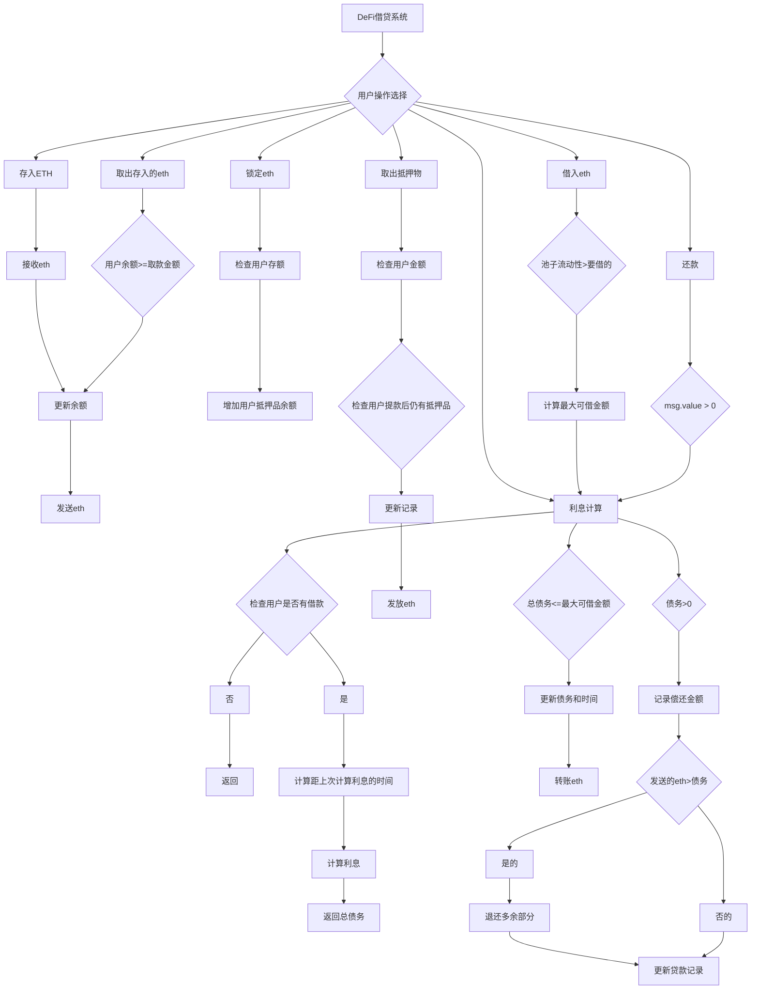

# DeFi 借贷合约

Day: Day 23
ID: 23
原文: https://www.notion.so/LendingPool-Contract-1de5720a23ef80b69930c481a98072df?source=copy_link
状态: 完成
译者: sun sun
难度等级: 高级

# 学习内容

欢迎回到 30 天 Solidity —— 每天解锁智能合约的一项新超能力。

到目前为止，你已经构建了可以发送和接收 ETH 的合约，用访问控制保护它们，甚至涉足了 NFT。但今天呢？

**今天，我们构建一个银行。**

不是那种需要排长队、填写繁琐文件和隐藏费用的类型。

也不是那种下午五点就关门的那种。

我们谈论的是 DeFi——即去中心化金融的缩写。

这不仅仅是一个流行词汇。DeFi 是区块链领域最具变革性的运动之一。它关乎重建整个金融体系——借贷、储蓄、交易——但这一切都不需要中心化机构的参与。

想象一下：

没有银行冻结你的账户。

没有贷款员评判你的信用。

仅代码——开放、透明、不可阻挡的代码——任何人都可以与之交互。

这就是 DeFi 如此强大的原因。你将传统金融的规则转化为智能合约逻辑，然后让区块链来完成剩下的工作。

而这里的神奇之处在于：一旦部署，合约就不关心你是谁。

如果数字对得上——你可以借贷，你可以赚取利息。

我们今天要构建什么？

我们正在创建一个简单而强大的借贷池。

类似于 Aave 或 Compound 等平台提供的迷你版本——但更容易理解。

 你将学到：

 接受用户存款 ETH 💰

让他们锁定抵押品以解锁借款 🛡️

随时间收取利息 📈

允许用户偿还贷款并提取资金 ✅

这是你第一次亲身体验 DeFi 机制——相信我，它将永远改变你对智能合约的看法。

让我们开始吧。

### **🔍 快速了解我们正在构建的内容**

SimpleLending 合约是你链上第一个 DeFi 银行。

它允许用户：

- 将 ETH 存入池中
- 锁定抵押品以获取贷款
- 基于该抵押品借入 ETH
- 用利息偿还贷款
- 完成后再提取资金

我们保持其简洁——没有 ERC20，没有外部价格信息——只是纯粹的基于 ETH 的借贷逻辑，帮助你理解 DeFi 的核心运作方式。现在让我们看看完整代码 👇

**🧾 完整合约：SimpleLending.sol**

```solidity
// SPDX-License-Identifier: MIT
pragma solidity ^0.8.0;

/**
 * @title SimpleLending
 * @dev A basic DeFi lending and borrowing platform
 */
contract SimpleLending {
    // Token balances for each user
    mapping(address => uint256) public depositBalances;

    // Borrowed amounts for each user
    mapping(address => uint256) public borrowBalances;

    // Collateral provided by each user
    mapping(address => uint256) public collateralBalances;

    // Interest rate in basis points (1/100 of a percent)
    // 500 basis points = 5% interest
    uint256 public interestRateBasisPoints = 500;

    // Collateral factor in basis points (e.g., 7500 = 75%)
    // Determines how much you can borrow against your collateral
    uint256 public collateralFactorBasisPoints = 7500;

    // Timestamp of last interest accrual
    mapping(address => uint256) public lastInterestAccrualTimestamp;

    // Events
    event Deposit(address indexed user, uint256 amount);
    event Withdraw(address indexed user, uint256 amount);
    event Borrow(address indexed user, uint256 amount);
    event Repay(address indexed user, uint256 amount);
    event CollateralDeposited(address indexed user, uint256 amount);
    event CollateralWithdrawn(address indexed user, uint256 amount);

    function deposit() external payable {
        require(msg.value > 0, "Must deposit a positive amount");
        depositBalances[msg.sender] += msg.value;
        emit Deposit(msg.sender, msg.value);
    }

    function withdraw(uint256 amount) external {
        require(amount > 0, "Must withdraw a positive amount");
        require(depositBalances[msg.sender] >= amount, "Insufficient balance");
        depositBalances[msg.sender] -= amount;
        payable(msg.sender).transfer(amount);
        emit Withdraw(msg.sender, amount);
    }

    function depositCollateral() external payable {
        require(msg.value > 0, "Must deposit a positive amount as collateral");
        collateralBalances[msg.sender] += msg.value;
        emit CollateralDeposited(msg.sender, msg.value);
    }

    function withdrawCollateral(uint256 amount) external {
        require(amount > 0, "Must withdraw a positive amount");
        require(collateralBalances[msg.sender] >= amount, "Insufficient collateral");

        uint256 borrowedAmount = calculateInterestAccrued(msg.sender);
        uint256 requiredCollateral = (borrowedAmount * 10000) / collateralFactorBasisPoints;

        require(
            collateralBalances[msg.sender] - amount >= requiredCollateral,
            "Withdrawal would break collateral ratio"
        );

        collateralBalances[msg.sender] -= amount;
        payable(msg.sender).transfer(amount);
        emit CollateralWithdrawn(msg.sender, amount);
    }

    function borrow(uint256 amount) external {
        require(amount > 0, "Must borrow a positive amount");
        require(address(this).balance >= amount, "Not enough liquidity in the pool");

        uint256 maxBorrowAmount = (collateralBalances[msg.sender] * collateralFactorBasisPoints) / 10000;
        uint256 currentDebt = calculateInterestAccrued(msg.sender);

        require(currentDebt + amount <= maxBorrowAmount, "Exceeds allowed borrow amount");

        borrowBalances[msg.sender] = currentDebt + amount;
        lastInterestAccrualTimestamp[msg.sender] = block.timestamp;

        payable(msg.sender).transfer(amount);
        emit Borrow(msg.sender, amount);
    }

    function repay() external payable {
        require(msg.value > 0, "Must repay a positive amount");

        uint256 currentDebt = calculateInterestAccrued(msg.sender);
        require(currentDebt > 0, "No debt to repay");

        uint256 amountToRepay = msg.value;
        if (amountToRepay > currentDebt) {
            amountToRepay = currentDebt;
            payable(msg.sender).transfer(msg.value - currentDebt);
        }

        borrowBalances[msg.sender] = currentDebt - amountToRepay;
        lastInterestAccrualTimestamp[msg.sender] = block.timestamp;

        emit Repay(msg.sender, amountToRepay);
    }

    function calculateInterestAccrued(address user) public view returns (uint256) {
        if (borrowBalances[user] == 0) {
            return 0;
        }

        uint256 timeElapsed = block.timestamp - lastInterestAccrualTimestamp[user];
        uint256 interest = (borrowBalances[user] * interestRateBasisPoints * timeElapsed) / (10000 * 365 days);

        return borrowBalances[user] + interest;
    }

    function getMaxBorrowAmount(address user) external view returns (uint256) {
        return (collateralBalances[user] * collateralFactorBasisPoints) / 10000;
    }

    function getTotalLiquidity() external view returns (uint256) {
        return address(this).balance;
    }
}

```

### 

# 1.产品需求书

### a.用户流程



### b.数据库

| Contract | Type | Bases |
| --- | --- | --- |
| SimpleLending | Implementation |  |

| └ Function Name | Visibility | Mutability |
| --- | --- | --- |
| deposit | external | payable |
| withdraw | external | 🛑 |
| depositCollateral | external | payable |
| withdrawCollateral | external | 🛑 |
| borrow | external | 🛑 |
| repay | external | payable |
| calculateInterestAccrued | public | view |
| getMaxBorrowAmount | external | view |
| getTotalLiquidity | external | view |

# 2.细节解说

### **🧾 合同声明**

```solidity
contract SimpleLending {

```

我们命名我们的合约 SimpleLending，因为，嗯……它是一个简单的借贷系统。这是我们 DeFi 银行的基础。

### **🧠 合约的大脑——映射**

在任何银行系统——无论是你所在地的分行还是 DeFi 智能合约——都需要一种方法来记住谁拥有什么。

这正是我们在做的工作。

这一部分是我们借贷池的大脑。这些映射是我们追踪存款、债务、抵押品和利息的方式——就像一个数字账本，在链上保持一切井然有序。

让我们看看这个合约中的四个关键映射：

```solidity
mapping(address => uint256) public depositBalances;
mapping(address => uint256) public borrowBalances;
mapping(address => uint256) public collateralBalances;
mapping(address => uint256) public lastInterestAccrualTimestamp;

```

### **depositBalances –您的数字保险库**

这个映射记录用户存入借贷池的 ETH 数量。

把它看作合约内部的一个个人保险库。当用户调用 deposit()函数时，他们的 ETH 会被存储在合约中，这个映射会更新以反映他们添加了多少。

> 📦 它就像你的活期账户余额一样——除非与贷款挂钩，否则始终可以访问。
> 

### **borrowBalances – 你的贷款账簿**

这个映射显示了用户从池中借了多少 ETH。

当你使用 borrow()函数借款时，ETH 会离开合约并进入你的钱包。同时，这个映射会更新以精确跟踪你欠多少债务。

我们也使用这个值（以及利息）来确定你是否可以提取你的抵押品或借更多。

> 🧾 这是你的贷款追踪器——那个显示“这是你欠款”的数字。
> 

### **collateralBalances – 安全网**

在去中心化金融（DeFi）中，借贷不是基于信任，而是基于数学。

要借款，你需要抵押资产。这个映射记录了每个用户提供的作为抵押的 ETH 数量。

当你调用 depositCollateral()时，ETH 会留在合约中，但你的 collateralBalances 条目会增加。

当你尝试借款或提取抵押资产时，合约会使用这个映射来检查你的头寸是否仍然安全。

> 🔐 想象一下这就像你的押金——它存在是为了在你不履行义务时保护系统。
> 

### **lastInterestAccrualTimestamp – 计时员**

我们的系统中的利息不会每秒自动累积——那会非常耗费 gas。

相反，我们记录每个用户上次计算利息的时间。然后，每当用户与系统交互（借款、还款等）时，我们会检查经过的时间，并计算从那时起累积了多少利息。

这使我们能够在不每块链支付利息的情况下模拟连续的利息。

> 🧮 这就像一个时间戳收据：“上次我们检查时，这位用户欠款 X。现在让我们根据经过的时间来更新。”
> 

### **💰 借贷逻辑——设定金融规则**

每个借贷平台——无论是 DeFi 协议还是当地银行——都遵循几条关键的金融规则。

在我们的智能合约中，这些规则被嵌入到两个简单的变量中：

```solidity
uint256 public interestRateBasisPoints = 500;         // 5% annual interest rate
uint256 public collateralFactorBasisPoints = 7500;    // 75% loan-to-value (LTV)

```

让我们逐一解析这些变量的含义及其重要性。

### **🧾 interestRateBasisPoints – 协议如何赚取收益**

这是借款人每年需支付的贷款利率。

但我们用 500 表示 5%，而不是写 5，因为我们使用的是基点。

> 🔢 基点在金融中用于精确表达百分比，尤其是在处理分数利率时。1 个基点是 0.01%，所以 500 个基点是 5%
> 

这意味着：

如果一个用户借入 1 ETH，一年后（假设他们没有提前还款）将需要偿还 1.05 ETH。

通过使用基点，我们可以避免浮点数运算（Solidity 不支持浮点数运算），并保持极高的精确度。

### **🛡️ collateralFactorBasisPoints – 协议如何保持安全**

该变量决定了根据抵押品价值可以借多少。

在我们这里：

7500 个基点 = 75%

这意味着用户只能借入他们作为抵押锁定 ETH 的 75%

假设你将 2 ETH 作为抵押：

2 ETH 的 75% = 1.5 ETH

这就是你被允许借入的最大金额

为什么不是 100%？

因为存在价格波动。ETH 明天可能会贬值。所以我们总是希望借款人留下一层安全垫——这就是抵押率强制执行的机制。

> 🧠 现实中的比喻：这就像银行说“我们可以用你的车作为抵押贷款——但只能按其当前价值的 75%来贷。”
> 

这有助于协议避免亏损，并确保借款人始终有足够的抵押物来支持他们的贷款。

### **📣 事件 – 活动广播**

以下是我们在 DeFi 银行中使用的事件：

```solidity
event Deposit(address indexed user, uint256 amount);
event Withdraw(address indexed user, uint256 amount);
event Borrow(address indexed user, uint256 amount);
event Repay(address indexed user, uint256 amount);
event CollateralDeposited(address indexed user, uint256 amount);
event CollateralWithdrawn(address indexed user, uint256 amount);

```

让我们来分解它们：

### **💸 Deposit**

当用户向借贷池添加 ETH 时发出。

> 这就像在说：“用户 X 刚刚存入了 Y ETH——更新他们的余额并在仪表板上显示！”
> 

### **🏧 Withdraw**

当用户从他们的存款余额中取出 ETH 时触发。

> 用于在 UI 中反映提款情况，并记录合约的 ETH 余额已变更。
> 

### **🧾 Borrow**

当用户成功借款时触发。

> 您的应用可以显示：“恭喜！您刚刚从池中借了 0.75 ETH。”
> 

### **💳 Repay**

当用户发送 ETH 以偿还贷款时触发。

> 对更新用户的贷款余额和计算剩余债务非常重要。
> 

### **🛡️ CollateralDeposited**

当用户将 ETH 锁定作为抵押品时发出。

> 前端应用可以使用此功能显示：“您现在有资格借入最多 X ETH。”
> 

### **🔓 CollateralWithdrawn**

当用户安全提取其抵押品时发生（在还款后或保持健康的贷款价值比之后）。

> 这是一个有用的触发器，用于可视化剩余的抵押品数量。
> 

### **🔧 Functions ——驱动 DeFi 引擎**

我们至今所构建的一切——变量、映射、参数、事件——它们都只是基础。

真正的魔法发生在用户与合约交互时。

这些功能是用户在您的 DeFi 银行中执行操作的方式：存款 ETH、借款、偿还贷款和管理抵押品。这就是合约变得互动的地方。

让我们从该流程中的第一个功能——存款开始。

## **🏦 deposit() – 向池中添加 ETH**

```solidity
function deposit() external payable {
    require(msg.value > 0, "Must deposit a positive amount");

    depositBalances[msg.sender] += msg.value;

    emit Deposit(msg.sender, msg.value);
}

```

这个函数是用户向借贷池中添加 ETH 的方式——简单至极。

这是逐步操作方法：

### **1. msg.value– 接收 ETH**

每当有人向智能合约发送 ETH 时，金额会存储在一个称为 msg.value 的特殊变量中。

所以如果我调用 deposit()并附加 1 ETH，msg.value 将是 1 以太币。

我们首先检查：

```solidity
require(msg.value > 0, "Must deposit a positive amount");

```

这一行防止人们在不发送任何 ETH 的情况下意外调用该函数。没有免费搭便车！

### **2. 更新余额**

接下来，我们更新跟踪每个用户存款的映射：

```solidity
depositBalances[msg.sender] += msg.value;

```

这里，msg.sender 是调用函数的人——即存款人。

我们的意思是：“将他们之前拥有的金额，加上新的金额。”

> 🧠 简单来说：“更新这个用户的银行余额。”
> 

### **3. 发送事件**

最后，我们让世界知道刚刚发生了什么：

```solidity
emit Deposit(msg.sender, msg.value);

```

这会触发存款事件，前端应用或索引器可以监听该事件。这就像合约在喊：

> “嘿！Alice 刚刚存入了 1 ETH！”
> 

这就是如何确保 UI 更新并在 Etherscan 等工具中记录交易的方式。

### **💸 withdraw(uint256 amount) – 取回你的资金**

```solidity
function withdraw(uint256 amount) external {
    require(amount > 0, "Must withdraw a positive amount");
    require(depositBalances[msg.sender] >= amount, "Insufficient balance");

    depositBalances[msg.sender] -= amount;
    payable(msg.sender).transfer(amount);

    emit Withdraw(msg.sender, amount);
}

```

既然用户可以存入 ETH，我们需要给他们一个方式来取回他们的 ETH——无论何时他们需要。

这正是 withdraw()函数的作用。

让我们像一位走进银行并说...

“嘿，我想取出一些我的资金。”

### **1. ✅ 验证提款请求**

首先，合约进行两项快速合理性检查：

```solidity
require(amount > 0, "Must withdraw a positive amount");

```

这确保用户不会不小心尝试提取 0 ETH。没有奇怪的边缘情况，没有困惑——只是干净的输入。

```solidity
require(depositBalances[msg.sender] >= amount, "Insufficient balance");

```

接下来，我们检查用户是否有足够的 ETH 在其存款余额中来进行此次提款。

如果不是，交易将被拒绝。

DeFi 不允许透支 😉

### **2. 🧮 更新余额**

如果两个检查都通过，用户的存款余额将得到更新：

```solidity
depositBalances[msg.sender] -= amount;

```

这从他们的账户中扣除提取的金额。

就像银行账本反映已经发生了提款一样。

### **3. 🪙 发送 ETH**

更新余额后，合约将 ETH 发送回用户：

```solidity
payable(msg.sender).transfer(amount);

```

这一行实际上将真实的 ETH 转回用户的钱包。

> 💡 Solidity 要求对可支付地址调用 .transfer() —— 这就是为什么我们将 msg.sender 强制转换为 payable(msg.sender)。
> 

### **4. 📣 发布事件**

最后，我们让大家知道刚才发生了什么：

```solidity
emit Withdraw(msg.sender, amount);

```

这会触发提款事件——一个你的前端可以监听以显示类似确认消息的信号：

> “✅ 成功提款 0.5 ETH！”
> 

### **🧮 calculateInterestAccrued(address user) – 借款的核心**

```solidity
function calculateInterestAccrued(address user) public view returns (uint256) {
    if (borrowBalances[user] == 0) {
        return 0;
    }

    uint256 timeElapsed = block.timestamp - lastInterestAccrualTimestamp[user];
    uint256 interest = (borrowBalances[user] * interestRateBasisPoints * timeElapsed) / (10000 * 365 days);

    return borrowBalances[user] + interest;
}

```

这个函数是我们借贷系统的核心引擎——在安静地驱动着借款最重要的部分：利息计算。

猜猜看？

你将在几乎所有涉及贷款的主要功能中看到这个函数出现：

- ✅ 当你借入
- 💳 当你偿还
- 🔓 当你提取抵押品
- 📊 即使在查询你欠多少时

让我们了解它具体在做什么——以及为什么这如此重要。

### **📊 我们为什么需要这个？**

在现实生活中，贷款利息会随着时间的推移而累积。

但智能合约无法每秒更新变量——那在 gas 费用上会非常昂贵。

所以，我们不是持续更新每个用户的贷款余额...

我们使用这个函数按需计算利息——只在需要时计算。

将其视为一个即时利息计算器。

### **✅ 工作原理**

**1. 检查用户是否借过任何款项**

```solidity
if (borrowBalances[user] == 0) {
    return 0;
}

```

没有贷款？没有利息。简单。

**2. 计算已过去多少时间**

```solidity
uint256 timeElapsed = block.timestamp - lastInterestAccrualTimestamp[user];

```

我们计算出自上次为该用户计算利息以来已过去多少时间。

> block.timestamp 给我们当前的时间。
> 

> lastInterestAccrualTimestamp 告诉我们上次更新他们债务的时间。
> 

**3. 应用利息公式**

```solidity
uint256 interest = (borrowBalances[user] * interestRateBasisPoints * timeElapsed) / (10000 * 365 days);

```

让我们来分解这个公式：

**borrowBalances[user]** → 用户的当前贷款本金

**interestRateBasisPoints** → 我们的年利率（例如，500 等于 5%）

**timeElapsed** → 他们欠债的时间长度

**10000 * 365 days** → 用于将基准点转换为年度分数

这根据贷款的活跃时间，给出了我们到目前为止产生的利息。

### **4. 返回总债务（本金+利息）**

```solidity
return borrowBalances[user] + interest;

```

好了。就这样，你就能获得最新的债务信息——无需手动计算。

> 这个总额将用于我们所有其他功能：验证借款资格、检查还款金额以及验证抵押品提取。
> 

## **🛡️ depositCollateral() – 锁定 ETH 以便日后借款**

```solidity
function depositCollateral() external payable {
    require(msg.value > 0, "Must deposit a positive amount as collateral");

    collateralBalances[msg.sender] += msg.value;

    emit CollateralDeposited(msg.sender, msg.value);
}

```

到目前为止，你已经看到了如何将 ETH 存入池中作为出借人——如果你想赚取被动收入，这很好。

但如果你想从池中借款呢？

嗯，就像现实生活中一样——如果你想贷款，需要提供抵押品。

这个函数就是用来完成这个操作的。

我们来分解一下 👇

### **🔒 抵押品与存款——有什么区别？**

在深入代码之前，这里有一个关键的区别：

| Deposits  存款 | 抵押品 |
| --- | --- |
| 你借给池子的钱 💸 | 你用来借钱的锁钱 💳 |
| 可以自由提取（除非用于借贷） | 仅当您的贷款安全时才可归还 |
| 您可从中赚取利息（如果系统支持该功能） | 它支持您的借贷并保障协议安全 |

所以是的——它们都是 ETH，但它们扮演着完全不同的角色。

这就是为什么我们有一个单独的函数用于抵押品存款。

### **✅ 步骤详解**

### **1. 检查真实存款**

```solidity
require(msg.value > 0, "Must deposit a positive amount as collateral");

```

我们确保用户正在发送一些 ETH——不允许空交易。

**2. 增加用户的抵押品余额**

```solidity
collateralBalances[msg.sender] += msg.value;

```

一旦收到 ETH，我们更新用户的抵押记录。这告诉合约：

“好了，这位用户现在已经锁定了 X ETH——我们可以让他们在某个限额内安全地借款。”

这是系统中解锁借贷能力的关键。

**3. 发出事件**

```solidity
emit CollateralDeposited(msg.sender, msg.value);

```

一如既往，我们发出事件，以便前端和工具能够对存款做出反应——更新仪表板、发送通知，并将操作记录在历史中。

## **🔓 withdrawCollateral(uint256 amount) – 拿回你锁定的 ETH（如果你是安全的）**

```solidity
function withdrawCollateral(uint256 amount) external {
    require(amount > 0, "Must withdraw a positive amount");
    require(collateralBalances[msg.sender] >= amount, "Insufficient collateral");

    uint256 borrowedAmount = calculateInterestAccrued(msg.sender);
    uint256 requiredCollateral = (borrowedAmount * 10000) / collateralFactorBasisPoints;

    require(
        collateralBalances[msg.sender] - amount >= requiredCollateral,
        "Withdrawal would break collateral ratio"
    );

    collateralBalances[msg.sender] -= amount;
    payable(msg.sender).transfer(amount);

    emit CollateralWithdrawn(msg.sender, amount);
}

```

所以你质押了一些 ETH 作为抵押。这让你获得了从池中借入资金的权利。

现在你想拿回一些 ETH。

这看起来很公平，对吧？

嗯……只有当你仍然安全时才行。

这个功能允许用户提取他们的抵押品——但前提是这样做不会让他们的贷款处于风险之中。

让我们一步步来，就像你正在与一个非常谨慎但非常公平的智能合约银行家谈判一样。

### **✅ 第一步：基本检查**

```solidity
require(amount > 0, "Must withdraw a positive amount");
require(collateralBalances[msg.sender] >= amount, "Insufficient collateral");

```

这两行代码很直接：

确保用户正在尝试提取一个真实的金额。

确保他们确实有足够的抵押品来尝试这一点。

如果任何一项检查失败——我们立即停止。

### **🧠 第 2 步：风险评估**

现在进入重要环节——确保用户在提款后仍然有抵押品。

### **首先，我们检查他们欠多少债务：**

```solidity
uint256 borrowedAmount = calculateInterestAccrued(msg.sender);

```

这包括他们随时间累积的任何利息。

### **然后我们计算他们需要多少抵押品才能保持安全：**

```solidity
uint256 requiredCollateral = (borrowedAmount * 10000) / collateralFactorBasisPoints;

```

这是基于我们之前设置的贷款价值比（LTV）—— 默认为 75%。

假设你欠 1 ETH，LTV 为 75%：

你需要至少 1 / 0.75 = 1.33 ETH 作为抵押品锁定。

### **❗ 第 3 步：安全检查**

我们现在模拟未来——如果你抵押了这笔资产会发生什么？

```solidity
require(
    collateralBalances[msg.sender] - amount >= requiredCollateral,
    "Withdrawal would break collateral ratio"
);

```

如果移除该 ETH 会导致你低于安全限制，我们将回滚交易。

> ⚠️ 这就像合约发出的警告：“等一下。如果你这样做，你的贷款将不再得到保障。我不能允许那样。”
> 

### **🪙 第 4 步：放手（如果你安全）**

如果你通过所有检查，你就可以继续。

```solidity
collateralBalances[msg.sender] -= amount;
payable(msg.sender).transfer(amount);
emit CollateralWithdrawn(msg.sender, amount);

```

我们更新你的记录，将 ETH 发回你的钱包，并发出一个事件通知前端。

## **🧾 borrow(uint256 amount) – 解锁 DeFi 的超级能力：借入 ETH**

```solidity

function borrow(uint256 amount) external {
    require(amount > 0, "Must borrow a positive amount");
    require(address(this).balance >= amount, "Not enough liquidity in the pool");

    uint256 maxBorrowAmount = (collateralBalances[msg.sender] * collateralFactorBasisPoints) / 10000;
    uint256 currentDebt = calculateInterestAccrued(msg.sender);

    require(currentDebt + amount <= maxBorrowAmount, "Exceeds allowed borrow amount");

    borrowBalances[msg.sender] = currentDebt + amount;
    lastInterestAccrualTimestamp[msg.sender] = block.timestamp;

    payable(msg.sender).transfer(amount);
    emit Borrow(msg.sender, amount);
}

```

好吧——现在我们进入合同真正开始像银行运作的部分。

这个功能允许用户从借贷池中借入 ETH，基于他们锁定的抵押品数量。

但是——就像现实生活中一样——你不能走进银行说“给我免费的钱。”

有规则。让我们来逐一了解它们。

### **🧠 步骤详解**

**1. 申请真实贷款**

```solidity
require(amount > 0, "Must borrow a positive amount");

```

我们确保用户不是试图借入零 ETH 或负数金额。每次借款操作都必须有一个实际数字作为支撑。

**2. 确保池中有流动性**

```solidity
require(address(this).balance >= amount, "Not enough liquidity in the pool");

```

该合约检查自身余额，以确认是否真的能够借出那么多 ETH。

> 不能借贷自己没有的资产。
> 

### **3. 检查借款人资格**

我们根据用户提供的抵押品数量，计算其可借款金额：

```solidity
uint256 maxBorrowAmount = (collateralBalances[msg.sender] * collateralFactorBasisPoints) / 10000;

```

所以如果你抵押了 2 ETH 作为保证金，并且保证金系数是 75%：

- maxBorrowAmount = 2 * 0.75 = 1.5 ETH

但这还没完——我们还需要考虑他们已经欠下的任何债务+利息：

```solidity
uint256 currentDebt = calculateInterestAccrued(msg.sender);

```

然后我们检查：

```solidity
require(currentDebt + amount <= maxBorrowAmount, "Exceeds allowed borrow amount");

```

如果这次检查失败，借贷将被阻止。用户的抵押品无法安全地支持请求的金额。

> ✅ 只允许安全、超额抵押的贷款。
> 

**4. 更新债务和时间**

如果用户符合资格，我们将继续并记录新的贷款

```solidity
borrowBalances[msg.sender] = currentDebt + amount;
lastInterestAccrualTimestamp[msg.sender] = block.timestamp;

```

我们表示：

- “该用户现在欠 X ETH（包括过去的债务）。”
- “而这将是我们未来计算利息的时间。”

### **5. 转移 ETH**

```solidity
payable(msg.sender).transfer(amount);

```

合约将真实的 ETH 发送到用户的钱包中。

现在他们可以随心所欲地使用这些 ETH——交易它、交换它、质押它——它完全属于他们。

**6. 发布借出事件**

```solidity
emit Borrow(msg.sender, amount);

```

这向外界（你的前端、区块浏览器、分析仪表板）表明这位用户刚刚借了款。

## **💳 repay() – 还款，重获自由**

```solidity
function repay() external payable {
    require(msg.value > 0, "Must repay a positive amount");

    uint256 currentDebt = calculateInterestAccrued(msg.sender);
    require(currentDebt > 0, "No debt to repay");

    uint256 amountToRepay = msg.value;
    if (amountToRepay > currentDebt) {
        amountToRepay = currentDebt;
        payable(msg.sender).transfer(msg.value - currentDebt); // Refund the extra
    }

    borrowBalances[msg.sender] = currentDebt - amountToRepay;
    lastInterestAccrualTimestamp[msg.sender] = block.timestamp;

    emit Repay(msg.sender, amountToRepay);
}

```

你借了 ETH。时间流逝。利息累积。

现在该还款了——这正是这个函数的作用。

让我们来解析当用户向 repay() 发送 ETH 时会发生什么。

### **✅ 步骤详解**

**1. 确认你确实在发送 ETH**

```solidity
require(msg.value > 0, "Must repay a positive amount");

```

就像 deposit() 函数一样，我们不想用户误触这个操作。你需要实际在函数调用时发送一些 ETH。

**2. 确认你欠多少**

```solidity
uint256 currentDebt = calculateInterestAccrued(msg.sender);
require(currentDebt > 0, "No debt to repay");

```

这里我们询问：

“这位用户欠多少——包括累积的任何利息？”

如果他们不欠任何东西，我们就到此为止。

**3. 接受你发送的内容**

```solidity
uint256 amountToRepay = msg.value;

```

现在我们记录用户尝试还款的金额。

**4. 处理超额还款（退款多余部分）**

```solidity

if (amountToRepay > currentDebt) {
    amountToRepay = currentDebt;
    payable(msg.sender).transfer(msg.value - currentDebt);
}

```

有时用户还款金额超过欠款（尤其是不确定已产生的利息金额时）。我们优雅地处理这种情况：

将还款金额限制在债务金额内

自动退还多余的 ETH

🧠 无需手动计算债务——只需发送足够或更多的 ETH，合约将处理其余部分。

**5. 更新贷款记录**

```solidity
borrowBalances[msg.sender] = currentDebt - amountToRepay;
lastInterestAccrualTimestamp[msg.sender] = block.timestamp;

```

这会减少用户的贷款余额并重置利息累积的计时器。

如果他们全额还款，他们的借款余额变为零——无债务！

### **6. 触发还款事件**

```solidity
emit Repay(msg.sender, amountToRepay);

```

前端、浏览器或分析工具现在可以显示：

> “✅ 1 ETH 的贷款已还款完成！”
> 

## **📊 工具函数——支持 UI 与集成的辅助工具**

智能合约中的并非每个函数都会改变状态或处理资金。

有时，你只需要检查某些内容。

这时工具函数就派上用场了——它们是简单的只读工具，帮助前端、其他智能合约或分析仪表板从合约中获取有用数据。

在我们的 DeFi 银行中，我们有两个这样的实用函数，它们确实能做到这一点：

**🔍 getMaxBorrowAmount(address user)**

```solidity
function getMaxBorrowAmount(address user) external view returns (uint256) {
    return (collateralBalances[user] * collateralFactorBasisPoints) / 10000;
}

```

这个函数计算特定用户根据其已抵押的保证金可以借多少 ETH。

它不在乎他们已经借了多少——它只是告诉你，在他们的保证金下，他们可以借的上限是多少。

> 🧠 公式：maxBorrow = collateral × collateralFactor
> 

所以如果有人锁定了 4 ETH，而我们的抵押率是 75%，这个函数将返回：

- 4 × 0.75 = 3 ETH → 那就是他们的最大可借额度

这对前端开发非常有用：

- 它允许界面显示：“你可以借最多 3 ETH”
- 或者显示一个进度条，展示他们已使用的借款额度

**💧 getTotalLiquidity()**

```solidity
function getTotalLiquidity() external view returns (uint256) {
    return address(this).balance;
}

```

这个更简单——它只是告诉你当前借贷池持有多少 ETH。

由于每一笔存款和还款都会向合约添加 ETH，而每一笔提款或借款都会移除 ETH，这个函数提供了实时的资金情况。

> 这就像检查银行的保险库余额。
> 

前端可以使用这个功能：

- 显示总池大小
- 指示是否有足够的流动性来满足借贷请求
- 若资金池余额不足，请提醒用户

### **🔚 总结——你所构建的**

你刚刚创建了一个功能完备的资金池，它可以：

- 接受存款 💰
- 让用户锁定抵押品 🛡️
- 借入 ETH 📤
- 随时间累积利息 📈
- 让用户还款并取回抵押品 ✅

本合同向您介绍去中心化借贷的核心机制——这是像 Aave、Compound 和 MakerDAO 这样的平台所使用的相同原则。

它简单而强大。