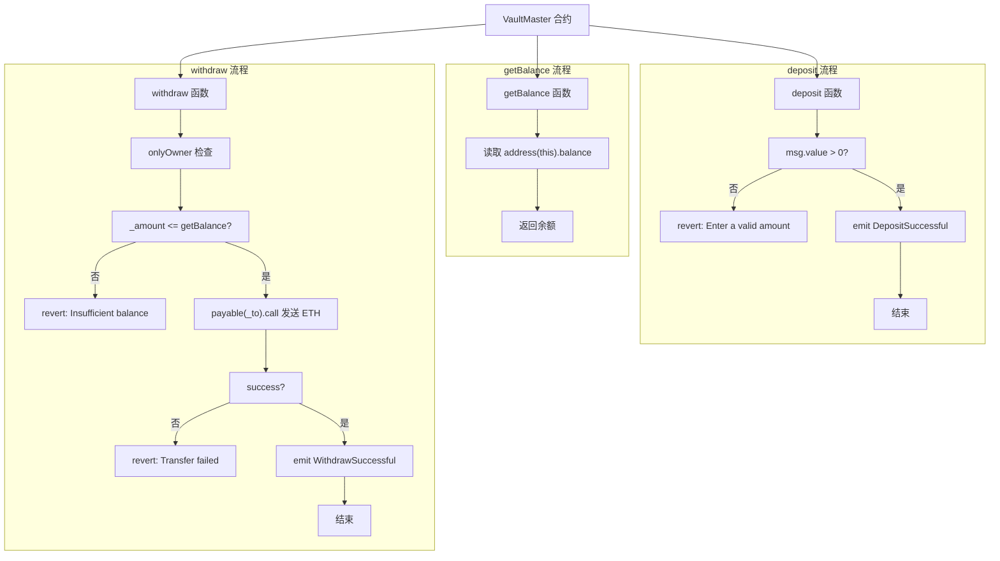

# 钱库控制合约 - Ownable

Day: Day 11
ID: 11
原文: https://www.notion.so/builder-hub/Masterkey-Contract-1d25720a23ef803db49dfc8693959f3c?source=copy_link
状态: 完成
译者: Bala Chen
难度等级: 中级

好的，让我们换个思路。

到目前为止，你可能一直在一次编写一个智能合约——所有内容都打包在一个文件中，各自独立运行。

但随着合约变得越来越复杂，你会开始注意到重复的代码。

> "我不是已经在其他地方写过这个所有权逻辑了吗？"
> 
> 
> "为什么我又要复制同样的 `onlyOwner` 检查？"
> 

这就是 Solidity 为你提供强大功能的地方：**继承**。

---

### 什么是继承？

假设你的父母拥有一栋房子。有一天，他们把它传给了你。

当你继承那栋房子时，你得到的不仅仅是四面墙——你得到了所有附带的东西：

- 家具
- 规则（比如"室内不准穿鞋"）
- 甚至可能还有家里的狗

你自己没有设置任何这些——但你仍然可以使用所有这些。

这就是 Solidity 中继承的工作原理。

一个合约（"母合约"）定义了一堆逻辑——函数、变量、修饰符等。

另一个合约（"子合约"）继承了这一切——可以按原样使用，或者修改其中的部分以满足自己的需求。

---

### 为什么要使用它？

继承帮助你：

- 避免在多个地方编写相同的逻辑
- 将代码拆分成更小、更专注的部分
- 重用重要功能，如访问控制或实用函数
- 使合约更容易更新和维护

它是大多数大规模 Solidity 项目的支柱

---

### 如果你想改变某些东西怎么办？

让我们回到房子的例子。

你继承了父母的房子。随之而来的是所有附带的东西——家具、设计，甚至他们遵循的规则。

但如果你不想完全按照原样保留呢？

也许你想翻新厨房。或者改变"不准养宠物"的规则。它仍然是同一栋房子——但你在让它成为你自己的。

**这正是在 Solidity 中继承合约时自定义的工作原理。**

你从母合约获得所有函数——但有时，你会想要**改变其中一个函数在新合约中的行为方式**。

Solidity 为你提供了一种安全的方法，使用两个关键字：

- **`virtual`** 放在**母合约**中。它将函数标记为*可更改的*。就像父母说，
    
    > "这是规则——但如果你需要的话，可以随意更改。"
    > 
- **`override`** 放在**子合约**中。它告诉 Solidity，
    
    > "我知道这个函数是继承的，但我要用自己的版本替换它。"
    > 

你**必须**同时使用两者——除非**母合约**明确允许，否则 Solidity 不会让你意外覆盖某些东西。

这使你的合约保持干净、可预测且更容易维护。你确切地知道什么是继承的，什么是被更改的——没有意外。

简而言之：

继承为你提供了**母合约**的一切，但通过 `virtual` 和 `override`，你获得了**自定义**所需部分的灵活性。

这样，Solidity 保持了安全和清晰——没有静默覆盖，没有意外更改。一切都是有意的。

---

### 我们今天要构建什么

你将编写两个展示继承实际应用的合约：

1. **Ownable.sol** – 一个简单的合约，定义谁是所有者，并为你提供可重用的 `onlyOwner` 检查来保护敏感函数。
2. **VaultMaster.sol** – 一个接受任何人 ETH 存款的金库，但只允许**所有者**提取。它不会重新编写所有权逻辑，而是简单地从 `Ownable` **继承**它。

这是你迈向编写干净、模块化和生产级 Solidity 代码的第一步。

<aside>
💬

代码原文：
[https://github.com/snehasharma76/30daysSolidity_Web3Compass/blob/master/Ownable.sol](https://github.com/snehasharma76/30daysSolidity_Web3Compass/blob/master/Ownable.sol)
https://github.com/snehasharma76/30daysSolidity_Web3Compass/blob/master/VaultMaster.sol

</aside>

# 1. 产品需求书

### 用户流程



### 数据库

下面是基于合约事件与状态的数据库表结构

**核心实体**

| 表名| 字段| 类型| 说明|
| --- | --- | --- | --- |
| accounts| address| VARCHAR(42) PK| 链上地址（0x+40hex），统一存小写|
|
 | label| TEXT| 可选备注/别名|
|
 | created_at| TIMESTAMP TZ| 创建时间|

| 表名| 字段| 类型| 说明|
| --- | --- | --- | --- |
| contracts| contract_address| VARCHAR(42) PK| VaultMaster 合约地址|
|
 | name| TEXT| 默认“VaultMaster”|
|
 | network| TEXT| 例如 ethereum、sepolia|
|
 | chain_id| BIGINT| 链 ID（如 1、11155111）|
|
 | deploy_tx_hash| VARCHAR(66)| 部署交易哈希|
|
 | owner_address| VARCHAR(42)| 当前所有者地址|
|
 | created_at| TIMESTAMP TZ| 创建时间|
|
 | updated_at| TIMESTAMP TZ| 更新时间|

**事件明细**

| 表名| 字段| 类型| 说明|
| --- | --- | --- | --- |
| ownership_transfers| id| BIGSERIAL PK| 事件主键|
|
 | contract_address| VARCHAR(42)| 合约地址|
|
 | previous_owner| VARCHAR(42)| 旧所有者|
|
 | new_owner| VARCHAR(42)| 新所有者|
|
 | tx_hash| VARCHAR(66)| 交易哈希|
|
 | block_number| BIGINT| 区块号|
|
 | log_index| INTEGER| 事件在区块内序号|
|
 | occurred_at_block_time| TIMESTAMP TZ| 区块时间|
|
 | created_at| TIMESTAMP TZ| 入库时间|

| 表名| 字段| 类型| 说明|
| --- | --- | --- | --- |
| deposits| id| BIGSERIAL PK| 存款事件主键|
|
 | contract_address| VARCHAR(42)| 合约地址|
|
 | account_address| VARCHAR(42)| 存款人地址（indexed）|
|
 | amount_wei| NUMERIC(78,0)| 存入金额（Wei）|
|
 | tx_hash| VARCHAR(66)| 交易哈希|
|
 | block_number| BIGINT| 区块号|
|
 | log_index| INTEGER| 事件序号|
|
 | occurred_at_block_time| TIMESTAMP TZ| 区块时间|
|
 | created_at| TIMESTAMP TZ| 入库时间|

| 表名| 字段| 类型| 说明|
| --- | --- | --- | --- |
| withdrawals| id| BIGSERIAL PK| 提取事件主键|
|
 | contract_address| VARCHAR(42)| 合约地址|
|
 | recipient_address| VARCHAR(42)| 接收地址（indexed）|
|
 | amount_wei| NUMERIC(78,0)| 提取金额（Wei）|
|
 | tx_hash| VARCHAR(66)| 交易哈希|
|
 | block_number| BIGINT| 区块号|
|
 | log_index| INTEGER| 事件序号|
|
 | occurred_at_block_time| TIMESTAMP TZ| 区块时间|
|
 | created_at| TIMESTAMP TZ| 入库时间|

**状态与交易**

| 表名| 字段| 类型| 说明|
| --- | --- | --- | --- |
| balance_snapshots| id| BIGSERIAL PK| 快照主键|
|
 | contract_address| VARCHAR(42)| 合约地址|
|
 | balance_wei| NUMERIC(78,0)| address(this).balance|
|
 | block_number| BIGINT| 区块号|
|
 | tx_hash| VARCHAR(66)| 相关交易哈希（可空）|
|
 | occurred_at_block_time| TIMESTAMP TZ| 区块时间|
|
 | created_at| TIMESTAMP TZ| 入库时间|

| 表名| 字段| 类型| 说明|
| --- | --- | --- | --- |
| transactions| tx_hash| VARCHAR(66) PK| 交易哈希|
|
 | contract_address| VARCHAR(42)| 关联合约地址|
|
 | from_address| VARCHAR(42)| 发送方地址|
|
 | to_address| VARCHAR(42)| 接收方地址|
|
 | value_wei| NUMERIC(78,0)| 交易金额（Wei）|
|
 | block_number| BIGINT| 区块号|
|
 | tx_index| INTEGER| 交易序号|
|
 | status| SMALLINT| 1 成功，0 失败|
|
 | method| TEXT| 方法名：deposit、withdraw、constructor|
|
 | created_at| TIMESTAMP TZ| 入库时间|

# 2. 细节解说

我们将编写**两个合约**：

1. **Ownable.sol** – 这个合约跟踪谁是所有者，并使用 `onlyOwner` 修饰符保护敏感函数。
2. **VaultMaster.sol** – 一个让用户存入 ETH 的金库，但**只有所有者**可以提取资金。

最棒的部分是：`VaultMaster` 将**继承** `Ownable` 的一切，无需重写任何一行逻辑。

让我们从基础开始。

---

## 合约 1：Ownable.sol — 我们的可重复使用的访问控制

```solidity

// SPDX-License-Identifier: MIT
pragma solidity ^0.8.20;

contract Ownable {
    address private owner;

    event OwnershipTransferred(address indexed previousOwner, address indexed newOwner);

    constructor() {
        owner = msg.sender;
        emit OwnershipTransferred(address(0), msg.sender);
    }

    modifier onlyOwner() {
        require(msg.sender == owner, "Only owner can perform this action");
        _;
    }

    function ownerAddress() public view returns (address) {
        return owner;
    }

    function transferOwnership(address _newOwner) public onlyOwner {
        require(_newOwner != address(0), "Invalid address");
        address previous = owner;
        owner = _newOwner;
        emit OwnershipTransferred(previous, _newOwner);
    }
}

```

让我们逐一分析。

---

### `address private owner;`

我们存储合约所有者的地址， 所有者也就是部署该合约的人。

它被标记为 `private`，所以只能在这个合约内部访问。其他合约无法直接访问它。

### `event OwnershipTransferred(...)`

```solidity

event OwnershipTransferred(address indexed previousOwner, address indexed newOwner);

```

Solidity 中的事件就像日志——它们存储在区块链上，你的前端可以**监听/查询/收听/查看**它们，但是它们不能改变合约的状态，它们只是让外部世界知道这个合约发生了什么：在这里，我们记录所有权从谁**转移**到谁。

`indexed` 关键字有助于轻松过滤日志——所以你可以搜索涉及特定地址的所有事件。

---

### `constructor()`

```solidity

constructor() {
    owner = msg.sender;
    emit OwnershipTransferred(address(0), msg.sender);
}

```

这在合约部署时运行一次。它将部署者（`msg.sender`）设置为初始所有者，并发出 `OwnershipTransferred` 事件来记录该更改。

---

### `modifier onlyOwner()`

```solidity

modifier onlyOwner() {
    require(msg.sender == owner, "Only owner can perform this action");
    _;
}

```

这是一个自定义修饰符。当应用于函数时，它**确保只有所有者可以调用它**。

如果 `require` 失败，函数调用就会在那里停止。

---

### `ownerAddress()`

```solidity

function ownerAddress() public view returns (address) {
    return owner;
}

```

由于 `owner` 是私有的，我们提供一个公共函数，这样任何人都可以检查当前所有者是谁。

---

### `transferOwnership()`

```solidity

function transferOwnership(address _newOwner) public onlyOwner {
    require(_newOwner != address(0), "Invalid address");
    address previous = owner;
    owner = _newOwner;
    emit OwnershipTransferred(previous, _newOwner);
}

```

这个函数允许当前所有者**转移所有权**给其他人。

- 它使用 `onlyOwner` 修饰符进行保护。
- 它检查新所有者地址是否有效（不是 `0x0`）。
- 它将当前所有者地址存储在 `previous` 变量中
- 然后更新所有者并通过 `OwnershipTransferred` 事件记录更改。

---

### 那么，我们构建了什么？

一个**可重复使用的合约**，它：

- 跟踪当前所有者
- 限制对敏感函数的访问
- 允许转移所有权
- 发出事件，使所有权更改被公开记录

但这个合约本身自己无法完成什么事情，它是为了被其他合约**继承**而存在——比如我们的下一个合约。

## 合约 2：VaultMaster.sol — 带有所有权的简单 ETH 金库

```solidity

// SPDX-License-Identifier: MIT
pragma solidity ^0.8.20;

import "./ownable.sol";

contract VaultMaster is Ownable {
    event DepositSuccessful(address indexed account, uint256 value);
    event WithdrawSuccessful(address indexed recipient, uint256 value);

    function getBalance() public view returns (uint256) {
        return address(this).balance;
    }

    function deposit() public payable {
        require(msg.value > 0, "Enter a valid amount");
        emit DepositSuccessful(msg.sender, msg.value);
    }

    function withdraw(address _to, uint256 _amount) public onlyOwner {
        require(_amount <= getBalance(), "Insufficient balance");

        (bool success, ) = payable(_to).call{value: _amount}("");
        require(success, "Transfer Failed");

        emit WithdrawSuccessful(_to, _amount);
    }
}

```

这个合约简单但强大。

让我们分解一下：

### `import "./ownable.sol";`

这一行从另一个文件引入我们的 `Ownable` 合约。

现在 `Ownable` 中定义的所有内容，包括 `onlyOwner` 修饰符和 `transferOwnership()` 功能，在 `VaultMaster` 合约中都将可用。

---

### `contract VaultMaster is Ownable`

这是关键的一行。它说：

> "VaultMaster 继承自 Ownable。"
> 

这意味着 `VaultMaster` 现在**自动拥有** `Ownable` 的所有函数、变量和修饰符。

---

### 事件

这里是两个事件声明：

```solidity

event DepositSuccessful(address indexed account, uint256 value);
event WithdrawSuccessful(address indexed recipient, uint256 value);

```

**分解：**

- `DepositSuccessful` 当有人向合约发送 ETH 时触发。
    - `account`：发送者的地址（标记为 `indexed`，因此可以在日志中轻松过滤）。
    - `value`：存入的 ETH 数量。
- `WithdrawSuccessful` 当所有者从合约提取 ETH 时触发。
    - `recipient`：接收资金的地址（也是 `indexed`）。
    - `value`：提取的数量。

这些事件在 `deposit()` 和 `withdraw()` 函数内部发出，以保持每笔交易的公开记录——对前端、仪表板和链下系统很有用。

---

### `getBalance()`

```solidity

function getBalance() public view returns (uint256) {
    return address(this).balance;
}

```

返回合约当前持有的 ETH 数量。

---

### `deposit()`

```solidity

function deposit() public payable   {
    require(msg.value > 0, "Enter a valid amount");
    emit DepositSuccessful(msg.sender, msg.value);
}

```

允许任何人向合约发送 ETH。

我们检查他们确实在发送一些东西，并记录下这个存储动作。

这个函数让**任何人**都可以向合约发送 ETH——它对公众开放。

然后我们使用 `require` 语句要求发送人必须发送>0的数值

如果检查通过，函数发出 `DepositSuccessful` 事件，记录：

- `msg.sender`（发送者的地址），
- 和 `msg.value`（发送的 ETH 数量）。

---

### `withdraw()`

```solidity

function withdraw(address _to, uint256 _amount) public onlyOwner {
    require(_amount <= getBalance(), "Insufficient balance");

    (bool success, ) = payable(_to).call{value: _amount}("");
    require(success, "Transfer Failed");

    emit WithdrawSuccessful(_to, _amount);
}

```

这个函数允许从合约中提取 ETH——但只有所有者有权限。

关键在于 `onlyOwner` 修饰符。我们没有在这个合约内部定义它——我们从 `Ownable` 合约继承了它。

这就是继承的力量：我们可以重用像访问控制这样的逻辑，而无需重写任何东西。`onlyOwner` 修饰符检查调用者是否是当前合约所有者，并阻止其他任何人执行该函数。

在函数内部：

- 我们首先检查合约是否有足够的 ETH 可以提取。
- 然后我们使用 `.call` 将指定数量发送到给定地址。
- 如果转账成功，我们发出 `WithdrawSuccessful` 事件来记录该操作。

---

## 彩蛋：使用 OpenZeppelin 的 Ownable 替代

好的，我们刚刚从头开始构建了自己的 `Ownable` 合约——这是学习访问控制如何工作的重要一步。

但在现实世界中，大多数开发者不会从头开始编写所有内容。他们依赖**可信的库**

### 什么是 OpenZeppelin？

**OpenZeppelin** 是一个由顶级智能合约开发者组成的团队，他们为以太坊创建了一个安全、可重用且经过社区审计的合约库。

他们的合约处理以下事务：

- 访问控制（`Ownable`、`AccessControl`）
- 代币标准（`ERC20`、`ERC721`、`ERC1155`）
- 安全模式（可暂停、重入保护）
- 代理和可升级合约
- 实用程序和数学库

这些合约在整个以太坊生态系统中被使用——被各种协议、DAO、NFT 平台、DeFi 应用程序以及几乎任何编写生产级智能合约的人使用。

**为什么？** 因为它们：

- 在实际环境中经过实战测试
- 持续维护
- 经过审计且值得信赖

使用 OpenZeppelin 节省时间，减少错误，并帮助你构建更安全的合约。---

### 如何在 Remix 中使用 OpenZeppelin 的 `Ownable`

由于我们在 **Remix** 中工作，你可以立即使用 OpenZeppelin——无需安装。

---

### 步骤 1：替换导入

在你的 `VaultMaster.sol` 中，不要从本地文件导入你的自定义 `Ownable` 合约，你可以直接使用官方 OpenZeppelin 版本，如下所示：

```solidity

import "@openzeppelin/contracts/access/Ownable.sol";

```

那么，`@` 符号是什么意思？

`@openzeppelin` 部分是在 Remix（以及许多 Solidity 项目中）使用的简写，用于引用来自 **npm 风格包系统**的信息**包**。

即使我们没有在 Remix 中明确安装任何东西，它仍然在幕后识别并解析这个路径。

可以这样理解：

- `@openzeppelin/...` = "从 OpenZeppelin 库包中获取这个"
- `contracts/access/Ownable.sol` = 该包内的实际文件夹和文件路径

所以这一行告诉 Remix：

> "嘿，从 OpenZeppelin 包内的 contracts/access 目录中拉取 Ownable.sol 文件。"
> 

当你以这种方式引用 OpenZeppelin 合约时，Remix 会自动获取它们，所以你不需要手动设置任何东西。

它开箱即用——这在你进行原型设计或学习时非常方便。

---

### 步骤 2：在构造函数中传递所有者

OpenZeppelin 版本的 `Ownable` 期望你在部署合约时**传递初始所有者**。所以，在你的合约内部，添加这个构造函数：

```solidity

constructor() Ownable(msg.sender) {}

```

这告诉 OpenZeppelin 将部署者设置为第一个所有者——就像我们之前手动做的一样。

---

### 使用 OpenZeppelin 的最终 VaultMaster

这是你使用 OpenZeppelin 的 `Ownable` 更新的 `VaultMaster.sol`：

```solidity

// SPDX-License-Identifier: MIT
pragma solidity ^0.8.20;

import "@openzeppelin/contracts/access/Ownable.sol";

contract VaultMaster is Ownable {

    event DepositSuccessful(address indexed account, uint256 value);
    event WithdrawSuccessful(address indexed recipient, uint256 value);

    // 使用 OpenZeppelin 的构造函数将部署者设置为所有者
    constructor() Ownable(msg.sender) {}

    function getBalance() public view returns (uint256) {
        return address(this).balance;
    }

    function deposit() public payable {
        require(msg.value > 0, "Enter a valid amount");
        emit DepositSuccessful(msg.sender, msg.value);
    }

    function withdraw(address _to, uint256 _amount) public onlyOwner {
        require(_amount <= getBalance(), "Insufficient balance");

        (bool success, ) = payable(_to).call{value: _amount}("");
        require(success, "Transfer failed");

        emit WithdrawSuccessful(_to, _amount);
    }
}

```

---

### 那么为什么要使用 OpenZeppelin？

因为从长远来看：

- 你编写**更少的代码**
- 你得到**更少的错误**
- 你的合约遵循**行业最佳实践**

这就像使用可靠的构建块，而不是每次都从原材料开始。你可以专注于应用程序的独特逻辑——并将基础工作留给专家。

---

## 总结

今天，你学到了：

- 如何编写控制所有权的**基础合约**
- 如何在另一个合约中**继承**该合约
- 如何使用 `modifier` 和 `event` 添加控制和可见性
- 如何更清晰地构建你的 Solidity 项目
- 以及如何使用 **OpenZeppelin 的 Ownable** 进行实际应用

继承使你的智能合约更加**模块化**、**可重用**和**可维护**。

这就是现实世界中智能合约系统的构建方式——一次一个小的、可组合的部分。