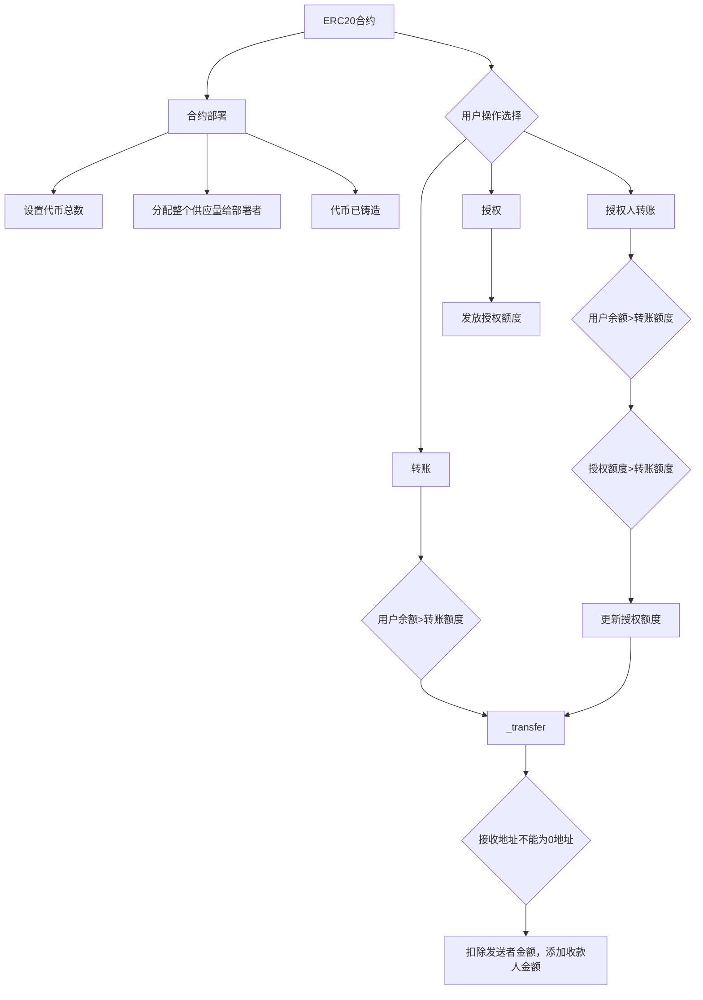

# 第一次ERC20合约

Day: Day 12
ID: 12
原文: https://www.notion.so/builder-hub/MyFirstToken-Contract-1d35720a23ef80b2b190c3b122c2290f?source=copy_link
状态: 完成
译者: sun sun
难度等级: 中级

# 学习内容

到目前为止，我们已经构建了计算器、共享钱包、储钱罐，甚至一个具有所有权逻辑的 ETH 密室——在这个过程中，我们学习了继承和访问控制如何使我们的合约保持简洁和安全。但我们如果稍微改变一下方向呢？

如果我们不只是持有或移动 ETH，而是想创建自己的代币呢？你知道——就像你经常在加密货币领域看到的那样。

$MEME, $WAGMI, $COIN — 它们无处不在。

自己创建一个难道不有趣吗？

今天你就要亲手做到这一点。我们将编写一个代币合约——但不是普通的代币——一个 ERC-20 代币。

代码原文：[https://github.com/snehasharma76/30daysSolidity_Web3Compass/blob/master/ERC20.sol](https://github.com/snehasharma76/30daysSolidity_Web3Compass/blob/master/ERC20.sol)

# 1.产品需求书

### a.用户流程



### b.数据库

| Contract | Type | Bases |
| --- | --- | --- |
| SimpleERC20 | Implementation |  |

| └ Function Name | Visibility | Mutability |
| --- | --- | --- |
| constructor | public | 🛑 |
| transfer | public | 🛑 |
| approve | public | 🛑 |
| transferFrom | public | 🛑 |
| _transfer | internal | 🛑 |

# 2.细节解说

### **为什么代币从一开始就需要标准**

在以太坊的早期，每个人都对创建代币的想法感到兴奋。

所以，他们确实创建了。很多。

但有一个大问题：每个人都以不同的方式构建它们。

一个代币的转账功能使用了 send()

另一个代币则称之为 moveTokens()

有些代币不允许你检查余额

另一些代币在转账发生时没有发出任何事件

现在想象一下，如果你是一个钱包或交易所，需要支持所有这些代币。

每当有新的代币出现时，你都必须编写定制的逻辑才能让它正常工作。

这就像试图制造一个通用的遥控器——但每个电视制造商都决定使用不同的按钮、不同的线缆，有时甚至根本没有电源开关。

所以以太坊社区联合起来，说：

“好吧，到此为止。让我们就如何构建代币达成共识。”

那时提出了 ERC-20——一套简单的规则，内容如下：

这就是一个代币应该的样子

每个代币都必须具备这些功能

如果你遵循这些规则，你的代币将能直接与钱包、DApp 和交易所兼容

那个时刻——即 ERC-20 的诞生——正是让以太坊的代币生态系统爆炸性增长的原因。

### **ERC-20 是什么意思？**

那么，到底什么是“ERC-20”？

我们来分解一下。

ERC 代表以太坊请求评论——基本上是一个公开提案，它说：

“嘿，以太坊开发者们，这里有一套我们认为在构建某种类型的智能合同时，每个人都应该遵循的规则和行为。”

这是以太坊社区就标准达成共识的方式——就像区块链的建筑规范。

以及 ERC-20？

那是 ERC 系列的第 20 个提案——而且恰好是定义了可替代代币在以太坊上应该如何行为的那一个。

### **ERC-20 定义了哪些规则？**

ERC-20 制定了一个统一的接口——一种共享的语言——所有代币都应该使用。它涵盖了诸如：

**命名和显示**

你的代币必须有名称、符号和小数位数，以便钱包能正确显示它们。

**余额和供应量**

必须有 totalSupply()函数，以及一种方法来检查地址拥有多少代币，使用 balanceOf(address)。

**转账**

应该有一个 transfer()函数，允许人们从他们的钱包向其他人发送代币。

**批准和授权支出**

您的代币需要一个 approve()函数，以便用户可以让其他人（例如智能合约）代表他们花费代币。

以及一个 transferFrom()函数来实际执行这些已批准的转账。

**事件发射**

每当代币转移或权限被授予时，您的合约应发射 Transfer 和 Approval 事件。

这些帮助钱包、DApps 和区块链浏览器追踪链上发生的事情。

### **为何这很重要**

通过遵循这些规则，您的代币变得即插即用——它可以：

出现在像 MetaMask 这样的钱包中

在去中心化交易所交易

与借贷协议、DAO 或任何支持 ERC-20 的应用程序合作

如果你的代币不符合 ERC-20 规则，那就好比建造一个不适用于任何插头的电源插座——它或许还能运作，但没有人能使用它。

简而言之：

ERC-20 是使以太坊代币经济成为可能的设计蓝图。这也是为什么代币具有互操作性、可重复使用，并能即时与生态系统兼容。

现在，你要自己构建一个。

### **今天我们要构建什么**

我们将从头开始构建一个最小的 ERC-20 代币。

它不会有铸造、销毁或高级功能——而且它跳过了生产环境中通常想要的一些安全检查。

但它非常适合理解代币在底层实际是如何运作的。

我们的代币将被称为 SimpleToken，符号为 SIM。

以下是我们将要讲解的合约：

**SimpleERC20.sol**

```solidity
// SPDX-License-Identifier: MIT
pragma solidity ^0.8.20;

contract SimpleERC20 {
    string public name = "SimpleToken";
    string public symbol = "SIM";
    uint8 public decimals = 18;
    uint256 public totalSupply;

    mapping(address => uint256) public balanceOf;
    mapping(address => mapping(address => uint256)) public allowance;

    event Transfer(address indexed from, address indexed to, uint256 value);
    event Approval(address indexed owner, address indexed spender, uint256 value);

    constructor(uint256 _initialSupply) {
        totalSupply = _initialSupply * (10 ** uint256(decimals));
        balanceOf[msg.sender] = totalSupply;
        emit Transfer(address(0), msg.sender, totalSupply);
    }

    function transfer(address _to, uint256 _value) public returns (bool) {
        require(balanceOf[msg.sender] >= _value, "Not enough balance");
        _transfer(msg.sender, _to, _value);
        return true;
    }

    function approve(address _spender, uint256 _value) public returns (bool) {
        allowance[msg.sender][_spender] = _value;
        emit Approval(msg.sender, _spender, _value);
        return true;
    }

    function transferFrom(address _from, address _to, uint256 _value) public returns (bool) {
        require(balanceOf[_from] >= _value, "Not enough balance");
        require(allowance[_from][msg.sender] >= _value, "Allowance too low");

        allowance[_from][msg.sender] -= _value;
        _transfer(_from, _to, _value);
        return true;
    }

    function _transfer(address _from, address _to, uint256 _value) internal {
        require(_to != address(0), "Invalid address");
        balanceOf[_from] -= _value;
        balanceOf[_to] += _value;
        emit Transfer(_from, _to, _value);
    }
}

```

让我们一步步来讲解。

### **分解**

### **代币元数据**

```solidity
string public name = "SimpleToken";
string public symbol = "SIM";
uint8 public decimals = 18;

```

这三行定义了您的代币在钱包和交易所中的显示方式：

- name 是代币的全名。
- symbol 是简短的交易代码（如"ETH"或"DAI"）。
- decimals 定义了它的可分割程度。

大多数代币使用 18 位小数——就像 ETH 一样。

**代币供应**

```solidity
uint256 public totalSupply;

```

这个用于追踪当前存在的代币总数。我们将在合约部署时设置这个值——更多细节请参考构造函数。

**余额和额度**

```solidity
mapping(address => uint256) public balanceOf;
mapping(address => mapping(address => uint256)) public allowance;

```

- balanceOf 告诉你每个地址持有多少代币。
- allowance是一个嵌套映射，用于追踪谁被允许代表谁花费代币——以及花费多少。

这是 ERC-20 的核心功能：允许其他人（如 DApp 或智能合约）移动你的代币，但前提是你必须首先批准。

**事件**

```solidity
event Transfer(address indexed from, address indexed to, uint256 value);
event Approval(address indexed owner, address indexed spender, uint256 value);

```

正如你所知，Solidity 中的事件就像合约在说，“嘿，刚发生了一件什么事！”——它们是智能合约与外界交互的关键部分。

它们不会修改任何状态或执行合约内的逻辑。相反，它们会发出日志，外部工具如钱包、DApps 和区块浏览器可以监听这些日志。

每个事件的作用如下：

- Transfer：每当代币从一个地址转移到另一个地址时，这个事件就会触发。钱包和浏览器依赖这个事件来显示交易历史。
- Approval：当有人授权另一个地址代表他们花费代币时，这个事件就会触发。

你会注意到地址参数上的 indexed 关键字——这使得这些值在事件日志中可搜索。所以如果你想要查找来自特定地址的所有转账，或是对某个特定支出者的所有批准，这就是实现方式。

### **构造函数——铸造初始供应**

```solidity
constructor(uint256 _initialSupply) {
    totalSupply = _initialSupply * (10 ** uint256(decimals));
    balanceOf[msg.sender] = totalSupply;
    emit Transfer(address(0), msg.sender, totalSupply);
}

```

这个构造函数在合约部署时只会运行一次，并且只会运行一次。

这是逐行解释：

```solidity
totalSupply = _initialSupply * (10 ** uint256(decimals));

```

这一行设定了将存在的代币总数。

- _initialSupply 是部署合约时传入的数值。
- 但请记住——ERC-20 代币使用小数位来确保精确度（就像 ETH 使用 Wei 一样）。
- 所以如果你的代币使用 18 位小数（这是标准），并且你想创建 100 个代币，你实际上需要将其表示为：
    
    100 * 10^18 = 100000000000000000000
    

这就是为什么我们将初始供应量乘以 10 ** decimals。

这个缩放后的数字存储在 totalSupply 中。

```solidity
balanceOf[msg.sender] = totalSupply;

```

整个供应量被分配给了部署合约的人 — msg.sender。

这意味着部署者最初持有 100%的代币。

从那时起，他们可以随意转移、出售或分配代币。

```solidity
emit Transfer(address(0), msg.sender, totalSupply);

```

这会发出一个 Transfer 事件来表示代币已被"铸造"。

我们将from地址设置为 address(0)，这是一种特殊说法：

这些代币并非来自其他用户——它们凭空创造了。

钱包、浏览器和前端工具理解这种模式，并将其显示为铸造事件。

### **transfer()**

```solidity
function transfer(address _to, uint256 _value) public returns (bool) {
    require(balanceOf[msg.sender] >= _value, "Not enough balance");
    _transfer(msg.sender, _to, _value);
    return true;
}

```

这个功能允许用户将他们的代币发送到另一个地址。这是最直接和最常用的转移代币的方式——无论是你向朋友发送一些 SIM 代币，还是用你的 ERC-20 代币支付某物。

以下是步骤：

- 首先，它确保发送者（msg.sender）有足够的代币，使用 require(balanceOf[msg.sender] >= _value)
- 然后，它不是在这里处理转账逻辑，而是调用一个内部辅助函数 _transfer() 来执行实际的代币转移。

那么为什么要拆分呢？

这就引出了一个非常重要的 Solidity 设计模式：逻辑分离。

我们不想在 transfer() 和 transferFrom() 等多个地方重复转账逻辑。相反，我们将核心的余额变更逻辑提取到一个单独的函数 _transfer() 中，并在需要的地方重用它。

可以把 transfer() 想象成前端按钮，而 _transfer() 是后端引擎。用户只看到按钮，但实际操作在后台进行。

这种方法的另一个好处是安全性和一致性。如果我们想改变代币余额更新的方式（例如添加费用或记录额外数据），我们只需要在一个地方修改 _transfer()，而 transfer() 和 transferFrom() 都会受益于更新。

### **_transfer()**

```solidity
function _transfer(address _from, address _to, uint256 _value) internal {
    require(_to != address(0), "Invalid address");
    balanceOf[_from] -= _value;
    balanceOf[_to] += _value;
    emit Transfer(_from, _to, _value);
}

```

这是实际移动代币的引擎。

它被标记为internal，这意味着它只能从该合约或其派生合约内部调用——不能由外部用户或其他合约调用。这是一个有意的选择：我们不想让人们直接调用_transfer()并绕过重要的检查，如额度。

它做了以下事情：

- 它确保接收地址不是零地址——因为那样会实际销毁代币。
- 它从发送者的余额中扣除金额。
- 它将相同金额添加到收款人。
- 然后它发出一个 Transfer 事件，以便钱包和前端可以反映这一变化。

通过将这个逻辑移入它自己的内部函数，我们得到：

- 干净、可重用的代码
- 减少重复逻辑的 bug
- 余额更新的单一真实来源

transfer()和 transferFrom()都依赖于_transfer()来保持一致性并遵循 DRY（不要重复自己）原则。

### **transferFrom()**

```solidity
function transferFrom(address _from, address _to, uint256 _value) public returns (bool) {
    require(balanceOf[_from] >= _value, "Not enough balance");
    require(allowance[_from][msg.sender] >= _value, "Allowance too low");

    allowance[_from][msg.sender] -= _value;
    _transfer(_from, _to, _value);
    return true;
}

```

这个功能允许已获批准的人代为转移代币。

以下是典型流程：

1. Alice 调用 approve(Bob, 100)
2. Bob 调用 transferFrom(Alice, Carol, 50)

在这个例子中：

- Bob 是 msg.sender
- Alice 是 _from
- Carol 是 _to

该函数执行三项操作：

- 它检查 Alice 是否确实拥有这些代币（balanceOf[_from] >= _value）
- 它检查 Bob 是否已被批准至少花费该金额（allowance[_from][msg.sender] >= _value）
- 它减少 Bob 的授权额度
- 然后它调用_transfer()来执行实际的代币转移

这个函数使得像 DEX 交易和 DAO 投票这样的操作成为可能——每当智能合约移动你的代币时，它很可能在底层使用 transferFrom()。

### **approve()**

```solidity
function approve(address _spender, uint256 _value) public returns (bool) {
    allowance[msg.sender][_spender] = _value;
    emit Approval(msg.sender, _spender, _value);
    return true;
}

```

这个功能允许你授权另一个地址（通常是智能合约）代表你花费代币。

这里有一个现实世界的类比：

你给你的朋友一张签名的授权条，让他从你的钱包里拿 50 美元。他们不能拿超过这个数额，并且需要这张授权条才能这样做。

这里也是一样：

- _spender 是您授权的地址
- _value 是他们被允许花费的最大金额

授权信息存储在一个嵌套映射中：allowance[owner][spender]. 就像转账一样，我们也会发出一个事件——Approval——来通知外界这一操作已经发生。

这是所有委托代币交易的基础——比如在 DEX 上交易、订阅服务或参与收益农场。

注意：此函数仅设置权限。实际转账通过 transferFrom() 完成。

### **缺失的内容（以及你为什么应该关心）**

好了，我们已经构建了一个可用的 ERC-20 代币——这很棒。

但在你急于将其部署到主网并开始建立自己的加密货币帝国之前……这个最小化合约还有一些功能没有实现——而这些功能很重要。

这是缺失的部分：

没有对 approve()进行抢先交易的保护

这是一个在 ERC-20 中众所周知的漏洞，有人可能利用竞态条件来花费超出他们应有的金额。修复方法？使用 increaseAllowance()和 decreaseAllowance()，或者使用其他更安全的模式。

**没有铸造或销毁功能**

总量在部署时固定。未经添加额外功能，你无法增加它（铸造）或减少它（销毁）。

**无访问控制或所有权**

任何人都可以与该合约交互——没有方法可以限制谁可以铸造、暂停或升级合约。

**无暂停或紧急制动器**

如果出现问题（比如漏洞或错误），你无法暂停转账或暂时关闭系统。

**没有可升级性或模块化**

一旦部署，就固定了。除非重新部署，否则无法升级逻辑——如果代币已经流通，这可能会很混乱。

所以虽然这个合约非常适合学习，但它还不适合真正的大场面。如果你正在构建真实的东西——一个会持有真实价值的代币——你需要更强大的工具。

### **奖励：使用 OpenZeppelin 节省时间（和理智）**

在生产环境中，大多数开发者不会从零开始编写所有内容。

他们会使用经过实战检验的库——而在以太坊世界中，首选是 OpenZeppelin。

### **为什么选择 OpenZeppelin？**

因为它：

安全（被主要 DeFi 协议使用）

经过审计并受社区信任

模块化和可定制

易于与其他合约集成

以下是使用 OpenZeppelin 轻松创建您自己的代币的方法：

```solidity

// SPDX-License-Identifier: MIT
pragma solidity ^0.8.20;

import "@openzeppelin/contracts/token/ERC20/ERC20.sol";

contract MyToken is ERC20 {
    constructor(uint256 initialSupply) ERC20("MyToken", "MTK") {
        _mint(msg.sender, initialSupply * 10 ** decimals());
    }
}

```

就这样。您刚刚用几行代码创建了一个生产级的 ERC-20 代币。

如果您想更进一步，OpenZeppelin 为您提供即插即用的扩展功能，例如：

- ERC20Burnable
- ERC20Pausable
- AccessControl 或 Ownable
- ERC20Permit 用于无 gas 审批

你可以挑选你需要的部分，将其组合到你的合约中，然后就可以使用了——所有安全措施和最佳实践都已内置其中。

所以当你学习完成后，准备真正开始构建时——不要重复造轮子。使用 OpenZeppelin。

### **总结**

今天你学习了：

为什么存在 ERC-20 以及它如何标准化以太坊上的代币行为

名称、符号、小数位数和总供应量是什么

如何跟踪余额和授权额度

如何授权和转移代币

OpenZeppelin 如何帮助你安全高效地完成所有这些

只需几行代码，你现在就明白了以太坊上 99%的代币实际上是如何工作的。

我们继续前进。