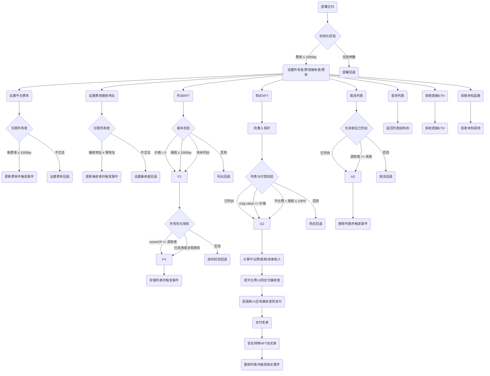

# NFT市场合约学习内容

Day: Day 26
ID: 26
原文: https://www.notion.so/NFT-Marketplace-1df5720a23ef8040b753eacf7bd9beb4?source=copy_link
状态: 完成
译者: Bala Chen
难度等级: 高级

嘿嘿，欢迎回到**30天Solidity学习**——每天，你不仅通过阅读智能合约的工作原理来升级，而是通过实际构建感觉像真实世界应用的东西。

今天，我们从**铸造NFT**转向**将它们货币化**。

这不仅仅是练习。

这是你构建真实产品的第一步。

可以在主网上运行的东西。你最喜欢的NFT艺术家可以用来列出他们作品的东西。

今天...

你正在构建自己的**NFT市场**。

---

### 🛍️ 让我们谈谈市场

想想你最喜欢的在线市场——也许是OpenSea，也许是淘宝，也许是你附近的跳蚤市场。

总是有相同的3个角色：

- 有人**出售**有价值的东西
- 有人**购买**它
- 中间有一个平台处理交易，抽取佣金，并移动商品

现在把这个想法——完全放在链上。

没有中间人。没有后端。没有人阻挡道路。

只是一个智能合约：

- 列出NFT
- 处理ETH支付
- 支付给卖家、平台，甚至原创者——**自动地**

---

### 🧠 为什么这个项目很重要

NFT市场是一切汇聚的地方：

- ERC721逻辑 ✅
- 安全的ETH转账 ✅
- 创作者版税 ✅
- 费用分配 ✅
- 重入保护 ✅
- 所有权+批准流程 ✅

这是展示真实世界里Web3应用如何在底层工作的合约类型。

当你构建这个时...你不仅仅是在复制OpenSea。

你在理解它——并创建你自己的精简版、不臃肿版本。

一个**你控制**的版本。

---

### 🧾 你今天将学到什么

- 如何**列出**带有自定义价格和可选版税的NFT
- 如何使用ETH**购买**NFT（自动分配给卖家、创作者和市场）
- 如果卖家改变主意，如何**取消列出**NFT
- 如何使用`ReentrancyGuard`**保护**一切
- 以及如何作为合约所有者**跟踪和更新费用**并拥有完全控制权

---

### 💡 是什么让这个特别？

这个市场不仅让人们交易NFT。它：

- 尊重创作者版税
- 自动执行所有权
- 确保每个人都得到正确的报酬（卖家、创作者和你！）
- 不需要**后端**和**信任**——一切都由代码执行

你不是在构建一个*假装*做事情的UI。

你在构建实际*做*这些事情的后端逻辑——实时，在链上。

---

### 🚀 到最后

你将拥有一个自包含的NFT市场合约，可以：

- 列出任何ERC-721
- 用ETH出售它
- 分配费用
- 安全地转移NFT
- 用事件记录所有活动，供前端获取

这就像你自己的小OpenSea——但按你的条件。

# 产品需求说明

用户流程



需要的数据结构

| └ Function Name | Visibility | Mutability |
| --- | --- | --- |
| constructor | Public | 🛑 |
| setMarketplaceFeePercent | External | ⚙️ |
| setFeeRecipient | External | ⚙️ |
| listNFT | External | ⚙️ |
| buyNFT | External | 🛑 |
| cancelListing | External | ⚙️ |
| getListing | External | View |
| receive | External | 🛑 |
| fallback | External | 🛑 |

# 细节解说

## 🧾 概述：这个NFT市场合约如何工作

那么我们真正在构建什么？

这个合约是一个**完全链上的NFT市场**，用纯Solidity编写。它让人们：

- **列出他们的NFT出售**，设置价格甚至自定义版税
- 通过直接向合约发送ETH来**购买NFT**
- **自动分割销售**在卖家、创作者（版税）和平台（市场费用）之间
- 随时**取消列表**
- 作为市场所有者**更新费用设置**

所有这些都**安全地**发生，具有内置保护，如`ReentrancyGuard`来防止攻击。

这里没有前端，没有JavaScript，没有后端数据库——只是一个智能合约：

- 跟踪每个列表
- 验证每个NFT和卖家
- 正确移动ETH和NFT
- 发出事件，以便UI可以跟随

这是像**OpenSea**和**LooksRare**这样的平台构建的相同基础——但更干净、更简单、对初学者友好。

## 🧾 完整的NFT市场合约代码

```solidity

// SPDX-License-Identifier: MIT
pragma solidity ^0.8.20;

import "@openzeppelin/contracts/token/ERC721/IERC721.sol";
import "@openzeppelin/contracts/security/ReentrancyGuard.sol";

contract NFTMarketplace is ReentrancyGuard {
    address public owner;
    uint256 public marketplaceFeePercent; // 以基点为单位 (100 = 1%)
    address public feeRecipient;

    struct Listing {
        address seller;
        address nftAddress;
        uint256 tokenId;
        uint256 price;
        address royaltyReceiver;
        uint256 royaltyPercent; // 以基点为单位
        bool isListed;
    }

    mapping(address => mapping(uint256 => Listing)) public listings;

    event Listed(
        address indexed seller,
        address indexed nftAddress,
        uint256 indexed tokenId,
        uint256 price,
        address royaltyReceiver,
        uint256 royaltyPercent
    );

    event Purchase(
        address indexed buyer,
        address indexed nftAddress,
        uint256 indexed tokenId,
        uint256 price,
        address seller,
        address royaltyReceiver,
        uint256 royaltyAmount,
        uint256 marketplaceFeeAmount
    );

    event Unlisted(
        address indexed seller,
        address indexed nftAddress,
        uint256 indexed tokenId
    );

    event FeeUpdated(
        uint256 newMarketplaceFee,
        address newFeeRecipient
    );

    constructor(uint256 _marketplaceFeePercent, address _feeRecipient) {
        require(_marketplaceFeePercent <= 1000, "Marketplace fee too high (max 10%)");
        require(_feeRecipient != address(0), "Fee recipient cannot be zero");

        owner = msg.sender;
        marketplaceFeePercent = _marketplaceFeePercent;
        feeRecipient = _feeRecipient;
    }

    modifier onlyOwner() {
        require(msg.sender == owner, "Only owner");
        _;
    }

    function setMarketplaceFeePercent(uint256 _newFee) external onlyOwner {
        require(_newFee <= 1000, "Marketplace fee too high");
        marketplaceFeePercent = _newFee;
        emit FeeUpdated(_newFee, feeRecipient);
    }

    function setFeeRecipient(address _newRecipient) external onlyOwner {
        require(_newRecipient != address(0), "Invalid fee recipient");
        feeRecipient = _newRecipient;
        emit FeeUpdated(marketplaceFeePercent, _newRecipient);
    }

    function listNFT(
        address nftAddress,
        uint256 tokenId,
        uint256 price,
        address royaltyReceiver,
        uint256 royaltyPercent
    ) external {
        require(price > 0, "Price must be above zero");
        require(royaltyPercent <= 1000, "Max 10% royalty allowed");
        require(!listings[nftAddress][tokenId].isListed, "Already listed");

        IERC721 nft = IERC721(nftAddress);
        require(nft.ownerOf(tokenId) == msg.sender, "Not the owner");
        require(
            nft.getApproved(tokenId) == address(this) || nft.isApprovedForAll(msg.sender, address(this)),
            "Marketplace not approved"
        );

        listings[nftAddress][tokenId] = Listing({
            seller: msg.sender,
            nftAddress: nftAddress,
            tokenId: tokenId,
            price: price,
            royaltyReceiver: royaltyReceiver,
            royaltyPercent: royaltyPercent,
            isListed: true
        });

        emit Listed(msg.sender, nftAddress, tokenId, price, royaltyReceiver, royaltyPercent);
    }

    function buyNFT(address nftAddress, uint256 tokenId) external payable nonReentrant {
        Listing memory item = listings[nftAddress][tokenId];
        require(item.isListed, "Not listed");
        require(msg.value == item.price, "Incorrect ETH sent");
        require(
            item.royaltyPercent + marketplaceFeePercent <= 10000,
            "Combined fees exceed 100%"
        );

        uint256 feeAmount = (msg.value * marketplaceFeePercent) / 10000;
        uint256 royaltyAmount = (msg.value * item.royaltyPercent) / 10000;
        uint256 sellerAmount = msg.value - feeAmount - royaltyAmount;

        // 市场费用
        if (feeAmount > 0) {
            payable(feeRecipient).transfer(feeAmount);
        }

        // 创作者版税
        if (royaltyAmount > 0 && item.royaltyReceiver != address(0)) {
            payable(item.royaltyReceiver).transfer(royaltyAmount);
        }

        // 卖家支付
        payable(item.seller).transfer(sellerAmount);

        // 将NFT转移给买家
        IERC721(item.nftAddress).safeTransferFrom(item.seller, msg.sender, item.tokenId);

        // 删除列表
        delete listings[nftAddress][tokenId];

        emit Purchase(
            msg.sender,
            nftAddress,
            tokenId,
            msg.value,
            item.seller,
            item.royaltyReceiver,
            royaltyAmount,
            feeAmount
        );
    }

    function cancelListing(address nftAddress, uint256 tokenId) external {
        Listing memory item = listings[nftAddress][tokenId];
        require(item.isListed, "Not listed");
        require(item.seller == msg.sender, "Not the seller");

        delete listings[nftAddress][tokenId];
        emit Unlisted(msg.sender, nftAddress, tokenId);
    }

    function getListing(address nftAddress, uint256 tokenId) external view returns (Listing memory) {
        return listings[nftAddress][tokenId];
    }

    receive() external payable {
        revert("Direct ETH not accepted");
    }

    fallback() external payable {
        revert("Unknown function");
    }
}

```

---

## 1. 📦 导入——引入可信的构建块

```solidity

import "@openzeppelin/contracts/token/ERC721/IERC721.sol";
import "@openzeppelin/contracts/security/ReentrancyGuard.sol";

```

这两行是从OpenZeppelin合约库**引入强大的、经过实战测试的组件**。让我们看看它们的作用：

---

### ✅ `IERC721`

```solidity

import "@openzeppelin/contracts/token/ERC721/IERC721.sol";

```

这引入了任何ERC-721 NFT的**接口**——这是非同质化代币（NFT）使用的标准。

把`IERC721`想象成定义以下内容的合约蓝图：

- 谁拥有代币（`ownerOf`）
- 如何安全发送代币（`safeTransferFrom`）
- 如何批准某人转移你的NFT（`approve`、`isApprovedForAll`等）

通过导入这个，我们可以**与任何NFT合约交互**——不仅仅是我们创建的NFT，而是*任何ERC-721兼容合约*，比如无聊猿或自定义游戏内物品。

> 🧠 我们这里不需要完整的NFT合约——我们不是在创建NFT。
> 
> 
> 我们只是**与现有NFT一起工作**，所以我们只需要接口来调用它们的函数。
> 

---

### 🛡️ `ReentrancyGuard`

```solidity

import "@openzeppelin/contracts/security/ReentrancyGuard.sol";

```

这是一个**安全工具**，帮助保护我们的合约免受称为**重入攻击**的常见黑客攻击。

那是什么？

> 想象有人开始购买NFT，在该交易完成之前，他们偷偷进入另一个（或一系列交易），搞乱余额并耗尽资金。
> 

通过使用`ReentrancyGuard`，我们可以**锁定我们的敏感函数**，如`buyNFT()`，这样没有人可以重新进入并在中途利用逻辑。

我们将使用`nonReentrant`修饰符应用这个保护。

---

## 2. 🏗️ 合约声明——启动市场

```solidity

contract NFTMarketplace is ReentrancyGuard {

```

这一行启动了实际的智能合约——它做了**两件大事**：

1. **命名我们的合约**
    - 它叫做`NFTMarketplace`——这是其他合约、工具和前端将引用它的方式。
2. **从ReentrancyGuard继承**
    - 通过这样做，我们的合约*自动获得保护*，在我们使用`nonReentrant`修饰符的任何函数上免受重入攻击。
    - 这就像给我们的敏感函数一个私人保镖。

---

🔑 为什么这个设置很重要

仅仅通过这两个导入和声明，我们就为以下内容奠定了基础：

- 与任何ERC-721 NFT合约一起工作
- 保持我们的市场免受关键漏洞的影响

现在我们准备深入**状态变量**——我们的合约存储的数据，用于跟踪列表、费用和所有权。

## 3. 状态变量

这些变量位于合约的顶部：

```solidity

address public owner;
uint256 public marketplaceFeePercent; // 以基点为单位 (100 = 1%)
address public feeRecipient;

```

---

**🧠 这些变量的作用**

这三个值为我们的市场提供了**基本的管理控制和收入逻辑**。它们定义：

- 谁负责
- 市场收取多少费用
- 这些费用去哪里

让我们逐一分析：

---

### 👑 `owner`

```solidity

address public owner;

```

- 这存储了**部署合约的地址**。
- 所有者被认为是**管理员**——唯一被允许更新费用或更改费用接收者的人。

> 💡 为什么手动跟踪所有权？
> 
> 
> 因为这没有使用OpenZeppelin的`Ownable`合约——我们保持精简并编写自己的基本访问控制。
> 

你稍后会在代码中看到一个名为`onlyOwner`的修饰符，它使用这个值。

---

### 💸 `marketplaceFeePercent`

```solidity

uint256 public marketplaceFeePercent; // 以基点为单位 (100 = 1%)

```

这设置了市场将从每次销售中收取的**费用百分比**——但以**基点**为单位。

> 🧾 什么是基点？
> 
> 
> 1基点 = 0.01%。
> 
> 所以100基点 = 1%。
> 
> 1000基点 = 10%。
> 

使用基点为我们提供了对费用的**细粒度控制**，并避免了Solidity缺乏小数的问题。

例如：

- 费用为`250`意味着每次销售的2.5%归市场所有。

这个变量稍后可以由所有者更新。

---

### 🏦 `feeRecipient`

```solidity

address public feeRecipient;

```

这是从每次NFT销售中**接收市场份额**的**钱包**。

它可能是：

- 市场创始人
- DAO金库
- 多重签名钱包
- 甚至是自动分配资金的智能合约

---

## 4. 结构体和映射

现在我们进入市场的**核心数据模型**：**`Listing`结构体**和存储所有列出NFT的**映射**。

这是你的市场跟踪什么在出售、谁拥有它、成本多少以及谁得到什么报酬的地方。

---

### 🧱 `Listing`结构体

```solidity

struct Listing {
    address seller;
    address nftAddress;
    uint256 tokenId;
    uint256 price;
    address royaltyReceiver;
    uint256 royaltyPercent; // 以基点为单位
    bool isListed;
}

```

这个结构体就像在市场上列出的单个NFT的**迷你数据库条目**。

让我们分解每个字段：

---

🧍 `seller`

```solidity

address seller;

```

列出NFT的人。

他们将是接收大部分付款的人（在市场费用和版税之后）。

---

🖼️ `nftAddress`

```solidity

address nftAddress;

```

这是NFT的**合约地址**。

你的市场支持*任何*ERC-721代币——不仅仅是一个收藏——所以我们需要知道**这个代币属于哪个NFT合约**。

---

🏷️ `tokenId`

```solidity

uint256 tokenId;

```

被列出的**NFT的ID**。

与`nftAddress`一起，这指向区块链上的特定NFT。

---

💰 `price`

```solidity

uint256 price;

```

卖家想要NFT的金额（以**ETH**为单位）。

当有人购买它时，他们需要发送确切的这个ETH数量。

---

🎨 `royaltyReceiver`

```solidity

address royaltyReceiver;

```

可选：应该从此次销售中接收**创作者版税**的地址。

这允许创作者继续从二次销售中赚钱，即使他们不再是卖家。

---

📈 `royaltyPercent`

```solidity

uint256 royaltyPercent; // 以基点为单位

```

`royaltyReceiver`应该获得多少版税——以基点为单位（1% = 100）。

例子：

- 如果`price = 1 ETH`且`royaltyPercent = 500`，创作者获得`0.05 ETH`。

> 🎯 你可以为每个列表自定义这个——不需要在NFT合约中烘焙固定版税。
> 

---

📦 `isListed`

```solidity

bool isListed;

```

告诉我们NFT是否**当前列出**的标志。

我们用这个来：

- 防止重复列表
- 检查某些东西是否仍在出售
- 控制在市场前端显示什么

---

### 📚 映射：存储所有列表

```solidity

mapping(address => mapping(uint256 => Listing)) public listings;

```

这是我们在合约中**存储和组织**所有列表的方式。

这是一个**嵌套映射**，意味着：

- 第一个键是**NFT合约地址**
- 第二个键是**代币ID**

所以如果你想访问特定NFT的列表，你会使用：

```solidity

listings[nftAddress][tokenId]

```

> 💡 为什么嵌套？
> 
> 
> 因为这允许支持多个不同的NFT收藏——全部在一个合约中。它干净、可扩展，并且与任何ERC-721都能很好地工作。
> 

## 5. 🔔 NFT市场中的关键事件

事件起初可能看起来像背景噪音...但它们实际上是智能合约与外部世界对话的**主要方式**。

当链上发生某事时——比如列出NFT或进行销售——我们发出一个**事件**，以便：

- 前端应用（如你的市场UI）可以获取并显示它
- 索引器（如The Graph）可以跟踪和分类它
- 开发者和用户可以在像Etherscan这样的区块浏览器上查看它

它们不影响合约内部的逻辑——但它们对**透明度和可用性**至关重要。

这里是合约中定义的四个事件：

```solidity

event Listed(
    address indexed seller,
    address indexed nftAddress,
    uint256 indexed tokenId,
    uint256 price,
    address royaltyReceiver,
    uint256 royaltyPercent
);

event Purchase(
    address indexed buyer,
    address indexed nftAddress,
    uint256 indexed tokenId,
    uint256 price,
    address seller,
    address royaltyReceiver,
    uint256 royaltyAmount,
    uint256 marketplaceFeeAmount
);

event Unlisted(
    address indexed seller,
    address indexed nftAddress,
    uint256 indexed tokenId
);

event FeeUpdated(
    uint256 newMarketplaceFee,
    address newFeeRecipient
);

```

---

现在，让我们逐一分解它们：

---

✅ 1. `Listed`

```solidity

event Listed(
    address indexed seller,
    address indexed nftAddress,
    uint256 indexed tokenId,
    uint256 price,
    address royaltyReceiver,
    uint256 royaltyPercent
);

```

当NFT被**列出**出售时发出此事件。

它告诉世界：

- **谁**列出了它（`seller`）
- **哪个NFT**正在被出售（`nftAddress`、`tokenId`）
- **多少钱**（`price`）
- **谁获得版税**，以及**多少**（`royaltyReceiver`、`royaltyPercent`）

`indexed`字段使得在UI和浏览器工具中按卖家或NFT过滤列表变得容易。

---

🛍️ 2. `Purchase`

```solidity

event Purchase(
    address indexed buyer,
    address indexed nftAddress,
    uint256 indexed tokenId,
    uint256 price,
    address seller,
    address royaltyReceiver,
    uint256 royaltyAmount,
    uint256 marketplaceFeeAmount
);

```

当有人**购买NFT**时触发此事件。

它包括：

- **买家**的地址
- 被出售的**NFT**（通过`nftAddress`和`tokenId`）
- 支付的**总价格**
- 接收ETH的**卖家**（减去费用）
- **版税接收者**（如果有）以及他们得到多少
- **市场费用金额**

这是最详细的事件——它跟踪**交易的每个部分**。对以下有用：

- 前端显示购买收据
- 显示市场收入的分析仪表板
- 创作者版税报告

---

🚫 3. `Unlisted`

```solidity

event Unlisted(
    address indexed seller,
    address indexed nftAddress,
    uint256 indexed tokenId
);

```

当卖家**取消**他们的列表时发出。

这个事件帮助：

- UI停止显示过期或删除的列表
- 索引器更新他们的数据库
- 每个人都保持对实际出售内容的同步

---

🛠️ 4. `FeeUpdated`

```solidity

event FeeUpdated(
    uint256 newMarketplaceFee,
    address newFeeRecipient
);

```

当**市场所有者更改费用设置**时记录此事件。

这包括：

- **新费用**（以基点为单位，例如250 = 2.5%）
- 费用ETH将被发送到的**新接收者地址**

它主要对管理面板、DAO控制的平台或用户透明度有用。

---

## 6. 🏗️构造函数——引导市场

```solidity

constructor(uint256 _marketplaceFeePercent, address _feeRecipient) {
    require(_marketplaceFeePercent <= 1000, "Marketplace fee too high (max 10%)");
    require(_feeRecipient != address(0), "Fee recipient cannot be zero");

    owner = msg.sender;
    marketplaceFeePercent = _marketplaceFeePercent;
    feeRecipient = _feeRecipient;
}

```

---

### **🧠 目标是什么？**

当有人部署这个合约时，我们希望他们：

- 设置市场将收取多少**费用**（例如，2.5%）
- 决定这些费用应该**去哪里**（例如，到DAO金库或开发钱包）
- 自动成为合约的**所有者/管理员**

---

### 🔍 逐行分解

✅ 费用验证

```solidity

require(_marketplaceFeePercent <= 1000, "Marketplace fee too high (max 10%)");

```

- 防止在部署时设置疯狂的费用设置。
- 费用以**基点**为单位，其中：
    - `1000` = 10%
    - `500` = 5%
    - `250` = 2.5%
- 这一行确保部署者不能设置像99%这样荒谬的东西。

---

**✅ 费用接收者检查**

```solidity

require(_feeRecipient != address(0), "Fee recipient cannot be zero");

```

我们确保部署者传入一个**有效的ETH地址**来接收市场费用。

> 将其设置为零地址（0x000...000）会使费用永远消失——所以我们阻止这种情况。
> 

---

**👑 设置所有者**

```solidity

owner = msg.sender;

```

部署合约的人成为**管理员/所有者**。

为什么这很重要：

- 只有所有者可以更新费用或更改费用接收者
- 这是你说"这个人控制市场设置"的方式

---

**💰 设置费用设置**

```solidity

marketplaceFeePercent = _marketplaceFeePercent;
feeRecipient = _feeRecipient;

```

- `marketplaceFeePercent`：平台从每次销售中收取多少
- `feeRecipient`：费用发送到哪里

一旦设置了这些，市场就准备好处理列表和销售了。

## 7. 🛡️`onlyOwner`修饰符——锁定管理函数

```solidity

modifier onlyOwner() {
    require(msg.sender == owner, "Only owner");
    _;
}

```

---

### **🧠 什么是修饰符？**

在Solidity中，**修饰符**就像可重用的保护子句。

你可以将其附加到函数上，以**在该函数运行之前要求某些条件**。

它有助于保持你的代码**干净**、**可重用**和**易于阅读**。

---

### 🔍 逐行分解

---

**✅ 检查谁在调用**

```solidity

require(msg.sender == owner, "Only owner");

```

这一行确保函数**只能由所有者调用**——部署合约的地址。

- `msg.sender`是试图调用函数的地址
- 如果它不等于`owner`，函数**立即停止**
- 返回错误消息`"Only owner"`

这是你的**访问控制**机制。

---

**📦 继续函数**

```solidity

_;

```

这个有趣的小下划线意味着：

> "如果require检查通过，现在继续运行函数的其余部分。"
> 

## 8. 💸 `setMarketplaceFeePercent()` — 更新市场费用

```solidity

function setMarketplaceFeePercent(uint256 _newFee) external onlyOwner {
    require(_newFee <= 1000, "Marketplace fee too high");
    marketplaceFeePercent = _newFee;
    emit FeeUpdated(_newFee, feeRecipient);
}

```

---

### 🧠 它做什么？

这个函数允许**合约的所有者**更改**市场费用**（平台在每次销售中收取的百分比）。

它对以下有用：

- 随着平台增长调整费用
- 在促销期间降低费用
- 增加费用以维持运营
- 响应社区治理，如果由DAO运行

---

### 🔍 逐行分解

**🔐 访问限制**

```solidity

external onlyOwner

```

- `external`：意味着这个函数是为了从合约外部调用（比如通过前端或由所有者直接调用）。
- `onlyOwner`：确保**只有管理员**可以调用它——感谢我们刚刚介绍的修饰符。

---

**✅ 输入检查**

```solidity

require(_newFee <= 1000, "Marketplace fee too high");

```

- 防止设置不合理的高费用。
- 费用以**基点**为单位，所以：
    - `1000` = 10%
    - `100` = 1%
- 如果`_newFee`大于1000，交易被回滚。

这防止市场变得滥用或不可用。

---

**📝 更新状态**

```solidity

marketplaceFeePercent = _newFee;

```

这设置新值，更新在所有未来销售中使用的**全局费用百分比**。

它**不**影响现有列表——只影响未来的购买。

---

**📢 发出事件**

```solidity

emit FeeUpdated(_newFee, feeRecipient);

```

这触发一个事件，以便：

- 前端可以获取更改并更新UI
- 审计员和用户可以看到费用被更改了
- 你为每次费用调整获得链上透明度

---

## 9. 🏦  `setFeeRecipient()` — 更新市场费用去向

```solidity

function setFeeRecipient(address _newRecipient) external onlyOwner {
    require(_newRecipient != address(0), "Invalid fee recipient");
    feeRecipient = _newRecipient;
    emit FeeUpdated(marketplaceFeePercent, _newRecipient);
}

```

---

### **🧠 这是为了什么？**

在任何NFT市场中，**费用接收者**是收集市场每次销售份额的地址。

这可能是：

- **创始人的钱包**
- **DAO金库**
- 团队管理的**多重签名**
- 甚至是进一步分割收入的**智能合约**

这个函数让市场**随时间适应**——无论是为了安全升级、去中心化，还是将收入转移到社区控制的合约。

---

### 🔍 逐行分解

**🔐 限制为所有者**

```solidity

external onlyOwner

```

就像之前一样：

- `external` = 只能从合约外部调用
- `onlyOwner` = **只有管理员**可以更新费用接收者

---

**✅ 验证新地址**

```solidity

require(_newRecipient != address(0), "Invalid fee recipient");

```

- 检查新地址**不是**零地址（`0x000...000`）。
- 如果是，我们回滚交易以避免意外"燃烧"未来费用。

> 这是一个简单但重要的保护措施。
> 

---

**📝 保存新地址**

```solidity

feeRecipient = _newRecipient;

```

我们更新合约的内部状态——现在所有未来的市场费用将被发送到这个新地址。

---

**📢 发出更新事件**

```solidity

emit FeeUpdated(marketplaceFeePercent, _newRecipient);

```

这重用了`FeeUpdated`事件——即使只有接收者改变了。

这有助于：

- 前端立即反映更改
- 索引器跟踪管理操作
- 用户知道费用去哪里--
- 

## 10. 🏷️ `listNFT()` — 列出你的NFT出售

```solidity

function listNFT(
    address nftAddress,
    uint256 tokenId,
    uint256 price,
    address royaltyReceiver,
    uint256 royaltyPercent
) external {
    require(price > 0, "Price must be above zero");
    require(royaltyPercent <= 1000, "Max 10% royalty allowed");
    require(!listings[nftAddress][tokenId].isListed, "Already listed");

    IERC721 nft = IERC721(nftAddress);
    require(nft.ownerOf(tokenId) == msg.sender, "Not the owner");
    require(
        nft.getApproved(tokenId) == address(this) || nft.isApprovedForAll(msg.sender, address(this)),
        "Marketplace not approved"
    );

    listings[nftAddress][tokenId] = Listing({
        seller: msg.sender,
        nftAddress: nftAddress,
        tokenId: tokenId,
        price: price,
        royaltyReceiver: royaltyReceiver,
        royaltyPercent: royaltyPercent,
        isListed: true
    });

    emit Listed(msg.sender, nftAddress, tokenId, price, royaltyReceiver, royaltyPercent);
}

```

---

### **🧠 它做什么？**

这个函数允许任何用户**列出他们拥有的NFT**在市场上出售。

它检查：

- 用户拥有NFT
- NFT被批准用于市场转移
- 价格和版税设置有效

一旦验证，它将列表存储在链上并发出事件，以便前端可以在市场UI中显示它。

---

**📥 输入——函数接受什么**

```solidity

function listNFT(
    address nftAddress,
    uint256 tokenId,
    uint256 price,
    address royaltyReceiver,
    uint256 royaltyPercent
)

```

| 参数 | 它代表什么 |
| --- | --- |
| `nftAddress` | NFT的**ERC-721合约**地址 |
| `tokenId` | 你正在列出的NFT的**唯一ID** |
| `price` | 你想要出售的**ETH数量（以wei为单位）** |
| `royaltyReceiver` | 应该在销售中接收**版税**的地址 |
| `royaltyPercent` | 给予多少版税（以**基点**为单位，例如，500 = 5%） |

---

### 🔍 逐行分解

**✅ 步骤1：基本验证**

```solidity

require(price > 0, "Price must be above zero");
require(royaltyPercent <= 1000, "Max 10% royalty allowed");
require(!listings[nftAddress][tokenId].isListed, "Already listed");

```

- 你必须以**非零价格**列出
- 版税必须**≤10%**以保持合理
- NFT必须**尚未列出**（以避免覆盖或重复条目）

---

**🔗 步骤2：与NFT交互**

```solidity

IERC721 nft = IERC721(nftAddress);

```

我们将地址转换为`IERC721`合约接口，以便我们可以调用标准ERC-721函数，如：

- `ownerOf`
- `getApproved`
- `isApprovedForAll`

---

**👑 步骤3：检查NFT所有权和批准**

```solidity

require(nft.ownerOf(tokenId) == msg.sender, "Not the owner");

```

确保调用者**实际拥有**他们试图列出的NFT。

这防止有人列出他们不拥有的NFT。

---

```solidity

require(
    nft.getApproved(tokenId) == address(this) || nft.isApprovedForAll(msg.sender, address(this)),
    "Marketplace not approved"
);

```

市场**必须被批准**代表用户转移NFT。

这是必需的，以便合约在出售时可以将NFT发送给买家。

---

**📦 步骤4：在链上保存列表信息**

```solidity

listings[nftAddress][tokenId] = Listing({
    seller: msg.sender,
    nftAddress: nftAddress,
    tokenId: tokenId,
    price: price,
    royaltyReceiver: royaltyReceiver,
    royaltyPercent: royaltyPercent,
    isListed: true
});

```

我们创建一个`Listing`结构体并将其存储在我们的嵌套`listings`映射中。

这现在是市场上的**实时列表**——任何人都可以发现。

---

**📢 步骤5：发出事件**

```solidity

emit Listed(msg.sender, nftAddress, tokenId, price, royaltyReceiver, royaltyPercent);

```

这在链上记录列表，以便：

- UI可以显示它
- 索引器（如The Graph）可以跟踪它
- 用户可以实时看到活动

---

## 11. 🛍️ `buyNFT()` — 用ETH购买NFT

这就是市场的**核心**。

当有人找到他们喜欢的NFT并点击"购买"时，这个函数就是实际进行交易的。

让我们像向第一次购买NFT的人解释一样走过它——同时也编码后端使其工作。

```solidity

function buyNFT(address nftAddress, uint256 tokenId) external payable nonReentrant {
    Listing memory item = listings[nftAddress][tokenId];
    require(item.isListed, "Not listed");
    require(msg.value == item.price, "Incorrect ETH sent");
    require(
        item.royaltyPercent + marketplaceFeePercent <= 10000,
        "Combined fees exceed 100%"
    );

    uint256 feeAmount = (msg.value * marketplaceFeePercent) / 10000;
    uint256 royaltyAmount = (msg.value * item.royaltyPercent) / 10000;
    uint256 sellerAmount = msg.value - feeAmount - royaltyAmount;

    // 支付市场
    if (feeAmount > 0) {
        payable(feeRecipient).transfer(feeAmount);
    }

    // 支付创作者版税
    if (royaltyAmount > 0 && item.royaltyReceiver != address(0)) {
        payable(item.royaltyReceiver).transfer(royaltyAmount);
    }

    // 支付卖家
    payable(item.seller).transfer(sellerAmount);

    // 将NFT转移给买家
    IERC721(item.nftAddress).safeTransferFrom(item.seller, msg.sender, item.tokenId);

    // 清理列表
    delete listings[nftAddress][tokenId];

    emit Purchase(
        msg.sender,
        nftAddress,
        tokenId,
        msg.value,
        item.seller,
        item.royaltyReceiver,
        royaltyAmount,
        feeAmount
    );
}

```

---

### 🧠 它做什么？

这个函数：

- 接受买家的ETH
- 在卖家、创作者（版税）和平台（费用）之间分割
- 将NFT转移给买家
- 删除列表
- 发出事件让世界知道购买发生了

全部在一个交易中。没有手动步骤。没有链下确认。

### 🧩 让我们分解它

---

**🛡️ 函数头**

```solidity

function buyNFT(address nftAddress, uint256 tokenId) external payable nonReentrant

```

- `external`：由用户从合约外部调用。
- `payable`：以便买家可以发送ETH。
- `nonReentrant`：使用`ReentrancyGuard`防止重入攻击——发送ETH的函数中的常见漏洞。

---

**📄 加载列表**

```solidity

Listing memory item = listings[nftAddress][tokenId];

```

我们从存储中获取列表到内存中，以便我们可以读取其详细信息（价格、卖家、版税信息等）。

---

**🔒 验证**

```solidity

require(item.isListed, "Not listed");
require(msg.value == item.price, "Incorrect ETH sent");
require(
    item.royaltyPercent + marketplaceFeePercent <= 10000,
    "Combined fees exceed 100%"
);

```

- 这个NFT甚至列出了吗？
- 买家是否发送了**确切**所需的ETH数量？
- 组合版税+平台费用是否保持在100%以下？

> 没有最后一个检查，有人可能将版税+费用设置为110%并破坏支付数学。
> 

---

**💰 计算支付**

```solidity

uint256 feeAmount = (msg.value * marketplaceFeePercent) / 10000;
uint256 royaltyAmount = (msg.value * item.royaltyPercent) / 10000;
uint256 sellerAmount = msg.value - feeAmount - royaltyAmount;

```

我们将总ETH（`msg.value`）分成三个桶：

- 市场费用
- 创作者版税
- 卖家的实际收入

全部以**基点**计算，用于精确的费用逻辑。

---

### 🏦 分配资金

**支付市场**

```solidity

if (feeAmount > 0) {
    payable(feeRecipient).transfer(feeAmount);
}

```

ETH去`feeRecipient`——这可能是平台、DAO，甚至开发钱包。

---

**支付创作者（可选）**

```solidity

if (royaltyAmount > 0 && item.royaltyReceiver != address(0)) {
    payable(item.royaltyReceiver).transfer(royaltyAmount);
}

```

如果列表有版税信息，指定地址获得一部分。

> 这支持创作者在二次销售中的收入——NFT领域的一个巨大功能。
> 

---

**支付卖家**

```solidity

payable(item.seller).transfer(sellerAmount);

```

费用和版税后剩下的任何东西都归列出NFT的人。

---

**📦 转移NFT**

```solidity

IERC721(item.nftAddress).safeTransferFrom(item.seller, msg.sender, item.tokenId);

```

合约使用标准ERC-721转移函数**将NFT**从卖家移动到买家。

> 这只有在卖家在列表期间批准市场时才有效。
> 

---

**🧹 清理列表**

```solidity

delete listings[nftAddress][tokenId];

```

一旦NFT被出售，我们从存储中删除列表，这样它就不再显示为"出售"。

---

📢 发出购买事件

```solidity

emit Purchase(
    msg.sender,
    nftAddress,
    tokenId,
    msg.value,
    item.seller,
    item.royaltyReceiver,
    royaltyAmount,
    feeAmount
);

```

这记录交易的完整详细信息——以便UI和索引器可以跟踪销售、费用和版税。---

## 12. ❌ `cancelListing()` — 从销售中移除NFT

```solidity

function cancelListing(address nftAddress, uint256 tokenId) external {
    Listing memory item = listings[nftAddress][tokenId];
    require(item.isListed, "Not listed");
    require(item.seller == msg.sender, "Not the seller");

    delete listings[nftAddress][tokenId];
    emit Unlisted(msg.sender, nftAddress, tokenId);
}

```

---

### 🧠 它做什么？

这个函数让NFT的**卖家**在**出售之前**从市场中移除它。

它在以下情况下有用：

- 你改变了出售的想法
- 你想以新价格重新列出
- 你意外列出了错误的NFT

函数确保**只有原始卖家**可以取消列出——一旦完成，NFT将不再显示为可购买。

---

**📥 输入**

```solidity

(address nftAddress, uint256 tokenId)

```

就像列出或购买一样：

- `nftAddress` = NFT的合约
- `tokenId` = 被取消列出的特定NFT

---

### 🔍 逐行分解

---

**📄 步骤1：加载列表**

```solidity

Listing memory item = listings[nftAddress][tokenId];

```

从存储中获取列表详细信息到内存中，以便我们可以检查它们。

---

**🛡️ 步骤2：验证**

```solidity

require(item.isListed, "Not listed");

```

- 如果NFT没有列出，你不能取消它。
- 这防止不必要的删除或误导性的UI更新。

```solidity

require(item.seller == msg.sender, "Not the seller");

```

- 只有原始**卖家**可以取消他们的列表。
- 这防止随机用户甚至买家试图搞乱列表。

---

**🧹 步骤3：删除列表**

```solidity

delete listings[nftAddress][tokenId];

```

这完全从`listings`映射中删除列表。

在此之后，NFT不再出售，不会出现在前端市场或API中。

---

**📢 步骤4：发出事件**

```solidity

emit Unlisted(msg.sender, nftAddress, tokenId);

```

我们公开记录操作，这让：

- UI实时更新
- 用户看到清晰的交易历史
- 索引器跟踪列表状态

## 13. 📦 `getListing()` — 查看列表详细信息

```solidity

function getListing(address nftAddress, uint256 tokenId) external view returns (Listing memory) {
    return listings[nftAddress][tokenId];
}

```

### 🧠 它做什么

这是一个**只读辅助函数**，让任何人（如前端或另一个合约）获取特定列表的详细信息。

- 外部调用时不消耗gas（因为它是`view`）
- 它返回给定NFT的完整`Listing`结构体

### 🖼️ 你什么时候会使用它？

- 市场前端想要显示列出NFT的所有详细信息
- 买家想要在购买前预览价格和版税
- 脚本或机器人想要检查列出的内容并过滤交易

---

## 14. 🛑 `receive()` — 拒绝直接ETH转账

```solidity

receive() external payable {
    revert("Direct ETH not accepted");
}

```

### 🧠 它做什么

当有人**直接向合约发送ETH**而不调用函数时触发此函数。

默认情况下，Solidity允许合约以这种方式接收ETH——但在我们的情况下，我们**不希望这样**。

这个函数通过调用`revert()`**拒绝**此类转账。

> 这防止：
> 
> - 意外的ETH转账
> - 用户认为他们只是通过发送ETH就在购买东西
> - ETH永远卡在合约中

---

## 15. 🧟 `fallback()` — 拒绝未知函数调用

```solidity

fallback() external payable {
    revert("Unknown function");
}

```

### 🧠 它做什么

`fallback()`函数在以下情况下被调用：

- 有人调用合约中不存在的函数
- 或在不触发`receive()`的情况下发送ETH

在这两种情况下，我们**不想接受调用或ETH**，所以我们立即用错误回滚。

> 这防止意外误用，并确保用户不会因为调用像byuNFT()而不是buyNFT()这样的拼写错误而丢失ETH。
> 

## 16. 🛠️ 在Remix上测试你的NFT市场

你已经用智能合约构建了一个真正的数字商店。现在让我们启动它，看看它在Remix上的实际运行。

你将能够：

- 铸造NFT
- 列出它们出售
- 使用ETH购买它们
- 取消列表
- 实时观看一切更新

---

### 📦 步骤1：加载你的合约

你需要**两个合约**：

**1. `SimpleNFT.sol`（你之前构建的那个）**

> ✅ 这让你向自己的钱包铸造NFT。
> 

---

**2. `NFTMarketplace.sol`（你的市场）**

粘贴你之前构建的**完整市场合约**。

✅ 确保两个合约都使用Solidity编译器标签编译无错误。

---

### 🚀 步骤2：部署合约

1. 转到Remix中的**Deploy & Run**标签。
2. 将**Environment**设置为`Remix VM (London)`（用于本地测试）。
3. 部署`SimpleNFT`——复制其地址。
4. 使用这些构造函数值部署`NFTMarketplace`：
    - 费用百分比：`250`（2.5%）
    - 费用接收者：你自己的Remix钱包地址（你会在右上角看到它）

---

### 🎨 步骤3：铸造一些NFT

1. 展开你部署的`SimpleNFT`合约。
2. 调用`mint()`函数两次以铸造两个NFT（ID 0和1）。
3. 调用`ownerOf(0)`和`ownerOf(1)`以确认你拥有它们。

---

### ✅ 步骤4：批准市场

在市场可以列出或出售你的NFT之前，你需要**批准**它。

1. 在`SimpleNFT`中，调用：
    - `setApprovalForAll(marketplaceAddress, true)`
    - （用你部署的市场的实际地址替换`marketplaceAddress`）

---

### 🏷️ 步骤5：列出NFT出售

现在转到你部署的`NFTMarketplace`合约。

1. 使用以下参数调用`listNFT()`：
    - `nftAddress`：你的`SimpleNFT`合约地址
    - `tokenId`：`0`
    - `price`：`1000000000000000000`（这是1 ETH以wei为单位）
    - `royaltyReceiver`：你自己的地址
    - `royaltyPercent`：`500`（5%）

**✅ 这个NFT现在是实时列出的。**

---

### 🛒 步骤6：购买NFT

在Remix中切换到另一个账户（右上角下拉菜单）。

在**Marketplace合约**中，使用以下参数调用`buyNFT()`：

- `nftAddress`：你的`SimpleNFT`地址
- `tokenId`：`0`

👇 在调用按钮上方的值字段中：

- 输入`1` ETH：`1000000000000000000`

✅ 砰——你的NFT被购买了！

- 卖家得到了报酬
- 版税归创作者
- 费用归平台
- NFT转移给买家

---

### ❌ 步骤7：尝试取消列表

- 再次铸造第三个NFT（再次`mint()`）。
- 如果需要，批准市场。
- 列出`tokenId 2`。

然后使用以下参数调用`cancelListing()`：

- `nftAddress`
- `tokenId`：`2`

✅ 你会看到列表消失（通过`getListing()`检查）。

---

### 🧠 可选调试提示

- 使用`getListing(nftAddress, tokenId)`查看列表信息
- 在`SimpleNFT`中使用`ownerOf(tokenId)`跟踪NFT转移
- 检查Remix**控制台日志和交易**以了解所有ETH移动

---

## 🎉 你做到了

你刚刚：

- 铸造了NFT
- 列出它们出售
- 用版税和费用购买了它们
- 取消了列表
- 完全测试了你自己的链上NFT商店

全部无需后端、数据库或前端。