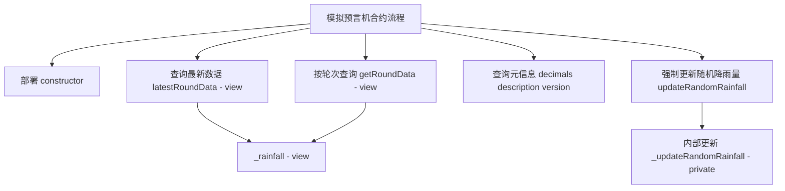
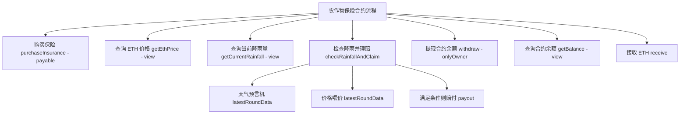

# oracle预言机将现实世界数据加入合约

Day: Day 18
ID: 18
原文: https://www.notion.so/builder-hub/Oracle-Contract-1d95720a23ef801da5afebc5873bcbf5?source=copy_link
状态: 完成
译者: Tian Titian
难度等级: 中级

今日学习内容：

# 🌍**什么是预言机——为什么智能合约需要它们？**

所以想象一下：

你已经构建了一个存在于区块链上的智能合约。它防篡改、透明，并且完全按照编码运行。太神奇了，对吧？

但这里有一个问题：智能合约**无法自行访问外部世界**。他们住在一个密封的盒子里，他们不知道天气如何，以美元计算 ETH 值多少钱，也不知道一场足球比赛是输赢。

这就是**预言机**的用武之地。

> 将预言机想象成一个值得信赖的送货员，他将现实世界的数据带入区块链世界。
> 

它们充当桥梁——安全地将链下数据（如价格、天气或分数）输入智能合约，以便他们做出明智的决策。

---

# 1. 产品需求书

### 合约流程图——模拟预言机



### 合约与函数清单——模拟预言机

| **Contract** | **Type** | **Bases** | **中文说明** |
| --- | --- | --- | --- |
| MockWeatherOracle | Implementation | AggregatorV3Interface, Ownable | 模拟天气预言机，提供降雨量数据接口 |

| **Function Name** | **Visibility** | **Mutability** | **中文说明** |
| --- | --- | --- | --- |
| constructor() | Public | nonpayable | 初始化轮次与时间戳，设置所有者 |
| decimals() returns (uint8) | External | view | 返回小数位（此处为 0，毫米整数） |
| description() returns (string) | External | view | 返回数据源描述字符串 |
| version() returns (uint256) | External | pure | 返回接口版本号 |
| getRoundData(uint80 *roundId*) returns (...) | External | view | 按轮次返回数据与时间戳等字段 |
| latestRoundData() returns (...) | External | view | 返回当前最新一轮的数据与时间戳等字段 |
| _rainfall() returns (int256) | Public | view | 基于区块信息生成伪随机降雨量 |
| updateRandomRainfall() | External | nonpayable | 触发一次内部轮次与时间更新 |
| _updateRandomRainfall() | Private | nonpayable | 内部更新轮次与时间戳（外部不可调用） |

### 合约流程图——农作物保险



### 合约与函数清单——农作物保险

| **Contract** | **Type** | **Bases** | **中文说明** |
| --- | --- | --- | --- |
| CropInsurance | Implementation | Ownable | 天气指数型农险：购买保单、触发理赔、提现与查询 |

| **Function Name** | **Visibility** | **Mutability** | **中文说明** |
| --- | --- | --- | --- |
| constructor(address _weatherOracle, address _ethUsdPriceFeed) | Public | payable | 初始化天气与价格预言机地址，可接收初始资金 |
| purchaseInsurance() | External | payable | 用户按当前 ETH 价支付保费并获得保单 |
| checkRainfallAndClaim() | External | nonpayable | 检查降雨是否低于阈值，若满足则赔付 |
| getEthPrice() returns (uint256) | Public | view | 读取价格预言机，返回 ETH 价格（喂价精度由预言机决定） |
| getCurrentRainfall() returns (uint256) | Public | view | 读取天气预言机，返回当前降雨量（毫米） |
| withdraw() | External | nonpayable | 仅所有者可提现合约全部余额到 owner |
| receive() | External | payable | 接收直接转入的 ETH |
| getBalance() returns (uint256) | Public | view | 返回合约当前 ETH 余额 |

# 2. 细节解说

## 🔗**进入 Chainlink：最受欢迎的预言机网络**

[Chainlink](https://chain.link/) 是去中心化预言机的黄金标准。它为价格馈送、天气、随机性甚至整个数据网络提供安全、防篡改且被 DeFi 项目广泛使用的 API。

Chainlink 具有 `AggregatorV3Interface`等标准接口，使我们能够轻松地将他们的数据馈送集成到我们的智能合约中。

在我们的例子中，我们需要**降雨数据**。现在，虽然 Chainlink 尚未为每个位置提供实时降雨源，但我们将**构建一个模拟天气预言机**，其行为*类似于* Chainlink——非常适合测试和学习。

稍后，一旦可用的 Chainlink 天气预言机可用，您就可以将其换成它。

---

# 🌧️ **我们在构建什么？**

想象一下：

- 农民经常因干旱（雨水不足）而损失农作物。
- 农作物保险通常需要数周或数月才能支付，并且有中间商。
- 如果农民可以购买**区块链驱动的农作物保险**，并在降雨量低于阈值时自动获得报酬，会怎样？

这就是我们正在构建的：

1. **`MockWeatherOracle.sol`** – 模拟 Chainlink 风格的预言机，随机生成降雨值。
2. **`CropInsurance.sol`** – 一个智能合约 :
    - 让农民支付溢价（以 ETH 计），
    - 监测降雨量，
    - 如果降雨量太低，则会自动支付。

让我们分解一下这两种合同，既简单又好。

---

# 🛰️ **模拟预言机**— `MockWeatherOracle.sol`

# MockWeatherOracle.sol — **完整合约代码**

```solidity

// SPDX-License-Identifier: MIT
pragma solidity ^0.8.19;

import "@chainlink/contracts/src/v0.8/interfaces/AggregatorV3Interface.sol";
import "@openzeppelin/contracts/access/Ownable.sol";

contract MockWeatherOracle is AggregatorV3Interface, Ownable {
    uint8 private _decimals;
    string private _description;
    uint80 private _roundId;
    uint256 private _timestamp;
    uint256 private _lastUpdateBlock;

    constructor() Ownable(msg.sender) {
        _decimals = 0; // Rainfall in whole millimeters
        _description = "MOCK/RAINFALL/USD";
        _roundId = 1;
        _timestamp = block.timestamp;
        _lastUpdateBlock = block.number;
    }

    function decimals() external view override returns (uint8) {
        return _decimals;
    }

    function description() external view override returns (string memory) {
        return _description;
    }

    function version() external pure override returns (uint256) {
        return 1;
    }

    function getRoundData(uint80 _roundId_)
        external
        view
        override
        returns (uint80 roundId, int256 answer, uint256 startedAt, uint256 updatedAt, uint80 answeredInRound)
    {
        return (_roundId_, _rainfall(), _timestamp, _timestamp, _roundId_);
    }

    function latestRoundData()
        external
        view
        override
        returns (uint80 roundId, int256 answer, uint256 startedAt, uint256 updatedAt, uint80 answeredInRound)
    {
        return (_roundId, _rainfall(), _timestamp, _timestamp, _roundId);
    }

    // Function to get current rainfall with random variation
    function _rainfall() public view returns (int256) {
        // Use block information to generate pseudo-random variation
        uint256 blocksSinceLastUpdate = block.number - _lastUpdateBlock;
        uint256 randomFactor = uint256(keccak256(abi.encodePacked(
            block.timestamp,
            block.coinbase,
            blocksSinceLastUpdate
        ))) % 1000; // Random number between 0 and 999

        // Return random rainfall between 0 and 999mm
        return int256(randomFactor);
    }

    // Function to update random rainfall
    function _updateRandomRainfall() private {
        _roundId++;
        _timestamp = block.timestamp;
        _lastUpdateBlock = block.number;
    }

    // Function to force update rainfall (anyone can call)
    function updateRandomRainfall() external {
        _updateRandomRainfall();
    }
}

```

---

# 🔍让我们逐行分解

---

## ✅ **许可证和版本**

```solidity

// SPDX-License-Identifier: MIT
pragma solidity ^0.8.19;

```

- `SPDX-License-Identifier`: 一个必需的注释，告诉编译器此代码使用什么许可证。这里是MIT——一个宽松的开源许可证。
- `pragma solidity ^0.8.19;`: 此行锁定要使用 Solidity 版本 **0.8.19 或更高版本**编译的合约，但 **不是 0.9.0 或更高版本**。它确保兼容性并避免未来版本的中断性更改。

---

## 📦  **导入**

```solidity

import "@chainlink/contracts/src/v0.8/interfaces/AggregatorV3Interface.sol";
import "@openzeppelin/contracts/access/Ownable.sol";

```

- **AggregatorV3Interface**: 这是 Chainlink 的标准预言机接口——用于获取价格信息或在我们的例子中模拟降雨等数据。
- **Ownable**: OpenZeppelin 的一个助手，它为我们提供了所有权功能——包括  `owner()` 和`onlyOwner` 修饰符。

💡 类比：将 `Ownable` 视为授予部署者管理员访问权限——当您想要限制谁可以执行某些作（例如，如果需要更新天气数据）时，这很有用。

---

## 🏗️ **合同声明**

```solidity

contract MockWeatherOracle is AggregatorV3Interface, Ownable {

```

我们正在创建一个名为 `MockWeatherOracle`的合约。

它:

- **继承** `AggregatorV3Interface` — 这意味着它必须实现`latestRoundData()`等函数。
- **继承** `Ownable` — 因此我们可以免费获得所有权功能。

---

## 🧮 **状态变量**

```solidity

uint8 private _decimals;
string private _description;
uint80 private _roundId;
uint256 private _timestamp;
uint256 private _lastUpdateBlock;

```

让我们逐一分解：

- `_decimals`: 定义数据的精度。我们的是 `0` ，因为降雨量以整毫米为单位（例如，“542 毫米”）。
- `_description`: Feed 的文字标签（如名称）。
- `_roundId`: 用于模拟不同的数据更新周期（每一轮都是新的读数）。
- `_timestamp`: 记录上次更新发生的时间。
- `_lastUpdateBlock`: 跟踪上次更新发生时的块，用于添加随机性。

---

## 🧱 **构造函数**

```solidity

constructor() Ownable(msg.sender) {
    _decimals = 0;
    _description = "MOCK/RAINFALL/USD";
    _roundId = 1;
    _timestamp = block.timestamp;
    _lastUpdateBlock = block.number;
}

```

这会在首次部署合约时设置初始值。

- `Ownable(msg.sender)` — 将部署者设置为管理员（部署合约的人）。
- `_decimals = 0` — 降雨不需要小数（比如 542.67 毫米？）
- `_description` — 只是一个可读的标签。
- `_roundId` — 从第 1 轮开始。
- `_timestamp` 和 `_lastUpdateBlock` — 存储当前时间/区块以模拟数据的新鲜度。

---

## 📥 **Chainlink 接口函数**

### 1. `decimals()`

```solidity

function decimals() external view override returns (uint8) {
    return _decimals;
}

```

Chainlink 需要这个。它告诉应用程序预期的小数位数。我们返回`0` 。

---

### 2. `description()`

```solidity

function description() external view override returns (string memory) {
    return _description;
}

```

提供人类可读的源描述。

---

### 3. `version()`

```solidity

function version() external pure override returns (uint256) {
    return 1;
}

```

这是我们模拟的`1` 版本。这主要是信息性的。

---

## 🔁 **舍入数据函数**

### 1. `getRoundData()`

```solidity

function getRoundData(uint80 _roundId_)
    external
    view
    override
    returns (uint80 roundId, int256 answer, uint256 startedAt, uint256 updatedAt, uint80 answeredInRound)
{
    return (_roundId_, _rainfall(), _timestamp, _timestamp, _roundId_);
}

```

这模拟了 Chainlink 访问历史数据的标准功能。

它返回：

- 您请求的轮次 ID
- 模拟降雨量值
- 两次相同的时间戳（为简单起见，此处不做区分）
- `answeredInRound` 的轮次 ID 相同

在真正的预言机中，`startedAt` 和 `updatedAt`可能不同。我们在这里简化它。

---

### 2. `latestRoundData()`

```solidity

function latestRoundData()
    external
    view
    override
    returns (uint80 roundId, int256 answer, uint256 startedAt, uint256 updatedAt, uint80 answeredInRound)
{
    return (_roundId, _rainfall(), _timestamp, _timestamp, _roundId);
}

```

这是最重要的功能——应用程序使用它来获取**最新数据**。

我们返回：

- 当前轮次 ID
- 随机降雨量值
- 时间戳
- 轮次 ID 确认

💡 此函数是 `CropInsurance` 合约将调用的函数，以获取当前降雨量。

---

## 🌧️ `_rainfall()` — **模拟降雨发生器**

```solidity

function _rainfall() public view returns (int256) {
    uint256 blocksSinceLastUpdate = block.number - _lastUpdateBlock;
    uint256 randomFactor = uint256(keccak256(abi.encodePacked(
        block.timestamp,
        block.coinbase,
        blocksSinceLastUpdate
    ))) % 1000;

    return int256(randomFactor);
}

```

以下是随机降雨背后的魔力：

1. 我们计算自上次更新以来经过的区块数。
2. 我们结合：
    - `block.timestamp` — 当前时间
    - `block.coinbase` — 矿工地址（一些熵）
    - `blocksSinceLastUpdate`
3. 所有内容均使用安全哈希函数`keccak256`进行哈希处理。
4. 使用 `% 1000`将结果转换为 0-999 之间的整数。

因此，每次调用此函数时，您都会得到一个新的伪随机降雨值——介于 **0 到 999mm** 之间。

> ⚠️ 注意：这不是安全随机性。但对于模拟预言机来说，这完全没问题。
> 

---

## 📅 `_updateRandomRainfall()`

```solidity

function _updateRandomRainfall() private {
    _roundId++;
    _timestamp = block.timestamp;
    _lastUpdateBlock = block.number;
}

```

一个辅助函数，用于：

- 增加轮数（模拟新数据）
- 记录新数据的创建时间

这将在现实生活中由 Chainlink 节点完成。在这里，我们手动模拟它。

---

## 🔁 `updateRandomRainfall()`

```solidity

function updateRandomRainfall() external {
    _updateRandomRainfall();
}

```

这是任何人都可以调用的 **public** 函数来更新“预言机”数据。

> 您可以通过“获取最新降雨量”等 UI 按钮调用此按钮，这对于测试或模拟新的一天很有用。
> 

---

# ✅ **总结：我们学到了什么？**

- 我们创建了一个虚假的天气数据预言机，其作用类似于 Chainlink 数据馈送。
- 它返回伪随机降雨值以模拟真实世界的输入。
- 它实现了`AggregatorV3Interface`的所有必需功能。
- 您可以使用它代替真正的 Chainlink 预言机来测试保险、游戏或任何对降雨做出反应的逻辑。

---

# 🌾 **农作物保险** — `CropInsurance.sol`

该合约模拟了基于区块链的农作物保险计划。农民可以支付少量溢价，如果降雨量低于阈值，他们会自动获得报酬——没有中间商，没有等待。

---

## 📜 完整合约

```solidity

// SPDX-License-Identifier: MIT
pragma solidity ^0.8.19;

import "@chainlink/contracts/src/v0.8/interfaces/AggregatorV3Interface.sol";
import "@openzeppelin/contracts/access/Ownable.sol";

contract CropInsurance is Ownable {
    AggregatorV3Interface private weatherOracle;
    AggregatorV3Interface private ethUsdPriceFeed;

    uint256 public constant RAINFALL_THRESHOLD = 500;
    uint256 public constant INSURANCE_PREMIUM_USD = 10;
    uint256 public constant INSURANCE_PAYOUT_USD = 50;

    mapping(address => bool) public hasInsurance;
    mapping(address => uint256) public lastClaimTimestamp;

    event InsurancePurchased(address indexed farmer, uint256 amount);
    event ClaimSubmitted(address indexed farmer);
    event ClaimPaid(address indexed farmer, uint256 amount);
    event RainfallChecked(address indexed farmer, uint256 rainfall);

    constructor(address _weatherOracle, address _ethUsdPriceFeed) payable Ownable(msg.sender) {
        weatherOracle = AggregatorV3Interface(_weatherOracle);
        ethUsdPriceFeed = AggregatorV3Interface(_ethUsdPriceFeed);
    }

    function purchaseInsurance() external payable {
        uint256 ethPrice = getEthPrice();
        uint256 premiumInEth = (INSURANCE_PREMIUM_USD * 1e18) / ethPrice;

        require(msg.value >= premiumInEth, "Insufficient premium amount");
        require(!hasInsurance[msg.sender], "Already insured");

        hasInsurance[msg.sender] = true;
        emit InsurancePurchased(msg.sender, msg.value);
    }

    function checkRainfallAndClaim() external {
        require(hasInsurance[msg.sender], "No active insurance");
        require(block.timestamp >= lastClaimTimestamp[msg.sender] + 1 days, "Must wait 24h between claims");

        (
            uint80 roundId,
            int256 rainfall,
            ,
            uint256 updatedAt,
            uint80 answeredInRound
        ) = weatherOracle.latestRoundData();

        require(updatedAt > 0, "Round not complete");
        require(answeredInRound >= roundId, "Stale data");

        uint256 currentRainfall = uint256(rainfall);
        emit RainfallChecked(msg.sender, currentRainfall);

        if (currentRainfall < RAINFALL_THRESHOLD) {
            lastClaimTimestamp[msg.sender] = block.timestamp;
            emit ClaimSubmitted(msg.sender);

            uint256 ethPrice = getEthPrice();
            uint256 payoutInEth = (INSURANCE_PAYOUT_USD * 1e18) / ethPrice;

            (bool success, ) = msg.sender.call{value: payoutInEth}("");
            require(success, "Transfer failed");

            emit ClaimPaid(msg.sender, payoutInEth);
        }
    }

    function getEthPrice() public view returns (uint256) {
        (
            ,
            int256 price,
            ,
            ,
        ) = ethUsdPriceFeed.latestRoundData();

        return uint256(price);
    }

    function getCurrentRainfall() public view returns (uint256) {
        (
            ,
            int256 rainfall,
            ,
            ,
        ) = weatherOracle.latestRoundData();

        return uint256(rainfall);
    }

    function withdraw() external onlyOwner {
        payable(owner()).transfer(address(this).balance);
    }

    receive() external payable {}

    function getBalance() public view returns (uint256) {
        return address(this).balance;
    }
}

```

---

## 🧱 **构造函数**

```solidity

constructor(address _weatherOracle, address _ethUsdPriceFeed) payable Ownable(msg.sender) {
    weatherOracle = AggregatorV3Interface(_weatherOracle);
    ethUsdPriceFeed = AggregatorV3Interface(_ethUsdPriceFeed);
}

```

**逐行解释：**

- `constructor(...)`: 此特殊函数在部署合约时运行**一次**。
- `address _weatherOracle`: 这是我们的降雨预言机的地址（就像我们之前构建的模拟一样）。
- `address _ethUsdPriceFeed`: 这是 Chainlink 价格馈送的地址，可为我们提供 ETH → USD 的转换。
- `Ownable(msg.sender)`: 将合约管理员初始化为部署它的人。
- 我们保存两个预言机地址以供以后的函数使用。

---

## 💸 `purchaseInsurance()`

```solidity

function purchaseInsurance() external payable {
    uint256 ethPrice = getEthPrice();
    uint256 premiumInEth = (INSURANCE_PREMIUM_USD * 1e18) / ethPrice;

    require(msg.value >= premiumInEth, "Insufficient premium amount");
    require(!hasInsurance[msg.sender], "Already insured");

    hasInsurance[msg.sender] = true;
    emit InsurancePurchased(msg.sender, msg.value);
}

```

**逐行解释：**

- `external payable`:该函数可以直接从用户那里接收 ETH。
- `getEthPrice()`: 我们使用 Chainlink 获取 ETH 的当前美元价格。
- `premiumInEth`: 我们将 10 美元的溢价转换为 ETH（乘以  `1e18` 以获得 wei 精度）。
- `require(msg.value >= ...)`: 检查用户是否发送了**足够**的 ETH。
- `require(!hasInsurance[msg.sender])`: 防止用户两次购买保险。
- `hasInsurance[msg.sender] = true`: 将用户标记为已投保。
- `emit InsurancePurchased(...)`: 发出前端可以监听的事件。

---

## ⛅ `checkRainfallAndClaim()`

```solidity

function checkRainfallAndClaim() external {
    require(hasInsurance[msg.sender], "No active insurance");
    require(block.timestamp >= lastClaimTimestamp[msg.sender] + 1 days, "Must wait 24h between claims");

```

- 此功能**仅适用于受保用户**。
- 我们在声明之间强制执行**1 天的冷却**，以避免垃圾邮件。

```solidity

    (
        uint80 roundId,
        int256 rainfall,
        ,
        uint256 updatedAt,
        uint80 answeredInRound
    ) = weatherOracle.latestRoundData();

```

- 从我们的天气预言机中提取最新的降雨数据。
- 我们使用 **解构** 来忽略不需要的值。

```solidity

    require(updatedAt > 0, "Round not complete");
    require(answeredInRound >= roundId, "Stale data");

```

- 基本检查以确保预言机数据是最新且有效的。

```solidity

    uint256 currentRainfall = uint256(rainfall);
    emit RainfallChecked(msg.sender, currentRainfall);

```

- 将降雨量转换为无符号格式。
- 发出一个事件，以便用户/前端可以跟踪他们所评估的降雨量。

---

## 💵  **索赔和支付逻辑**

```solidity

    if (currentRainfall < RAINFALL_THRESHOLD) {
        lastClaimTimestamp[msg.sender] = block.timestamp;
        emit ClaimSubmitted(msg.sender);

```

- 如果降雨量**低于干旱阈值**，索赔流程将继续进行。
- 记录时间以防止背靠背索赔
- 发出 `ClaimSubmitted`事件。

```solidity

        uint256 ethPrice = getEthPrice();
        uint256 payoutInEth = (INSURANCE_PAYOUT_USD * 1e18) / ethPrice;

```

- 使用实时汇率将 50 美元的支出转换为 ETH。

```solidity

        (bool success, ) = msg.sender.call{value: payoutInEth}("");
        require(success, "Transfer failed");

```

- 将 ETH 转移给农民。
- 我们检查传输是否成功。

```solidity

        emit ClaimPaid(msg.sender, payoutInEth);
    }
}

```

- 发出 `ClaimPaid` 事件进行跟踪。

---

## 📈实用函数

### `getEthPrice()`

```solidity

function getEthPrice() public view returns (uint256) {
    (, int256 price, , , ) = ethUsdPriceFeed.latestRoundData();
    return uint256(price);
}

```

### 🧠 **它的作用**:

- 此功能与 **Chainlink** 对话，它为我们提供了**以美元计价的最新 ETH 价格**。
- 它返回的 `price` 并不是直接的实际价值——它带有**8 位额外的数字**。

---

### 📦 **示例：**

假设 Chainlink 需要返回：

```solidity

price = 254000000000

```

**那是$2,540.00000000** — 基本上是 `$2,540` ，末尾有 8 位小数。

因此，要正确阅读它，只需**将输出除以 100,000,000**（又名 `1e8` ）

```

Actual ETH price = 254000000000 / 100000000 = $2,540
```

---

### 💵 **我们如何使用它？**

假设有人发送了 **0.1 ETH**，您想知道这是多少美元。

---

### 逐步学习:

1 ETH = $2,540

0.1 ETH = 0.1 × 2,540 = **$254**

在合约中：

```solidity
ethAmount = 0.1 ether = 100000000000000000 wei  // 18 decimals
ethPrice  = 254000000000                       // 8 decimals

usdValue = (ethAmount * ethPrice) / 1e18
         = (100000000000000000 * 254000000000) / 1e18
         = 25400000000
```

现在将其除以 `1e8` （Solidity 外部）得到：

```

usdValue = 25400000000 / 1e8 = $254
```

### `getCurrentRainfall()`

```solidity

function getCurrentRainfall() public view returns (uint256) {
    (, int256 rainfall, , , ) = weatherOracle.latestRoundData();
    return uint256(rainfall);
}

```

- 让任何人都可以查看当前降雨量——对仪表板或浏览器很有用。

---

## 🔐 **管理员 + 后备**

```solidity

function withdraw() external onlyOwner {
    payable(owner()).transfer(address(this).balance);
}

```

- 让合约所有者提取所有收集的 ETH（例如，未使用的溢价）

```solidity

receive() external payable {}

```

- 该函数允许合约**无需调用函数**接收 ETH。

```solidity

function getBalance() public view returns (uint256) {
    return address(this).balance;
}

```

- 允许任何人查看合约当前持有多少 ETH。

---

# 🧪 **如何使用它（测试工作流程）**

1. 部署 `MockWeatherOracle`
2. 部署`CropInsurance` :
    - 天气预言机地址
    - Chainlink ETH/USD 预言机地址（或其他模拟）
3. 调用 `updateRandomRainfall()` 来模拟天气
4. 使用 `purchaseInsurance()` 支付保费
5. 调用 `checkRainfallAndClaim()` 并查看是否发生付款

---

# 🎉 **总结**

您现在了解了：

- 什么是预言机以及 Chainlink 如何将智能合约连接到现实世界。
- 如何模拟预言机进行测试。
- 如何使用 Solidity 和 Chainlink 风格的提要构建功能齐全的保险 dApp。
- 为什么事件‘ `msg.sender`,映射和安全传输在 dApp 开发中至关重要。

如果您想要前端演练、Chainlink 模拟部署脚本或使用 Hardhat 或 Foundry 进行测试覆盖率，请告诉我。