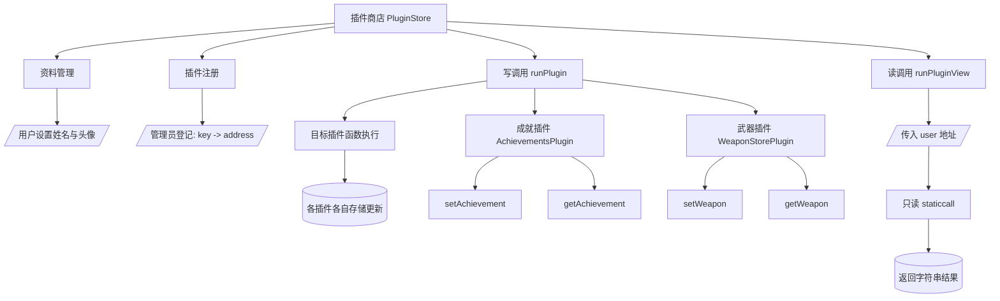

# 模块化的玩家配置文件系统 - delegatecall

Day: Day 16
ID: 16
原文: https://www.notion.so/PluginStore-Contract-1d75720a23ef803693fafcd0f7fdb162?source=copy_link
状态: 完成
译者: 禾
难度等级: 中级

# 今日学习内容：

想象一下你正在构建一个 Web3 游戏——带有背景故事、战斗、角色成长，甚至可能还有交易。自然地，每个玩家都有 **个人资料** ——他们的名字、头像、装备的武器、成就、社交链接、战斗记录…

现在这里有一个问题：

如果你试图将所有这些内容塞进一个智能合约中，很快就会变得臃肿不堪。你会遇到存储限制、升级问题，并且会失去灵活性。

那如果我们把整个东西**模块化**呢？

我们不再使用一个庞大的合约，而是构建一个**轻量级的核心资料合约**，只存储名称和头像...

...然后让用户可以"安装"可选的**功能插件**——这些是处理特定事务的小型智能合约，比如成就、物品栏、战斗统计或社交活动。

就像**玩家用的模组**一样。即插即用，上链。

但要让这一切起作用，核心合约需要以某种方式调用这些插件合约。这就是神奇的地方：

> 欢迎来到 Solidity 中的调用世界——这是实现模块化、可升级性和智能合约灵活性的入口。
> 

# 1. 产品需求书

1. 用户路径图/ 合约流程图（Mermaid）



b. 数据库结构表

合约与函数清单

| Contract | Type | Bases |
| --- | --- | --- |
| PluginStore | Implementation |  |
| └ Function Name | Visibility | Mutability |
| └ setProfile | External ❗️ | 🛑 |
| └ getProfile | External ❗️ |  |
| └ registerPlugin | External ❗️ | 🛑 |
| └ getPlugin | External ❗️ |  |
| └ runPlugin | External ❗️ | 🛑 |
| └ runPluginView | External ❗️ |  |
| AchievementsPlugin | Implementation |  |
| └ Function Name | Visibility | Mutability |
| └ setAchievement | Public ❗️ | 🛑 |
| └ getAchievement | Public ❗️ |  |
| WeaponStorePlugin | Implementation |  |
| └ Function Name | Visibility | Mutability |
| └ setWeapon | Public ❗️ | 🛑 |
| └ getWeapon | Public ❗️ |  |

# 2. 细节解说

## 🧩 **谈谈调用：`call`、`delegatecall` 和 `staticcall`**

[🧩](data:image/gif;base64,R0lGODlhAQABAIAAAP///wAAACH5BAEAAAAALAAAAAABAAEAAAICRAEAOw==)

Solidity 为我们提供了几种与其它合约交互的方式。理解这些将帮助我们了解这个系统的运作机制。

---

### 🔁**`call`**

[🔁](data:image/gif;base64,R0lGODlhAQABAIAAAP///wAAACH5BAEAAAAALAAAAAABAAEAAAICRAEAOw==)

最常见的一种。

- 你正在告诉**另一个合约**做某事。
- 该合同使用  **它自己的状态**  和  **它自己的存储** 。
- 通常用于与外部系统交互（例如一个 ERC-20 代币）。

 📦*示例：* “嘿 Token 合约，将 100 个代币转账给 Bob。”

---

### 🧠**`delegatecall`**

[📦](data:image/gif;base64,R0lGODlhAQABAIAAAP///wAAACH5BAEAAAAALAAAAAABAAEAAAICRAEAOw==)

[🧠](data:image/gif;base64,R0lGODlhAQABAIAAAP///wAAACH5BAEAAAAALAAAAAABAAEAAAICRAEAOw==)

这是智能的那个。

- 你是在从另一个合约中**借用逻辑** ……
- 但你是在**你的合约的存储上下文中**运行它。
- 意思是数据存放在你的合约中，但逻辑来自其他地方。

 🎮*示例：* “嘿合约，用你的函数来存储这些数据——但要存储在我的存储中，而不是你的。”

[🎮](data:image/gif;base64,R0lGODlhAQABAIAAAP///wAAACH5BAEAAAAALAAAAAABAAEAAAICRAEAOw==)

这就是我们构建可升级合约或代理模式等的方法

---

### 🔍**`staticcall`**

[🔍](data:image/gif;base64,R0lGODlhAQABAIAAAP///wAAACH5BAEAAAAALAAAAAABAAEAAAICRAEAOw==)

就像 `call` 一样，但只读。

- 不允许存储更改。
- 非常适合查看或纯函数。

 📖 *示例：* “嘿合约，就给我展示一下合约里存了什么”

---

[📖](data:image/gif;base64,R0lGODlhAQABAIAAAP///wAAACH5BAEAAAAALAAAAAABAAEAAAICRAEAOw==)

## 🎮**游戏计划：构建我们的模块化玩家系统**

[🎮](data:image/gif;base64,R0lGODlhAQABAIAAAP///wAAACH5BAEAAAAALAAAAAABAAEAAAICRAEAOw==)

这是我们在构建的：

我们游戏世界的中心是 **插件商店** — 核心合约，存储每位玩家的  **个人资料** ：仅包括他们的姓名和头像。简单、干净、专注。

但这个世界中的玩家们想要的不只是一个名字和一个面容。

他们想要成就、武器、徽章。也许甚至是一个帮派系统。

所以我们没有将所有功能都塞进核心合约中，而是让玩家**附加功能模块** ——我们称之为**插件** 。

每个插件都是一个独立的合约，负责特定功能。而且由于插件是模块化的，我们可以在任何时候升级、替换或添加新的插件——无需重新部署整个系统。

---

## ****🧩**我们的插件库**

[🧩](data:image/gif;base64,R0lGODlhAQABAIAAAP///wAAACH5BAEAAAAALAAAAAABAAEAAAICRAEAOw==)

首先，我们将构建：

- 🏆 **`AchievementsPlugin`**– 存储玩家最近获得的成就
- ⚔️ **`WeaponStorePlugin`** – 存储玩家装备的武器

[🏆](data:image/gif;base64,R0lGODlhAQABAIAAAP///wAAACH5BAEAAAAALAAAAAABAAEAAAICRAEAOw==)

[⚔️](data:image/gif;base64,R0lGODlhAQABAIAAAP///wAAACH5BAEAAAAALAAAAAABAAEAAAICRAEAOw==)

这些插件不是独立运行的——**PluginStore** 会动态调用它们：

- 对于状态改变的操作（如设置武器），我们使用 **`call`**
- 对于只读查询（如检查玩家的成就），我们使用 **`staticcall`**

如果我们想要共享存储（比如在可升级系统中），甚至可以替换为 **`delegatecall`** — 但目前，`call` 和 `staticcall` 使事情保持简单和安全。

## 🔌 **PluginStore – 我们模块化游戏系统的核心**

[🔌](data:image/gif;base64,R0lGODlhAQABAIAAAP///wAAACH5BAEAAAAALAAAAAABAAEAAAICRAEAOw==)

本合同定义了**玩家资料中心** ——每位玩家都有一个基本资料（姓名和头像），他们可以通过插件连接附加功能。

让我们逐行深入并解释正在发生的事情。

```solidity
// SPDX-License-Identifier: MIT
pragma solidity ^0.8.0;

contract PluginStore {
    struct PlayerProfile {
        string name;
        string avatar;
    }

    mapping(address => PlayerProfile) public profiles;

    // === Multi-plugin support ===
    mapping(string => address) public plugins;

    // ========== Core Profile Logic ==========

    function setProfile(string memory _name, string memory _avatar) external {
        profiles[msg.sender] = PlayerProfile(_name, _avatar);
    }

    function getProfile(address user) external view returns (string memory, string memory) {
        PlayerProfile memory profile = profiles[user];
        return (profile.name, profile.avatar);
    }

    // ========== Plugin Management ==========

    function registerPlugin(string memory key, address pluginAddress) external {
        plugins[key] = pluginAddress;
    }

    function getPlugin(string memory key) external view returns (address) {
        return plugins[key];
    }

    // ========== Plugin Execution ==========
function runPlugin(
    string memory key,
    string memory functionSignature,
    address user,
    string memory argument
) external {
    address plugin = plugins[key];
    require(plugin != address(0), "Plugin not registered");

    bytes memory data = abi.encodeWithSignature(functionSignature, user, argument);
    (bool success, ) = plugin.call(data);
    require(success, "Plugin execution failed");
}

function runPluginView(
    string memory key,
    string memory functionSignature,
    address user
) external view returns (string memory) {
    address plugin = plugins[key];
    require(plugin != address(0), "Plugin not registered");

    bytes memory data = abi.encodeWithSignature(functionSignature, user);
    (bool success, bytes memory result) = plugin.staticcall(data);
    require(success, "Plugin view call failed");

    return abi.decode(result, (string));
}

}
```

### 🧱 **合同设置**

[🧱](data:image/gif;base64,R0lGODlhAQABAIAAAP///wAAACH5BAEAAAAALAAAAAABAAEAAAICRAEAOw==)

```solidity
// SPDX-License-Identifier: MIT
pragma solidity ^0.8.0;
```

标准许可证和编译器版本。我们使用的是 Solidity `0.8.x`，它自带了溢出检查功能。

---

### 👤 **玩家资料**

[👤](data:image/gif;base64,R0lGODlhAQABAIAAAP///wAAACH5BAEAAAAALAAAAAABAAEAAAICRAEAOw==)

```solidity
struct PlayerProfile {
    string name;
    string avatar;
}
```

我们定义了一个结构体来存储每个玩家的  **姓名**  和  **头像** 。这使基本资料保持轻量级和专注。

---

```solidity
mapping(address => PlayerProfile) public profiles;
```

这个映射将每个以太坊地址（玩家）与其 `PlayerProfile` 关联起来。

- `profiles[msg.sender] = ...` 将为调用者存储一个个人资料。
- 由于它标记为 `public` ，Solidity 会自动生成一个获取器。

### 🧩 **插件注册表**

[🧩](data:image/gif;base64,R0lGODlhAQABAIAAAP///wAAACH5BAEAAAAALAAAAAABAAEAAAICRAEAOw==)

```solidity
mapping(string => address) public plugins;
```

我们使用这个映射来通过字符串键（如 "`achievements`" 或 "`weapons`"）注册插件，并将它们映射到部署的合约地址。

这是插件目录。每个插件在使用前都必须注册。

---

### **setProfile**

```solidity
function setProfile(string memory _name, string memory _avatar) external {
    profiles[msg.sender] = PlayerProfile(_name, _avatar);
}
```

### ✅ **功能说明：**

[✅](data:image/gif;base64,R0lGODlhAQABAIAAAP///wAAACH5BAEAAAAALAAAAAABAAEAAAICRAEAOw==)

允许玩家  **创建或更新**  他们的个人资料，通过设置名称和头像。

### ****🔍 **逐行说明：**

[🔍](data:image/gif;base64,R0lGODlhAQABAIAAAP///wAAACH5BAEAAAAALAAAAAABAAEAAAICRAEAOw==)

- `function setProfile(...)`：这个函数是**公开可调用的** ，所以任何玩家都可以设置自己的个人资料。
- `msg.sender`: 这是调用函数的人的地址——我们用它作为键来存储他们的个人资料。
- `PlayerProfile(_name, _avatar)`：我们直接在行内创建了一个结构体实例。
- `profiles[msg.sender] = ...`: 我们将结构体分配给调用者的地址在映射中。这会写入合约存储。

---

### **getProfile**

```solidity
function getProfile(address user) external view returns (string memory, string memory) {
    PlayerProfile memory profile = profiles[user];
    return (profile.name, profile.avatar);
}
```

### ✅ **功能说明：**

[✅](data:image/gif;base64,R0lGODlhAQABAIAAAP///wAAACH5BAEAAAAALAAAAAABAAEAAAICRAEAOw==)

允许  **任何人**  使用钱包地址查询玩家的个人资料。

### ****🔍 **逐行说明：**

[🔍](data:image/gif;base64,R0lGODlhAQABAIAAAP///wAAACH5BAEAAAAALAAAAAABAAEAAAICRAEAOw==)

- `external view`: 该函数不改变状态——它是只读的。
- `PlayerProfile memory profile = ...`: 我们从存储中获取资料并复制到内存。
- `return (...)`: 返回名称和头像，用于在前端或 UI 中显示。

---

## ****🧩 **插件管理功能**

[🧩](data:image/gif;base64,R0lGODlhAQABAIAAAP///wAAACH5BAEAAAAALAAAAAABAAEAAAICRAEAOw==)

### **`registerPlugin`**

```solidity
function registerPlugin(string memory key, address pluginAddress) external {
    plugins[key] = pluginAddress;
}
```

### ✅ **功能说明：**

[✅](data:image/gif;base64,R0lGODlhAQABAIAAAP///wAAACH5BAEAAAAALAAAAAABAAEAAAICRAEAOw==)

使用类似`"achievements"` 或 `"weapons"`这样的人类可读键来注册插件合约。

### 🔍 **逐行说明：**

[🔍](data:image/gif;base64,R0lGODlhAQABAIAAAP///wAAACH5BAEAAAAALAAAAAABAAEAAAICRAEAOw==)

- `string memory key`: 用于识别插件的名称——可以将其视为 URL 别名或插件名称。
- `address pluginAddress`: 你要注册的插件的智能合约地址。
- `plugins[key] = pluginAddress`: 将插件添加到系统中，以便后续使用。

📌 这使得您的插件  *可被核心合约发现* 。

---

[📌](data:image/gif;base64,R0lGODlhAQABAIAAAP///wAAACH5BAEAAAAALAAAAAABAAEAAAICRAEAOw==)

### `getPlugin`

```solidity
function getPlugin(string memory key) external view returns (address) {
    return plugins[key];
}
```

### ✅ **功能说明：**

[✅](data:image/gif;base64,R0lGODlhAQABAIAAAP///wAAACH5BAEAAAAALAAAAAABAAEAAAICRAEAOw==)

返回插件地址，使用其键。

适用于 UI 工具或验证插件是否已注册。

---

## ⚙️ **插件执行函数**

[⚙️](data:image/gif;base64,R0lGODlhAQABAIAAAP///wAAACH5BAEAAAAALAAAAAABAAEAAAICRAEAOw==)

### **`runPlugin`**

```solidity
function runPlugin(
    string memory key,
    string memory functionSignature,
    address user,
    string memory argument
) external {
    address plugin = plugins[key];
    require(plugin != address(0), "Plugin not registered");

    bytes memory data = abi.encodeWithSignature(functionSignature, user, argument);
    (bool success, ) = plugin.call(data);
    require(success, "Plugin execution failed");
}
```

### ✅ **功能说明：**

[✅](data:image/gif;base64,R0lGODlhAQABAIAAAP///wAAACH5BAEAAAAALAAAAAABAAEAAAICRAEAOw==)

发送一个**改变状态的函数调用**到插件合约。

真正的灵活性就在于此——它允许你使用其签名调用插件上的*任何*函数。

### 🔍 **逐行说明：**

[🔍](data:image/gif;base64,R0lGODlhAQABAIAAAP///wAAACH5BAEAAAAALAAAAAABAAEAAAICRAEAOw==)

1. `address plugin = plugins[key];`
    - 我们使用键 `"achievements"` 来获取插件地址。
2. `require(plugin != address(0), ...)`
    - 确保插件确实已注册——否则我们将中止。
3. `abi.encodeWithSignature(...)`
    - 这是最棘手的部分：
        - 我们正在从字符串构建一个低级函数调用。
        - `functionSignature` 看起来像： `"setAchievement(address,string)"`
        - 我们将它与提供的参数( `user`, `argument` )结合，构建原始字节码。
4. `plugin.call(data)`
    - 低级 `call` 将请求发送到插件合约。
    - 插件在**它自己的存储上下文中**执行， **不是**在 PluginStore 中。
5. `require(success, ...)`
    - 如果插件失败（由于无效参数或逻辑错误），整个交易将回滚。

📦 这允许  **写入状态的插件方法**  — 例如更新玩家的武器或成就。

---

[📦](data:image/gif;base64,R0lGODlhAQABAIAAAP///wAAACH5BAEAAAAALAAAAAABAAEAAAICRAEAOw==)

### **`runPluginView`**

```solidity
function runPluginView(
    string memory key,
    string memory functionSignature,
    address user
) external view returns (string memory) {
    address plugin = plugins[key];
    require(plugin != address(0), "Plugin not registered");

    bytes memory data = abi.encodeWithSignature(functionSignature, user);
    (bool success, bytes memory result) = plugin.staticcall(data);
    require(success, "Plugin view call failed");

    return abi.decode(result, (string));
}
```

### ✅ **功能说明：**

[✅](data:image/gif;base64,R0lGODlhAQABAIAAAP///wAAACH5BAEAAAAALAAAAAABAAEAAAICRAEAOw==)

调用插件合约上的  **只读函数**  并返回结果。

### 🔍 **逐行说明：**

[🔍](data:image/gif;base64,R0lGODlhAQABAIAAAP///wAAACH5BAEAAAAALAAAAAABAAEAAAICRAEAOw==)

1. `address plugin = plugins[key];`
    - 与之前一样获取插件。
2. `abi.encodeWithSignature(...)`
    - 仅使用用户地址准备函数调用所需的数据。
3. `plugin.staticcall(data)`
    - 与 call 不同，staticcall  **不能改变状态**  — 它是只读的。
    - 非常适合像 getWeapon() 或 getAchievement() 这样的函数。
4. `require(success, ...)`
    - 如果插件失败（例如，无效地址或错误的签名），调用将被撤销。
5. `abi.decode(...)`
    - 将返回的字节转换为字符串，以便我们可以将其返回给调用者。

📌  对于希望高效且无风险地  **获取插件数据**  的  **前端应用**  来说，这个函数非常出色。

[📌](data:image/gif;base64,R0lGODlhAQABAIAAAP///wAAACH5BAEAAAAALAAAAAABAAEAAAICRAEAOw==)

## 🏆 **成就插件 — 玩家里程碑的附加逻辑**

[🏆](data:image/gif;base64,R0lGODlhAQABAIAAAP///wAAACH5BAEAAAAALAAAAAABAAEAAAICRAEAOw==)

这份合同是一个**插件** ，用于存储每位玩家的**最新解锁的成就** ——比如`"First Blood"`, `"Master Collector"`, or `"Top 1%"`。

它被设计为通过像 `runPlugin(...)` 这样的函数由 `PluginStore` 合约使用。这就是为什么逻辑简单且专注——它是一个  **隔离模块** ，负责一件事情： **追踪成就** 。

我们来分解一下。

---

### ✅ **完整合同（供参考）**

[✅](data:image/gif;base64,R0lGODlhAQABAIAAAP///wAAACH5BAEAAAAALAAAAAABAAEAAAICRAEAOw==)

```solidity
// SPDX-License-Identifier: MIT
pragma solidity ^0.8.0;
contract AchievementsPlugin {
    // user => achievement string
    mapping(address => string) public latestAchievement;

    // Set achievement for a user (called by PluginStore)
    function setAchievement(address user, string memory achievement) public {
        latestAchievement[user] = achievement;
    }

    // Get achievement for a user
    function getAchievement(address user) public view returns (string memory) {
        return latestAchievement[user];
    }
}
```

### 📦 **状态变量**

[📦](data:image/gif;base64,R0lGODlhAQABAIAAAP///wAAACH5BAEAAAAALAAAAAABAAEAAAICRAEAOw==)

```solidity
mapping(address => string) public latestAchievement;
```

### ✅ 功能说明

[✅](data:image/gif;base64,R0lGODlhAQABAIAAAP///wAAACH5BAEAAAAALAAAAAABAAEAAAICRAEAOw==)

跟踪每个玩家最近解锁的最新成就。

- `address`是玩家的钱包。
- `string`是成就的名称（例如`"First Kill"` 或 `"Treasure Hunter"`）。
- 它被标记为 `public` ，这意味着 Solidity 会自动免费创建一个 getter 函数：

→ `latestAchievement(address)` → `string`

### **为什么这样构造：**

这是一种将字符串与每个玩家地址相关联的**简单直接的方法** 。

### 🛠️ `setAchievement`

[🛠️](data:image/gif;base64,R0lGODlhAQABAIAAAP///wAAACH5BAEAAAAALAAAAAABAAEAAAICRAEAOw==)

```solidity
function setAchievement(address user, string memory achievement) public {
    latestAchievement[user] = achievement;
}
```

### ✅ 功能说明**：**

[✅](data:image/gif;base64,R0lGODlhAQABAIAAAP///wAAACH5BAEAAAAALAAAAAABAAEAAAICRAEAOw==)

更新特定用户的最新成就字符串。

### 🔍 **逐行说明：**

[🔍](data:image/gif;base64,R0lGODlhAQABAIAAAP///wAAACH5BAEAAAAALAAAAAABAAEAAAICRAEAOw==)

- `function setAchievement(...)`：这是修改状态的主要设置函数。
- `address user`: 正在更新成就的玩家。这是手动传递的（而不是使用 `msg.sender`），因为 **PluginStore** 是代表玩家调用这个的。
- `string memory achievement`: 要存储的成就名称。
- `latestAchievement[user] = achievement;`: 更新映射。简单的赋值操作。

### 🧠 **为什么这样写：**

[🧠](data:image/gif;base64,R0lGODlhAQABAIAAAP///wAAACH5BAEAAAAALAAAAAABAAEAAAICRAEAOw==)

- **插件商店处理访问控制**  — 这个功能有意保持开放，以便插件可以在任何地方重用。
- 我们使用标准的设置器模式，以便 PluginStore 可以将其调用委托出去。

---

### 🔍 `getAchievement`

[🔍](data:image/gif;base64,R0lGODlhAQABAIAAAP///wAAACH5BAEAAAAALAAAAAABAAEAAAICRAEAOw==)

```solidity
function getAchievement(address user) public view returns (string memory) {
    return latestAchievement[user];
}
```

[✅](data:image/gif;base64,R0lGODlhAQABAIAAAP///wAAACH5BAEAAAAALAAAAAABAAEAAAICRAEAOw==)

### ✅ 功能说明

获取特定用户解锁的最新成就。

### 🔍 **逐行说明：**

[🔍](data:image/gif;base64,R0lGODlhAQABAIAAAP///wAAACH5BAEAAAAALAAAAAABAAEAAAICRAEAOw==)

- `public view`: 这是一个**只读**函数。
- `returns (string memory)`: 它从映射中返回字符串值。
- `latestAchievement[user]`: 从映射中进行简单查询。

### **如果存在公共的 getter，为什么还要使用自定义的？**

这提供了更大的灵活性——例如，你之后可以：

- 添加格式
- 与元数据结合
- 返回多个成就

所以这个 getter 是明确定义的，为了未来兼容性和清晰性。

## ⚔️ **武器商店插件 — 以模块化方式追踪装备的武器**

[⚔️](data:image/gif;base64,R0lGODlhAQABAIAAAP///wAAACH5BAEAAAAALAAAAAABAAEAAAICRAEAOw==)

在许多游戏中，每个玩家可以携带或装备武器——比如剑、弓、激光枪或某些自定义物品。这个插件处理的就是这些。

就像 `AchievementsPlugin` 一样，这个合约设计为通过  **主`PluginStore`合约**  来使用。它存储每个玩家的  **当前装备的武器** ，并允许核心合约  **设置**  和  **获取**  该武器。

让我们逐行分析代码并逐一解释。

---

### 🔍 **完整合约**

[🔍](data:image/gif;base64,R0lGODlhAQABAIAAAP///wAAACH5BAEAAAAALAAAAAABAAEAAAICRAEAOw==)

```solidity
// SPDX-License-Identifier: MIT
pragma solidity ^0.8.0;

/**
 * @title WeaponStorePlugin
 * @dev Stores and retrieves a user's equipped weapon. Meant to be called via PluginStore.
 */
contract WeaponStorePlugin {
    // user => weapon name
    mapping(address => string) public equippedWeapon;

    // Set the user's current weapon (called via PluginStore)
    function setWeapon(address user, string memory weapon) public {
        equippedWeapon[user] = weapon;
    }

    // Get the user's current weapon
    function getWeapon(address user) public view returns (string memory) {
        return equippedWeapon[user];
    }
}
```

### 🗃️ **状态变量**

[🗃️](data:image/gif;base64,R0lGODlhAQABAIAAAP///wAAACH5BAEAAAAALAAAAAABAAEAAAICRAEAOw==)

```solidity
mapping(address => string) public equippedWeapon;
```

### ✅ 功能说明**：**

[✅](data:image/gif;base64,R0lGODlhAQABAIAAAP///wAAACH5BAEAAAAALAAAAAABAAEAAAICRAEAOw==)

- 跟踪每个玩家装备了哪种武器。
- `address` 表示**玩家** 。
- `string` 存储**武器名称** ——例如 `"Flaming Sword"` 或 `"Golden AK"`。

因为它被标记为`public` ，Solidity 自动生成一个 getter：

```solidity
function equippedWeapon(address) external view returns (string memory);
```

所以这个插件已经无需编写自定义获取器就暴露了武器信息——不过我们很快会看到为什么自定义获取器仍然存在。

---

### 🛠️ `setWeapon`

[🛠️](data:image/gif;base64,R0lGODlhAQABAIAAAP///wAAACH5BAEAAAAALAAAAAABAAEAAAICRAEAOw==)

```solidity
function setWeapon(address user, string memory weapon) public {
    equippedWeapon[user] = weapon;
}
```

### ✅ 功能说明**：**

[✅](data:image/gif;base64,R0lGODlhAQABAIAAAP///wAAACH5BAEAAAAALAAAAAABAAEAAAICRAEAOw==)

这个函数允许我们更新玩家当前装备的武器。

### 🔍 **逐行说明：**

[🔍](data:image/gif;base64,R0lGODlhAQABAIAAAP///wAAACH5BAEAAAAALAAAAAABAAEAAAICRAEAOw==)

- `function setWeapon(...)`: 标准的武器分配设置函数。
- `address user`: 正在更新武器的玩家。

这是**手动传递**的，因为 `PluginStore` 代表玩家调用这个函数。我们不是使用 `msg.sender`。

- `string memory weapon`: 新武器的名称。
- `equippedWeapon[user] = weapon;`: 更新映射。

### 🧠 **为什么这样设置？**

[🧠](data:image/gif;base64,R0lGODlhAQABAIAAAP///wAAACH5BAEAAAAALAAAAAABAAEAAAICRAEAOw==)

- 它使插件逻辑与访问控制的处理方式保持**解耦** 。

插件商店预计会验证谁有权调用此功能。

- 此函数可以在不同的上下文或合约中重复使用。

---

### 🔍 `getWeapon`

[🔍](data:image/gif;base64,R0lGODlhAQABAIAAAP///wAAACH5BAEAAAAALAAAAAABAAEAAAICRAEAOw==)

```solidity
function getWeapon(address user) public view returns (string memory) {
    return equippedWeapon[user];
}
```

### ✅ 功能说明**：**

[✅](data:image/gif;base64,R0lGODlhAQABAIAAAP///wAAACH5BAEAAAAALAAAAAABAAEAAAICRAEAOw==)

获取用户的当前装备武器。

### 🔍 **逐行说明：**

[🔍](data:image/gif;base64,R0lGODlhAQABAIAAAP///wAAACH5BAEAAAAALAAAAAABAAEAAAICRAEAOw==)

- `public view:` 这是一个**只读**函数。
- `returns (string memory)`: 它返回武器字符串。
- `equippedWeapon[user]`: 从映射中进行简单查找。

尽管由于映射声明存在公共获取器，但显式编写此函数有助于：

- 语义清晰
- 面向未来（例如，我们可能以后想格式化名称或获取元数据）

---

### 🔌 **如何融入插件系统**

[🔌](data:image/gif;base64,R0lGODlhAQABAIAAAP///wAAACH5BAEAAAAALAAAAAABAAEAAAICRAEAOw==)

让我们假设 `PluginStore` 在键 `"weapon"` 下注册了这个插件。

现在如果玩家想要装备一把新武器：

```solidity
pluginStore.runPlugin(
  "weapon",
  "setWeapon(address,string)",
  msg.sender,
  "Golden Axe"
);
```

如果我们想知道他们使用什么武器：

```solidity
pluginStore.runPluginView(
  "weapon",
  "getWeapon(address)",
  userAddress
);
```

就像在游戏中安装模组一样，这个插件成为了一个  **可复用的游戏逻辑组件** 。

## ****🧩**总结：链上游戏的灵活未来**

[🧩](data:image/gif;base64,R0lGODlhAQABAIAAAP///wAAACH5BAEAAAAALAAAAAABAAEAAAICRAEAOw==)

我们刚刚建立的不只是一些智能合约——它是一个**模式** 。

构建链上模块化、可扩展系统的模式——核心保持简单，功能按需插入。

让我们回顾一下我们学到的内容：

### ✅ **核心概念**

[✅](data:image/gif;base64,R0lGODlhAQABAIAAAP///wAAACH5BAEAAAAALAAAAAABAAEAAAICRAEAOw==)

我们创建了一个名为 `PluginStore` 的合约，作为玩家档案的  **中心** 。它存储基本信息（如姓名和头像），但将专业功能——如成就和武器——卸载到  **插件合约** 。

每个插件合约实现自己的逻辑和数据结构，但主合约可以通过以下方式与它们进行通信：

- `call` — 触发外部合约的状态变化
- `delegatecall` — 当我们想要插件逻辑但要将**数据存储在主合约中**
- `staticcall` — 用于高效、只读查询

这种关注点分离使我们获得  **模块化** 、 **可升级性**  和  **可维护性**  — 这些是复杂 Web3 游戏的重要优势。

---

### 🔌 **这为何重要**

[🔌](data:image/gif;base64,R0lGODlhAQABAIAAAP///wAAACH5BAEAAAAALAAAAAABAAEAAAICRAEAOw==)

在传统设置中，每个功能（如背包、成就、好友等）都会使单个合约臃肿。任何升级都需要重新部署、状态迁移和诸多麻烦。

但在这个插件模型中，我们可以：

- 将新功能作为新合约添加
- 升级插件而不触及核心
- 保持存储精简和逻辑清晰
- 让玩家自定义他们的体验

### 🎮 **你可以探索的下一步**

[🎮](data:image/gif;base64,R0lGODlhAQABAIAAAP///wAAACH5BAEAAAAALAAAAAABAAEAAAICRAEAOw==)

如果你想扩展这个系统，可以尝试构建：

- 一个 **FriendsPlugin** 来管理玩家连接
- 一个 **BattleLogPlugin** 来追踪战斗历史
- 一个 **TokenInventoryPlugin** 用于追踪 ERC-20 或 NFT 的所有权

如果你喜欢冒险——尝试将 `call` 替换为 `delegatecall` 并将所有存储保持在 `PluginStore` 中。但要注意：权力越大，责任越大（以及复杂的存储布局风险）。