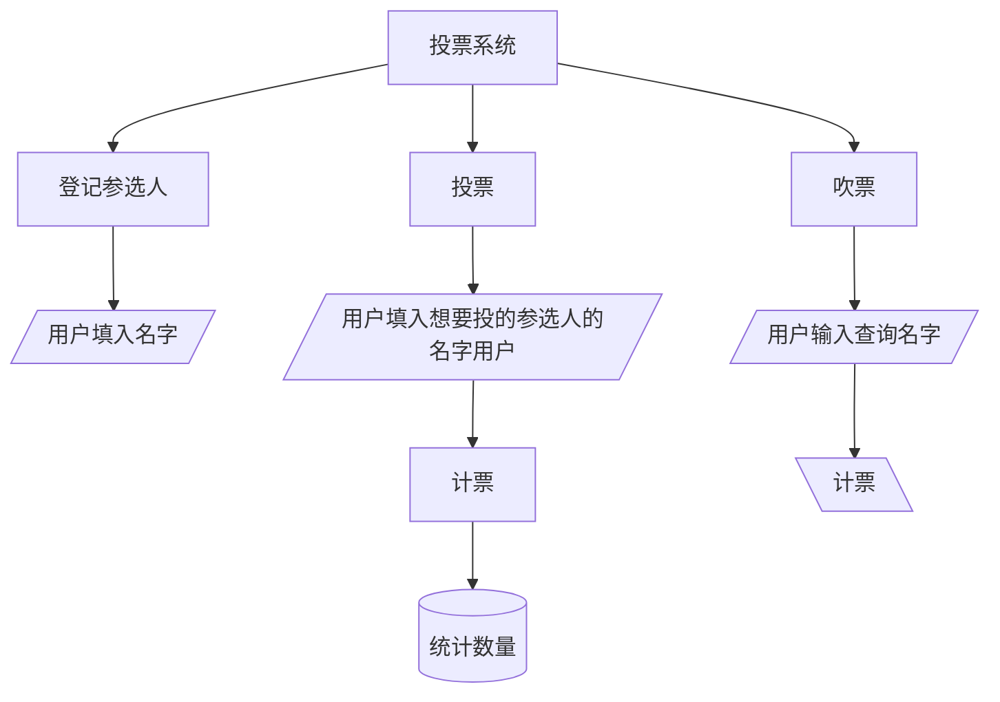

# 投票站合约

Day: Day 3
ID: 3
原文: https://www.notion.so/PollStation-Contract-1c25720a23ef802c9d9be066debb9bbd?source=copy_link
状态: 完成
译者: Bala Chen
难度等级: 初级

[🧭 首页](https://www.notion.so/5-5-HerSolidity-28e06421268880e4b645d9458179e231?pvs=21) ｜ [🎓 30天课程日历](https://www.notion.so/28e0642126888002b26be4b2e9841ce0?pvs=21) ｜[](https://www.notion.so/28e06421268881e59a00e854a7444215?pvs=21) ｜[FAQ-Solidity答疑问题库](https://www.notion.so/2910642126888046a897d75705d86a58?pvs=21) ｜ [👩🏻‍💻 关于我们](https://www.notion.so/344d3328efef4b3ab742f92b61533ce8?pvs=21)

今日学习内容：

到目前为止，我们已经使用了不同的数据类型，例如数字 (`uint256`) 和 字符串 (`string`). 我们了解了状态变量如何在区块链上存储值，以及(`functions`) 怎么修改和检索它们.

但智能合约不仅存储单个值，也能有效的组织和构建数据。

这里，solidity提供了数组（`arrays` ），用于存储数据列表，和映射（`mapping`）用于将值与唯一键（`key` ）关联。

今日，我们将探讨数组（`arrays` ）和映射（`mapping`）如何在solidity中工作，同时分解PollStation合约。

<aside>
💬

完整代码地址：
https://github.com/snehasharma76/30daysSolidity_Web3Compass/blob/master/PollStation.sol

</aside>

# 1. 产品需求书

### 用户流程



### 数据库

| Contract | Type | Bases |  |  | 含义 |
| --- | --- | --- | --- | --- | --- |
| └ | **Function Name** | **Visibility** | **Mutability** | **Modifiers** |  |
|  |  |  |  |  |  |
| **PollStation** | Implementation |  |  |  |  |
| └ | addCandidateNames | Public ❗️ | 🛑 | NO❗️ | 登记参选人 |
| └ | getcandidateNames | Public ❗️ |  | NO❗️ | 通过数据库找参选人 |
| └ | vote | Public ❗️ | 🛑 | NO❗️ | 投票 |
| └ | getVote | Public ❗️ |  | NO❗️ | 吹票 |
|  |  |  |  |  |  |
|  |  |  |  |  |  |
|  |  |  |  |  |  |
|  |  |  |  |  |  |
|  |  |  |  |  |  |
|  |  |  |  |  |  |
|  |  |  |  |  |  |
|  |  |  |  |  |  |
|  |  |  |  |  |  |
| **AdminOnly** | Implementation |  |  |  |  |
| └ | <Constructor> | Public ❗️ | 🛑 | NO❗️ |  |
| └ | addTreasure | Public ❗️ | 🛑 | onlyOwner |  |
| └ | approveWithdrawal | Public ❗️ | 🛑 | onlyOwner |  |
| └ | withdrawTreasure | Public ❗️ | 🛑 | NO❗️ |  |
| └ | resetWithdrawalStatus | Public ❗️ | 🛑 | onlyOwner |  |
| └ | transferOwnership | Public ❗️ | 🛑 | onlyOwner |  |
| └ | getTreasureDetails | Public ❗️ |  | onlyOwner |  |

# 2. 细节解说

## **理解投票站合约**

该合约允许用户：

1. **向投票中添加候选人**。
2. **检索候选人列表**。
3. **为候选人投票**。
4. **检查候选人收到的总票数**。

为了实现这一点，我们需要两个关键组件：

- **一个数组**来存储所有候选人的姓名。
- **一个映射**来跟踪每个候选人收到的票数。

---

## **声明候选人列表和投票跟踪**

在编写函数之前，我们需要**高效地存储**候选人及其票数。

```solidity

string[] public candidateNames;
mapping(string => uint256) voteCount;

```

### **1️⃣ 数组 – 存储候选人列表**

```solidity

string[] public candidateNames;

```

这一行声明了一个**数组**来存储候选人姓名。

### **什么是数组？**

**数组**是相同类型元素的**列表**。在 Solidity 中，数组可以保存数字、字符串、地址或其他数据类型。

在这里，我们使用数组来存储**多个候选人的姓名**。

### **为什么使用数组？**

- **数组在有序列表中存储多个值。**
- **我们可以一次检索所有元素**——在显示所有候选人时很有用。
- **我们可以使用 `.push()` 动态添加新元素**。

### **使用示例**

如果我们添加两个候选人：

```solidity

addCandidateNames("Alice");
addCandidateNames("Bob");

```

我们的数组现在看起来像这样：

```solidity

candidateNames = ["Alice", "Bob"];

```

**注意：** 由于 `candidateNames` 是 `public` 的，Solidity 会自动为其创建一个**获取函数**，这意味着用户可以检索候选人列表而无需编写单独的函数。

---

### **2️⃣ 映射 – 存储投票计数**

```solidity

mapping(string => uint256) voteCount;

```

这一行创建了一个**映射**来跟踪每个候选人的票数。

### **什么是映射？**

**映射**就像一个**字典**，它将键（在这种情况下是代表候选人姓名的 `string`）链接到值（代表其票数的 `uint256`）。

### **为什么使用映射而不是数组？**

映射允许**即时查找**。我们可以直接使用候选人的姓名访问其票数，而不是搜索数组来查找候选人的票数。

### **使用示例**

假设我们存储两个候选人及其票数：

```solidity

voteCount["Alice"] = 3;
voteCount["Bob"] = 5;

```

现在，我们可以即时检索票数：

```solidity

voteCount["Alice"]; // 返回 3
voteCount["Bob"];   // 返回 5

```

映射**极其高效**，因为它们提供对存储值的**直接访问**，而无需循环遍历列表。

---

## **添加候选人 – `addCandidateNames()` 函数**

```solidity

function addCandidateNames(string memory _candidateNames) public {
    candidateNames.push(_candidateNames);
    voteCount[_candidateNames] = 0;
}

```

### **详细分析：**

1️⃣ **接受候选人姓名作为输入（`_candidateNames`）**

- 这是一个**函数参数**，意味着用户在调用函数时提供候选人的姓名。
- 我们使用 `memory`，因为字符串在 Solidity 中是动态的，必须在函数内部明确存储在临时内存中。

2️⃣ **将候选人存储在数组中**

- `candidateNames.push(_candidateNames);` 将姓名添加到我们的 `candidateNames` 数组中。

3️⃣ **将候选人的票数初始化为零**

- `voteCount[_candidateNames] = 0;` 确保每个候选人从零票开始。

现在，当有人调用：

```solidity

addCandidateNames("Alice");

```

- `"Alice"` 被添加到 `candidateNames[]` 中。
- `"Alice"` 在 `voteCount` 映射中被初始化为 `0` 票。

---

## **检索候选人列表 – `getCandidateNames()` 函数**

```solidity

function getcandidateNames() public view returns (string[] memory) {
    return candidateNames;
}

```

### **理解 `view` 函数**

- `public view` → 由于此函数仅**读取**数据（不修改状态变量），因此**调用免费**。
- `returns (string[] memory)` → 返回存储在 `candidateNames` 中的**字符串数组**。
- 由于 `candidateNames` 是 `public` 的，Solidity **自动**提供获取函数。

此函数允许用户查看**谁在参与投票**。

---

## **为候选人投票 – `vote()` 函数**

```solidity

function vote(string memory _candidateNames) public {
    voteCount[_candidateNames] += 1;
}

```

### **工作原理：**

- `public` → 允许任何人调用此函数。
- `string memory _candidateNames` → 将候选人的姓名作为输入。
- `voteCount[_candidateNames] += 1;` → 将该候选人的票数增加 1。

### **潜在问题**

目前，**任何人都可以投票任意次数**。

现实世界的实现应该**防止重复投票**——但现在，我们保持简单。

---

## **检查候选人的票数 – `getVote()` 函数**

```solidity

function getVote(string memory _candidateNames) public view returns (uint256) {
    return voteCount[_candidateNames];
}

```

### **详细分析：**

- `public view` → 由于此函数**仅读取数据**，因此不消耗 gas。
- `returns (uint256)` → 返回给定候选人的票数。
- `voteCount[_candidateNames]` → 从映射中检索候选人的票数。

---

## **该合约的实际运行方式**

### **场景 1 – 设置投票**

1. **将合约部署**到区块链。
2. 调用 `addCandidateNames("Alice")`。
3. 调用 `addCandidateNames("Bob")`。
4. 现在，候选人列表是：`["Alice", "Bob"]`。

### **场景 2 – 投票**

1. 调用 `vote("Alice")` → Alice 获得 1 票。
2. 再次调用 `vote("Alice")` → Alice 现在有 2 票。
3. 调用 `vote("Bob")` → Bob 获得 1 票。

### **场景 3 – 检查票数**

1. 调用 `getVote("Alice")` → 返回 `2`。
2. 调用 `getVote("Bob")` → 返回 `1`。

---

## **关键要点**

1. **数组（`string[]`）允许我们存储多个候选人姓名。**
2. **映射（`mapping(string => uint256)`）允许我们将每个候选人与票数关联。**
3. **`view` 关键字确保只读函数调用免费。**
4. **函数根据状态变量修改或检索数据。**
5. **没有投票者限制，此合约允许无限投票——这在现实世界应用中应该改进。**

---

## **可能的改进**

1. **防止多次投票** – 添加 `mapping(address => bool)` 来跟踪用户是否已经投票。
2. **检查候选人是否存在** – 确保用户不能为不存在的候选人投票。