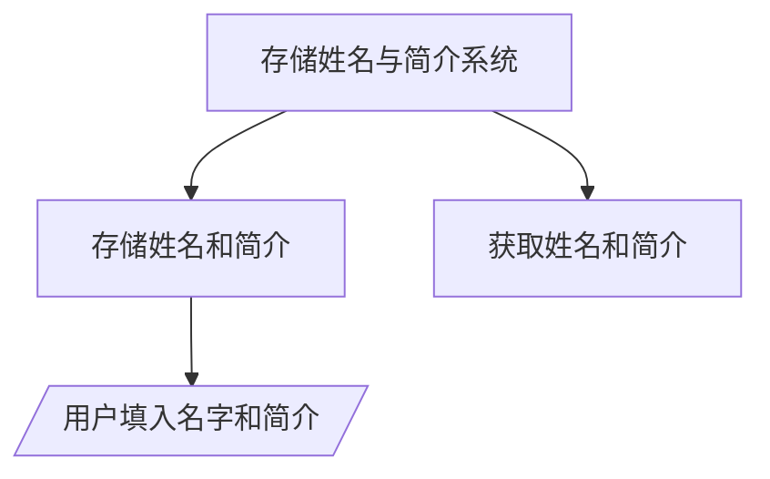

# 存储姓名和简介

Day: Day 2
ID: 2
原文: https://builder-hub.notion.site/SaveMyName-Contract-1c15720a23ef801a8a42eedbae041ea9
状态: 完成
译者: sun sun
难度等级: 初级

[🧭 首页](https://www.notion.so/5-5-HerSolidity-28e06421268880e4b645d9458179e231?pvs=21) ｜ [🎓 30天课程日历](https://www.notion.so/28e0642126888002b26be4b2e9841ce0?pvs=21) ｜[](https://www.notion.so/28e06421268881e59a00e854a7444215?pvs=21) ｜[FAQ-Solidity答疑问题库](https://www.notion.so/2910642126888046a897d75705d86a58?pvs=21) ｜ [👩🏻‍💻 关于我们](https://www.notion.so/344d3328efef4b3ab742f92b61533ce8?pvs=21)

# 学习内容

在我们的上一个合同中，我们学习了如何在区块链上存储和更新一个简单的数字（计数器）。这让我们了解了状态变量以及 Solidity 函数如何修改它们。

现在，我们通过存储文本数据——用户的名字和简介来继续前进。这很重要，因为现实世界的应用通常涉及处理用户信息。在这个过程中，我们将探索 Solidity 中的字符串、内存存储、函数返回类型和 view 关键字。

让我们一步一步地分解所有内容。

```solidity
代码原文：
https://github.com/snehasharma76/30daysSolidity_Web3Compass/blob/master/SaveMyName.sol
```

# 1.产品需求书

### a.用户流程



### b.数据库

| **Contract / 合约** | **Type / 类型** | **Bases / 基础合约** |  | **含义 / Description** |
| --- | --- | --- | --- | --- |
| SaveMyName.sol | Implementation - 实现合约（非接口或抽象合约） | 无继承合约 |  | 保存名字和个人简介 |
| **Function Name / 函数名** | **Visibility / 可见性** | **Mutability / 可变性** | **Modifiers / 修饰器** | **含义 / Description** |
| add | Public / 公开 | 状态修改操作（需要Gas费用） | NO / 无 | 存储用户姓名和简介 |
| retrieve | Public / 公开 | view / 只读，不修改状态，无需Gas费 | NO / 无 | 读取并返回存储的名称和简介 |
|  |  |  |  |  |

# 2.细节解说

**在区块链上存储名称和简介**

在构建传统应用程序时，存储用户数据很方便。通常将其保存在数据库中，并根据需要随时更新。但智能合约并非如此运作。相反，所有数据永久存储在区块链上，这使得处理文本数据的方式与您可能习惯的方式不同。

以下是如何在 Solidity 中声明两个状态变量来存储用户的名称和简介：

```solidity
string name;
string bio;

```

**这里发生了什么？**

string name；和 string bio；→ 这些是状态变量，意味着它们的值将被永久存储在区块链上。

与数值（uint256）不同，在 Solidity 中，字符串更为复杂，需要特殊处理。

这些变量默认为内部变量，这意味着值只能从这个合约内部或任何从这个合约派生的合约中访问（稍后会有更多说明）

可以将这想象成一个链上个人资料，用户可以在其中设置和更新他们的姓名和简介。

### **add() 函数——存储数据**

为了允许用户存储他们的姓名和简介，我们使用以下函数：

```solidity
function add(string memory _name, string memory _bio) public {
    name = _name;
    bio = _bio;
}

```

**分解说明**

**1️⃣ 函数参数——接受用户输入**

当用户调用函数时，函数可以接收输入（也称为参数）。

_name 和 _bio 是占位符，用于存储用户的输入。

当函数运行时，这些值会存储在合约的状态变量（name 和 bio）中。

例如：

```solidity
add("Alice", "Blockchain Developer");

```

调用此函数后，name 被设置为"Alice"，bio 被设置为"Blockchain Developer"。

### **2️⃣ 理解命名规范**

你可能已经注意到我们在参数名前使用了下划线（_）：_name 和 _bio。

这不是 Solidity 的要求——它只是用来区分函数参数和状态变量的常见命名约定。

例如：

name 指的是状态变量。

_name 指的是函数参数。

但是，你可以自由使用自己的命名规范。以下函数工作方式完全相同：

```solidity
function add(string memory newName, string memory newBio) public {
    name = newName;
    bio = newBio;
}

```

下划线只是一个风格选择，但使用它可以通过区分函数输入和合约存储变量来帮助使代码更易于阅读。

### **3️⃣ 内存关键字——为什么需要它**

注意参数被定义为:string memory _name, string memory _bio。

但我们为什么需要这里使用memory呢？

Solidity 有两种主要的存储类型：

**Storage** (存储）:永久存储在区块链上的数据（例如姓名和简介）。

**Memory** （内存）:仅在函数运行时存在的临时存储空间。

当函数接受字符串作为输入时，Solidity 要求我们明确说明它是存储在内存（memory）中还是存储（storage）中。

由于函数参数无需永久存储，我们使用内存（memory）。

可以将内存想象成一张草稿纸——它在函数运行时暂时保存数据，然后便消失了。

### **retrieve()检索函数——从区块链获取数据**

一旦用户存储了他们的名字和简介，我们需要一种方法来获取这些信息。这就是 retrieve() 函数的作用：

```solidity
function retrieve() public view returns (string memory, string memory) {
    return (name, bio);
}

```

### **理解 view 的功能**

view 这个关键字在这个合约中是新出现的。它告诉 Solidity 这个函数只读取数据而不修改区块链。

### **为什么view重要？**

任何修改状态变量（如 add()）的函数都需要 gas 费用，因为它会更新区块链。

被标记为 view 的函数在被调用时不会消耗 gas。

它只是获取并返回现有数据。

这就是为什么 retrieve()可以免费调用——它不会在区块链上做任何改变。它只是读取并返回存储的名称和简介。

### **理解 returns (string memory, string memory)**

与 add()不同，add()只是更新数据，retrieve()会向调用它的任何人返回数据。

```solidity
returns (string memory, string memory)

```

这告诉 Solidity 该函数返回两个字符串值（名称和简介）。

和函数参数一样，返回的字符串必须存储在内存中，所以我们再次指定内存（memory）。

当函数被调用时，它返回存储的值：

```solidity
retrieve() → Returns ("Alice", "Blockchain Developer")

```

将此功能想象成检查你的社交媒体资料——你可以看到你的存储信息，但你并没有修改任何内容。

### **使合约更高效**

目前，我们有两个独立的功能：

add() → 用于存储姓名和简介。

retrieve() → 用于获取姓名和简介。

虽然这样工作正常，但我们可以通过将它们合并成一个函数来使其更简洁：

```solidity
function saveAndRetrieve(string memory _name, string memory _bio) public returns (string memory, string memory) {
    name = _name;
    bio = _bio;
    return (name, bio);
}

```

### **这个版本的工作原理：**

这个函数像 add() 一样存储姓名和简介。

不再需要单独的 retrieve()函数，保存后立即返回值。

这减少了函数调用次数，使合约更短且更易使用。

### **但有个隐患……**

虽然这种方法在合约中节省了空间，但它也有缺点：

自从这个功能修改了区块链以来，调用它总是需要消耗 gas，即使用户只是想检索数据。

在原来的双函数方法中，调用 retrieve()是免费的，因为它不会修改任何东西。

因此，虽然这个版本更简洁，但在 gas 消耗方面并不一定更高效。

### **关键要点**

字符串在 Solidity 中需要特殊处理，必须在函数内部显式地存储在内存中。

状态变量永久存储在区块链上，而内存变量仅在函数执行期间临时存在。

view 关键字使函数可以自由调用，因为它不会修改区块链。

函数参数中的下划线(_)只是一个命名约定，并非强制要求。

组合功能可以使合约更短，但如果操作不当，也会增加 gas 成本。

### **下一步 – 改进合约**

现在我们已经有了基本的姓名和简介存储合约，以下是一些我们可以改进它的方法：

添加更多用户数据 – 除了存储姓名和简介，修改合约以存储年龄、职业等数据