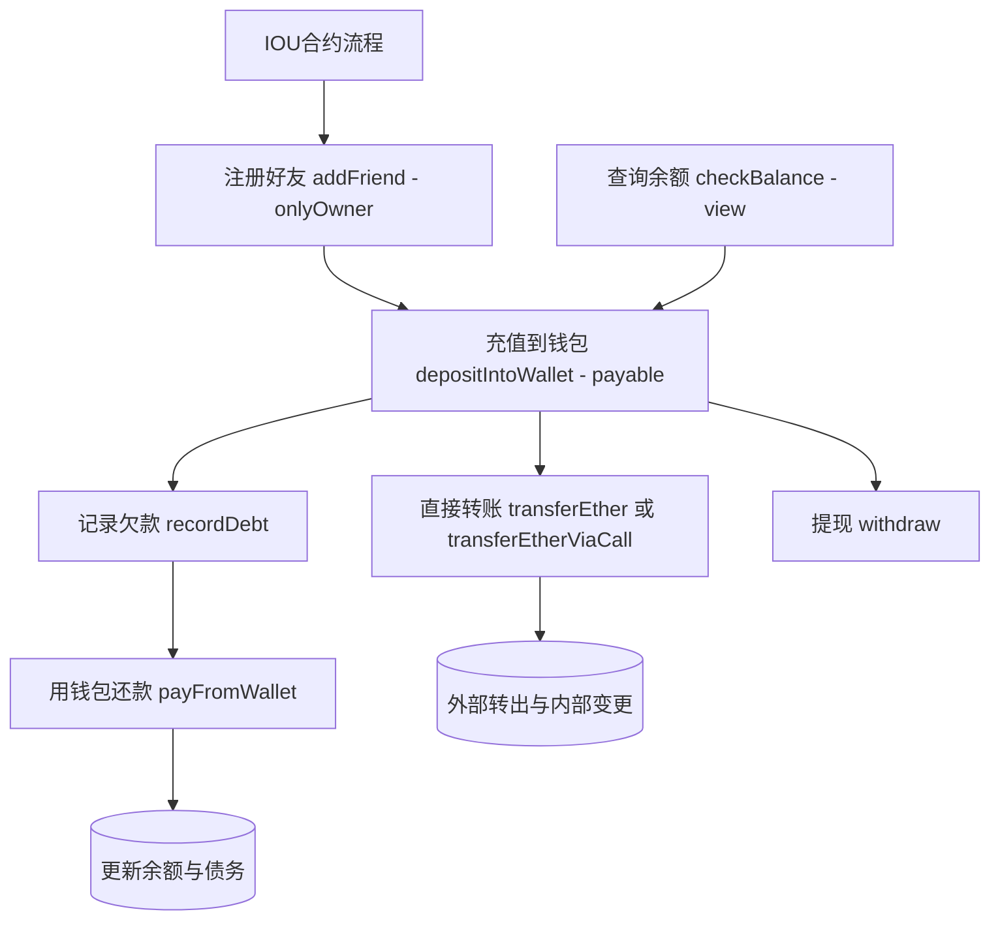

# IOU合约

Day: Day 7
ID: 7
原文: https://www.notion.so/Simple-IOU-Contract-1ce5720a23ef80acbcb9dda43b5f803f?source=copy_link
状态: 完成
译者: Tian Titian
难度等级: 初级

[🧭 首页](https://www.notion.so/5-5-HerSolidity-28e06421268880e4b645d9458179e231?pvs=21) ｜ [🎓 30天课程日历](https://www.notion.so/28e0642126888002b26be4b2e9841ce0?pvs=21) ｜[](https://www.notion.so/28e06421268881e59a00e854a7444215?pvs=21) ｜[FAQ-Solidity答疑问题库](https://www.notion.so/2910642126888046a897d75705d86a58?pvs=21) ｜ [👩🏻‍💻 关于我们](https://www.notion.so/344d3328efef4b3ab742f92b61533ce8?pvs=21)

今日学习内容：

假设您和您的朋友经常外出——分摊账单、支付旅行费用、购买团体礼物。大多数时候，一个人预付钱，其他人说“我稍后会还给你”。

但您可能遇到过这种情况：

> “等等......我又欠你多少钱？”
> 
> 
> “我已经还给你了吗？”
> 
> “您为该团体承保的总金额是多少？”
> 

它很快就会变得混乱。

这就是这个智能合约的用武之地。 `SimpleIOU` 是您的**链上群账**。它可以帮助朋友：

- 跟踪债务，
- 将 ETH 存储在他们自己的应用内余额中，
- 并且可以轻松安顿下来，无需做数学或电子表格。

<aside>
💻

**完整代码地址：**

[https://github.com/snehasharma76/30daysSolidity_Web3Compass/blob/master/SimpleIOUApp.sol](https://github.com/snehasharma76/30daysSolidity_Web3Compass/blob/master/SimpleIOUApp.sol)

</aside>

# 1. 产品需求书

### 合约流程图（Mermaid）



### 合约与函数清单

| Contract | Type | Bases | 中文说明 |
| --- | --- | --- | --- |
| SimpleIOU | Implementation | - | 简单 IOU 记账与内部余额转移合约 |
| Function Name | Visibility | Mutability | 中文说明 |
| addFriend(address _friend) | Public | nonpayable | 仅所有者可注册好友到白名单 |
| depositIntoWallet() | Public | payable | 注册用户向内部钱包充值 ETH |
| recordDebt(address _debtor, uint256 _amount) | Public | nonpayable | 记录某债务人对调用者的欠款金额 |
| payFromWallet(address _creditor, uint256 _amount) | Public | nonpayable | 用内部余额向指定债权人偿还欠款并冲减债务 |
| transferEther(address payable _to, uint256 _amount) | Public | nonpayable | 使用 transfer 向注册好友直接转出 ETH，并记录内部余额变动 |
| transferEtherViaCall(address payable _to, uint256 _amount) | Public | nonpayable | 使用 call 方式转出 ETH，并记录内部余额变动 |
| withdraw(uint256 _amount) | Public | nonpayable | 从内部余额提现 ETH 至调用者地址 |
| checkBalance() returns (uint256) | Public | view | 查询调用者在合约的内部余额 |

# 2. 细节解说

**状态变量：我们在跟踪什么？**

在任何逻辑运行之前，合约需要**记住一些事情**。

### `owner`

```solidity
 
address public owner;

```

我们首先定义该组的**管理员**是谁。

 `owner` 是部署合约的人。此人将拥有特殊权限，例如向群组添加新朋友。这就像创建 Splitwise 组的第一个人 - 他们管理访问权限。

---

### `registeredFriends` and `friendList`

```solidity
 
mapping(address => bool) public registeredFriends;
address[] public friendList;

```

我们希望这份合同**对您的团队来说是私有的**。不仅仅是互联网上的任何人都应该能够加入并开始记录欠条。

我们的管理方法如下：

- `registeredFriends` 让我们**快速检查**是否允许某人使用合约。
- `friendList`为我们提供了所有注册地址的**完整列表**，如果您想在前端显示所有群组成员，这非常有用。

添加好友后，他们的地址就会同时出现。

---

### `balances`

```solidity
 
mapping(address => uint256) public balances;

```

现在我们来处理这笔钱。

每个人都可以在**合同内**将 ETH 存入其个人余额中。该 ETH 稍后可用于：

- 还清债务，
- 将 ETH 转移给另一个会员，
- 或者完全撤回。

实际的 ETH 存储在合约“内部”，这个映射只是跟踪**谁拥有多少**。

---

### `debts`

```solidity
 
mapping(address => mapping(address => uint256)) public debts;

```

这就是真正的 IOU 魔法发生的地方。

这是一个**嵌套映射**，意思是：

```solidity
 
debts[debtor][creditor] = amount;

```

例如：

```solidity
 
debts[0xAsha][0xRavi] = 1.5 ether;

```

意味着 Asha 欠 Ravi 1.5 ETH。它就在那里，透明地存储在链上。没有沟通不畅，没有遗忘。

---

## 构造函数

```solidity
 
constructor() {
    owner = msg.sender;
    registeredFriends[msg.sender] = true;
    friendList.push(msg.sender);
}

```

部署合约时：

- `msg.sender` （无论部署它的人）成为所有者。
- 他们会自动注册为朋友 - 因为他们显然想使用该系统。
- 他们的地址被添加到 `friendList`中。

因此，从创建此合同的那一刻起，我们就已经有了一个活跃成员：管理员。

---

## **修饰符：控制访问**

我们不希望任何人都与此合约进行交互。这些**修饰符**有助于保护功能免遭未经授权的访问。

---

### `onlyOwner`

```solidity
 
modifier onlyOwner() {
    require(msg.sender == owner, "Only owner can perform this action");
    _;
}

```

这个很简单：它确保只有部署合约的人（所有者）才能执行某些操作 - 例如添加朋友。

---

### `onlyRegistered`

```solidity
 
modifier onlyRegistered() {
    require(registeredFriends[msg.sender], "You are not registered");
    _;
}

```

只有注册的好友（所有者添加的人）才能：

- 存入 ETH
- 记录债务，
- 偿还债务，
- 发送 ETH，
- 或者撤回它。

如果有人尝试在没有先添加的情况下使用合约，该函数将立即拒绝他们的请求。

---

## **功能：好友（用户）可以做什么？**

现在我们已经设置了结构，让我们看看实际功能——用户可以做什么以及它在幕后是如何工作的。

---

### `addFriend`

```solidity
 
function addFriend(address _friend) public onlyOwner {
    require(_friend != address(0), "Invalid address");
    require(!registeredFriends[_friend], "Friend already registered");

    registeredFriends[_friend] = true;
    friendList.push(_friend);
}

```

只有部署合约的人（所有者）才能调用此函数。它：

- 检查新地址是否不是`0x0`
- 确保该人尚未被添加
- 然后将它们添加到 `registeredFriends` 和`friendList`中。

这使您的 IOU 组保持小、私密和安全。

---

### `depositIntoWallet`

```solidity
 
function depositIntoWallet() public payable onlyRegistered {
    require(msg.value > 0, "Must send ETH");
    balances[msg.sender] += msg.value;
}

```

以下是用户如何将 ETH 添加到其应用内余额中：

- 该函数是`payable`,这意味着它可以接收 ETH。
- `msg.value` 保存发送的 ETH 数量。
- 该金额将添加到他们的内部余额中。

现在他们可以用这笔 ETH 来偿还债务、汇款或稍后提取。

---

### `recordDebt`

```solidity
 
function recordDebt(address _debtor, uint256 _amount) public onlyRegistered {
    require(_debtor != address(0), "Invalid address");
    require(registeredFriends[_debtor], "Address not registered");
    require(_amount > 0, "Amount must be greater than 0");

    debts[_debtor][msg.sender] += _amount;
}

```

如果你的朋友欠你钱，你调用这个记录下来。

假设 Ravi 支付了每个人的午餐费用，而 Asha 欠他 0.05 ETH。拉维会调用：

```solidity
 
recordDebt(ashaAddress, 0.05 ether);

```

合同存储了 Asha 现在欠 Ravi 的这笔钱。

这里没有 ETH 被移动——我们只是在**记录协议**。

---

### `payFromWallet`

```solidity
 
function payFromWallet(address _creditor, uint256 _amount) public onlyRegistered {
    require(_creditor != address(0), "Invalid address");
    require(registeredFriends[_creditor], "Creditor not registered");
    require(_amount > 0, "Amount must be greater than 0");
    require(debts[msg.sender][_creditor] >= _amount, "Debt amount incorrect");
    require(balances[msg.sender] >= _amount, "Insufficient balance");

    balances[msg.sender] -= _amount;
    balances[_creditor] += _amount;
    debts[msg.sender][_creditor] -= _amount;
}

```

这是您使用合约中存储的 ETH 余额**偿还某人**的地方。

它的作用如下：

- 检查你欠那个人的钱
- 确保您有足够的 ETH
- 从您的余额中减去金额
- 将其添加到债权人的余额中
- 减少您记录的债务

尽管如此，实际上并没有 ETH 离开合约。它只是在用户的余额之间内部移动。

---

### `transferEther` — Sending ETH Using `transfer()`

```solidity

function transferEther(address payable _to, uint256 _amount) public onlyRegistered {
    require(_to != address(0), "Invalid address");
    require(registeredFriends[_to], "Recipient not registered");
    require(balances[msg.sender] >= _amount, "Insufficient balance");

    balances[msg.sender] -= _amount;
    _to.transfer(_amount);
    balances[_to] += _amount;
}

```

### **这究竟是怎么回事呢？**

假设您的余额中存了 1 ETH，并且您想将 0.25 ETH 发送给您的朋友 Rohit（他也在您的朋友群中）。此功能允许您将 ETH 直接从合约发送到他们的钱包。

以下是它的检查内容：

1. **收件人地址有效吗？**
2. **他们是否在群组中注册？**
3. **您的余额中有足够的 ETH 吗？**

如果所有这些都通过，您的余额就会减少，并且 `_to.transfer(_amount)` 将 ETH 从合约发送到接收者的地址。

### **所以......什么是**`transfer()`?

`transfer()` 是一种内置的 Solidity 方法，用于将 ETH 从合约发送到外部地址。

语法：

```solidity
recipientAddress.transfer(amount);

```

这就是为什么`transfer()` 传统上被认为是安全的：

- 如果发送失败，它**自动恢复**
- 它**仅向接收者转发 2300 gas**——刚好足以接收 ETH，但不足以执行任何其他代码（防止重入攻击）

### **为什么这可能是个问题？**

2300 gas 的限制也是它的弱点。如果接收者是**智能合约**（而不是钱包），它可能需要更多的 gas 来处理传入的 ETH——例如更新日志、发出事件或存储状态。

如果接收合约需要超过 2300 个 gas，则转移失败。

在现代 Solidity 中，`transfer()` 可以将 ETH 发送到 **钱包**，但在处理**合约**时存在风险或限制。

---

### `transferEtherViaCall` — Sending ETH Using `call()`

```solidity

function transferEtherViaCall(address payable _to, uint256 _amount) public onlyRegistered {
    require(_to != address(0), "Invalid address");
    require(registeredFriends[_to], "Recipient not registered");
    require(balances[msg.sender] >= _amount, "Insufficient balance");

    balances[msg.sender] -= _amount;

    (bool success, ) = _to.call{value: _amount}("");
    balances[_to] += _amount;
    require(success, "Transfer failed");
}

```

这个函数做同样的工作——将 ETH 发送给另一个朋友——但它使用了一种更灵活的方法： `call`.

### **所以......什么是** `call()`?

`call()` 是 Solidity 中的一个**低级**函数，用于发送 ETH 和调用函数。它是这样写的：

```solidity

(bool success, ) = recipient.call{value: amount}("");

```

它为您提供了比`transfer()`更多的控制权：

- **无 gas 限制** — 接收方合约可以执行任何它想要的逻辑
- 您可以使用`success` 变量**检查作是否成功**

但权力越大，责任越大——如果你使用`call()`, i则由你来：

- 检查是否成功
- 妥善处理任何故障情况
- 确保你的合约免受重入攻击（稍后在高级合约中会详细介绍）

### **为什么我们在这里使用** `call()` ?

使用`call()` 使函数**与智能合约地址兼容**——而不仅仅是外部拥有的账户（钱包）。因此，即使您朋友的钱包实际上是合约（如 Gnosis 保险箱或支付拆分器），ETH 仍然会通过。

---

### `withdraw`

```solidity
 
function withdraw(uint256 _amount) public onlyRegistered {
    require(balances[msg.sender] >= _amount, "Insufficient balance");

    balances[msg.sender] -= _amount;

    (bool success, ) = payable(msg.sender).call{value: _amount}("");
    require(success, "Withdrawal failed");
}

```

如果您想将 ETH 从合约中取出，此功能可以做到。

- 它从您的内部余额中减去金额
- 使用`call()`将其发送到您的钱包

简单安全。

---

### `checkBalance`

```solidity
 
function checkBalance() public view onlyRegistered returns (uint256) {
    return balances[msg.sender];
}

```

只是查看系统中有多少 ETH 的快速方法。

---

## **回顾**

您现在拥有了一个功能齐全、干净、适合初学者的债务跟踪器。

用户可以：

- 加入群组（如果所有者添加了它们）
- 存入 ETH
- 记录债务
- 使用他们的余额结算它们
- 接发送和提取 ETH

您还了解到：

- 如何使用映射（单个映射和嵌套映射）
- ETH 转账如何运作（“转账”与“调用”）
- 如何保持合同访问受控和安全

当您准备好通过债务减免、分组或事件日志记录来扩展此期限时，请告诉我。你正在路上。