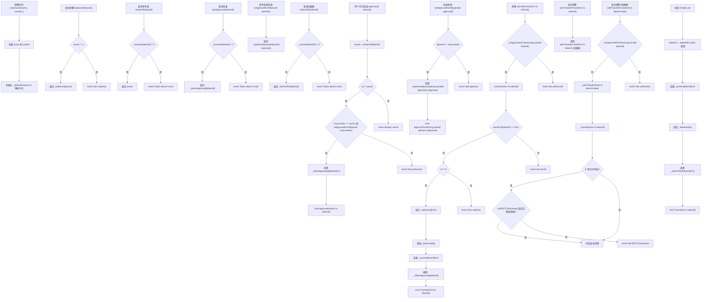

# 简易的NFT合约 - ERC721

Day: Day 21
ID: 21
原文: https://www.notion.so/SimpleNFT-1dc5720a23ef807da46fd1f75523bbb9?source=copy_link
状态: 完成
译者: Bala Chen
难度等级: 高级

# 创建你自己的NFT（简单的ERC-721）

好的，欢迎回到**30天Solidity学习**。

到目前为止，我们一直在学习智能合约的底层工作原理。我们制作了自己的代币，锁定了资金，玩转了访问控制，甚至学会了如何保护合约免受恶意攻击。

但今天？

今天不一样。

我们终于要进入Solidity中你构建的东西具有实际现实世界用途的部分。

我们将从每个人都听说过，但很少有人真正理解的东西开始：

**NFT**。

---

### 🎨 NFT到底*是*什么？

好的，让我们先澄清一下——NFT不仅仅是猴子图片或网络炫耀的材料。

**NFT是关于数字所有权的**。

理解它们的关键是这个听起来很奇怪的词：**非同质化**。

**NFT** = **非同质化代币**

让我们分解一下：

- **代币**只是区块链上的数字物品。
- **同质化**意味着"可互换的"。就像金钱。1美元总是价值1美元，无论它来自哪里。
- **非同质化**意味着它不可互换。它是独特的。独一无二的。

假设你的朋友递给你一支笔。很好。它只是一支普通的笔——你用它，丢了它，无所谓。

现在想象你的爷爷给你一支他从1940年代就拥有的钢笔。它很旧，有雕刻，背后有故事。

从技术上讲，两者都是"只是笔"。但它们相等吗？

绝对不是。

来自你爷爷的那支是**非同质化的**——它有情感价值、历史、独特性。

你不会只是把它换成文具店的随机笔。

这正是NFT的工作原理。

它们是*不完全相同*的数字物品。每一个都有自己的ID，自己的数据，自己的意义。

即使它们是同一个收藏的一部分，NFT #1可能与NFT #2000完全不同。

不同的图像，不同的属性，不同的故事。

---

### 🤝 那么这与我们之前构建的有什么不同？

还记得我们之前制作的ERC-20代币吗？

那是一个**同质化**代币——就像制作你自己的数字货币。

如果你有10个，我有10个，我们拥有的是同样的东西。代币是相等且可互换的。

NFT（使用**ERC-721**构建）完全不同。

每个代币都有自己的*身份*。自己的编号。自己的意义。

你不能1:1交换它们，因为每一个都可能代表完全不同的东西。

---

### 🚪 NFT不仅仅是艺术

这是大多数人误解的部分。

NFT不仅仅是关于艺术品或收藏品。

它们是一种以数字形式表示**所有权**——字面上任何东西——的方式。

让我们分解一些真实的例子：

### 🎟 活动门票

NFT可以是音乐会、研讨会或节日的门票。

没有纸张。没有截图。只需从你的钱包扫描——你就进去了。

### 🎮 游戏内物品

你辛苦获得的那个稀有皮肤、剑或房子？如果它是NFT，你*拥有*它。

不是游戏公司。是你。你可以出售它，租赁它，甚至把它带到其他游戏中。

### 📄 财产或法律文件

在未来，你的房屋契约可能是NFT。

它将存在于链上，很难伪造，并且易于转移，无需走20步流程的文书工作。

### 📛 证书或证明

NFT可以用作数字证书。

完成了课程？砰——NFT在你的钱包里。任何人都可以立即验证它。

---

### 💡 为什么这很重要？

在NFT之前，互联网有一个奇怪的问题——你可以分享东西，但你不能拥有它。

你可以发布照片，但很难证明它是你的。

你可以在游戏中购买东西，但如果游戏关闭——它就消失了。

NFT解决了这个问题。

它们将**所有权**的概念带到数字世界——以一种公开、永久和可编程的方式。

这不仅仅是艺术。

> 这是你的东西——门票、收藏品、身份证、凭证——最终在数字空间中变得真实。
> 

# 1. 产品需求书

### 用户流程



### 数据库

下面是可直接复制到 Notion 的表格格式列清单

**addresses**

| 名称
 | 类型
 | 示例值
 |
| --- | --- | --- |
| id
 | 数字
 | 1
 |
| address
 | 文本
 | 0x3F…A1c9
 |
| created_at
 | 日期
 | 2025-10-17 00:57
 |
| updated_at
 | 日期
 | 2025-10-17 00:57
 |

**tokens**

| 名称
 | 类型
 | 示例值
 |
| --- | --- | --- |
| token_id
 | 数字
 | 1
 |
| owner_address
 | 文本
 | 0x3F…A1c9
 |
| uri
 | 文本
 | ipfs://QmT7…2uN
 |
| minted_at
 | 日期
 | 2025-10-17 00:58
 |
| metadata_cached
 | 文本(JSON)
 | {“name”:“龙#1”,“image”:“ipfs://Qm…”}
 |
| is_burned
 | 复选框
 | false
 |

**balances**

| 名称
 | 类型
 | 示例值
 |
| --- | --- | --- |
| address
 | 文本
 | 0x3F…A1c9
 |
| balance
 | 数字
 | 3
 |
| updated_at
 | 日期
 | 2025-10-17 00:59
 |

**token_approvals**

| 名称
 | 类型
 | 示例值
 |
| --- | --- | --- |
| token_id
 | 数字
 | 1
 |
| approved_address
 | 文本
 | 0xOp…Sea1
 |
| updated_at
 | 日期
 | 2025-10-17 01:00
 |

**operator_approvals**

| 名称
 | 类型
 | 示例值
 |
| --- | --- | --- |
| owner_address
 | 文本
 | 0x3F…A1c9
 |
| operator_address
 | 文本
 | 0xOp…Sea1
 |
| approved
 | 复选框
 | true
 |
| updated_at
 | 日期
 | 2025-10-17 01:01
 |

**transfers**

| 名称
 | 类型
 | 示例值
 |
| --- | --- | --- |
| id
 | 数字
 | 42
 |
| token_id
 | 数字
 | 1
 |
| from_address
 | 文本
 | 0x0000000000000000000000000000000000000000
 |
| to_address
 | 文本
 | 0x7B…92e3
 |
| tx_hash
 | 文本
 | 0xabc…789
 |
| block_number
 | 数字
 | 5690021
 |
| timestamp
 | 日期
 | 2025-10-17 01:02
 |

**approvals**

| 名称
 | 类型
 | 示例值
 |
| --- | --- | --- |
| id
 | 数字
 | 7
 |
| owner_address
 | 文本
 | 0x3F…A1c9
 |
| approved_address
 | 文本
 | 0xOp…Sea1
 |
| token_id
 | 数字
 | 1
 |
| tx_hash
 | 文本
 | 0xdef…123
 |
| block_number
 | 数字
 | 5690025
 |
| timestamp
 | 日期
 | 2025-10-17 01:03
 |

**approval_for_all**

| 名称
 | 类型
 | 示例值
 |
| --- | --- | --- |
| id
 | 数字
 | 11
 |
| owner_address
 | 文本
 | 0x3F…A1c9
 |
| operator_address
 | 文本
 | 0xOp…Sea1
 |
| approved
 | 复选框
 | true
 |
| tx_hash
 | 文本
 | 0xaaa…555
 |
| block_number
 | 数字
 | 5690033
 |
| timestamp
 | 日期
 | 2025-10-17 01:04
 |

**counters（可选）**

| 名称
 | 类型
 | 示例值
 |
| --- | --- | --- |
| name
 | 文本
 | tokenIdCounter
 |
| current_value
 | 数字
 | 1024
 |
| updated_at
 | 日期
 | 2025-10-17 01:05
 |

# 2. 细节解说

---

🛠 那么我们今天要构建什么？

我们要保持简单。

你将从头开始构建你的**第一个NFT合约**。

没有OpenZeppelin。没有复制粘贴。只有原始的Solidity——这样你就能理解实际发生了什么。

它将遵循**ERC-721标准**，这就像以太坊上NFT的规则手册。

到最后，你将创建一个真正的、可铸造的NFT——你可以将其连接到游戏、画廊，甚至你自己的迷你市场。

让我们开始吧。

---

## 🔍 完整代码：`SimpleNFT.sol`

```solidity
// SPDX-License-Identifier: MIT
pragma solidity ^0.8.19;

interface IERC721 {
    event Transfer(address indexed from, address indexed to, uint256 indexed tokenId);
    event Approval(address indexed owner, address indexed approved, uint256 indexed tokenId);
    event ApprovalForAll(address indexed owner, address indexed operator, bool approved);

    function balanceOf(address owner) external view returns (uint256);
    function ownerOf(uint256 tokenId) external view returns (address);

    function approve(address to, uint256 tokenId) external;
    function getApproved(uint256 tokenId) external view returns (address);

    function setApprovalForAll(address operator, bool approved) external;
    function isApprovedForAll(address owner, address operator) external view returns (bool);

    function transferFrom(address from, address to, uint256 tokenId) external;
    function safeTransferFrom(address from, address to, uint256 tokenId) external;
    function safeTransferFrom(address from, address to, uint256 tokenId, bytes calldata data) external;
}

interface IERC721Receiver {
    function onERC721Received(address operator, address from, uint256 tokenId, bytes calldata data) external returns (bytes4);
}

contract SimpleNFT is IERC721 {
    string public name;
    string public symbol;

    uint256 private _tokenIdCounter = 1;

    mapping(uint256 => address) private _owners;
    mapping(address => uint256) private _balances;
    mapping(uint256 => address) private _tokenApprovals;
    mapping(address => mapping(address => bool)) private _operatorApprovals;
    mapping(uint256 => string) private _tokenURIs;

    constructor(string memory name_, string memory symbol_) {
        name = name_;
        symbol = symbol_;
    }

    function balanceOf(address owner) public view override returns (uint256) {
        require(owner != address(0), "Zero address");
        return _balances[owner];
    }

    function ownerOf(uint256 tokenId) public view override returns (address) {
        address owner = _owners[tokenId];
        require(owner != address(0), "Token doesn't exist");
        return owner;
    }

    function approve(address to, uint256 tokenId) public override {
        address owner = ownerOf(tokenId);
        require(to != owner, "Already owner");
        require(msg.sender == owner || isApprovedForAll(owner, msg.sender), "Not authorized");

        _tokenApprovals[tokenId] = to;
        emit Approval(owner, to, tokenId);
    }

    function getApproved(uint256 tokenId) public view override returns (address) {
        require(_owners[tokenId] != address(0), "Token doesn't exist");
        return _tokenApprovals[tokenId];
    }

    function setApprovalForAll(address operator, bool approved) public override {
        require(operator != msg.sender, "Self approval");
        _operatorApprovals[msg.sender][operator] = approved;
        emit ApprovalForAll(msg.sender, operator, approved);
    }

    function isApprovedForAll(address owner, address operator) public view override returns (bool) {
        return _operatorApprovals[owner][operator];
    }

    function transferFrom(address from, address to, uint256 tokenId) public override {
        require(_isApprovedOrOwner(msg.sender, tokenId), "Not authorized");
        _transfer(from, to, tokenId);
    }

    function safeTransferFrom(address from, address to, uint256 tokenId) public override {
        safeTransferFrom(from, to, tokenId, "");
    }

    function safeTransferFrom(address from, address to, uint256 tokenId, bytes memory data) public override {
        require(_isApprovedOrOwner(msg.sender, tokenId), "Not authorized");
        _safeTransfer(from, to, tokenId, data);
    }

    function mint(address to, string memory uri) public {
        uint256 tokenId = _tokenIdCounter;
        _tokenIdCounter++;

        _owners[tokenId] = to;
        _balances[to] += 1;
        _tokenURIs[tokenId] = uri;

        emit Transfer(address(0), to, tokenId);
    }

    function tokenURI(uint256 tokenId) public view returns (string memory) {
        require(_owners[tokenId] != address(0), "Token doesn't exist");
        return _tokenURIs[tokenId];
    }

    function _transfer(address from, address to, uint256 tokenId) internal virtual {
        require(ownerOf(tokenId) == from, "Not owner");
        require(to != address(0), "Zero address");

        _balances[from] -= 1;
        _balances[to] += 1;
        _owners[tokenId] = to;

        delete _tokenApprovals[tokenId];
        emit Transfer(from, to, tokenId);
    }

    function _safeTransfer(address from, address to, uint256 tokenId, bytes memory data) internal virtual {
        _transfer(from, to, tokenId);
        require(_checkOnERC721Received(from, to, tokenId, data), "Not ERC721Receiver");
    }

    function _isApprovedOrOwner(address spender, uint256 tokenId) internal view returns (bool) {
        address owner = ownerOf(tokenId);
        return (spender == owner || getApproved(tokenId) == spender || isApprovedForAll(owner, spender));
    }

    function _checkOnERC721Received(address from, address to, uint256 tokenId, bytes memory data) private returns (bool) {
        if (to.code.length > 0) {
            try IERC721Receiver(to).onERC721Received(msg.sender, from, tokenId, data) returns (bytes4 retval) {
                return retval == IERC721Receiver.onERC721Received.selector;
            } catch {
                return false;
            }
        }
        return true;
    }
}

```

好的，是时候动手了。

这个合约是一个**基础的NFT合约**，遵循ERC-721标准——但不使用任何外部库或框架。

它非常干净，非常易读，向你展示了NFT在底层如何工作的核心思想。

它的功能：

- 为你的NFT收藏提供名称和符号
- 让你**铸造**带有自定义元数据的新NFT（如图像或描述）
- 跟踪**谁拥有什么**
- 记录**每个人拥有多少NFT**
- 让所有者**批准**其他人转移他们的NFT
- 当然，处理用户之间的**转移**

这不臃肿的，也没有OpenZeppelin魔法，只是纯粹的Solidity，完全按照NFT合约需要做的事情——不多不少。

让我们来看看。👇#

## 📌 详细分解

### 📜 接口

```solidity

interface IERC721 {
    event Transfer(address indexed from, address indexed to, uint256 indexed tokenId);
    event Approval(address indexed owner, address indexed approved, uint256 indexed tokenId);
    event ApprovalForAll(address indexed owner, address indexed operator, bool approved);

    function balanceOf(address owner) external view returns (uint256);
    function ownerOf(uint256 tokenId) external view returns (address);

    function approve(address to, uint256 tokenId) external;
    function getApproved(uint256 tokenId) external view returns (address);

    function setApprovalForAll(address operator, bool approved) external;
    function isApprovedForAll(address owner, address operator) external view returns (bool);

    function transferFrom(address from, address to, uint256 tokenId) external;
    function safeTransferFrom(address from, address to, uint256 tokenId) external;
    function safeTransferFrom(address from, address to, uint256 tokenId, bytes calldata data) external;
}

```

**🧠 发生了什么？**

这是**ERC-721接口**，它定义了NFT合约必须实现的所有强制函数和事件，才能被称为"ERC-721兼容"。

这就像在说："嘿以太坊，我的合约是NFT合约，这些是我承诺支持的功能。"

- **事件**如`Transfer`和`Approval`告诉区块链（和前端）NFT何时移动或获得批准。
- **函数**处理所有权、批准和转移代币。

---

### 📬 处理安全转移

```solidity

interface IERC721Receiver {
    function onERC721Received(address operator, address from, uint256 tokenId, bytes calldata data) external returns (bytes4);
}

```

这个接口用于**安全地向合约发送NFT**。没有它，如果你试图将NFT转移到无法处理它的智能合约，NFT可能会被卡住。所以我们检查接收合约知道如何处理NFT。

---

### 🏗️ 合约开始

```solidity

contract SimpleNFT is IERC721 {
    string public name;
    string public symbol;

    uint256 private _tokenIdCounter = 1;

    mapping(uint256 => address) private _owners;
    mapping(address => uint256) private _balances;
    mapping(uint256 => address) private _tokenApprovals;
    mapping(address => mapping(address => bool)) private _operatorApprovals;
    mapping(uint256 => string) private _tokenURIs;

```

**🧠 这里发生了什么？**

好的，这是我们卷起袖子，实际**构建NFT合约大脑**的地方。

让我们逐行分析——不仅仅是*它是什么*，还有*为什么我们需要它*。

---

```jsx
contract SimpleNFT is IERC721{

```

这一行就像我们在说：

> "嘿Solidity，我们正在构建一个名为SimpleNFT的新合约，它将遵循ERC-721规则。"
> 

在Solidity中，当我们使用`is IERC721`时，这就像签署合同：

"我承诺包含`IERC721`接口中定义的所有函数。"

所以是的——如果`IERC721`是规则手册，`SimpleNFT`就是我们对这些规则的实际实现。这就是其他合约和平台（如OpenSea）知道如何与我们交互的方式。

```jsx
string public name;
 string public symbol;

```

---

每个NFT收藏，就像每种货币一样，都需要一个身份。

- `name`：这可能是像`"加密猫"`或`"我的像素小马"`这样的东西。
- `symbol`：一个更短的代码风格代码，如`"CAT"`或`"PONY"`。

这些是公共变量，这意味着任何人都可以调用函数来询问名称或符号。Solidity会在底层自动为它们生成getter函数。

---

```jsx
uint256 private _tokenIdCounter = 1;

```

NFT需要是独特的，对吧？所以我们给它们分配ID——就像编号为`#1`、`#2`、`#3`等的收藏卡。

这个变量帮助我们**跟踪下一个可用的代币ID**来铸造。

我们从`1`而不是`0`开始（只是为了保持人类可读性和减少错误）。

每次我们铸造新NFT时，我们：

1. 使用当前的`_tokenIdCounter`
2. 然后为下一次铸造增加（`++`）它

---

```jsx
mapping(uint256 => address) private _owners;

```

这个映射回答一个简单的问题：

> "谁拥有代币#X？"
> 

我们用它来**存储**拥有给定代币ID的人的地址。如果`_owners[10] = 0xabc...`，这意味着代币#10由该地址拥有。

没有所有者=没有代币。

---

---

```jsx
mapping(address => uint256) private _balances;

```

这个与上面的相反。

不是问**"谁拥有代币#X？"**，这个问：

> "Alice拥有多少代币？"
> 

我们在这里跟踪余额——一个地址拥有多少总NFT。

所以如果`_balances[0xabc...] = 3`，这意味着这个人从这个合约拥有3个NFT。

这帮助我们实现接口中的`balanceOf()`函数。

---

```jsx
mapping(uint256 => address) private _tokenApprovals;

```

好的——这里开始感觉有点像安全检查点。

NFT可以被**批准**由其他人转移。例如，如果你想让OpenSea代表你出售你的NFT，你需要批准它们。

这个映射跟踪：

- `_tokenApprovals[12] = 0xopensea...`意味着地址`0xopensea...`被批准转移代币#12。

把它想象成给某人临时权限将你的卡片收藏交给买家。

---

```jsx
mapping(address => mapping(address => bool)) private _operatorApprovals;

```

这是前一个的更广泛版本。

在这里，我们说：

> "我信任这个地址管理我所有的NFT——不仅仅是一个。"
> 

所以例如：

```solidity

_operatorApprovals[Alice][Bob] = true

```

意味着Bob被允许移动Alice拥有的**任何**NFT。

这对市场、租赁系统或将权利委托给另一个钱包很方便。

---

```jsx
mapping(uint256 => string) private _tokenURIs;

```

最后，有趣的部分——这是NFT魔法所在的地方！

这个映射存储每个代币的**元数据URL**。

每个代币可能有图像、描述，甚至可能是3D模型。

URI可能指向这样的东西：

```

<https://my-nft-host.com/metadata/42.json>

```

其中包含：

```json

{
  "name": "龙#42",
  "description": "一个凶猛的喷火龙NFT。",
  "image": "ipfs://somehash/dragon.png"
}

```

这就是让NFT*不仅仅是数字*的原因。

它们变成角色、艺术品、音乐——任何你想让它们代表的东西。

### 构造函数

```solidity

    constructor(string memory name_, string memory symbol_) {
        name = name_;
        symbol = symbol_;
    }

```

**🧠 发生了什么？**

当你部署这个合约时，你设置NFT收藏的名称和符号。例如，"加密龙"和符号"CDR"。

---

### 🏦 balanceOf

```solidity
  function balanceOf(address owner) public view override returns (uint256) {
        require(owner != address(0), "Zero address");
        return _balances[owner];
    }

```

**🧠 解释**

这返回一个地址拥有多少NFT。

- 如果有人用`0x0`地址（无效）调用这个，我们拒绝它。
- 否则，我们只返回存储在`_balances`中的计数。

---

### 👑 ownerOf

```solidity

    function ownerOf(uint256 tokenId) public view override returns (address) {
        address owner = _owners[tokenId];
        require(owner != address(0), "Token doesn't exist");
        return owner;
    }

```

**🧠 解释**

给定一个代币ID，这告诉你**谁拥有它**。

如果代币不存在（即，还没有人拥有它），我们抛出错误“Token doesn't exist ”。

---

### ✉️ `approve`

```solidity

function approve(address to, uint256 tokenId) public override {
    address owner = ownerOf(tokenId);
    require(to != owner, "Already owner");
    require(msg.sender == owner || isApprovedForAll(owner, msg.sender), "Not authorized");

    _tokenApprovals[tokenId] = to;
    emit Approval(owner, to, tokenId);
}

```

---

**🧠 这里发生了什么？**

这个函数允许NFT的当前所有者说：

> "嘿，我给这个特定的人权限来转移这个特定的代币。"
> 

它不转移所有权——它只是*临时*交出钥匙。

让我们逐行分析。

---

### 🔍 逐行分解

```jsx
address owner = ownerOf(tokenId);

```

我们首先弄清楚**谁真正拥有**这个代币。这很重要，因为**只有真正的所有者**可以批准其他人——我们不希望随机的人分发权限。

---

```jsx
require(to != owner, "Already owner");

```

这是一个理智检查：

为什么你要批准自己转移自己的代币？没有意义。

所以我们用这一行阻止它。

---

```jsx
require(msg.sender == owner || isApprovedForAll(owner, msg.sender), "Not authorized");

```

这是我们的安全门。

它说：

"只有当*你是所有者*...或者*你已经被所有者批准管理他们所有的代币*（通过`setApprovalForAll`）时，你才能批准某人。"

基本上：

- ✅ 所有者可以批准某人
- ✅ *操作员*（被预先批准管理所有代币的人）可以批准某人
- ❌ 随机钱包不能

这确保**只有授权用户可以分配特定代币的权限**。

---

```jsx
_tokenApprovals[tokenId] = to;

```

现在所有检查都通过了——我们继续**保存批准**。

这意味着：

> "代币#123现在被批准由地址0xSomeOtherWallet转移。"
> 

该信息存储在`_tokenApprovals`映射中。

---

```jsx
emit Approval(owner, to, tokenId);

```

最后，我们发出一个`Approval`事件——向外部世界的小呼喊。

这个事件对像OpenSea或Etherscan这样的平台非常重要，因为它帮助它们知道：

- 谁拥有什么
- 谁被允许移动它

前端*监听*这些事件以保持它们的UI同步。

---

### 🔍 getApproved

```solidity

    function getApproved(uint256 tokenId) public view override returns (address) {
        require(_owners[tokenId] != address(0), "Token doesn't exist");
        return _tokenApprovals[tokenId];
    }

```

**🧠 解释**

检查谁被批准转移特定代币。

---

### ✅ setApprovalForAll

```solidity

    function setApprovalForAll(address operator, bool approved) public override {
        require(operator != msg.sender, "Self approval");
        _operatorApprovals[msg.sender][operator] = approved;
        emit ApprovalForAll(msg.sender, operator, approved);
    }

```

**🧠 解释**

不是单独批准每个代币，这让用户**批准或撤销**给定操作员（例如，市场或金库合约）对他们所有NFT的访问权限。

---

### 🔄 isApprovedForAll

```solidity

    function isApprovedForAll(address owner, address operator) public view override returns (bool) {
        return _operatorApprovals[owner][operator];
    }

```

**🧠 解释**

只是检查操作员是否被批准管理某人拥有的*所有*NFT。

### 🔁 _transfer（内部）

```solidity

    function _transfer(address from, address to, uint256 tokenId) internal virtual {
        require(ownerOf(tokenId) == from, "Not owner");
        require(to != address(0), "Zero address");

        _balances[from] -= 1;
        _balances[to] += 1;
        _owners[tokenId] = to;

        delete _tokenApprovals[tokenId];
        emit Transfer(from, to, tokenId);
    }

```

**🧠 这里发生了什么？**

这是处理NFT从一个钱包到另一个钱包实际移动的**核心函数**。

但关键是：`_transfer`**不是为了被用户直接调用**。相反，它充当**助手**——一个**可重用的内部工具**，其他函数如`transferFrom()`和`safeTransferFrom()`在底层依赖它。

所以每当有人调用那些公共转移函数时，这个小家伙就在这里做真正的工作。

让我们逐行分析：

---

### 🔍 逐步分解

✅ 所有权检查

```solidity

require(ownerOf(tokenId) == from, "Not owner");

```

在其他任何事情之前，我们检查：

"这个`from`地址真的是这个代币的所有者吗？"

如果不是——我们停止。不允许未经授权的移动。

---

**❌ 没有黑洞转移**

```solidity

require(to != address(0), "Zero address");

```

我们也阻止转移到**零地址**——这就像将NFT发送到数字黑洞。

只有铸造（创建新NFT）应该使用零地址作为`from`。

---

**➖ 更新发送者的余额**

```solidity

_balances[from] -= 1;

```

`from`地址正在失去这个NFT，所以我们将他们的余额减少1。

---

**➕ 更新接收者的余额**

```solidity

_balances[to] += 1;

```

`to`地址正在接收新的NFT，所以我们增加他们的余额。

---

**👑 更改所有权**

```solidity

_owners[tokenId] = to;

```

现在代币已经易手，我们**将代币ID重新分配**给新所有者。

这是最关键的步骤——所有权记录得到更新。

---

**🧹 清除旧批准**

```solidity

delete _tokenApprovals[tokenId];

```

如果有人之前被批准转移这个代币——我们**删除该批准**。

毕竟，代币现在有了新所有者，他们应该决定谁（如果有的话）下次获得权限。

---

**📢 发出转移事件**

```solidity

emit Transfer(from, to, tokenId);

```

这向区块链（以及像Etherscan或OpenSea这样的前端）发送**官方信号**：

> "代币#123刚刚从Alice移动到Bob。"
> 

这个事件是ERC-721标准要求的，是让公共UI与区块链状态保持同步的原因。

---

### 📦 那么为什么这个函数是*内部的*？

好问题。

我们将这个函数标记为`internal`，因为：

- 对最终用户直接调用**不安全**。
- 它不执行权限检查，如"调用者被批准转移这个代币吗？"
- 它假设这些检查已经在外部函数（`transferFrom()`或`safeTransferFrom()`）中**发生了**。

所以不是在每个地方重复这个转移逻辑，我们在这里写一次，并在**所有权限验证后**从其他函数安全地调用它。

### 🔐 `_safeTransfer`（内部）

```solidity

function _safeTransfer(address from, address to, uint256 tokenId, bytes memory data) internal virtual {
    _transfer(from, to, tokenId);
    require(_checkOnERC721Received(from, to, tokenId, data), "Not ERC721Receiver");
}

```

---

**🧠 这里发生了什么？**

这个函数就像`_transfer`，但有**额外的安全装甲**。

它做`_transfer`做的一切（更新余额、所有权、清除批准和触发`Transfer`事件），**但之后添加一个关键检查**：

> "嘿，我们是在向智能合约发送这个NFT吗？如果是——它真的能接收NFT吗？"
> 

因为事情是这样的——如果你意外地将NFT发送到**不知道如何处理NFT**的合约，它就会永远卡在那里...

这个函数通过在转移后调用`_checkOnERC721Received()`来帮助避免这种情况。如果检查失败，整个转移被回滚。

所以，简而言之：

- ✅ 如果`to`是普通钱包，工作正常。
- 🔒 当`to`是智能合约时额外安全。
- 🚫 如果合约不支持ERC-721则回滚。

---

### 🔍 `_isApprovedOrOwner`

```solidity

function _isApprovedOrOwner(address spender, uint256 tokenId) internal view returns (bool) {
    address owner = ownerOf(tokenId);
    return (spender == owner || getApproved(tokenId) == spender || isApprovedForAll(owner, spender));
}

```

---

**🧠 这里发生了什么？**

这是**守门员函数**。在我们允许任何人移动代币之前，我们问这个简单的问题：

> "调用者被允许移动这个代币吗？"
> 

让我们分解一下：

- `spender == owner` → 调用的人是代币的实际所有者。
- `getApproved(tokenId) == spender` → 代币所有者给了这个特定的人移动这一个代币的权限。
- `isApprovedForAll(owner, spender)` → 代币所有者说，"这个人可以管理我所有的代币。"

如果这些检查中的任何一个返回true，那么调用者被授权继续。

这个函数在各个地方被使用来**强制访问控制**，在做像转移代币这样的敏感事情之前。---

### 📦 `_checkOnERC721Received`

```solidity

function _checkOnERC721Received(address from, address to, uint256 tokenId, bytes memory data) private returns (bool) {
    if (to.code.length > 0) {
        try IERC721Receiver(to).onERC721Received(msg.sender, from, tokenId, data) returns (bytes4 retval) {
            return retval == IERC721Receiver.onERC721Received.selector;
        } catch {
            return false;
        }
    }
    return true;
}

```

---

**🧠 这里发生了什么？**

这是`_safeTransfer`使用的**安全检查**。

它在这里回答一个非常重要的问题：

> "我们是在向知道如何处理NFT的智能合约发送这个NFT吗？"
> 

让我们逐行分析。

**🧠 `if (to.code.length > 0)`**

这检查：

> 接收者是智能合约吗？
> 

钱包地址没有代码，但合约有。

所以如果`to.code.length > 0`，那么是的——我们在与智能合约对话。

---

**🎯 尝试调用`onERC721Received`**

```solidity

try IERC721Receiver(to).onERC721Received(...) returns (bytes4 retval)

```

然后我们**尝试调用**智能合约*应该*实现的函数，如果它想安全地接收NFT。

这就像敲门问：

> "你知道如何处理这个NFT吗？"
> 

如果合约返回预期值（这是一个特定的选择器），一切都好。转移成功。

---

**💥 捕获失败**

如果调用失败（即合约没有实现`onERC721Received`，或抛出错误），那么我们返回`false`。

这导致`_safeTransfer`回滚整个交易，保护NFT不被丢失。

---

**✅ 如果它只是一个钱包...**

```solidity

return true;

```

如果我们向普通钱包（不是合约）发送NFT，那么我们很好——不需要花哨的检查。

### 🔁 transferFrom

```solidity

    function transferFrom(address from, address to, uint256 tokenId) public override {
        require(_isApprovedOrOwner(msg.sender, tokenId), "Not authorized");
        _transfer(from, to, tokenId);
    }

```

**🧠 解释**

将代币从一个人转移到另一个人。只有所有者或被批准的人可以这样做。

它使用`_isApprovedOrOwner`检查权限，然后调用`_transfer`。

---

### 🛡️ `safeTransferFrom`（基本版本）

```solidity

function safeTransferFrom(address from, address to, uint256 tokenId) public override {
    safeTransferFrom(from, to, tokenId, "");
}

```

---

**🧠 这里发生了什么？**

这是安全转移的**简化版本**。

把它想象成快捷方式——当你不想包含任何额外数据时，只需调用这个。

它所做的就是**委托给下一个版本**（带有`bytes memory data`的那个），传入空数据负载。

这对99%的转移很有用，比如当用户只是简单地从一个钱包向另一个钱包发送NFT时。

---

### 🛡️ `safeTransferFrom`（带数据）

```solidity

function safeTransferFrom(address from, address to, uint256 tokenId, bytes memory data) public override {
    require(_isApprovedOrOwner(msg.sender, tokenId), "Not authorized");
    _safeTransfer(from, to, tokenId, data);
}

```

---

🧠 这里发生了什么？

这是**真正的**`safeTransferFrom`函数——做所有实际工作的那个。

它处理两个重要的事情：

---

**✅ 步骤1：访问控制检查**

```solidity

require(_isApprovedOrOwner(msg.sender, tokenId), "Not authorized");

```

这确保调用者**被允许**移动这个NFT。

那么谁被允许？

- 代币的**所有者**
- 被**批准**转移这个特定代币的人
- 或者有管理所有者所有代币的一般权限的**操作员**

如果你不是这三者之一，转移被阻止。

---

**⚙️ 步骤2：执行安全转移**

```solidity

_safeTransfer(from, to, tokenId, data);

```

这是魔法发生的地方。

它调用`_safeTransfer`，它：

- 移动代币
- 更新余额和所有权
- 清除之前的批准
- 检查接收者是否是**智能合约**，如果是，确保它支持NFT

如果接收者是钱包：✅ 顺利转移。

如果它是不实现`onERC721Received`的合约：❌ 交易被回滚。

这避免了意外地将NFT"锁定"在不知道如何处理它们的合约内。

---

### 🧪 铸造NFT

```solidity

    function mint(address to, string memory uri) public {
        uint256 tokenId = _tokenIdCounter;
        _tokenIdCounter++;

        _owners[tokenId] = to;
        _balances[to] += 1;
        _tokenURIs[tokenId] = uri;

        emit Transfer(address(0), to, tokenId);
    }

```

**🧠 解释**

这是你的**铸造函数**——它创建新的NFT：

- 为其分配唯一的tokenId。
- 将所有权给予接收者。
- 存储其元数据URI。
- 从零地址发出`Transfer`（表示铸造）。

---

**🖼️ tokenURI**

```solidity

    function tokenURI(uint256 tokenId) public view returns (string memory) {
        require(_owners[tokenId] != address(0), "Token doesn't exist");
        return _tokenURIs[tokenId];
    }

```

**🧠 解释**

这是你如何**获取给定NFT的元数据URL**——图像、描述等。---

🧩 为什么这种函数设计模式？

如果你想知道为什么这个合约有这么多函数——一些公共的，一些内部的，一些看起来几乎相同——这不是过度工程化。这是**职责的智能分离**。想法是将事情分解成小的、可预测的构建块，每个都*做好一件事*。像`transferFrom`或`safeTransferFrom`这样的公共函数处理**权限检查**和外部输入。像`_transfer`或`_safeTransfer`这样的内部函数做移动代币或更新状态的**核心逻辑**。像`_isApprovedOrOwner`这样的辅助函数保持我们的访问规则干净和可重用。这种模块化结构使合约**更容易理解、更安全维护，并且更不容易出错**——特别是当你开始在其上构建更复杂的功能时。把它想象成组装乐高积木：每个积木都有特定的形状和目的，但当你把它们组合在一起时，你得到一个坚固、完整的NFT引擎。

## 🚀 如何运行你的NFT合约并铸造你的第一个代币

---

### 🧱 先决条件

在开始之前，确保你有：

- 一个**MetaMask钱包**（在测试网如Sepolia或l2测试网上有一些测试ETH）
- **Remix IDE**（无需设置，在浏览器中运行）
- [**Pinata**](https://www.pinata.cloud/)上的账户（用于将图像+元数据上传到IPFS）

---

### ⚙️ 逐步分解

---

### ✅ 1. 在Remix上部署合约

1. 打开Remix
2. 创建新文件（例如`SimpleNFT.sol`）并将你的NFT合约代码粘贴进去。
3. 确保编译器版本设置为`0.8.19`
4. 编译合约。
5. 转到"Deploy & Run Transactions"标签：
    - 选择**Injected Provider - MetaMask**作为环境
    - 连接你的钱包
    - 选择合约并点击**Deploy**

你的合约现在在测试网上运行！

---

### 🖼️ 2. 通过Pinata将图像上传到IPFS

这是我们在去中心化存储网络上存储NFT的**实际媒体文件**——比如图像——的地方。

1. 转到https://app.pinata.cloud/pinmanager
2. 点击**Upload** → **File**
3. 上传你的图像（例如，`dragon.png`）
4. 上传后，Pinata会给你一个IPFS哈希。
    
    它看起来像这样：
    
    ```
    
    QmYk...zKs
    
    ```
    
5. 你可以使用以下方式预览你的图像：
    
    ```
    
    <https://gateway.pinata.cloud/ipfs/QmYk...zKs>
    
    ```
    

---

### 🧾 3. 创建并上传元数据JSON

NFT不仅存储图像——它们存储描述NFT的**元数据**。这个元数据存储在JSON文件中。

在你的本地机器上创建这样的文件：

```json

{
  "name": "龙#1",
  "description": "一个凶猛的喷火龙NFT。",
  "image": "ipfs://QmYk...zKs"
}

```

像图像一样将这个JSON文件上传到Pinata（步骤2）。

上传后，你会得到另一个IPFS哈希——这是你的**代币URI**。

示例URI：

```

ipfs://QmT7...2uN

```

这是你在铸造NFT时传递给智能合约的内容。

---

### 🧪 4. 通过Remix铸造NFT

1. 在Remix中，在"Deployed Contracts"下，打开你的合约方法。
2. 寻找`mint`函数。它应该看起来像这样：

```solidity

function mint(address to, string memory uri) public

```

1. 填写：
    - `to`：你的钱包地址（你可以从MetaMask复制）
    - `uri`：你的元数据的IPFS链接，例如
    
    ```
    
    ipfs://QmT7...2uN
    
    ```
    
2. 点击**transact**并在MetaMask中确认交易。

砰💥！你刚刚铸造了你自己的NFT！

---

### 👀 5. 在测试网浏览器或市场上查看你的NFT

- 使用你的合约地址
- 或尝试将你的合约和钱包导入**OpenSea**或**Rarible**的测试网版本。

它们会获取`tokenURI`，从IPFS获取元数据，并显示你的NFT图像+名称+描述。

---

### 🧠 为什么是IPFS和Pinata？

- **以太坊只存储代币ID + URI**，不存储实际媒体（太昂贵）。
- **IPFS**是去中心化存储系统——即使你的网站关闭，内容也会保持可用。
- **Pinata**是IPFS固定服务——它帮助保持你的文件在IPFS上存活，并为你提供管理上传的简单工具。