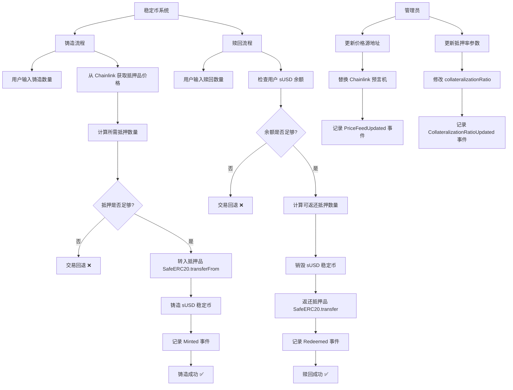

# 稳定币

Day: Day 29
ID: 29
原文: https://builder-hub.notion.site/StableCoin-Contract-1e35720a23ef809f9875e8e244964c5b
状态: 完成
译者: Rebecca9715
难度等级: 高级

好的，建设者们——

花一秒钟回顾一下你走了多远。

仅仅几天时间，你就从编写简单变量……

到创建**你自己的 ERC-20 代币**，

**锁定宝藏**，

**设置访问控制**，

**保护合约免受攻击**，

甚至**在智能合约中安全地处理资金**。

**你不仅仅是阅读了 Solidity——你*用它构建*了。**

现在，你已经准备好迎接下一步了。

今天，我们将从"玩具合约"转向**构建一个真实世界的、必不可少的工具**，它为加密世界中最大的应用提供动力：

> 稳定币。
> 

---

## 🌍 为什么稳定币如此重要

想象一下试图过你的日常生活——

但你钱包里的钱的价值每隔几个小时就会*跳动*上下 30%。

- 昨天，你的咖啡花了 3 美元。
- 今天，是 6 美元。
- 明天，也许是 1.50 美元。

这就是像比特币和以太坊这样的加密货币可能有多疯狂。

- *对投资者来说有趣？**也许吧。
- *对支付来说实用？**绝对不是。

这就是**稳定币**的用武之地。

🔹 它们就像加密世界风暴海洋中的锚。

🔹 它们被设计为保持*稳定*，通常与主要货币如**美元**1:1 挂钩。

🔹 它们是 Web3 中**交易**、**储蓄**、**借贷**、**放贷**和**日常交易**背后的沉默英雄。

事实上，如果你今天环顾 DeFi——

**几乎每个 dApp**、每个 NFT 市场、每个借贷池、每个 DEX——

它们在幕后都严重依赖稳定币。

没有稳定币？

整个 DeFi 世界就会感觉像是试图在价格每五秒钟变化一次的市场上购物。

---

## 🛠️ 但真正的稳定币不是超级复杂吗？

是的——绝对是。

像 USDC、DAI 和 USDT 这样的现实世界稳定币是**极其复杂的系统**。

它们涉及：

- 抵押储备
- 链上和链下预言机
- 动态供应调整
- 治理投票
- 全面审计和法律合规

这只是冰山一角！

**但事情是这样的：**

你不需要深入那种复杂性来*理解*核心思想是如何运作的。

---

## 🚀 我们今天要构建什么

今天，我们正在构建你自己的**SimpleStablecoin**。

一个**初学者友好**的版本。

**精心设计**以剥离所有令人不知所措的复杂性——

并**放大**真正重要的东西：

- 你如何**铸造**稳定币？
- 你如何**赎回**它们？
- 你如何用**真实抵押品****支持**它们？
- 你如何**计算**安全边际并保护系统？

👉 这不是生产级稳定币。

👉 这是**你的训练场**——

一个干净、易于理解的游乐场，你将在这里学习驱动世界上最大稳定币的*机制*。

当我们完成时，你不仅会知道稳定币合约是如何构建的——

你将编写你**自己的**。

相信我——

**这是成为真正的 Web3 开发者的一大飞跃。**

---

**准备好了吗？**

让我们深入合约——并开始解开你的 SimpleStablecoin 实际上是如何工作的！

---

# 🧠 快速概览：我们的 SimpleStablecoin 如何工作

在我们深入代码之前，这里快速概览一下幕后发生的事情：

用户将存入一个受信任的抵押代币（如 ETH、USDC 或我们决定的任何 ERC-20 代币），并根据从价格源获取的最新价格，合约计算他们可以铸造多少稳定币。为了保持系统安全，我们确保用户始终存入*多于*他们获得的稳定币价值的抵押品——这要归功于 150% 的抵押率。稍后，当有人想要他们的抵押品回来时，他们可以通过销毁它们来赎回他们的稳定币。该合约还包括基本的所有者控制（如更新价格源或抵押设置）并防止像重入攻击这样的常见漏洞。

这是一个**初学者友好**的版本——专门关注**铸造**、**赎回**和**抵押管理**等核心机制，这样你就可以真正理解稳定币在幕后是如何工作的，而不会被生产级的复杂性所淹没。

---

# 📝 这是完整的合约

现在你知道了高层次的想法，

让我们跳进代码，看看一切是如何组合在一起的！

👇

```solidity
// SPDX-License-Identifier: MIT
pragma solidity ^0.8.20;

import "@openzeppelin/contracts/token/ERC20/ERC20.sol";
import "@openzeppelin/contracts/access/Ownable.sol";
import "@openzeppelin/contracts/security/ReentrancyGuard.sol";
import "@openzeppelin/contracts/token/ERC20/utils/SafeERC20.sol";
import "@openzeppelin/contracts/access/AccessControl.sol";
import "@openzeppelin/contracts/interfaces/IERC20Metadata.sol";
import "@chainlink/contracts/src/v0.8/interfaces/AggregatorV3Interface.sol";

contract SimpleStablecoin is ERC20, Ownable, ReentrancyGuard, AccessControl {
    using SafeERC20 for IERC20;

    bytes32 public constant PRICE_FEED_MANAGER_ROLE = keccak256("PRICE_FEED_MANAGER_ROLE");
    IERC20 public immutable collateralToken;
    uint8 public immutable collateralDecimals;
    AggregatorV3Interface public priceFeed;
    uint256 public collateralizationRatio = 150; // 以百分比表示（150 = 150%）

    event Minted(address indexed user, uint256 amount, uint256 collateralDeposited);
    event Redeemed(address indexed user, uint256 amount, uint256 collateralReturned);
    event PriceFeedUpdated(address newPriceFeed);
    event CollateralizationRatioUpdated(uint256 newRatio);

    error InvalidCollateralTokenAddress();
    error InvalidPriceFeedAddress();
    error MintAmountIsZero();
    error InsufficientStablecoinBalance();
    error CollateralizationRatioTooLow();

    constructor(
        address _collateralToken,
        address _initialOwner,
        address _priceFeed
    ) ERC20("Simple USD Stablecoin", "sUSD") Ownable(_initialOwner) {
        if (_collateralToken == address(0)) revert InvalidCollateralTokenAddress();
        if (_priceFeed == address(0)) revert InvalidPriceFeedAddress();

        collateralToken = IERC20(_collateralToken);
        collateralDecimals = IERC20Metadata(_collateralToken).decimals();
        priceFeed = AggregatorV3Interface(_priceFeed);

        _grantRole(DEFAULT_ADMIN_ROLE, _initialOwner);
        _grantRole(PRICE_FEED_MANAGER_ROLE, _initialOwner);
    }

    function getCurrentPrice() public view returns (uint256) {
        (, int256 price, , , ) = priceFeed.latestRoundData();
        require(price > 0, "Invalid price feed response");
        return uint256(price);
    }

    function mint(uint256 amount) external nonReentrant {
        if (amount == 0) revert MintAmountIsZero();

        uint256 collateralPrice = getCurrentPrice();
        uint256 requiredCollateralValueUSD = amount * (10 ** decimals()); // 假设 sUSD 为 18 位小数
        uint256 requiredCollateral = (requiredCollateralValueUSD * collateralizationRatio) / (100 * collateralPrice);
        uint256 adjustedRequiredCollateral = (requiredCollateral * (10 ** collateralDecimals)) / (10 ** priceFeed.decimals());

        collateralToken.safeTransferFrom(msg.sender, address(this), adjustedRequiredCollateral);
        _mint(msg.sender, amount);

        emit Minted(msg.sender, amount, adjustedRequiredCollateral);
    }

    function redeem(uint256 amount) external nonReentrant {
        if (amount == 0) revert MintAmountIsZero();
        if (balanceOf(msg.sender) < amount) revert InsufficientStablecoinBalance();

        uint256 collateralPrice = getCurrentPrice();
        uint256 stablecoinValueUSD = amount * (10 ** decimals());
        uint256 collateralToReturn = (stablecoinValueUSD * 100) / (collateralizationRatio * collateralPrice);
        uint256 adjustedCollateralToReturn = (collateralToReturn * (10 ** collateralDecimals)) / (10 ** priceFeed.decimals());

        _burn(msg.sender, amount);
        collateralToken.safeTransfer(msg.sender, adjustedCollateralToReturn);

        emit Redeemed(msg.sender, amount, adjustedCollateralToReturn);
    }

    function setCollateralizationRatio(uint256 newRatio) external onlyOwner {
        if (newRatio < 100) revert CollateralizationRatioTooLow();
        collateralizationRatio = newRatio;
        emit CollateralizationRatioUpdated(newRatio);
    }

    function setPriceFeedContract(address _newPriceFeed) external onlyRole(PRICE_FEED_MANAGER_ROLE) {
        if (_newPriceFeed == address(0)) revert InvalidPriceFeedAddress();
        priceFeed = AggregatorV3Interface(_newPriceFeed);
        emit PriceFeedUpdated(_newPriceFeed);
    }

    function getRequiredCollateralForMint(uint256 amount) public view returns (uint256) {
        if (amount == 0) return 0;

        uint256 collateralPrice = getCurrentPrice();
        uint256 requiredCollateralValueUSD = amount * (10 ** decimals());
        uint256 requiredCollateral = (requiredCollateralValueUSD * collateralizationRatio) / (100 * collateralPrice);
        uint256 adjustedRequiredCollateral = (requiredCollateral * (10 ** collateralDecimals)) / (10 ** priceFeed.decimals());

        return adjustedRequiredCollateral;
    }

    function getCollateralForRedeem(uint256 amount) public view returns (uint256) {
        if (amount == 0) return 0;

        uint256 collateralPrice = getCurrentPrice();
        uint256 stablecoinValueUSD = amount * (10 ** decimals());
        uint256 collateralToReturn = (stablecoinValueUSD * 100) / (collateralizationRatio * collateralPrice);
        uint256 adjustedCollateralToReturn = (collateralToReturn * (10 ** collateralDecimals)) / (10 ** priceFeed.decimals());

        return adjustedCollateralToReturn;
    }

}

```

---

# 1. 产品需求书

### 用户流程



### 数据库

| Contract | Type | Bases |
| --- | --- | --- |
| **SimpleStablecoin** | Implementation | ERC20, Ownable, ReentrancyGuard, AccessControl |

| └ Function Name | Visibility | Mutability |
| --- | --- | --- |
| constructor | public | 🛑 |
| getCurrentPrice | public | view |
| mint | external | 🛑 |
| redeem | external | 🛑 |
| setCollateralizationRatio | external (onlyOwner) | 🛑 |
| setPriceFeedContract | external (onlyRole) | 🛑 |
| getRequiredCollateralForMint | public | view |
| getCollateralForRedeem | public | view |

# 2. 细节解说

# 📦 `SimpleStablecoin.sol` 中的导入

在我们深入稳定币的逻辑之前，我们首先引入一些强大的库和接口。这些导入带来了经过实战检验的工具，用于代币行为、所有权、安全性、角色管理——以及第一次从 Chainlink 获得实时价格数据。

这是我们引入合约的所有内容：

---

```solidity

import "@openzeppelin/contracts/token/ERC20/ERC20.sol";
import "@openzeppelin/contracts/access/Ownable.sol";
import "@openzeppelin/contracts/security/ReentrancyGuard.sol";
import "@openzeppelin/contracts/token/ERC20/utils/SafeERC20.sol";
import "@openzeppelin/contracts/access/AccessControl.sol";
import "@openzeppelin/contracts/interfaces/IERC20Metadata.sol";
import "@chainlink/contracts/src/v0.8/interfaces/AggregatorV3Interface.sol";

```

---

# 🧩 详细解读

我们首先从 OpenZeppelin 导入 **ERC20**，它为我们提供了所有标准代币功能——铸造、转账和管理余额——无需从头开始编写。

然后，**Ownable** 介入引入一个简单的所有权系统。敏感设置，如更新抵押率，应该只由合约所有者更改，而这个模块为我们处理这个问题。

接下来导入 **ReentrancyGuard**，以保护像 `mint` 和 `redeem` 这样的重要函数免受一种称为"重入"的攻击，在这种攻击中，恶意合约试图在第一次调用完成之前重复调用函数。

**SafeERC20** 是处理其他 ERC-20 代币的安全网。有时，代币合约表现不佳（如在没有错误的情况下转账失败），而 SafeERC20 确保所有代币操作要么成功完成，要么干净地失败。

我们还引入 **AccessControl**，它允许合约定义自定义角色。在这个稳定币中，我们有一个特殊的 **价格源管理器** 角色——所以特定账户可以在没有完全管理员控制的情况下更新价格源。

**IERC20Metadata** 在这里帮助我们获取关于抵押代币的额外信息，如它使用多少位小数。不同的代币有不同的小数设置，我们的数学需要考虑到这一点。

最后，也是最重要的，我们从 Chainlink 导入 **AggregatorV3Interface**。

这是让我们的稳定币**看到抵押代币的真实世界价格**的东西。

而不是猜测或依赖手动更新，合约可以自动获取受信任的、去中心化的价格数据——保持系统准确、最新并防止操纵。

---

# 🏗️ 合约声明

在通过导入设置好所有工具之后，我们现在正式开始构建我们的合约。

这是启动一切的第一行：

---

```solidity

contract SimpleStablecoin is ERC20, Ownable, ReentrancyGuard, AccessControl {

```

---

# 🧩 详细解读

我们声明我们的合约并给它一个名字：**SimpleStablecoin**。

但我们不是从头开始构建一切——我们**扩展**四个强大的 OpenZeppelin 合约以继承现成的功能：

- **ERC20**——这为我们的稳定币提供了所有基本的代币行为，如转账代币、批准支出者和检查余额。
- **Ownable**——添加一个简单的所有权模型，所以我们可以控制谁有权执行敏感操作，如更新系统设置。
- **ReentrancyGuard**——保护关键函数免受重入攻击，使铸造和赎回等操作更加安全。
- **AccessControl**——允许我们定义自定义角色（如价格源管理器），并精细控制谁可以调用某些函数。

通过一次继承所有这些，我们建立了一个强大的基础，其中安全性、访问控制和代币行为已经得到专业处理——我们可以纯粹专注于稳定币特定的逻辑。

---

# 

# 🏗️ 状态变量

现在合约已经被声明，我们继续设置**关键变量**，这些变量定义了我们的稳定币将如何在内部工作。

这些变量将存储从抵押代币到当前价格源的所有内容，确保我们的系统知道它正在管理什么资产以及在什么规则下。

这是代码：

---

```solidity

using SafeERC20 for IERC20;

bytes32 public constant PRICE_FEED_MANAGER_ROLE = keccak256("PRICE_FEED_MANAGER_ROLE");
IERC20 public immutable collateralToken;
uint8 public immutable collateralDecimals;
AggregatorV3Interface public priceFeed;
uint256 public collateralizationRatio = 150; // 以百分比表示（150 = 150%）

```

---

# 🧩 详细解读

---

```solidity

using SafeERC20 for IERC20;

```

这一行为我们与之交互的所有 `IERC20` 代币激活 **SafeERC20**。

它自动用安全检查包装像 `transferFrom` 和 `transfer` 这样的方法——确保代币操作要么正确成功，要么在出现任何问题时安全地回滚。

---

```solidity
bytes32 public constant PRICE_FEED_MANAGER_ROLE = keccak256("PRICE_FEED_MANAGER_ROLE");

```

我们创建一个名为 `PRICE_FEED_MANAGER_ROLE` 的特殊角色，它控制谁可以更新价格源。

你会注意到它被存储为 `bytes32` `constant`。
原因如下：

`bytes32` 被使用是因为 AccessControl 中的角色标识符总是期望正好 32 字节——这是一个标准化格式，使角色检查在以太坊虚拟机（EVM）内部快速高效。

constant 意味着这个值一旦部署就永远不会改变。它被永久硬编码到合约中，使其在 gas 上更便宜、更安全——没有人有机会意外地（或恶意地）稍后修改角色标识符。

我们使用 `keccak256("PRICE_FEED_MANAGER_ROLE")` 生成它，这样角色就有一个独特的、加密强度的标识符，而不是只使用一个普通字符串。

---

```solidity

IERC20 public immutable collateralToken;

```

这个变量存储用户必须作为抵押品存入的 **ERC-20 代币的地址**。

通过使它成为 `immutable`，我们确保它只能设置一次——在部署时——并且以后永远不能更改，增加了额外的安全层。

---

```solidity

uint8 public immutable collateralDecimals;

```

不同的 ERC-20 代币可以有不同数量的小数（例如，USDC 使用 6，ETH 使用 18）。

我们在合约部署时将抵押代币的小数存储在这里，这样以后的铸造和赎回计算就保持准确。

---

```solidity

AggregatorV3Interface public priceFeed;

```

这个变量指向 **Chainlink 价格源** 合约。

我们将使用它在有人铸造或赎回稳定币时获取我们抵押代币的实时价格。

---

```solidity

uint256 public collateralizationRatio = 150; // 以百分比表示（150 = 150%）

```

这设置了**抵押率**——意味着用户在铸造稳定币时必须始终存入其价值的 **150%** 的抵押品。

这是一个内置的安全缓冲，以保护系统免受抵押品价值突然下降的影响。

---

# 📣 事件

智能合约不能只是直接与网站或用户"对话"。

相反，它们**发出事件**——记录在区块链上的小信号。

像前端、区块浏览器和钱包这样的应用可以监听这些事件，并实时向用户显示正在发生的事情。

这是我们从 SimpleStablecoin 发出的一组事件：

---

```solidity

event Minted(address indexed user, uint256 amount, uint256 collateralDeposited);
event Redeemed(address indexed user, uint256 amount, uint256 collateralReturned);
event PriceFeedUpdated(address newPriceFeed);
event CollateralizationRatioUpdated(uint256 newRatio);

```

---

# 🧩 详细解读

---

```solidity

event Minted(address indexed user, uint256 amount, uint256 collateralDeposited);

```

每当有人成功铸造新稳定币时，就会触发此事件。

它记录：

- **谁铸造的**（`user`）
- **他们收到多少稳定币**（`amount`）
- **他们存入多少抵押品**（`collateralDeposited`）

`user` 上的 `indexed` 关键字允许你轻松地在区块链上按特定用户地址过滤和搜索所有铸造操作。

---

```solidity

event Redeemed(address indexed user, uint256 amount, uint256 collateralReturned);

```

每当有人将稳定币赎回为抵押品时，就会触发此事件。

它告诉我们：

- **谁赎回的**（`user`）
- **他们销毁了多少稳定币**（`amount`）
- **他们取回了多少抵押品**（`collateralReturned`）

同样，`user` 是 `indexed` 的，所以前端应用可以快速显示用户的个人赎回历史。

---

```solidity

event PriceFeedUpdated(address newPriceFeed);

```

此事件表示**价格源地址**已更新。

它记录新的源地址，所以一切都保持完全透明——

用户可以相信对关键数据源的任何更改都是公开可见的。

---

```solidity

event CollateralizationRatioUpdated(uint256 newRatio);

```

最后，每当**抵押率**被更改时，就会发出此事件。

监控系统的用户和 dApp 可以在所需的安全缓冲被提高或降低时立即做出反应。

---

# 🚨 自定义错误

当智能合约内部出现问题时，如无效输入或检查失败，我们希望交易**优雅地失败**并解释*原因*。

在较旧的 Solidity 代码中，这通常使用带有错误字符串的 `require()` 语句完成——但这种方法在 gas 上很昂贵。

**自定义错误**是一种更新、更清洁的处理失败的方式。

它们更便宜、更易于阅读，并且使用户和开发人员的调试变得更简单。

这是我们声明的自定义错误：

---

```solidity

error InvalidCollateralTokenAddress();
error InvalidPriceFeedAddress();
error MintAmountIsZero();
error InsufficientStablecoinBalance();
error CollateralizationRatioTooLow();

```

---

# 🧩 详细解读

---

```solidity

error InvalidCollateralTokenAddress();

```

如果有人试图用无效（零）抵押代币地址部署合约，就会抛出此错误。

没有真正的代币支持系统，整个稳定币将无法工作——所以我们一开始就阻止它。

---

```solidity

error InvalidPriceFeedAddress();

```

如果提供的价格源地址无效，就会触发此错误。

由于我们严重依赖实时价格数据，连接到坏的源会使系统不安全——所以我们立即阻止它。

---

```solidity

error MintAmountIsZero();

```

如果用户试图铸造**零**稳定币，我们抛出此错误。

铸造零代币没有意义，只会浪费 gas，所以我们干净地阻止它。

---

```solidity

error InsufficientStablecoinBalance();

```

当用户试图**赎回**比他们实际余额更多的稳定币时，使用此错误。

它防止意外错误和潜在滥用。

---

```solidity

error CollateralizationRatioTooLow();

```

如果有人试图将抵押率设置为低于 100%，就会抛出此错误。

允许低于 100% 的比率意味着稳定币没有完全支持——这是一个巨大的风险——所以我们执行严格的最低限度。

---

# 🏗️ 构造函数

构造函数是我们合约的**启动序列**。

它运行**一次**——在合约部署的那一刻——并设置所有关键部分：我们接受什么代币作为抵押品、我们从哪里获得价格数据以及谁控制合约。

这是代码：

---

```solidity

constructor(
    address _collateralToken,
    address _initialOwner,
    address _priceFeed
) ERC20("Simple USD Stablecoin", "sUSD") Ownable(_initialOwner) {
    if (_collateralToken == address(0)) revert InvalidCollateralTokenAddress();
    if (_priceFeed == address(0)) revert InvalidPriceFeedAddress();

    collateralToken = IERC20(_collateralToken);
    collateralDecimals = IERC20Metadata(_collateralToken).decimals();
    priceFeed = AggregatorV3Interface(_priceFeed);

    _grantRole(DEFAULT_ADMIN_ROLE, _initialOwner);
    _grantRole(PRICE_FEED_MANAGER_ROLE, _initialOwner);
}

```

---

# 🧩 详细解读

---

```solidity

constructor(
    address _collateralToken,
    address _initialOwner,
    address _priceFeed
)

```

在部署合约时，我们必须提供：

- **抵押代币**的地址（像 USDC、WETH 等 ERC-20）
- **初始所有者**的地址（管理员）
- **Chainlink 价格源**的地址（获取实时抵押品价格）

---

```solidity

ERC20("Simple USD Stablecoin", "sUSD")

```

就在这里，在构造函数内部，我们调用 OpenZeppelin 的 ERC-20 构造函数——

给我们的代币一个**名称**（"Simple USD Stablecoin"）和一个**符号**（"sUSD"），它们将出现在钱包和浏览器中。

---

```solidity

Ownable(_initialOwner)

```

我们还调用 `Ownable` 构造函数，设置合约的初始所有者——

将拥有特殊管理员权限的人，如稍后调整设置。

---

```solidity

if (_collateralToken == address(0)) revert InvalidCollateralTokenAddress();

```

在做任何其他事情之前，我们仔细检查提供的抵押代币地址是有效的（不是零地址）。

如果它无效，我们立即**回滚**部署，并显示清晰的自定义错误。

---

```solidity

if (_priceFeed == address(0)) revert InvalidPriceFeedAddress();

```

同样的想法在这里——我们确保 Chainlink 价格源地址在继续之前是有效的。

没有价格源，就没有稳定币逻辑。

---

```solidity

collateralToken = IERC20(_collateralToken);

```

我们保存抵押代币的地址，所以合约知道用户在铸造稳定币时将存入**什么代币**。

---

```solidity

collateralDecimals = IERC20Metadata(_collateralToken).decimals();

```

不同的代币有不同的小数格式。

我们现在获取并存储抵押代币的小数，这样我们就可以在以后正确处理所有数学。

---

```solidity

priceFeed = AggregatorV3Interface(_priceFeed);

```

我们将合约连接到 **Chainlink 价格源**，使其能够按需获取实时价格数据。

---

```solidity

_grantRole(DEFAULT_ADMIN_ROLE, _initialOwner);
_grantRole(PRICE_FEED_MANAGER_ROLE, _initialOwner);

```

最后，我们授予两个重要角色：

- **DEFAULT_ADMIN_ROLE**——让所有者完全控制合约的角色系统
- **PRICE_FEED_MANAGER_ROLE**——让所有者在将来需要时更新价格源

通过在部署时分配这些角色，我们确保系统从第一天起就是安全且可管理的。

---

# 🧮 从 Chainlink 获取实时价格

这个函数是我们在整个合约中使用的**辅助函数**——在铸造和赎回逻辑以及视图函数中。

而不是在每个地方重复相同的价格获取逻辑，我们将它整齐地包装在 `getCurrentPrice()` 中，这样它就可重用且易于维护。

这是代码：

---

```solidity

function getCurrentPrice() public view returns (uint256) {
    (, int256 price, , , ) = priceFeed.latestRoundData();
    require(price > 0, "Invalid price feed response");
    return uint256(price);
}

```

---

# 🧩 详细解读

---

```solidity

function getCurrentPrice() public view returns (uint256)

```

这是一个**公共视图**函数——任何人都可以调用它来获取最新价格，并且它不会改变任何状态。

---

```solidity

(, int256 price, , , ) = priceFeed.latestRoundData();

```

我们从 Chainlink 聚合器接口调用 `latestRoundData()`。

这给我们**最新报告的价格**——但我们只关心元组中的第二个值，这是实际价格（作为 `int256` 返回）。

---

```solidity

require(price > 0, "Invalid price feed response");

```

只是为了安全起见，我们检查返回的价格大于零。

如果预言机曾经失败或返回坏数据，我们阻止交易以防止错误的抵押品计算。

---

```solidity

return uint256(price);

```

由于 Solidity 数学与无符号整数（`uint256`）配合最佳，我们将 `int256` 值转换为正数并返回它。

---

这个函数在我们需要实时价格时被调用——这在稳定币中**很常见**。

通过在这里集中逻辑，我们保持事物干净、安全，并且如果需要的话，易于在一个地方更新。

---

# 🏗️ 铸造稳定币

mint 函数是用户**将抵押品存入**合约并接收**新铸造的稳定币**作为回报的地方。

这是任何想要基于其存入资产的价值创建新 sUSD 代币的人的入口点。

这是代码：

---

```solidity

function mint(uint256 amount) external nonReentrant {
    if (amount == 0) revert MintAmountIsZero();

    uint256 collateralPrice = getCurrentPrice();
    uint256 requiredCollateralValueUSD = amount * (10 ** decimals()); // 假设 sUSD 为 18 位小数
    uint256 requiredCollateral = (requiredCollateralValueUSD * collateralizationRatio) / (100 * collateralPrice);
    uint256 adjustedRequiredCollateral = (requiredCollateral * (10 ** collateralDecimals)) / (10 ** priceFeed.decimals());

    collateralToken.safeTransferFrom(msg.sender, address(this), adjustedRequiredCollateral);
    _mint(msg.sender, amount);

    emit Minted(msg.sender, amount, adjustedRequiredCollateral);
}

```

---

# 🧩 详细解读

---

```solidity

function mint(uint256 amount) external nonReentrant {

```

这是一个**面向公众的函数**——任何用户都可以调用它来铸造稳定币。

我们还用 `nonReentrant` 保护它，以防止铸造过程中的狡猾攻击。

---

```solidity

if (amount == 0) revert MintAmountIsZero();

```

我们立即阻止用户铸造**零**稳定币。

铸造零是毫无意义的，只会浪费 gas。

---

```solidity

uint256 collateralPrice = getCurrentPrice();

```

我们使用连接的 Chainlink 价格源获取抵押代币的**当前实时价格**。

这确保所需的抵押品计算始终基于**真实世界数据**，而不是过时的假设。

---

```solidity

uint256 requiredCollateralValueUSD = amount * (10 ** decimals());

```

我们计算用户想要铸造的稳定币的 **USD 价值**。

由于 sUSD 使用 18 位小数（如 ETH），我们乘以 `10 ** 18` 以正确处理缩放。

---

```solidity

uint256 requiredCollateral = (requiredCollateralValueUSD * collateralizationRatio) / (100 * collateralPrice);

```

接下来，我们根据抵押率（如 150%）计算用户需要存入多少**抵押品价值**（以 USD 计）。

如果你想以 150% 铸造 $100 的 sUSD，你应该提供价值 $150 的抵押品。

---

```solidity

uint256 adjustedRequiredCollateral = (requiredCollateral * (10 ** collateralDecimals)) / (10 ** priceFeed.decimals());

```

由于代币和价格源通常使用不同数量的小数（例如，6 vs 18），

我们在这里调整数字以确保计算对于抵押代币和价格源都是**精度正确**的。

---

```solidity

collateralToken.safeTransferFrom(msg.sender, address(this), adjustedRequiredCollateral);

```

我们安全地将所需数量的抵押品从用户转入合约。

`safeTransferFrom` 确保操作要么完全成功，要么干净地失败——没有静默错误。

---

```solidity

_mint(msg.sender, amount);

```

一旦抵押品安全存入，我们**铸造**请求数量的 sUSD 稳定币直接进入用户的钱包。

---

```solidity

emit Minted(msg.sender, amount, adjustedRequiredCollateral);

```

最后，我们触发 **Minted** 事件——记录谁铸造的、他们铸造了多少以及他们存入了多少抵押品——

为 dApp 和用户提供对刚刚发生的事情的完全可见性。

---

# 🔄 赎回稳定币

如果铸造是用户通过存入抵押品来创建 sUSD 的方式，

**赎回**是他们销毁他们的 sUSD 并**取回他们的抵押品**的方式。

这个函数与 `mint` 相反：它确保用户有足够的稳定币，根据最新价格计算他们应该取回多少抵押品，并安全地将其返回给他们。

这是代码：

---

```solidity

function redeem(uint256 amount) external nonReentrant {
    if (amount == 0) revert MintAmountIsZero();
    if (balanceOf(msg.sender) < amount) revert InsufficientStablecoinBalance();

    uint256 collateralPrice = getCurrentPrice();
    uint256 stablecoinValueUSD = amount * (10 ** decimals());
    uint256 collateralToReturn = (stablecoinValueUSD * 100) / (collateralizationRatio * collateralPrice);
    uint256 adjustedCollateralToReturn = (collateralToReturn * (10 ** collateralDecimals)) / (10 ** priceFeed.decimals());

    _burn(msg.sender, amount);
    collateralToken.safeTransfer(msg.sender, adjustedCollateralToReturn);

    emit Redeemed(msg.sender, amount, adjustedCollateralToReturn);
}

```

---

# 🧩 详细解读

---

```solidity

if (amount == 0) revert MintAmountIsZero();

```

我们立即阻止零值赎回。

赎回零只是浪费 gas。

---

```solidity

if (balanceOf(msg.sender) < amount) revert InsufficientStablecoinBalance();

```

我们检查用户实际拥有足够的 sUSD 来赎回。

如果他们试图销毁比他们持有的更多，交易被回滚——干净而清晰。

---

```solidity

uint256 collateralPrice = getCurrentPrice();

```

我们从 Chainlink 获取抵押代币的**最新真实世界价格**。

这确保用户收到的抵押品数量基于最新的、受信任的市场数据。

---

```solidity

uint256 stablecoinValueUSD = amount * (10 ** decimals());

```

我们计算正在赎回的 sUSD 代币的 USD 价值，使用 18 位小数正确缩放（因为这是 sUSD 使用的）。

---

```solidity

uint256 collateralToReturn = (stablecoinValueUSD * 100) / (collateralizationRatio * collateralPrice);

```

然后我们计算**应该返回多少抵押品价值**——

基于抵押率和当前市场价格。

> 例如：如果你以 150% 赎回 $100，你应该取回大约 $66.66 价值的抵押品。
> 

---

```solidity

uint256 adjustedCollateralToReturn = (collateralToReturn * (10 ** collateralDecimals)) / (10 ** priceFeed.decimals());

```

在这里，我们调整抵押代币使用的小数数量与价格源之间的任何差异——

所以返回的金额是**精确和准确的**。

---

```solidity

_burn(msg.sender, amount);

```

我们**销毁**正在赎回的稳定币——永久将它们从流通中移除。

---

```solidity

collateralToken.safeTransfer(msg.sender, adjustedCollateralToReturn);

```

一旦 sUSD 被销毁，计算的抵押品数量**安全地发送回**用户的钱包。

---

```solidity

emit Redeemed(msg.sender, amount, adjustedCollateralToReturn);

```

我们发出一个 **Redeemed** 事件，记录：

- 谁赎回的
- 他们销毁了多少 sUSD
- 他们收到了多少抵押品

这使一切在链上保持透明和可追溯。

---

# ⚙️ 更新抵押率

这个函数允许**所有者**调整系统的安全缓冲——铸造新稳定币时所需的超额抵押百分比。

调整这个比率可以帮助应对不断变化的市场条件（如高波动性），但它受到严格控制以避免危险设置。

这是函数：

---

```solidity

function setCollateralizationRatio(uint256 newRatio) external onlyOwner {
    if (newRatio < 100) revert CollateralizationRatioTooLow();
    collateralizationRatio = newRatio;
    emit CollateralizationRatioUpdated(newRatio);
}

```

---

# 🧩 详细解读

---

```solidity

function setCollateralizationRatio(uint256 newRatio) external onlyOwner {

```

这是一个**仅限所有者的函数**——没有其他人可以调用它。

它让所有者能够更新用户在铸造时必须存入多少抵押品。

---

```solidity

if (newRatio < 100) revert CollateralizationRatioTooLow();

```

我们执行一个**严格的下限**：比率永远不能低于 100%。

这确保每个稳定币始终至少由其全部价值的抵押品支持——不允许部分准备金。

---

```solidity

collateralizationRatio = newRatio;

```

如果新比率有效，我们存储它。

这个新值将在所有未来的 `mint` 和 `redeem` 计算中使用。

---

```solidity

emit CollateralizationRatioUpdated(newRatio);

```

我们发出一个事件，所以更改**在链上可见**。

这保持系统透明——dApp 和用户可以看到规则何时（以及如何）改变。

---

# 🔄 更新价格源

价格源是任何抵押支持的稳定币的支柱。

如果数据源中断或需要升级，我们需要一种方式**安全地更新它**而不重新部署整个合约。

这个函数让受信任的角色——不仅仅是所有者——在需要时更新 Chainlink 源。

---

```solidity

function setPriceFeedContract(address _newPriceFeed) external onlyRole(PRICE_FEED_MANAGER_ROLE) {
    if (_newPriceFeed == address(0)) revert InvalidPriceFeedAddress();
    priceFeed = AggregatorV3Interface(_newPriceFeed);
    emit PriceFeedUpdated(_newPriceFeed);
}

```

---

# 🧩 详细解读

---

```solidity

function setPriceFeedContract(address _newPriceFeed) external onlyRole(PRICE_FEED_MANAGER_ROLE) {

```

这个函数只能由拥有 **PRICE_FEED_MANAGER_ROLE** 的人调用。

这样，我们不会将所有价格源控制权交给所有者——它是一个单独的、严格限定范围的角色。

---

```solidity

if (_newPriceFeed == address(0)) revert InvalidPriceFeedAddress();

```

我们检查新地址是有效的（不是零）。

如果不是，我们立即用清晰的自定义错误停止交易。

---

```solidity

priceFeed = AggregatorV3Interface(_newPriceFeed);

```

一旦验证，我们更新内部 `priceFeed` 引用——将合约连接到新的 Chainlink 源。

---

```solidity

emit PriceFeedUpdated(_newPriceFeed);

```

我们发出一个事件，所以更新是公开可见的。

这保持系统透明，并确保任何使用此合约的 dApp 或前端可以响应更改。

---

# 📊 预览所需抵押品

在用户调用 `mint` 之前，知道他们需要存入**多少抵押品**是有帮助的。

这个函数使这变得容易——它让前端和用户**预览所需金额**，基于实时价格源和当前比率，而无需实际发送交易。

这是代码：

---

```solidity

function getRequiredCollateralForMint(uint256 amount) public view returns (uint256) {
    if (amount == 0) return 0;

    uint256 collateralPrice = getCurrentPrice();
    uint256 requiredCollateralValueUSD = amount * (10 ** decimals());
    uint256 requiredCollateral = (requiredCollateralValueUSD * collateralizationRatio) / (100 * collateralPrice);
    uint256 adjustedRequiredCollateral = (requiredCollateral * (10 ** collateralDecimals)) / (10 ** priceFeed.decimals());

    return adjustedRequiredCollateral;
}

```

---

# 🧩 详细解读

---

```solidity

function getRequiredCollateralForMint(uint256 amount) public view returns (uint256)

```

这是一个**视图函数**，意味着它不修改状态——它只从合约中读取。

任何人都可以调用它来检查他们铸造给定数量的 sUSD 需要多少抵押品。

---

```solidity

if (amount == 0) return 0;

```

如果用户询问铸造零代币需要多少抵押品，答案很简单：无。

---

```solidity

uint256 collateralPrice = getCurrentPrice();

```

我们使用实时 Chainlink 源获取抵押品的**当前市场价格**。

---

```solidity

uint256 requiredCollateralValueUSD = amount * (10 ** decimals());

```

我们将稳定币的数量缩放到 18 位小数以用完整的 USD 价值术语表达它。

这给我们抵押品必须覆盖的总 USD 价值。

---

```solidity

uint256 requiredCollateral = (requiredCollateralValueUSD * collateralizationRatio) / (100 * collateralPrice);

```

我们应用**抵押率**（例如，150%）来确定用户必须提供比 USD 价值多多少。

---

```solidity

uint256 adjustedRequiredCollateral = (requiredCollateral * (10 ** collateralDecimals)) / (10 ** priceFeed.decimals());

```

我们调整抵押代币和价格源之间的任何**小数不匹配**。

这确保最终数字以抵押代币的单位正确缩放。

---

```solidity

return adjustedRequiredCollateral;

```

最后，我们返回用户需要发送以铸造所需 sUSD 数量的**抵押代币（以最小单位）**的确切数量。

---

# 💵 预览赎回时返回的抵押品

这个函数是 **`getRequiredCollateralForMint` 的对应物**——它帮助用户检查如果他们赎回一定数量的 sUSD，他们将收到**多少抵押品**。

这是一个纯粹的、只读的函数，对于前端和钱包在用户采取任何行动之前给用户清晰度非常有用。

---

```solidity

function getCollateralForRedeem(uint256 amount) public view returns (uint256) {
    if (amount == 0) return 0;

    uint256 collateralPrice = getCurrentPrice();
    uint256 stablecoinValueUSD = amount * (10 ** decimals());
    uint256 collateralToReturn = (stablecoinValueUSD * 100) / (collateralizationRatio * collateralPrice);
    uint256 adjustedCollateralToReturn = (collateralToReturn * (10 ** collateralDecimals)) / (10 ** priceFeed.decimals());

    return adjustedCollateralToReturn;
}

```

---

# 🧩 详细解读

---

```solidity

if (amount == 0) return 0;

```

如果用户询问赎回**零**稳定币，答案显然是零——不需要运行其余的计算。

---

```solidity

uint256 collateralPrice = getCurrentPrice();

```

我们使用我们之前定义的同一辅助函数获取抵押代币的**实时价格**。

这确保所有数学都基于最新的市场数据。

---

```solidity

uint256 stablecoinValueUSD = amount * (10 ** decimals());

```

我们将用户想要赎回的 sUSD 数量转换为其 **USD 价值**，使用 18 位小数缩放，因为我们的稳定币使用该格式。

---

```solidity

uint256 collateralToReturn = (stablecoinValueUSD * 100) / (collateralizationRatio * collateralPrice);

```

这告诉我们用户有权获得的**抵押品的 USD 价值**。

由于系统是超额抵押的（例如，150%），用户只能取回他们最初锁定的全部价值的一部分。

---

```solidity

uint256 adjustedCollateralToReturn = (collateralToReturn * (10 ** collateralDecimals)) / (10 ** priceFeed.decimals());

```

再次，我们处理抵押代币和价格源之间**小数格式**的差异——所以结果以代币单位正确缩放。

---

```solidity

return adjustedCollateralToReturn;

```

最后，我们返回用户如果赎回给定 sUSD 数量将收到的抵押品数量（以最小单位如 wei）。

---

有了这个，用户对系统的两面都有完全的可见性：

- 他们需要多少抵押品来铸造。
- 他们赎回时会取回多少抵押品。

---

# 🧰 在 Remix 上使用主网分叉部署 SimpleStablecoin 的分步指南

### 1. 打开 Remix IDE

- 在浏览器中导航到 Remix IDE。

### 2. 设置主网分叉环境

1. 单击左侧边栏上的 **"Deploy & Run Transactions"** 标签（🚀 图标）。
2. 在 **"Environment"** 下拉菜单中，选择 **"Remix VM - Mainnet fork"**。
    - 这会分叉以太坊主网并将其加载到 Remix VM 中，允许你与已部署的主网合约交互。
    - Remix 提供 10 个账户，每个账户预加载 100 ETH 用于测试目的

*注意：使用主网分叉时要小心，因为它模拟主网环境。确保你不会发送真实交易，除非有意为之。*

### 3. 创建并编译你的自定义 ERC20 代币

1. 在 **File Explorer**（📁 图标）中，创建一个名为 `MyToken.sol` 的新文件。
2. 将以下代码粘贴到 `MyToken.sol` 中：
    
    ```solidity
    // SPDX-License-Identifier: MIT
    pragma solidity ^0.8.20;
    
    import "@openzeppelin/contracts/token/ERC20/ERC20.sol";
    
    contract MyToken is ERC20 {
        constructor() ERC20("MyToken", "MTK") {
            _mint(msg.sender, 1_000_000 * 10 ** decimals());
        }
    }
    
    ```
    
3. 单击 **"Solidity Compiler"** 标签（🛠️ 图标）。
4. 确保编译器版本与你的合约中的 pragma 匹配（例如，`0.8.20`）。
5. 单击 **"Compile MyToken.sol"**。

### 4. 部署你的自定义 ERC20 代币

1. 在 **"Deploy & Run Transactions"** 标签中：
    - 确保 **Environment** 设置为 **"Remix VM - Mainnet fork"**。
    - 从下拉菜单中选择 `MyToken` 合约。
2. 单击 **"Deploy"**。
3. 部署后，你将在 **Deployed Contracts** 下看到你的合约。展开它以查看可用函数。

### 5. 识别 Chainlink 价格源地址

由于你正在使用主网分叉，你可以与实际部署的合约交互。例如：

- **Chainlink ETH/USD 价格源（以太坊主网）：**
    - 地址：`0x5f4ec3df9cbd43714fe2740f5e3616155c5b8419`
    - 小数：8

*注意：这些地址特定于以太坊主网。通过参考 [Chainlink 的官方文档](https://docs.chain.link/data-feeds/price-feeds/addresses)确保它们准确且最新。*

### 6. 创建并编译 SimpleStablecoin 合约

1. 在 **File Explorer** 中，创建一个名为 `SimpleStablecoin.sol` 的新文件。
2. 将你完整的 **SimpleStablecoin** 合约代码粘贴到此文件中。
    - 确保包含所有必要的 OpenZeppelin 导入。
3. 单击 **"Solidity Compiler"** 标签。
4. 确保编译器版本与你的合约中的 pragma 匹配。
5. 单击 **"Compile SimpleStablecoin.sol"**。

### 7. 部署 SimpleStablecoin 合约

1. 在 **"Deploy & Run Transactions"** 标签中：
    - 确保 **Environment** 设置为 **"Remix VM - Mainnet fork"**。
    - 从下拉菜单中选择 `SimpleStablecoin` 合约。
2. 输入构造函数参数：
    - `_collateralToken`：粘贴你部署的 `MyToken` 合约的地址。
    - `_initialOwner`：使用 Remix 提供的预资助账户地址之一。
    - `_priceFeedContract`：粘贴 Chainlink ETH/USD 价格源地址。
3. 单击 **"Deploy"**。

### 8. 与已部署的合约交互

### 批准 SimpleStablecoin 合约花费你的代币

1. 在 **Deployed Contracts** 部分，展开你的 `MyToken` 合约。
2. 调用 `approve` 函数：
    - `_spender`：你部署的 `SimpleStablecoin` 合约的地址。
    - `_value`：要批准的代币数量（例如，`1000000000000000000000` 表示 1000 个 18 位小数的代币）。

### 铸造稳定币

1. 在 **Deployed Contracts** 部分展开你的 `SimpleStablecoin` 合约。
2. 调用 `mint` 函数：
    - `amount`：你希望铸造的稳定币数量（100 个代币）。

### 赎回稳定币

1. 调用 `redeem` 函数：
    - `amount`：你希望赎回的稳定币数量。

*注意：在执行这些操作之前，请确保你有足够的余额和批准。*