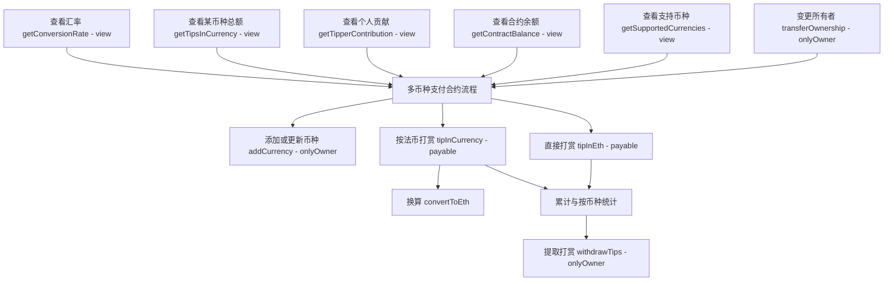

# 多币种支付合约

Day: Day 8
ID: 8
原文: https://www.notion.so/TipJar-Contract-1cf5720a23ef80e2acf8ebd862a85f27?source=copy_link
状态: 完成
译者: Tian Titian
难度等级: 初级

[🧭 首页](https://www.notion.so/5-5-HerSolidity-28e06421268880e4b645d9458179e231?pvs=21) ｜ [🎓 30天课程日历](https://www.notion.so/28e0642126888002b26be4b2e9841ce0?pvs=21) ｜[](https://www.notion.so/28e06421268881e59a00e854a7444215?pvs=21) ｜[FAQ-Solidity答疑问题库](https://www.notion.so/2910642126888046a897d75705d86a58?pvs=21) ｜ [👩🏻‍💻 关于我们](https://www.notion.so/344d3328efef4b3ab742f92b61533ce8?pvs=21)

今日学习内容：

假设你一直在构建链上工具——也许是存钱罐合同，也许是像 Splitwise 这样的共享费用跟踪器。

现在想象一下...…

你刚刚完成了 dApp 的现场演示，有人喜欢它，他们说：

“嘿，我很乐意为此给你小费。但我没有 ETH——我只能用美元支付。

我们如何做到这一点？

当当当当。这就是今天智能合约的用武之地。

今天，我们正在构建一个名为 TipJar 的智能合约，让人们可以向您发送提示：

- 直接在 ETH 中，或
- 以其他货币（如美元、欧元或日元）计算，我们会将其转换为 ETH

<aside>
💻

 **完整代码地址：**👇🏼

[https://github.com/snehasharma76/30daysSolidity_Web3Compass/blob/master/TipJar.sol](https://github.com/snehasharma76/30daysSolidity_Web3Compass/blob/master/TipJar.sol)

</aside>

这是您第一次看到在智能合约中处理现实世界的货币，它带来了一些非常重要的课程：

- 如何处理 ETH 和 wei
- 为什么 Solidity 不支持小数
- 如何安全地进行转换数学
- 以及如何确保用户发送正确数量的 ETH

让我们从基础开始：如何在 Solidity 中将一种货币转换为另一种货币？

# 1. 产品需求书

### 合约流程图



### 合约与函数清单

| Contract | Type | Bases | 中文说明 |
| --- | --- | --- | --- |
| TipJar | Implementation | - | 多币种打赏与汇率换算、统计与提现 |
|  Function Name | Visibility | Mutability | 中文说明 |
| addCurrency(string _currencyCode, uint256 _rateToEth) | Public | nonpayable | 仅所有者添加或更新币种与其兑 ETH 汇率 |
| convertToEth(string _currencyCode, uint256 _amount) | Public | view | 将法币金额按汇率换算为 Wei（ETH 最小单位） |
| tipInEth() | Public | payable | 直接以 ETH 打赏，累计到总额与按币种统计 |
| tipInCurrency(string _currencyCode, uint256 _amount) | Public | payable | 指定法币金额打赏，需随交易附带等值 ETH |
| withdrawTips() | Public | nonpayable | 仅所有者提取合约内累计的打赏款项 |
| transferOwnership(address _newOwner) | Public | nonpayable | 转移合约所有权至新地址 |
| getSupportedCurrencies() returns (string[]) | Public | view | 获取当前支持的币种列表 |
| getContractBalance() returns (uint256) | Public | view | 查询合约当前持有的 ETH 余额 |
| getTipperContribution(address _tipper) returns (uint256) | Public | view | 查询某地址累计打赏（以 Wei 计） |
| getTipsInCurrency(string _currencyCode) returns (uint256) | Public | view | 查询某币种累计打赏的名义金额 |
| getConversionRate(string _currencyCode) returns (uint256) | Public | view | 查询某币种当前设置的兑 ETH 汇率 |

# 2. 细节解说

### **我们需要为TipJar提供 哪些数据？**

在我们深入研究逻辑之前，让我们先分解一下我们的合约需要在 TipJar 中管理的信息类型

```
address public owner;
```

这可以跟踪谁部署了合约以及谁控制了管理作（例如添加货币或提取小费）。

```
mapping(string => uint256) public conversionRates;
```

此映射存储从货币代码（如“USD”）到 ETH 的汇率——

```
string[] public supportedCurrencies;
```

这个动态数组帮助我们跟踪我们添加的所有货币代码，以便我们以后可以循环访问它们。

```
uint256 public totalTipsReceived;
```

这个变量告诉我们合约总体上收集了多少 ETH（以 wei 为单位）。

```
mapping(address => uint256) public tipperContributions;
```

这存储了每个地址在小费中发送了多少 ETH。

```
mapping(string => uint256) public tipsPerCurrency;
```

这跟踪了每种货币的小费金额。因此，如果有人发送等值 2000 美元，我们会在“USD”条目下存储“2000”。

### **修饰符 — 守门人**

因此，与往常一样，我们将创建一个修饰符，以确保只有合约的所有者才能调用某些函数

```
modifier onlyOwner() {
    require(msg.sender == owner, "Only owner can perform this action");
    _;
}
```

只是为了确保没有人用我们的 tipjar 尝试任何有趣的事情。

### **设置货币转换 —** `addCurrency()`

好吧，在我们进入实际的小费部分之前，我们需要回答一个大问题：

**我们的合约如何知道一美元值多少 ETH？**

事实是......事实并非如此。不是自动的。

智能合约存在于区块链上，它们无法访问实时汇率等真实世界的数据。所以如果有人想用美元给小费，我们必须告诉合约：

> “这是 1 美元的 ETH 价值。”
> 

稍后，我们将学习如何使用预言机（如 Chainlink）等方式获取实时数据。但现在，我们将使用名为 `addCurrency()`的函数手动完成。

它的工作原理如下：

---

### **代码**

```solidity

function addCurrency(string memory _currencyCode, uint256 _rateToEth) public onlyOwner {
    require(_rateToEth > 0, "Conversion rate must be greater than 0");

    // Check if currency already exists
    bool currencyExists = false;
    for (uint i = 0; i < supportedCurrencies.length; i++) {
        if (keccak256(bytes(supportedCurrencies[i])) == keccak256(bytes(_currencyCode))) {
            currencyExists = true;
            break;
        }
    }

    // Add to the list if it's new
    if (!currencyExists) {
        supportedCurrencies.push(_currencyCode);
    }

    // Set the conversion rate
    conversionRates[_currencyCode] = _rateToEth;
}

```

---

### **这个函数的实际作用**

让我们一点一点地分解一下。

### Step 1:**谁可以调用？**

该函数标有`onlyOwner`，这意味着**只有部署合约的人**才能添加或更新货币汇率。

这很重要——你不希望任何人错误地（或故意）设置“1 美元 = 10 ETH”。

### Step 2: 验证费率

```solidity

require(_rateToEth > 0, "Conversion rate must be greater than 0");

```

我们检查比率是否为零或负——只是快速的安全检查。

---

### **用于检查货币是否存在的变量**

接下来，我们创建一个布尔变量来检查货币是否存在

```json
    bool currencyExists = false;
```

### Step 3: 避免两次添加相同的货币

现在，在添加新货币之前，我们要确保我们不会意外添加重复的货币。为此，我们循环浏览已添加的货币列表，并将每种货币与新货币进行比较：

```solidity

for (uint i = 0; i < supportedCurrencies.length; i++) {
    if (keccak256(bytes(supportedCurrencies[i])) == keccak256(bytes(_currencyCode))) {
        currencyExists = true;
        break;
    }
}

```

现在，这是重要的部分——在 Solidity 中，**您不能像在 JavaScript 或 Python 中那样直接使用 `==`** 比较两个字符串。这是因为 Solidity 中的字符串是存储在内存中的复杂类型，而不是原始值。

那么我们如何比较它们呢？

我们使用 `bytes(...)`然后将这些字节传递给 `keccak256()` — 的内置加密哈希函数。这为我们提供了每个字符串的唯一指纹，我们会比较它们。

如果哈希值匹配，则意味着字符串相等，并且我们知道货币已经存在。因此，我们设置了 `currencyExists = true` 并脱离循环。

这种方法是在 Solidity 中比较字符串的一种安全可靠的方法，也是您在链上处理动态文本值时要记住的一个很好的技巧。

### Step 4: **存储货币和汇率**

如果它是新货币，即 currencyExists 变量保持 false，我们将该货币添加到 supportedCurrencies 列表中：

```solidity
    if (!currencyExists) {
        supportedCurrencies.push(_currencyCode);
    }

```

无论哪种方式，我们都会更新或设置转化率：

```solidity

conversionRates[_currencyCode] = _rateToEth;

```

这确保了：

- 添加新货币
- 现有的可以安全地更新其费率

---

### **构造函数**

一旦我们有了 `addCurrency()`  函数，我们就可以在构造函数中使用它来实际预加载一些值并存储合约所有者地址。

```solidity
constructor() {
    owner = msg.sender;

    addCurrency("USD", 5 * 10**14);
    addCurrency("EUR", 6 * 10**14);
    addCurrency("JPY", 4 * 10**12);
    addCurrency("GBP", 7 * 10**14);
}

```

---

### ETH and Wei  **—  精确层**

好吧，让我们暂停一下。

您可能已经注意到所有这些`10**14` 和`10**18` 值飞来飞去，并想——“等等，为什么都是零？

好吧，欢迎来到 **wei** 的世界——ETH 的最小单位。
我的意思是，我们上面已经提到过，但这里有更详细的解释。

因此，Solidity 不适用于小数。没有浮点数，没有分数。因此，当您在智能合约中处理以太币时，您不是在处理 `0.5 ETH` 或 `1.25 ETH`.

你实际上是在处理**wei**。

这是转换：

```
 
1 ETH = 1,000,000,000,000,000,000 wei = 10^18 wei
```

可以这样想：

- ETH 是“美元”或“卢比”
- Wei 是“cent”或“paisa”——但小数点后 18 位而不是 2 位

因此，如果有人给 **0.05 ETH** 打赏，那实际上是：

```
 
0.05 * 10^18 = 5 * 10^16 wei

```

这就是合同中传递的价值。

为什么这很重要？

因为当我们从另一种货币（比如说 2000 美元）转换时，我们计算它的价值**以 wei** 为单位，而不是以 ETH 为单位。这就是为什么转化率也按`10^18`，因此数学计算得干净准确。

我们做所有事情都是整数，只是在非常非常小的规模上。

这有点像以毫米而不是米为单位测量事物——它让我们可以精确地使用，而不必担心 Solidity 无法处理的十进制数学。

因此，每当您看到：

```solidity
 
5 * 10**14

```

这只是意味着：

“嘿，这是 `0.0005 ETH`，但扩大了规模以适应 Solidity 的无小数世界。”

当你想以 ETH（在你的前端）中向用户显示它时，你只需将其分回：

```

let readableEth = rawWei / 10**18;
```

简单。准确。没有舍入错误。

---

### **转换为 ETH（以 wei 为单位）**

好了，让我们进入我们逻辑的核心——将外币金额转换为 ETH。

现在记住：我们所做的一切都是用 **wei**，即 ETH 的最小单位。因此，结果不会是人类可读的 `0.5` o或`1.2 ETH` ——它将是一个表示等效值 wei 的大整数。

下面是处理此功能的函数：

```solidity

function convertToEth(string memory _currencyCode, uint256 _amount) public view returns (uint256) {
    require(conversionRates[_currencyCode] > 0, "Currency not supported");

    uint256 ethAmount = _amount * conversionRates[_currencyCode];
    return ethAmount;
}

```

让我们看一个例子。

假设有人想给小费**2000 美元**。

早些时候，我们这样定义转化率：

```solidity

addCurrency("USD", 5 * 10**14); // 1 USD = 0.0005 ETH

```

Now, this rate is already scaled up to work in wei. So we multiply:

```

ethAmount = 2000 * 5 * 10^14 = 1 * 10^18 wei

```

现在，这个比率已经扩大到在wei中工作。所以我们乘以：

因此， `convertToEth` 函数接受一个货币代码和一个金额，进行数学运算，并返回等效的 ETH 值（以 wei 为单位）。

重要提示：如果您想在前端将此值显示为 1.0 ETH，则需要将函数的输出除以 10^18。但请确保在前端执行此作，而不是在 Solidity 合约中执行此作

为什么？

因为 Solidity 仅适用于整数。如果您尝试：

```solidity
uint256 eth = ethAmount / 10**18;
```

你会失去所有的小数点，任何少于 1 ETH 的东西都会四舍五入为 0——这是我们绝对不想要的。

所以请记住：所有货币数学都保留在链上的 wei 中。人类可读的 ETH 来自链下格式化。

---

### **用 ETH 发送小费**

让我们从发送小费的最简单方式开始：**直接使用 ETH**。

这是函数：

```solidity

function tipInEth() public payable {
    require(msg.value > 0, "Tip amount must be greater than 0");

    tipperContributions[msg.sender] += msg.value;
    totalTipsReceived += msg.value;
    tipsPerCurrency["ETH"] += msg.value;
}

```

让我们一步一步分解一下：

- `msg.value` 是与函数调用一起发送的 ETH 数量（以 wei 为单位）。
- `payable` 关键字允许函数实际接收 ETH。如果没有它，该函数将拒绝发送的任何以太币。
- 我们首先检查`msg.value > 0`。这可以防止用户发送 0 ETH 小费——因为，好吧，这有什么意义呢？

如果检查通过，合约将执行三件事：

1. 它记录了该特定用户迄今为止在 `tipperContributions`中的贡献。
2. 它更新了 `totalTipsReceived`，这是合约曾经收到的所有 ETH 的运行总数。
3. 它将小费添加到 `tipsPerCurrency` 中的`"ETH"` 桶中，因此我们可以将 ETH 小费与美元或其他货币分开跟踪。

这个功能超级简单——没有货币转换，没有匹配的值——只是从用户的钱包发送到合约的纯 ETH。

---

### **外币小费**

好吧，现在让我们进入这个合约的真正核心——**给 ETH 以外**的东西打赏。

这是实现它的函数：

```solidity

function tipInCurrency(string memory _currencyCode, uint256 _amount) public payable {
    require(conversionRates[_currencyCode] > 0, "Currency not supported");
    require(_amount > 0, "Amount must be greater than 0");

    uint256 ethAmount = convertToEth(_currencyCode, _amount);
    require(msg.value == ethAmount, "Sent ETH doesn't match the converted amount");

    tipperContributions[msg.sender] += msg.value;
    totalTipsReceived += msg.value;
    tipsPerCurrency[_currencyCode] += _amount;
}

```

让我们用一个例子来分解一下：

假设一个用户想要给**2000美元**的小费。

- `_amount = 2000`
- USD 的兑换率为 `5 * 10^14 wei` （即 1 美元 = 0.0005 ETH）
- 因此，wei 中所需的 ETH 为：

```

ethAmount = 2000 * 5 * 10^14 = 1 * 10^18 wei
```

这正好是 Solidity 术语中的 **1 ETH**。

这是问题：

该函数检查`msg.value` 即随交易发送的实际 ETH）是否与预期金额匹配。

如果没有——如果用户发送的太多或太少——交易就会失败。

这可以保护合约免受错误的影响，并确保收到的 ETH 完全符合我们根据货币输入的预期。

这是模拟多币种小费的一种非常巧妙的方法——尽管在幕后，一切都仍然在 ETH 上运行。

---

### **提现小费**

一旦收集了小费，业主可能希望将其从合同中撤回。这就是这个函数的用途：

```solidity

function withdrawTips() public onlyOwner {
    uint256 contractBalance = address(this).balance;
    require(contractBalance > 0, "No tips to withdraw");

    (bool success, ) = payable(owner).call{value: contractBalance}("");
    require(success, "Transfer failed");

    totalTipsReceived = 0;
}

```

让我们来看看她发生了什么

1. **检查余额：**
    
    首先，我们使用 `address(this).balance`获取合约当前的 ETH 余额。如果没有什么可提取的，该功能会立即停止。
    
2. **发送资金：**
    
    我们使用这行来实际发送 ETH：
    
    ```solidity
    (bool success, ) = payable(owner).call{value: contractBalance}("");
    
    ```
    
    这会将全部余额发送给合约的 `owner` “所有者”。
    
    您可能想知道 — 为什么不直接使用  `.transfer()`?
    
    好吧，`.call{value: ...}`  被认为是最安全、最灵活的发送 ETH 的方式：
    
    - 即使接收者是智能合约，它也能正常工作（由于 gas 限制，某些合约拒绝`.transfer()`
    - 它返回一个 `success` 标志，以便我们可以检查传输是否有效
    - 它避免了与旧方法相关的一些限制和风险
3. **重置计数：**
    
    最后，我们将`totalTipsReceived` 重置为 0，仅用于簿记。（注意：这不会影响实际的 ETH 余额——已经发送了。
    

这是一个简单但安全的提款流程，遵循 Solidity 最佳实践。它确保只有所有者才能提取小费，防止空提款，并安全地处理 ETH 转账，而无需假设接收者的任何信息。

---

### **转让所有权**

有时，部署合约的人可能想将控制权移交给其他人——也许你正在传递火炬，也许这是团队变动的一部分，或者你只是在转移账户。

这正是这个函数允许的：

```solidity

function transferOwnership(address _newOwner) public onlyOwner {
    require(_newOwner != address(0), "Invalid address");
    owner = _newOwner;
}

```

让我们来分解一下：

1. **访问受限：**
    
    由于`onlyOwner` 修饰符，此函数只能由当前的`owner`调用。这阻止了任何人分配所有权。
    
2. **Valid new address:**
    
    我们确保新所有者的地址不是零地址(`0x000...000`)。这实际上会使合同变得无主——我们可能不希望这样。
    
3. **更新所有权：**
    
    如果一切正常，我们将使用新地址更新`owner`状态变量。从现在开始，新地址拥有完全控制权——包括提取小费或更新货币汇率的能力。
    

这是一个简单但功能强大的功能，增加了合约的灵活性和长期可维护性。

### **实用函数 — 从合约中获取信息**

到目前为止，我们已经讨论了很多关于人们如何**发送**提示的问题。但是检查事情呢？我们如何读取存储在合约中的数据？

这就是实用函数的用武之地——它们不会修改区块链;他们只是返回有用的信息。

让我们逐一介绍一下：

---

### `getSupportedCurrencies()`

```solidity

function getSupportedCurrencies() public view returns (string[] memory) {
    return supportedCurrencies;
}

```

这将返回所有者添加到合约中的货币代码（如“美元”、“欧元”等）的完整列表。

当您想要循环浏览货币时，它很有帮助，或者只是显示当前支持的内容。

---

### `getContractBalance()`

```solidity

function getContractBalance() public view returns (uint256) {
    return address(this).balance;
}

```

这告诉您合约当前持有多少 ETH。

它包括：

- 所有已发送的提示
- 任何尚未提取的 ETH

注意：该数字以 **wei** 而不是 ETH 返回——所以如果你想以 ETH 显示它，请记住除以 `10^18` 。

---

### `getTipperContribution(address _tipper)`

```solidity
function getTipperContribution(address _tipper) public view returns (uint256) {
    return tipperContributions[_tipper];
}

```

想知道某个人给了多少小费吗？

传入他们的地址，这个函数将返回他们的总贡献（以 wei 为单位）。非常适合建立排行榜、感谢页面或跟踪个人支持者。

---

### `getTipsInCurrency(string memory _currencyCode)`

```solidity

function getTipsInCurrency(string memory _currencyCode) public view returns (uint256) {
    return tipsPerCurrency[_currencyCode];
}

```

这告诉您**以特定货币**支付小费的总金额——例如 2000 美元或 15000 日元。

注意：此金额以用户输入的外币单位为单位，而不是转换为 ETH。它对于显示原始小费意图很有用，即使实际收到的 ETH 是通过汇率计算的。

---

### `getConversionRate(string memory _currencyCode)`

```solidity

function getConversionRate(string memory _currencyCode) public view returns (uint256) {
    require(conversionRates[_currencyCode] > 0, "Currency not supported");
    return conversionRates[_currencyCode];
}

```

需要检查 1 单位货币值多少 ETH（以 wei 为单位）？

使用此功能。只需提供货币代码（如`"USD"`），您就会得到存储在合约中的当前汇率。

例如，如果它返回`5 * 10^14`，则表示：

```
1 USD = 0.0005 ETH

```

所有这些实用函数都是只读的，标记为`view` ，并且无需花费 gas 即可调用 - 非常适合以安全高效的方式检索数据。

---

### **最后的思考**

通过此 TipJar 合约，您现在知道如何：

- 处理 ETH 和外币小费
- 使用不带小数的缩放转换数学
- 使用 wei 安全工作
- 使用 `.call()`保护您的提款

这是构建与现实世界价值交互的 dApp 的坚实基础。

让我们继续建设。这仅仅是开始。