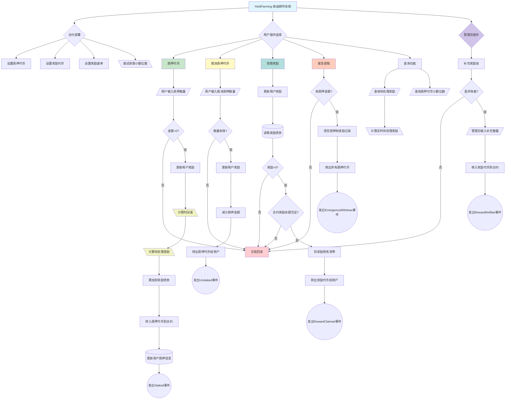

# 质押/定期/活期理财产品合约

Day: Day 27
ID: 27
原文: https://builder-hub.notion.site/YieldFarming-Contract-1e25720a23ef8046ba76fcacffc66864?pvs=4
状态: 完成
译者: Rebecca9715
难度等级: 高级

嘿嘿，欢迎回到 **30 天 Solidity** —

在这里，我们每一天都不仅仅是学习智能合约如何工作...

我们正在**亲手构建 DeFi 的基石**(以及其他东西😉)。

今天?

你将要构建 **DeFi 运行的引擎**之一:

一个**收益耕作平台**。

---

## 🧠 但首先... 什么*是*收益耕作?

让我们用超级简单的方式来说明。

想象你的代币就像种子。

你可以:

- 只是让它们闲置在你的钱包里什么都不做...
- **或者**你可以把它们"种植"在某个地方，**锁定一段时间**，并**生长出更多代币**作为奖励。

这就是收益耕作。

> 质押代币 → 让时间流逝 → 收获奖励。
> 

你的资产不是积灰尘，而是积累*收益*。

而且你质押的时间越长或数量越多，你赚得越多。

---

在 Web3 的真实世界中，收益耕作支撑着:

- 流动性池
- DAO 金库
- DeFi 激励措施
- GameFi 奖励系统
- 启动平台和代币分发

它**无处不在**。

从 Uniswap 到 SushiSwap 再到 Curve —

**每个奖励池背后，都有一个就像你即将构建的智能合约**。

---

## 💡 你今天要构建什么

在今天的项目中，你将创建一个让用户能够:

- 📥 **质押** ERC-20 代币
- ⏳ **随时间累积奖励**，基于他们质押了多少和多长时间
- 💰 **随时领取他们的奖励**
- 🚪 如果需要，**紧急提取**他们的代币
- 🔧 **管理员可以补充**奖励池以保持耕作活跃

我们将用以下方式完成这一切:

- 具有**重入保护**
- 干净地处理**不同的代币和小数位数**

简而言之:

你不仅仅是随机分发代币 —

你正在构建一个**公平的**、**安全的**、**基于时间加权的奖励系统**，使 DeFi 生态系统保持运转。

---

## 🔥 为什么这个合约很重要

这个收益耕作平台是许多 DeFi 协议的**真正基础**。

它向你展示如何:

- 正确跟踪**个人用户质押**
- 随时间计算**动态奖励**
- 为用户构建**紧急退出选项**
- **管理奖励资金**而不破坏系统

通过掌握这个，你将解锁智能合约开发的全新水平 — 一个**时间**、**价值**和**用户行为**都在链上交互的水平。

---

# 🚀 准备好播种了吗?

好的，在我们开始编写代码之前...

让我们快速回顾一下并**理解你即将构建的完整逻辑**。

因为**这不仅仅是一个随机的质押合约** —

它是一个经过精心设计的系统，每个部分都扮演着重要角色。

以下是整个流程的工作方式:

---

## 🧩 我们的收益耕作合约的宏观逻辑

### 1. 📥 质押

- 用户调用 `stake()` 将**他们的代币存入**农场。
- 我们跟踪**多少**他们质押以及**何时**他们质押。
- 他们的奖励开始**自动累积** — 基于质押的金额。

---

### 2. ⏳ 赚取奖励

- 奖励是**按秒计算**的 — 不是按区块计算。
- 你质押的代币越多，留下的时间越长，**你的奖励就越大**。
- 我们不会神奇地铸造奖励 —
    
    它们必须由管理员**预先资助**到合约中(`refillRewards()`)。
    

---

### 3. 💰 领取奖励

- 当用户想要收获时，他们调用 `claimRewards()`。
- 他们以**奖励代币**的形式收到所有累积的奖励。
- 他们的奖励计数器在领取后重置为零。

---

### 4. 🚪 取消质押

- 用户也可以 `unstake()` 部分或全部他们的代币。
- 当他们这样做时，他们在质押减少之前仍然**领取他们的待处理奖励**。
- 这是一个丝滑**的退出**，不会失去已赚取的奖励。

---

### 5. 🚨 紧急提取

- 如果发生了一些疯狂的事情(用户恐慌、UI 错误、黑客恐慌)，用户可以调用 `emergencyWithdraw()`。
- 这让他们**立即取出他们的质押** —
    
    但**他们会失去任何待处理的奖励**作为紧急退出的代价。
    

---

### 6. 🔧 管理员控制

- **所有者**(部署合约的人)可以调用 `refillRewards()`。
- 这会向系统添加更多奖励代币，**保持农场活跃和可持续**。
- 无需重新部署合约 — 你可以继续充值。

---

### 7. 🛡️ 内置安全性

- **ReentrancyGuard** 在所有敏感函数上都是活跃的。
- **SafeCast** 用于防止数学运算时的溢出/下溢。
- ETH 转账被**拒绝** — 这仅限 ERC-20。
- 一切都被设计为**公平、安全和基于时间**。

---

# 📜 完整的收益耕作合约

好的，这是宏观视图:

你即将看到的不仅仅是另一个 Solidity 合约。

这是**实时 DeFi 耕作系统的完整蓝图** — 那种位于真实质押程序、流动性激励和 Web3 奖励系统背后的东西。

你手中持有的这个智能合约将让用户:

- 📥 **质押 ERC-20 代币**到农场
- ⏳ **自动累积奖励**，按秒计算
- 💰 **随时领取奖励**以收获
- 🚪 在收集奖励的同时**取消质押**他们的代币
- 🚨 如果需要，**紧急提取**而无需等待
- 🔧 **管理员补充**奖励池而无需停止或重启合约

在做这一切的同时，它还:

- 🛡️ 防止重入攻击
- 📏 安全地处理代币小数位数
- 🏗️ 如果需要，公平地存储和计算数千用户的奖励
- 📢 为所有重要内容发出事件(质押、取消质押、奖励、紧急情况)

```solidity

// SPDX-License-Identifier: MIT
pragma solidity ^0.8.20;

import "@openzeppelin/contracts/token/ERC20/IERC20.sol";
import "@openzeppelin/contracts/security/ReentrancyGuard.sol";
import "@openzeppelin/contracts/utils/math/SafeCast.sol"; // 如果需要使用 SafeCast

// 用于获取 ERC-20 元数据(小数位数)的接口
interface IERC20Metadata is IERC20 {
    function decimals() external view returns (uint8);
    function name() external view returns (string memory);
    function symbol() external view returns (string memory);
}

/// @title 收益耕作平台
///     质押代币以随时间赚取奖励,可选紧急提取和管理员补充
contract YieldFarming is ReentrancyGuard {
    using SafeCast for uint256;

    IERC20 public stakingToken;
    IERC20 public rewardToken;

    uint256 public rewardRatePerSecond; // 每秒分配的奖励

    address public owner;

    uint8 public stakingTokenDecimals; // 存储质押代币的小数位数

    struct StakerInfo {
        uint256 stakedAmount;
        uint256 rewardDebt;
        uint256 lastUpdate;
    }

    mapping(address => StakerInfo) public stakers;

    event Staked(address indexed user, uint256 amount);
    event Unstaked(address indexed user, uint256 amount);
    event RewardClaimed(address indexed user, uint256 amount);
    event EmergencyWithdraw(address indexed user, uint256 amount);
    event RewardRefilled(address indexed owner, uint256 amount);

    modifier onlyOwner() {
        require(msg.sender == owner, "Not the owner");
        _;
    }

    constructor(
        address _stakingToken,
        address _rewardToken,
        uint256 _rewardRatePerSecond
    ) {
        stakingToken = IERC20(_stakingToken);
        rewardToken = IERC20(_rewardToken);
        rewardRatePerSecond = _rewardRatePerSecond;
        owner = msg.sender;

        // 尝试获取小数位数
        try IERC20Metadata(_stakingToken).decimals() returns (uint8 decimals) {
            stakingTokenDecimals = decimals;
        } catch (bytes memory) {
            stakingTokenDecimals = 18; // 如果获取失败,默认为 18 位小数
        }
    }

    ///     质押代币以开始赚取奖励
    function stake(uint256 amount) external nonReentrant {
        require(amount > 0, "Cannot stake 0");

        updateRewards(msg.sender);

        stakingToken.transferFrom(msg.sender, address(this), amount);
        stakers[msg.sender].stakedAmount += amount;

        emit Staked(msg.sender, amount);
    }

    ///     取消质押代币并可选择领取奖励
    function unstake(uint256 amount) external nonReentrant {
        require(amount > 0, "Cannot unstake 0");
        require(stakers[msg.sender].stakedAmount >= amount, "Not enough staked");

        updateRewards(msg.sender);

        stakers[msg.sender].stakedAmount -= amount;
        stakingToken.transfer(msg.sender, amount);

        emit Unstaked(msg.sender, amount);
    }

    ///     领取累积的奖励
    function claimRewards() external nonReentrant {
        updateRewards(msg.sender);

        uint256 reward = stakers[msg.sender].rewardDebt;
        require(reward > 0, "No rewards to claim");
        require(rewardToken.balanceOf(address(this)) >= reward, "Insufficient reward token balance");

        stakers[msg.sender].rewardDebt = 0;
        rewardToken.transfer(msg.sender, reward);

        emit RewardClaimed(msg.sender, reward);
    }

    ///     紧急取消质押而不领取奖励
    function emergencyWithdraw() external nonReentrant {
        uint256 amount = stakers[msg.sender].stakedAmount;
        require(amount > 0, "Nothing staked");

        stakers[msg.sender].stakedAmount = 0;
        stakers[msg.sender].rewardDebt = 0;
        stakers[msg.sender].lastUpdate = block.timestamp;

        stakingToken.transfer(msg.sender, amount);

        emit EmergencyWithdraw(msg.sender, amount);
    }

    ///     管理员可以补充奖励代币
    function refillRewards(uint256 amount) external onlyOwner {
        rewardToken.transferFrom(msg.sender, address(this), amount);

        emit RewardRefilled(msg.sender, amount);
    }

    ///     更新质押者的奖励
    function updateRewards(address user) internal {
        StakerInfo storage staker = stakers[user];

        if (staker.stakedAmount > 0) {
            uint256 timeDiff = block.timestamp - staker.lastUpdate;
            uint256 rewardMultiplier = 10 ** stakingTokenDecimals;
            uint256 pendingReward = (timeDiff * rewardRatePerSecond * staker.stakedAmount) / rewardMultiplier;
            staker.rewardDebt += pendingReward;
        }

        staker.lastUpdate = block.timestamp;
    }

    ///     查看待处理奖励而不领取
    function pendingRewards(address user) external view returns (uint256) {
        StakerInfo memory staker = stakers[user];

        uint256 pendingReward = staker.rewardDebt;

        if (staker.stakedAmount > 0) {
            uint256 timeDiff = block.timestamp - staker.lastUpdate;
            uint256 rewardMultiplier = 10 ** stakingTokenDecimals;
            pendingReward += (timeDiff * rewardRatePerSecond * staker.stakedAmount) / rewardMultiplier;
        }

        return pendingReward;
    }

    ///     查看质押代币小数位数
    function getStakingTokenDecimals() external view returns (uint8) {
        return stakingTokenDecimals;
    }
}

```

---

# 一. 产品需求书

### 用户流程



### 数据库

| Contract | Type | Bases |
| --- | --- | --- |
| **SimpleStablecoin** | Implementation | ERC20, Ownable, ReentrancyGuard, AccessControl |

| 序号 | Function Name | Visibility | Mutability | Modifiers | 功能说明 |
| --- | --- | --- | --- | --- | --- |
| 1 | constructor | Public ❗️ | 🛑 | - | 初始化合约，设置质押代币、奖励代币和奖励速率 |
| 2 | stake | External ❗️ | 🛑 | nonReentrant | 用户质押代币开始赚取奖励 |
| 3 | unstake | External ❗️ | 🛑 | nonReentrant | 用户取消质押代币并自动更新奖励 |
| 4 | claimRewards | External ❗️ | 🛑 | nonReentrant | 用户领取所有累积的奖励 |
| 5 | emergencyWithdraw | External ❗️ | 🛑 | nonReentrant | 紧急提取质押代币（放弃奖励） |
| 6 | refillRewards | External ❗️ | 🛑 | onlyOwner | 管理员补充奖励池 |
| 7 | updateRewards | Internal 🔒 | 🛑 | - | 内部函数：更新用户的奖励累积 |
| 8 | pendingRewards | External ❗️ | 👀 | - | 查看用户当前待处理的奖励（不领取） |
| 9 | getStakingTokenDecimals | External ❗️ | 👀 | - | 查看质押代币的小数位数 |

### 事件列表

| Event Name | Parameters | 说明 |
| --- | --- | --- |
| Minted | address indexed user, uint256 amount, uint256 collateralDeposited | 铸造稳定币时触发 |
| Redeemed | address indexed user, uint256 amount, uint256 collateralReturned | 赎回稳定币时触发 |
| PriceFeedUpdated | address newPriceFeed | 价格源更新时触发 |
| CollateralizationRatioUpdated | uint256 newRatio | 抵押率更新时触发 |

### 错误列表

| Error Name | 说明 |
| --- | --- |
| InvalidCollateralTokenAddress | 无效的抵押代币地址 |
| InvalidPriceFeedAddress | 无效的价格源地址 |
| MintAmountIsZero | 铸造数量为零 |
| InsufficientStablecoinBalance | 稳定币余额不足 |
| CollateralizationRatioTooLow | 抵押率低于100% |

### 状态变量

| Variable Name | Type | Visibility | Description |
| --- | --- | --- | --- |
| PRICE_FEED_MANAGER_ROLE | bytes32 | public constant | 价格源管理员角色标识符 |
| collateralToken | IERC20 | public immutable | 抵押代币合约地址 |
| collateralDecimals | uint8 | public immutable | 抵押代币小数位数 |
| priceFeed | AggregatorV3Interface | public | Chainlink价格源接口 |
| collateralizationRatio | uint256 | public | 抵押率（默认150%） |

# 二. 细节解说

# 📦 1. 导入 – 引入正确的工具

在我们编写任何一行自定义逻辑之前，

我们引入一些**经过实战测试的 OpenZeppelin 库**，使我们的合约**更安全**、**更智能**和**面向未来**。

以下是我们使用的导入 — 以及每个导入为何重要:

---

### ✅ 1.1 ERC-20 接口

```solidity

import "@openzeppelin/contracts/token/ERC20/IERC20.sol";

```

这个导入让我们访问 **ERC-20 接口** — 基本上，这是任何像 USDC、DAI 或你的自定义代币将遵循的标准函数集。

它包括基本函数，如:

- `transfer()`
- `transferFrom()`
- `approve()`
- `balanceOf()`

**为什么我们在这里需要它:**

因为用户将质押和领取 **ERC-20 代币**，我们需要安全地与这些代币交互而不硬编码任何东西。

✅ 无论是自定义代币、稳定币还是其他东西 — 只要它遵循 ERC-20，我们的合约就可以处理它。

---

### 🛡️ 1.2 重入保护

```solidity

import "@openzeppelin/contracts/security/ReentrancyGuard.sol";

```

这个对于**安全性**来说**超级重要**。

当资金(或代币)在智能合约内移动时，你必须小心一种叫做**重入攻击**的东西 — 有人试图在第一次调用完成之前*再次*调用函数，导致意外行为并可能耗尽资金。

**为什么我们在这里需要它:**

像 `stake()`、`unstake()`、`claimRewards()` 和 `emergencyWithdraw()` 这样的函数都在处理代币转账 — 这意味着它们是重入的潜在目标。

✅ 通过使用 `ReentrancyGuard`，我们确保一旦函数开始执行，它会**锁定**自己直到完成 — 不允许偷偷重新进入。

---

### 🧮 1.3 SafeCast

```solidity

import "@openzeppelin/contracts/utils/math/SafeCast.sol"; // 如果需要使用 SafeCast

```

在 Solidity 中，当你在不同类型的数字之间移动时(如 `uint256` → `uint8`)，你需要**非常小心**。

如果你盲目地向下转换数字而不检查，你可能会**溢出**或**截断值**而没有意识到 — 这可能导致错误甚至安全漏洞。

**为什么我们在这里需要它:**

在处理奖励和计算时，特别是涉及代币**小数位数**时，我们想确保我们**安全地**转换数字。

✅ `SafeCast` 有助于防止在我们跨不同大小的数字进行数学运算时意外溢出或数据丢失。

---

# 🛠️ 2. ERC-20 元数据的自定义接口

这是代码片段:

```solidity

// 用于获取 ERC-20 元数据(小数位数)的接口
interface IERC20Metadata is IERC20 {
    function decimals() external view returns (uint8);
    function name() external view returns (string memory);
    function symbol() external view returns (string memory);
}

```

---

### 🧠 这里发生了什么?

我们正在创建标准 `IERC20` 接口的**小扩展**。

通常，ERC-20 代币保证它将具有:

- `balanceOf()`
- `transfer()`
- `approve()`
- 和其他基本函数...

**但你猜怎么着?**

**`decimals()`、`name()` 和 `symbol()` 在原始 ERC-20 标准中是*可选的*。**

它们后来变得常见 — 但并非每个 ERC-20 代币都必须正式实现它们。

这就是为什么 OpenZeppelin 将其分离为一个不同的接口，称为 `IERC20Metadata`。

我们在这里以轻量级的方式重新创建它，以便我们可以*使用*这些函数，如果代币支持它们 — 而不是默认假设它们存在。

---

### 🔥 为什么我们需要这个

我们的收益耕作合约**想要知道**质押代币的 `decimals` —

因为当我们计算奖励时，我们需要正确**缩放**数字。

例子:

| 代币 | 小数位数 | 1 个代币看起来像什么 |
| --- | --- | --- |
| USDC | 6 位小数 | 1 USDC = 1,000,000 单位 |
| ETH | 18 位小数 | 1 ETH = 1,000,000,000,000,000,000 单位 |

> 🧠 如果你忽略小数位数，你的数学将完全错误 —
> 
> 
> 用户可能会赚得*太多*或*太少*奖励。
> 

---

### 📚 每个函数的详细说明

| 函数 | 目的 |
| --- | --- |
| `decimals()` | 返回代币使用的小数位数 |
| `name()` | 返回人类可读的代币名称(例如，"Dai Stablecoin") |
| `symbol()` | 返回简短的股票代码符号(例如，"DAI") |
- 我们**主要**关心 `decimals()` 用于奖励数学。
- 但拥有 `name()` 和 `symbol()` 对于以后的 UI 也很有用!

---

### 🌟 这就是为什么这个小接口很重要

这是一件小事 — 只是几行。

但没有它，**你的整个农场可能会崩溃**，当质押具有奇怪小数位数的代币时。

好的合约**考虑现实世界的混乱** —

你现在正在学习用这种远见来构建。🌱

---

# 🏛️ 3. 合约声明

```solidity

contract YieldFarming is ReentrancyGuard {

```

---

## 🧠 这里发生了什么?

这一行同时做两件主要事情:

### 1. 📜 创建合约

我们正在创建一个名为 **`YieldFarming`** 的全新智能合约。

这是人们与你的农场互动时将使用的名称。

这是像 MetaMask 这样的钱包将显示的内容。

这是将在像 Etherscan 这样的浏览器中显示的名称。

这是你的**数字农场的官方标题**。

---

### 2. 🛡️ 继承重入保护

注意 `is ReentrancyGuard` 部分吗?

这意味着我们的 YieldFarming 合约**继承**自 OpenZeppelin 的 `ReentrancyGuard` 合约。

> 🧠 在 Solidity 中，继承意味着你从另一个合约中引入函数和保护 — 而不必自己重写它们。
> 

**具体来说:**

它为我们提供了 `nonReentrant` 修饰符，我们将在所有敏感函数上使用它，如:

- `stake()`
- `unstake()`
- `claimRewards()`
- `emergencyWithdraw()`

✅ 每次用户存入或提取代币时，我们都会**锁定**函数以防止重入攻击 —

这种攻击曾从编写不当的 DeFi 应用中耗尽了数百万美元。

> 甚至没有意识到，你正在编写 DeFi 级别的安全代码，只需正确设置这个。
> 

---

# 📦 4. 状态变量 – 我们的农场将处理什么数据?

好的 — 在我们开始构建质押函数或奖励领取之前，

让我们花点时间思考一下我们的农场实际上需要跟踪的**数据类型**。

因为当你构建一个系统，用户锁定他们的代币并随时间赚取奖励时，

**你不能只是"希望"数字正确。**

你需要:

- 知道用户正在质押**什么代币**
- 知道用户将获得**什么代币**作为奖励
- 知道奖励分配的**速度有多快**
- 跟踪**谁负责**维护农场
- 干净地处理**不同的代币小数位数**(因为并非所有代币都是平等创建的)

在本节中，我们将**声明所有重要的状态变量** —

我们的农场顺利、公平和安全运行所需的信息片段。

---

✅ 现在，让我们逐行分解!

```solidity

using SafeCast for uint256;

IERC20 public stakingToken;
IERC20 public rewardToken;

uint256 public rewardRatePerSecond; // 每秒分配的奖励

address public owner;

uint8 public stakingTokenDecimals;

```

---

## 🛠️ 逐行分解

---

### ✅ `using SafeCast for uint256;`

**这一行是一个 Solidity 技巧** — 它用 `SafeCast` 库中的新*安全*函数扩展了原生 `uint256` 类型。

**用简单的英语:**

它允许我们直接在 `uint256` 数字上调用像 `.toUint8()`、`.toUint128()` 等方法 — 并在不冒溢出或奇怪错误风险的情况下安全地在不同类型之间转换。

> 例子:
> 
> 
> 如果我们稍后有一个 `uint256`，我们需要安全地将其缩小到 `uint8`,
> 
> 而不是手动编写一个大检查，我们可以这样做:
> 
> ```solidity
> 
> uint8 smallNumber = bigNumber.toUint8();
> 
> ```
> 

✅ **它使转换更简单、更安全。**

我们主要在以下情况下使用它:

- 处理不同的奖励规模
- 管理小数位数
- 进行精确的奖励计算

---

```solidity
IERC20 public stakingToken;

```

这是用户将质押(锁定)到合约中的**代币**。

- 它可以是任何东西:自定义代币、治理代币、像 DAI 这样的稳定币等。
- 它作为 `IERC20` 接口存储，因此我们可以对其调用像 `transferFrom()`、`transfer()` 和 `balanceOf()` 这样的函数。

✅ 这是用户存入农场的**资产**。

---

```solidity
IERC20 public rewardToken;

```

这是用户将作为奖励赚取的**代币**。

- 它可以与质押代币相同(质押 DAI，赚取 DAI)
- 或者它可以是不同的(质押 DAI，赚取 FARM 代币)

✅ 这为系统提供了灵活性 — 你可以用任何你想要的 ERC-20 代币奖励用户。

---

```solidity
uint256 public rewardRatePerSecond;

```

这定义了**奖励生成的速度**。

- 它是**每秒**在所有质押者之间分配的奖励代币数量。
- 因此，如果你设置 `rewardRatePerSecond = 1e18`，系统**每秒**发放 `1` 个奖励代币(以 wei 计算)。

✅ 这允许你根据奖励池的大小微调耕作程序的**速度**。

---

```solidity
address public owner;

```

这存储**管理员的钱包地址** —

部署合约的人(或多重签名，或 DAO)。

`owner` 将拥有特殊权力，如:

- 补充奖励池
- 在更高级的版本中可能暂停/更新事物

✅ 只有所有者可以调用受 `onlyOwner` 修饰符保护的敏感函数。

---

```solidity
uint8 public stakingTokenDecimals;

```

当我们进行奖励计算时，我们必须**根据小数位数正确缩放数学**。

- 一些代币有 18 位小数(如 ETH)。
- 一些代币有 6 位小数(如 USDC)。
- 一些奇怪的代币甚至更少。

通过在合约部署时读取并保存质押代币的小数位数，

我们确保**奖励数学保持准确**，无论用户质押什么代币。

✅ 没有小数位数不匹配错误 = 没有数学灾难。

---

# 🧱 5. 跟踪每个用户 – 结构和映射

好的 — 到目前为止，我们已经设置了*全局*变量:

人们正在质押什么代币，他们赚取什么，谁拥有农场，等等。

但现在是时候放大并考虑**个人用户**了。

因为当有人将代币质押到农场时，

我们需要**跟踪他们的个人数据**:

- 他们质押了多少
- 他们赚取了多少奖励(但可能还没有领取)
- 他们的奖励上次更新是什么时候

如果我们不正确跟踪这个，整个奖励系统将崩溃 —

一些用户可能得到太多，其他人太少。

因此，在合约的这一部分，我们正在设置一个**干净、有组织的结构**来管理**每个质押者的信息**。

这是我们正在看的代码:

```solidity

struct StakerInfo {
    uint256 stakedAmount;
    uint256 rewardDebt;
    uint256 lastUpdate;
}

mapping(address => StakerInfo) public stakers;

```

---

## 🧠 这些行背后的逻辑

---

```solidity
stakedAmount

```

这跟踪用户存入农场的**质押代币数量**。

每次用户**质押**或**取消质押**时，我们都会更新这个数字。

- 更多质押 = 随时间获得更多奖励。
- 更少质押 = 更小的奖励份额。

✅ 它告诉我们用户在农场内**任何时刻的位置有多大**。

---

```solidity
rewardDebt

```

这跟踪用户**已经赚取但尚未领取的奖励数量**。

每当用户与农场互动时，我们**更新**他们的 `rewardDebt`，基于:

- 他们质押了多少
- 过了多少时间
- 奖励率

✅ 它防止用户"忘记"旧奖励或意外为同一质押时间赚取两次。

---

```solidity
lastUpdate

```

这记录**我们上次更新**用户奖励的时间。

当用户质押、取消质押或领取时，我们:

- 计算自 `lastUpdate` 以来他们赚了多少
- 更新 `rewardDebt`
- 然后**刷新**他们的 `lastUpdate` 到当前区块时间戳。

✅ 它确保奖励基于**实际花费的时间**质押 — 而不是假设。

---

```solidity
mapping(address => StakerInfo) public stakers;

```

这将**每个用户的地址**映射到他们的**个人 StakerInfo 数据**。

因此，对于每个用户，合约知道:

- 他们质押了多少
- 他们积累了多少奖励
- 他们的奖励上次更新是什么时候

✅ 这是我们如何在农场内部**单独跟踪每个人的位置** — 干净和安全。

---

# 📢 6. 事件 – 广播农场内部发生的事情

好的 — 现在我们正在跟踪谁在质押和赚取奖励，

我们还需要一种方法向外部世界**广播重要行动**。

因为记住:

**智能合约没有前端。**

它们不能直接与用户"交谈" —

它们只能**发出事件**，钱包、dapp 和像 Etherscan 这样的浏览器可以监听。

---

以下是我们声明的事件:

```solidity

event Staked(address indexed user, uint256 amount);
event Unstaked(address indexed user, uint256 amount);
event RewardClaimed(address indexed user, uint256 amount);
event EmergencyWithdraw(address indexed user, uint256 amount);
event RewardRefilled(address indexed owner, uint256 amount);

```

---

## 🧠 每个事件背后的逻辑

---

### 📥 `Staked`

```solidity

event Staked(address indexed user, uint256 amount);

```

- 当用户**质押代币**到农场时触发。
- 告诉我们**谁质押了**以及**他们质押了多少**。

✅ 对于跟踪存款、构建用户仪表板以及在前端显示"用户 X 质押了 Y 代币"很有用。

---

### 🚪 `Unstaked`

```solidity

event Unstaked(address indexed user, uint256 amount);

```

- 当用户**取消质押**(提取)他们的代币时触发。
- 告诉我们**谁提取了**以及**他们移除了多少**。

✅ 帮助前端更新余额，并让用户看到他们退出的干净历史。

---

### 💰 `RewardClaimed`

```solidity

event RewardClaimed(address indexed user, uint256 amount);

```

- 当用户**领取他们的待处理奖励**而不取消质押时触发。
- 显示**谁领取了**以及**他们收到了多少奖励代币**。

✅ 对于奖励历史、分析以及向用户显示他们到目前为止赚了多少至关重要。

---

### 🚨 `EmergencyWithdraw`

```solidity

event EmergencyWithdraw(address indexed user, uint256 amount);

```

- 当用户**立即取出他们的质押**而不等待奖励时触发。
- 告诉我们**谁进行了紧急退出**以及**他们提取了多少**。

✅ 帮助在紧急情况下跟踪恐慌退出 — 并告诉用户他们的紧急提取成功了。

---

### 🧹 `RewardRefilled`

```solidity

event RewardRefilled(address indexed owner, uint256 amount);

```

- 当**管理员**用新的奖励代币补充合约时触发。
- 告诉我们**谁补充了**以及**向池中添加了多少代币**。

✅ 对于透明度至关重要 — 用户可以看到奖励池何时被充值，耕作继续。

---

# 🛡️ 7. 修饰符 – 保护仅限管理员的操作

这是代码:

```solidity

modifier onlyOwner() {
    require(msg.sender == owner, "Not the owner");
    _;
}

```

---

## 🧠 这里发生了什么?

这个 `onlyOwner` 修饰符就像一个**安全检查点**。

每当我们将 `onlyOwner` 附加到函数时，

它强制合约**检查**:

> 调用此函数的人实际上是农场的所有者吗?
> 

如果是 — ✅ 函数正常执行。

如果不是 — ❌ 交易立即恢复，错误为 `"Not the owner"`。

---

# 🏗️ 8. 构造函数

好的 — 在任何人可以开始质押或赚取奖励之前，

我们需要**设置农场**:

- 用户将质押什么代币?
- 他们将作为奖励赚取什么代币?
- 奖励应该多快分配?

所有这些都在合约部署时**一次**决定 — 在**构造函数**内部。

> 把它想象成在你向农民开放大门之前设置农场的规则。
> 

这个构造函数锁定所有重要的起始值，以便其他一切稍后可以顺利运行。

---

## 📜 构造函数代码

```solidity

constructor(
    address _stakingToken,
    address _rewardToken,
    uint256 _rewardRatePerSecond
) {
    stakingToken = IERC20(_stakingToken);
    rewardToken = IERC20(_rewardToken);
    rewardRatePerSecond = _rewardRatePerSecond;
    owner = msg.sender;

    // 尝试获取小数位数
    try IERC20Metadata(_stakingToken).decimals() returns (uint8 decimals) {
        stakingTokenDecimals = decimals;
    } catch (bytes memory) {
        stakingTokenDecimals = 18; // 如果获取失败,默认为 18 位小数
    }
}

```

---

## 🔍 逐行分解

---

### 🧩 设置质押代币

```solidity

stakingToken = IERC20(_stakingToken);

```

- 这告诉合约用户必须质押参与的 **ERC-20 代币**。
- 我们将 `_stakingToken` 地址视为 `IERC20` — 因此我们可以安全地与其交互(转账、余额检查等)

✅ 没有这个，用户不知道他们应该锁定什么资产到农场。

---

### 🎁 设置奖励代币

```solidity

rewardToken = IERC20(_rewardToken);

```

- 这告诉合约用户将作为奖励赚取的 **ERC-20 代币**。
- 它可以与质押代币相同，或完全不同的代币。

✅ 灵活性直接内置 — 你可以以任何你想要的方式奖励用户。

---

### ⏳ 设置奖励率

```solidity

rewardRatePerSecond = _rewardRatePerSecond;

```

- 这定义了**每秒**向质押者集体分配**多少奖励代币**。
- 更高的比率 = 奖励分配得更快。
- 更低的比率 = 奖励分配得更慢。

✅ 这是控制农场支付奖励"速度"的东西。

---

### 👑 设置所有者

```solidity

owner = msg.sender;

```

- 部署合约的人成为**所有者**。
- 这个人将有权限调用像 `refillRewards()` 这样的特殊函数。

✅ 只有所有者可以补充奖励池并管理农场的健康。

---

### 🧮 尝试获取质押代币小数位数

```solidity

try IERC20Metadata(_stakingToken).decimals() returns (uint8 decimals) {
    stakingTokenDecimals = decimals;
} catch (bytes memory) {
    stakingTokenDecimals = 18; // 如果获取失败,默认为 18 位小数
}

```

- 我们**尝试**从质押代币读取 `decimals()` 函数。
- 一些代币(特别是非标准代币)可能不实现这个，所以我们用 `try/catch` 包装它。
- 如果获取小数位数成功，太好了 — 我们存储它。
- 如果失败，我们假设 **18 位小数**(这是大多数现代 ERC-20 的标准)。

✅ 这确保我们的奖励计算保持**准确**，即使跨不同类型的代币。

---

# 📥 9. `stake()` – 用户进入农场并开始赚取

好的 — 现在农场已经设置好了，

我们需要一种方式让用户**实际加入**并**开始耕作奖励**。

这正是 `stake()` 函数所做的:

> 用户将一些代币发送到合约 →
> 
> 
> 我们存储他们的存款 →
> 
> 他们立即开始**按秒**赚取奖励。
> 

这是用户在耕作系统中**正式播种**的地方。

---

## 📜 `stake()` 的完整代码

```solidity

///     质押代币以开始赚取奖励
function stake(uint256 amount) external nonReentrant {
    require(amount > 0, "Cannot stake 0");

    updateRewards(msg.sender);

    stakingToken.transferFrom(msg.sender, address(this), amount);
    stakers[msg.sender].stakedAmount += amount;

    emit Staked(msg.sender, amount);
}

```

---

## 🔍 逐行分解

---

### 🛡️ 防止重入

```solidity

function stake(uint256 amount) external nonReentrant {

```

- 这个函数可以被**任何人**调用(`external`)，但
- 它受到 `nonReentrant` 修饰符的保护，以**阻止重入攻击**(因为它涉及转移代币)。

✅ 始终保护移动资金的函数。

---

### ⚡ 基本验证:不能质押 0

```solidity

require(amount > 0, "Cannot stake 0");

```

- 用户必须至少质押 **1 单位**(即使是非常小的数量)。
- 质押零没有意义，可能会导致奇怪的边界情况。

✅ 一个简单、好的第一次检查。

---

### 🧠 更新待处理奖励

```solidity

updateRewards(msg.sender);

```

- 在接受新存款之前，我们**计算并存储**用户到目前为止已经赚取的任何待处理奖励。
- 这确保**公平的奖励跟踪** — 新存款不会抹去或搞乱先前的奖励。

✅ 奖励必须在更改质押金额*之前*计算。

---

### 💸 拉入质押的代币

```solidity

stakingToken.transferFrom(msg.sender, address(this), amount);

```

- 我们从用户的钱包**拉入**质押代币到合约中。
- 用户必须事先**批准**农场合约花费他们的代币(标准 ERC-20 行为)。

✅ 在这一行之后，用户的代币正式锁定到农场中。

---

### 🧮 更新质押者的金额

```solidity

stakers[msg.sender].stakedAmount += amount;

```

- 我们通过新存入的金额**增加**用户的总 `stakedAmount`。
- 这个新金额将用于计算未来的奖励。

✅ 更大的质押 = 每秒更大的奖励份额。

---

### 📢 发出质押事件

```solidity

emit Staked(msg.sender, amount);

```

- 触发一个事件，让 UI 和浏览器知道:
    - **谁质押了**
    - **他们质押了多少**

✅ 为用户和前端提供透明的历史。

---

# 🚪 10. `unstake()` – 让用户退出农场(并仍然赚取)

好的 — 质押很棒，但用户也需要一种方式**随时离开农场**。

也许他们想兑现。也许他们只是需要他们的代币回来。

`unstake()` 函数让他们**安全地提取他们的质押代币**,

**同时仍然收集他们到那时为止赚取的任何奖励**。

这就像把你的种子从地里拉出来**并拾起你到目前为止种出的所有果实**。

---

## 📜 `unstake()` 的完整代码

```solidity

///     取消质押代币并可选择领取奖励
function unstake(uint256 amount) external nonReentrant {
    require(amount > 0, "Cannot unstake 0");
    require(stakers[msg.sender].stakedAmount >= amount, "Not enough staked");

    updateRewards(msg.sender);

    stakers[msg.sender].stakedAmount -= amount;
    stakingToken.transfer(msg.sender, amount);

    emit Unstaked(msg.sender, amount);
}

```

---

## 🔍 逐行分解

---

### 🛡️ 锁定函数防止重入

```solidity

function unstake(uint256 amount) external nonReentrant {

```

- `external`:任何人都可以调用它 — 只为他们自己。
- `nonReentrant`:我们锁定它以**防止重入攻击**，因为正在转移代币。

✅ 安全第一，始终如一。

---

### ⚡ 基本验证

```solidity

require(amount > 0, "Cannot unstake 0");

```

- 用户必须取消质押**真实数量**。
- 不允许零取消质押(会毫无意义并可能搞乱记账)。

✅ 干净、可预测的行为。

---

```solidity

require(stakers[msg.sender].stakedAmount >= amount, "Not enough staked");

```

- 用户不能取消质押超过他们最初存入的数量。
- 如果他们试图取消质押太多，交易**立即恢复**。

✅ 保护农场的内部余额。

---

### 🧠 取消质押前更新奖励

```solidity

updateRewards(msg.sender);

```

- 在更改用户的质押之前，我们**计算并锁定**他们到这一点为止赚取的任何奖励。
- 这样，即使他们部分取消质押，用户**也不会失去**奖励。

✅ 公平的奖励，即使在部分退出时。

---

### 🧮 减少质押金额

```solidity

stakers[msg.sender].stakedAmount -= amount;

```

- 更新奖励后，我们通过他们取消质押的金额**减少**用户的 `stakedAmount`。

✅ 他们的耕作能力立即调整以匹配他们的新质押。

---

### 💸 将代币转回用户

```solidity

stakingToken.transfer(msg.sender, amount);

```

- 我们**发回**取消质押的代币到用户的钱包。
- 没有第三方参与 — 这是一个直接的、链上的、自助操作。

✅ 用户重新获得对他们代币的完全控制。

---

### 📢 发出取消质押事件

```solidity

emit Unstaked(msg.sender, amount);

```

- 我们触发一个事件，以便 UI、浏览器和日志知道:
    - **谁取消质押了**
    - **他们取消质押了多少**

✅ 使系统保持透明和易于跟踪。

---

# 💰 11. `claimRewards()` – 收获你赚取的代币

好的 — 到目前为止，用户一直在质押他们的代币并观察他们的奖励在后台悄悄增长。

但他们如何实际**收集**这些奖励?

这正是 `claimRewards()` 让他们做的:

> 这就像收获你种出的果实 —
> 
> 
> 而不用连根拔起树本身。
> 

用户可以**随时领取他们赚取的奖励**,

**而不触碰**他们的原始质押。

---

## 📜 `claimRewards()` 的完整代码

```solidity

///     领取累积的奖励
function claimRewards() external nonReentrant {
    updateRewards(msg.sender);

    uint256 reward = stakers[msg.sender].rewardDebt;
    require(reward > 0, "No rewards to claim");
    require(rewardToken.balanceOf(address(this)) >= reward, "Insufficient reward token balance");

    stakers[msg.sender].rewardDebt = 0;
    rewardToken.transfer(msg.sender, reward);

    emit RewardClaimed(msg.sender, reward);
}

```

---

## 🔍 逐行分解

---

### 🛡️ 锁定函数防止重入

```solidity

function claimRewards() external nonReentrant {

```

- 同样，因为我们正在移动代币，我们使用 `nonReentrant` 来防止潜在的重入漏洞。

✅ 始终锁定发送资金的函数。

---

### 🧠 更新用户的待处理奖励

```solidity

updateRewards(msg.sender);

```

- 在交出任何奖励之前，
    
    我们根据当前时间**重新计算**一切。
    
- 这确保用户获得他们赚取的**每一秒的价值**的奖励。

✅ 没有错过的时间。没有丢失的代币。

---

### 🧮 获取待处理奖励金额

```solidity

uint256 reward = stakers[msg.sender].rewardDebt;

```

- 我们读取用户当前欠的奖励数量(存储为他们的 `rewardDebt`)。

✅ 干净简单 — 奖励已经在内部跟踪。

---

### ⚡ 验证检查

```solidity

require(reward > 0, "No rewards to claim");

```

- 如果用户没有积累奖励，我们拒绝领取。

✅ 节省 gas 并防止意外的空交易。

---

```solidity

require(rewardToken.balanceOf(address(this)) >= reward, "Insufficient reward token balance");

```

- 仔细检查合约实际上**持有足够的奖励代币**来支付领取。
- 如果奖励池为空或太低，交易将恢复。

✅ 良好的故障保护，避免破损的支付。

---

### 🧹 重置用户的奖励债务

```solidity

stakers[msg.sender].rewardDebt = 0;

```

- 发送奖励后，我们**重置**用户的 `rewardDebt` 为零。
- 否则，他们可能会再次领取相同的奖励。

✅ 使记账保持干净和公平。

---

### 💸 将奖励转给用户

```solidity

rewardToken.transfer(msg.sender, reward);

```

- 最后，我们**发送**奖励代币直接到用户的钱包。

✅ 平滑、直接和无需信任。

---

### 📢 发出奖励领取事件

```solidity

emit RewardClaimed(msg.sender, reward);

```

- 为透明度和历史跟踪触发事件:
    - **谁领取了**
    - **他们领取了多少**

✅ 让前端更新 UI，浏览器干净地记录操作。

---

# 🚨 12. `emergencyWithdraw()` – 恐慌按钮

好的 — 当一切顺利运行时，质押很棒...

但如果发生了一些疯狂的事情怎么办?

- 也许前端坏了。
- 也许用户只是急需他们的代币回来。
- 也许有突然的安全恐慌。

无论什么原因 —

用户应该有一种方式**立即退出**而不用担心待处理的奖励。

这正是 `emergencyWithdraw()` 的目的:

> 这就像在紧急情况下打破玻璃 —
> 
> 
> **立即**取回你的代币，但**留下你的奖励**。
> 

---

## 📜 `emergencyWithdraw()` 的完整代码

```solidity

///     紧急取消质押而不领取奖励
function emergencyWithdraw() external nonReentrant {
    uint256 amount = stakers[msg.sender].stakedAmount;
    require(amount > 0, "Nothing staked");

    stakers[msg.sender].stakedAmount = 0;
    stakers[msg.sender].rewardDebt = 0;
    stakers[msg.sender].lastUpdate = block.timestamp;

    stakingToken.transfer(msg.sender, amount);

    emit EmergencyWithdraw(msg.sender, amount);
}

```

---

## 🔍 逐行分解

---

### 🛡️ 锁定函数防止重入

```solidity

function emergencyWithdraw() external nonReentrant {

```

- 安全第一 — 即使紧急退出也受到重入攻击的保护。

✅ 即使在压力下也保持安全。

---

### 🧮 获取质押金额

```solidity

uint256 amount = stakers[msg.sender].stakedAmount;

```

- 将用户的**当前质押金额**加载到临时变量中。

✅ 我们准备将其发送回用户。

---

### ⚡ 验证检查

```solidity

require(amount > 0, "Nothing staked");

```

- 确保用户实际上**有东西质押**。
- 如果没有，没有什么可以提取，函数恢复。

✅ 防止无用的交易。

---

### 🧹 重置所有用户信息

```solidity

stakers[msg.sender].stakedAmount = 0;
stakers[msg.sender].rewardDebt = 0;
stakers[msg.sender].lastUpdate = block.timestamp;

```

- **清零**用户的质押和奖励债务。
- **更新**他们的 `lastUpdate` 到当前时间(即使他们正在退出)。
- 这确保如果他们再次返回并质押，他们从新开始。

✅ 干净、安全的状态重置 — 没有剩余或奇怪的奖励错误。

---

### 💸 将代币转回用户

```solidity

stakingToken.transfer(msg.sender, amount);

```

- 将质押的代币直接发送回用户的钱包。

✅ 快速自助退出 — 不需要管理员。

---

### 📢 发出紧急提取事件

```solidity

emit EmergencyWithdraw(msg.sender, amount);

```

- 触发一个事件，以便操作公开记录:
    - **谁提取了**
    - **他们取出了多少**

✅ 帮助前端和浏览器清楚地显示紧急退出。

---

# 🔋 13. `refillRewards()` – 保持奖励池活跃

好的 — 用户正在愉快地质押、耕作和领取奖励...

但当奖励池开始不足时会发生什么?

而不是关闭一切或部署新合约，

管理员(所有者)可以简单地**充值**奖励池 —

**注入新的奖励**以保持耕作季节继续。

这正是 `refillRewards()` 所做的:

> 这就像给杂货店补货。
> 
> 
> 新奖励进来 → 耕作继续而没有任何中断。
> 

---

## 📜 `refillRewards()` 的完整代码

```solidity

///     管理员可以补充奖励代币
function refillRewards(uint256 amount) external onlyOwner {
    rewardToken.transferFrom(msg.sender, address(this), amount);

    emit RewardRefilled(msg.sender, amount);
}

```

---

## 🔍 逐行分解

---

### 🔒 仅限所有者访问

```solidity

function refillRewards(uint256 amount) external onlyOwner {

```

- 只有 `owner`(部署农场的人)可以调用这个。
- 受我们之前设置的 `onlyOwner` 修饰符保护。
- 普通用户**不能**补充奖励池 — 只有管理员可以。

✅ 使敏感操作保持在管理员控制下。

---

### 💸 将新奖励拉入合约

```solidity

rewardToken.transferFrom(msg.sender, address(this), amount);

```

- 所有者必须首先**批准**收益耕作合约花费他们的奖励代币。
- 然后这个函数**拉入**指定数量到农场合约中。
- 这些新代币现在可用于随时间支付给农民。

✅ 没有奖励铸造。没有奇怪的黑客。只是简单、干净的 ERC-20 转账。

---

### 📢 发出奖励补充事件

```solidity

emit RewardRefilled(msg.sender, amount);

```

- 触发一个事件以公开记录:
    - **谁补充了**奖励
    - **他们添加了多少代币**

✅ 前端可以观察这个事件以实时更新奖励池余额。

---

# 🧠 14. `updateRewards()` – 保持奖励公平和新鲜

好的 — 耕作奖励不会神奇地自己更新。

每次用户**质押**、**取消质押**或**领取奖励**时，

我们需要**重新计算**他们基于以下因素赚了多少:

- **多长时间**他们一直在质押
- **多少**他们质押了
- **多快**奖励正在分配

这就是内部 `updateRewards()` 函数的用武之地:

> 这就像每次有人触摸植物时检查其生长 —
> 
> 
> 并确保它与过了多少时间相匹配。
> 

这个函数悄悄地**保持一切公平和准确**在幕后。

---

## 📜 `updateRewards()` 的完整代码

```solidity

///     更新质押者的奖励
function updateRewards(address user) internal {
    StakerInfo storage staker = stakers[user];

    if (staker.stakedAmount > 0) {
        uint256 timeDiff = block.timestamp - staker.lastUpdate;
        uint256 rewardMultiplier = 10 ** stakingTokenDecimals;
        uint256 pendingReward = (timeDiff * rewardRatePerSecond * staker.stakedAmount) / rewardMultiplier;
        staker.rewardDebt += pendingReward;
    }

    staker.lastUpdate = block.timestamp;
}

```

---

## 🔍 逐行分解

---

### 📚 加载用户信息

```solidity

StakerInfo storage staker = stakers[user];

```

- 我们从**存储**中获取用户的质押者数据，
    
    以便我们可以直接更新它而不将其复制到内存中。
    

✅ 我们所做的任何更改都将立即反映在链上。

---

### 🔍 检查用户是否有质押的代币

```solidity

if (staker.stakedAmount > 0) {

```

- 只有在用户实际上有东西质押时才更新奖励。
- 如果他们没有质押任何东西，就不需要计算奖励。

✅ 节省 gas 并避免不必要的数学。

---

### 🕒 计算过了多少时间

```solidity

uint256 timeDiff = block.timestamp - staker.lastUpdate;

```

- 找出自用户奖励上次更新以来**过了多少秒**。

✅ 他们质押的时间越长，他们赚得越多。

---

### 🧮 根据小数位数设置奖励乘数

```solidity

uint256 rewardMultiplier = 10 ** stakingTokenDecimals;

```

- 由于代币可能有不同的小数位数(6、18 等),
    
    我们使用代币的小数位数**规范化**奖励计算。
    

✅ 使奖励数学在任何质押代币上保持准确。

---

### 💰 计算待处理奖励

```solidity

uint256 pendingReward = (timeDiff * rewardRatePerSecond * staker.stakedAmount) / rewardMultiplier;

```

- 这个公式说:
    - 乘以**过去的时间** × **奖励率** × **质押金额**
    - 然后除以奖励乘数以调整小数位数

✅ 这给我们用户自上次更新以来赚取的**新奖励**的确切数量。

---

### ➕ 将待处理奖励添加到奖励债务

```solidity

staker.rewardDebt += pendingReward;

```

- 我们将新计算的奖励添加到用户的 `rewardDebt`。
- 这个奖励债务稍后将在他们调用 `claimRewards()` 时**被领取**。

✅ 使奖励随时间公平累积。

---

### 🕒 更新上次更新时间

```solidity

staker.lastUpdate = block.timestamp;

```

- 将用户的上次更新时间戳重置为**现在**。
- 下次我们更新奖励时，我们将只计算从这一刻起的**新收益**。

✅ 始终干净地向前移动时间跟踪。

---

# 👀 15. `pendingRewards()` – 在不触碰的情况下查看你的收益

好的 — 用户喜欢看到他们的奖励**实时**增长。

但他们不想**每秒**领取奖励 — 有时他们只想**检查**到目前为止他们赚了多少。

这正是 `pendingRewards()` 让他们做的:

> 这就像检查你的农场，看有多少果实长出来了 —
> 
> 
> 而不用摘它。
> 

这个函数是一个**仅查看函数** —

意味着调用它不花费 gas，并且不会改变合约内部的任何东西。

---

## 📜 `pendingRewards()` 的完整代码

```solidity

///     查看待处理奖励而不领取
function pendingRewards(address user) external view returns (uint256) {
    StakerInfo memory staker = stakers[user];

    uint256 pendingReward = staker.rewardDebt;

    if (staker.stakedAmount > 0) {
        uint256 timeDiff = block.timestamp - staker.lastUpdate;
        uint256 rewardMultiplier = 10 ** stakingTokenDecimals;
        pendingReward += (timeDiff * rewardRatePerSecond * staker.stakedAmount) / rewardMultiplier;
    }

    return pendingReward;
}

```

---

## 🔍 逐行分解

---

### 📚 获取用户信息

```solidity

StakerInfo memory staker = stakers[user];

```

- 我们将用户的质押信息**加载到内存**中(而不是存储)。
- 由于我们只是**读取**而不是**更改**任何东西，使用 `memory` 节省 gas 并更快。

✅ 查看函数的良好实践。

---

### 🧮 从当前存储的奖励开始

```solidity

uint256 pendingReward = staker.rewardDebt;

```

- 从用户**已经累积**但尚未领取的任何奖励开始。
- 这作为基本待处理奖励金额。

✅ 在计算更多之前捕获已欠的内容。

---

### 🕒 如果他们有质押的代币，添加新奖励

```solidity

if (staker.stakedAmount > 0) {
    uint256 timeDiff = block.timestamp - staker.lastUpdate;
    uint256 rewardMultiplier = 10 ** stakingTokenDecimals;
    pendingReward += (timeDiff * rewardRatePerSecond * staker.stakedAmount) / rewardMultiplier;
}

```

### 1. **首先，检查用户是否有任何质押的代币。**

```solidity

if (staker.stakedAmount > 0) {

```

- 如果用户没有质押任何东西，他们显然不应该赚取奖励。
- 所以我们**只在**他们实际上在农场中锁定了一些代币时才计算。
- 节省 gas 并防止无用的计算。

---

### 2. **计算自我们上次更新他们的奖励以来过了多少时间。**

```solidity

uint256 timeDiff = block.timestamp - staker.lastUpdate;

```

- `block.timestamp` 给出**当前时间**(以秒为单位)。
- `staker.lastUpdate` 是**上次**我们更新此用户奖励的时间。
- 通过减法，我们得到**过了多少秒**。

✅ 这很重要，因为用户**每秒**赚取奖励 —

他们质押的时间越长，他们应得的越多。

---

### 3. **使用奖励乘数正确处理代币小数位数。**

```solidity

uint256 rewardMultiplier = 10 ** stakingTokenDecimals;

```

- 不同的 ERC-20 代币使用不同数量的小数位数。
- `rewardMultiplier` 将一切规范化回**真实世界的数字**。
- 例如:
    - 如果代币使用 18 位小数，`rewardMultiplier = 10^18`。
    - 如果代币使用 6 位小数，`rewardMultiplier = 10^6`。
- 这确保数学总是正确缩放。

✅ 没有这一步，你可能会意外地支付用户**数十亿**或**微小的分数**，取决于代币的设置。

---

### 4. **计算用户在那段时间内赚了多少奖励。**

```solidity

pendingReward += (timeDiff * rewardRatePerSecond * staker.stakedAmount) / rewardMultiplier;

```

- 简单解释的公式:
    - **`timeDiff`** = 他们一直在赚取的时间有多长。
    - **`rewardRatePerSecond`** = 每秒支付多少奖励代币。
    - **`stakedAmount`** = 他们质押了多少(更大的质押 = 更大的奖励)。
    - **除以 `rewardMultiplier`** 以调整小数位数。

✅ 这个计算**准确地衡量**他们自上次互动以来对农场的贡献。

注意 `+=`:

- 我们在已经在那里的任何 `pendingReward` 之上**添加**新奖励。
- 所以如果他们已经有一些未领取的奖励，我们在上面**堆叠**新的。
- 什么都不会丢失。什么都不会被覆盖。

---

### 🔙 返回总待处理奖励

```solidity

return pendingReward;

```

- 我们返回用户**现在可以领取的**最终奖励金额，如果他们想要的话。

✅ 前端可以向用户美观地显示此信息。

---

# 📏 16. `getStakingTokenDecimals()` – 帮助前端处理数学

好的 — 不同的 ERC-20 代币可以有不同的**小数位数设置**。

一些代币使用 18 位小数(如 ETH)，一些使用 6 位小数(如 USDC)，一些甚至更奇怪。

当你在前端显示余额、奖励或进行数学运算时，

**你需要确切知道质押代币使用多少小数位数** —

否则你的数字对用户来说会看起来错误或令人困惑。

这就是这个小辅助函数的用武之地:

> 这就像在测量任何东西之前检查尺子。
> 
> 
> 没有假设，没有错误。
> 

---

## 📜 `getStakingTokenDecimals()` 的完整代码

```solidity

/// 查看质押代币小数位数
function getStakingTokenDecimals() external view returns (uint8) {
    return stakingTokenDecimals;
}

```

---

## 🔍 这一行背后的逻辑

---

### 📚 简单返回小数位数

```solidity

return stakingTokenDecimals;

```

- 当我们部署合约时，我们**获取**并**保存**了质押代币的小数位数。
- 现在，这个函数只是**返回**那个存储的值。
- 没有重新计算。没有消耗 gas 的调用。只是一个干净、快速的读取。

✅ 前端或用户可以随时调用这个以确切知道如何**缩放**和**显示**代币余额。

# 🧪 如何在 Remix 上运行和测试你的收益耕作合约

---

## 1️⃣ 部署两个简单的 ERC-20 代币合约

在我们甚至可以触碰收益农场之前，

我们需要**两个代币**:

- 一个用户将**质押**的代币
- 一个用户将**作为奖励赚取**的代币

✅ 使用这个简单的 ERC-20 代码:

```solidity

// SPDX-License-Identifier: MIT
pragma solidity ^0.8.20;

import "@openzeppelin/contracts/token/ERC20/ERC20.sol";

contract SimpleToken is ERC20 {
    constructor(string memory name, string memory symbol, uint256 initialSupply) ERC20(name, symbol) {
        _mint(msg.sender, initialSupply);
    }
}

```

**步骤:**

- 编译并部署 **SimpleToken** 两次:
    1. 第一次:name = `"StakeToken"`,symbol = `"STK"`,initialSupply = `1000000 * 10^18`(即 100 万个有 18 位小数的代币 — 输入为 `1000000000000000000000000`)
    2. 第二次:name = `"RewardToken"`,symbol = `"RWD"`，相同的初始供应量。

✅ 现在你有两个 ERC-20 代币部署了。

---

## 2️⃣ 部署你的 YieldFarming 合约

现在你部署实际的农场!

所需输入:

- `stakingToken`:你刚部署的 `StakeToken` 的地址
- `rewardToken`:`RewardToken` 的地址
- `rewardRatePerSecond`:选择像 `1000000000000000` 这样的东西(如果使用 18 位小数，这是每秒 0.001 奖励代币)

✅ 这部署了你的耕作平台 — 它准备好接受质押者了!

---

## 3️⃣ **重要!批准农场移动你的代币**

在你可以**质押**之前，你必须给 YieldFarming 合约**权限**代表你移动你的质押代币。

否则，当你调用 `stake()` 时，农场将不被允许从你的钱包拉代币。

**步骤:**

转到你部署的 **StakeToken** 合约:

- 找到并调用函数:

```solidity

function approve(address spender, uint256 amount) public returns (bool)

```

- 参数:
    - `spender`:YieldFarming 合约的**地址**
    - `amount`:你允许它拉取的最大数量(设置一些大的，如 `1000000000000000000000` = 1000 STK)

✅ 一旦批准，农场现在可以在你调用 `stake()` 时移动你的质押代币。

⚡ **批准对于任何 ERC-20 中的 `transferFrom`** 操作是强制性的。

---

> ❗ 重要提示:
> 
> 
> 你只需要批准农场一次(除非你想稍后更改津贴)。
> 
> 每次你与使用 `transferFrom()` 的新代币合约交互时，你必须分别批准它!
> 

---

## 4️⃣ 资助奖励池(可选但推荐)

由于用户将赚取**奖励代币**,

你的 YieldFarming 合约需要在其余额中有一些**奖励代币**。

**步骤:**

- 转到你部署的 **RewardToken** 合约。
- 首先调用 `approve()`:
    - `spender`:YieldFarming 合约地址
    - `amount`:足够大的数字，如 `100000000000000000000000`(100,000 RWD)
- 然后在你的 YieldFarming 合约中，调用:

```solidity

refillRewards(amount)

```

- `amount`:你想要作为奖励转移到农场的 RWD 代币数量。

✅ 现在你的农场有奖励准备分配了!

---

## 5️⃣ 质押你的代币

现在转到你部署的 **YieldFarming** 合约:

- 调用:

```solidity

stake(amount)

```

- `amount`:你想要质押的 STK 代币数量(例如，`1000000000000000000000` 表示 1000 STK)

✅ 质押后:

- 你的代币被锁定在农场内。
- 你的奖励赚取立即开始(按秒)!

---

## 6️⃣ 查看你的待处理奖励

等待几秒钟或几分钟后:

- 调用:

```solidity

pendingRewards(address user)

```

- `user`:你的钱包地址

✅ 它显示你**实时**赚了多少奖励(`RWD`)，而不用领取。

前端(如 Dapps)通常自动调用这个以向用户显示"你到目前为止赚了 X"。

---

## 7️⃣ 领取你的奖励

每当你想收获你赚的东西:

- 调用:

```solidity

claimRewards()

```

✅ 你赚取的奖励代币(`RWD`)被转移到你的钱包。

✅ 你的原始质押保持不变 — 你可以继续耕作!

---

## 8️⃣ 取消质押你的代币(并稍后继续领取)

如果你想移除你的质押:

- 调用:

```solidity

unstake(amount)

```

- 传递你想要提取的质押代币数量(例如，`500000000000000000000` = 500 STK)。

✅ 你取回你的质押。

✅ 你仍然可以分别领取任何剩余的奖励。

---

## 9️⃣ 紧急提取(即时退出)

如果发生了紧急情况，你想要**即时退出**而不用担心待处理的奖励:

- 调用:

```solidity

emergencyWithdraw()

```

✅ 你的**整个质押金额**立即回来。

✅ **你放弃任何未领取的奖励**。

# 🎉 恭喜!

你今天不仅仅是部署了另一个智能合约 —

你构建了真实世界 DeFi 的支柱。

你设计了一个系统，用户可以质押、赚取、提取和收获奖励 — 安全、公平和自动 —

正是驱动像 Uniswap、SushiSwap 等平台的那种系统。

但更重要的是:

你理解了每一行背后的*原因* —

不仅仅是如何编写它，而是**如何像 DeFi 建设者一样思考**。

这是一大步。

你现在知道如何:

- 安全地移动 ERC-20 代币
- 正确管理批准
- 随时间计算奖励
- 保护合约免受攻击
- 构建**逐块增长价值**的系统

你不仅仅是在学习 Solidity 了 —

你正在构建去中心化金融的未来。

**感到自豪吧。认真的。** 🚀

农场是活的。

种子已经播下了。

**而你才刚刚开始。🌱**